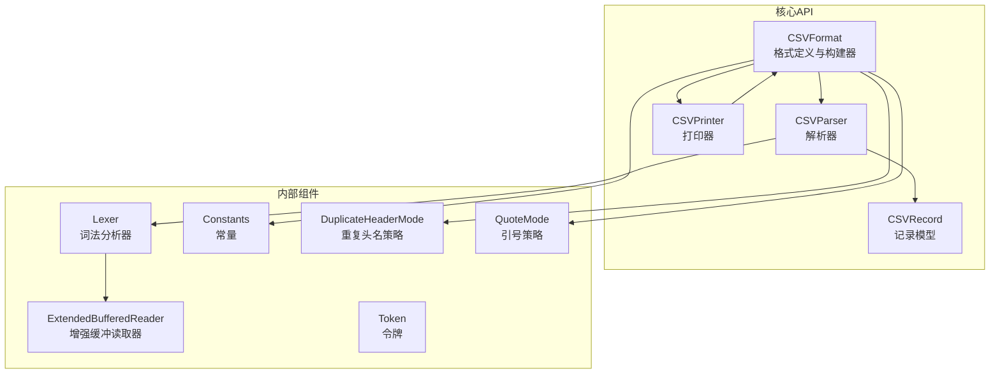
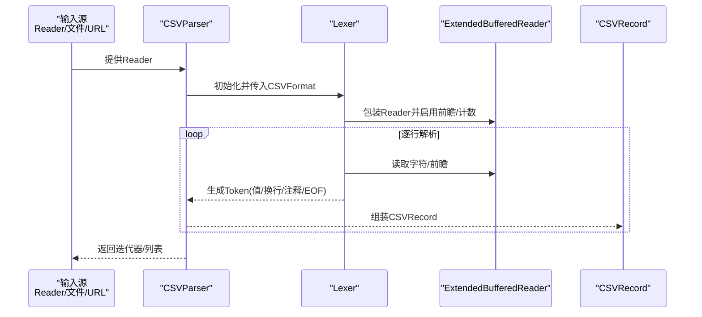
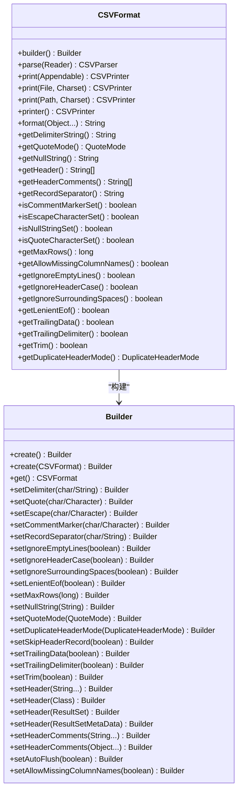
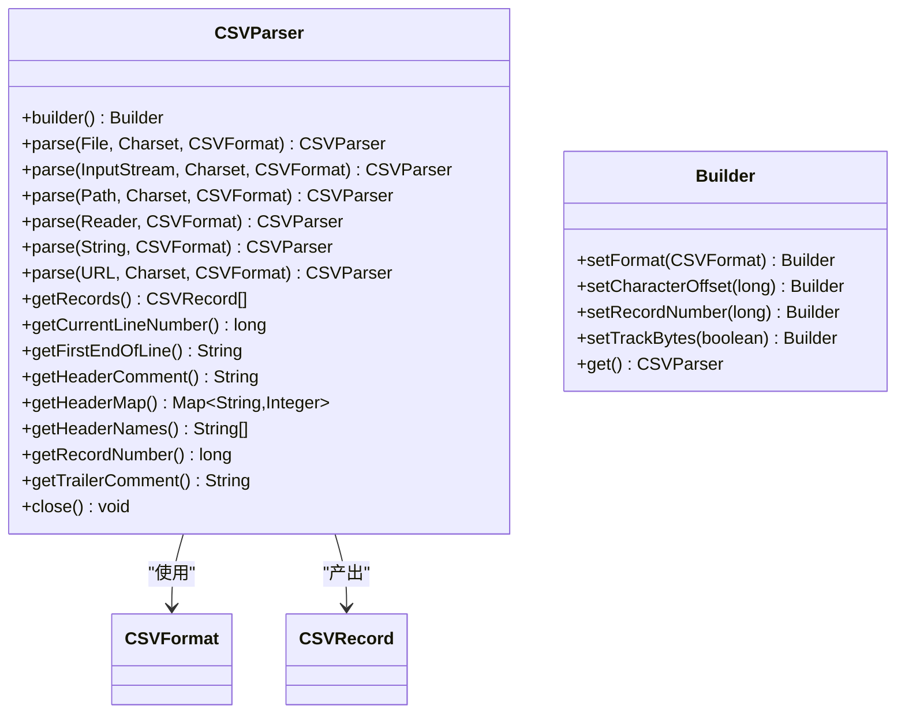
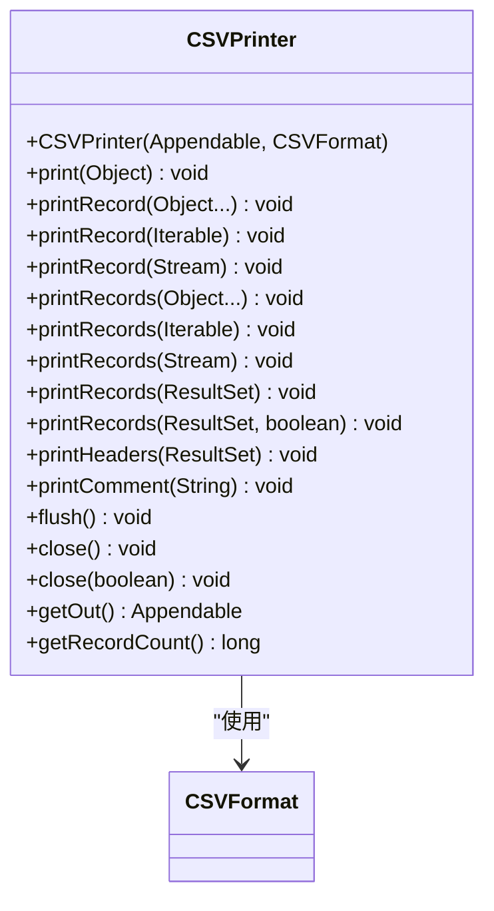
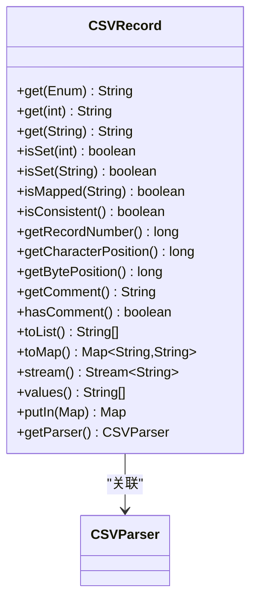
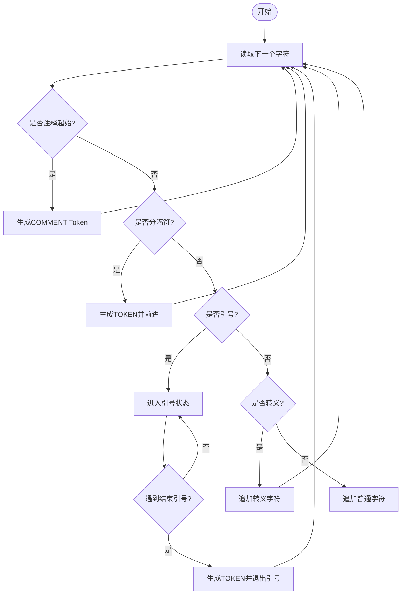
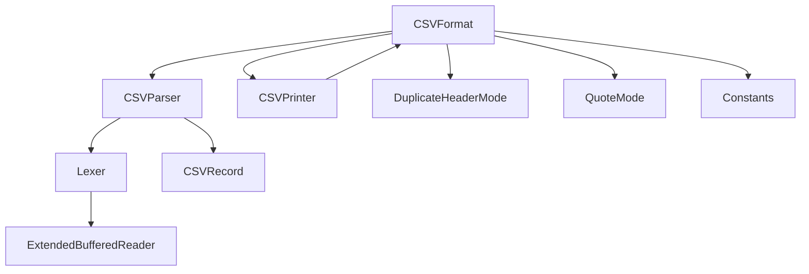

# API参考手册

<cite>
**本文档引用的文件**
- [CSVFormat.java](file://src/main/java/org/apache/commons/csv/CSVFormat.java)
- [CSVParser.java](file://src/main/java/org/apache/commons/csv/CSVParser.java)
- [CSVPrinter.java](file://src/main/java/org/apache/commons/csv/CSVPrinter.java)
- [CSVRecord.java](file://src/main/java/org/apache/commons/csv/CSVRecord.java)
- [Constants.java](file://src/main/java/org/apache/commons/csv/Constants.java)
- [DuplicateHeaderMode.java](file://src/main/java/org/apache/commons/csv/DuplicateHeaderMode.java)
- [QuoteMode.java](file://src/main/java/org/apache/commons/csv/QuoteMode.java)
- [Lexer.java](file://src/main/java/org/apache/commons/csv/Lexer.java)
- [ExtendedBufferedReader.java](file://src/main/java/org/apache/commons/csv/ExtendedBufferedReader.java)
- [Token.java](file://src/main/java/org/apache/commons/csv/Token.java)
- [CSVException.java](file://src/main/java/org/apache/commons/csv/CSVException.java)
- [package-info.java](file://src/main/java/org/apache/commons/csv/package-info.java)
- [README.md](file://README.md)
</cite>

## 目录
1. [简介](#简介)
2. [项目结构](#项目结构)
3. [核心组件](#核心组件)
4. [架构总览](#架构总览)
5. [详细组件分析](#详细组件分析)
6. [依赖关系分析](#依赖关系分析)
7. [性能考虑](#性能考虑)
8. [故障排除指南](#故障排除指南)
9. [结论](#结论)
10. [附录](#附录)

## 简介
Apache Commons CSV 是一个用于读写各种 CSV 格式的简单 Java 库。它支持多种预定义格式（如 Excel、RFC4180、MySQL、PostgreSQL 等），并提供了灵活的构建器模式来定制解析与打印行为。该库通过词法分析器和缓冲读取器实现高效的流式处理，并提供对注释、转义、引号策略、空值转换等高级特性的支持。

## 项目结构
该项目采用标准的 Maven 结构，核心源码位于 `src/main/java/org/apache/commons/csv/` 下，包含以下关键包内文件：
- CSVFormat：格式定义与构建器，包含预定义格式与静态工厂方法
- CSVParser：解析器，支持从多种输入源创建实例并迭代解析记录
- CSVPrinter：打印器，支持将数据以指定格式输出到目标
- CSVRecord：单条记录的表示，提供按索引或名称访问字段的能力
- Constants：内部常量定义
- DuplicateHeaderMode：重复头名处理策略
- QuoteMode：引号策略枚举
- Lexer：词法分析器，负责扫描输入并生成令牌
- ExtendedBufferedReader：增强的缓冲读取器，支持前瞻与位置跟踪
- Token：内部令牌表示
- CSVException：CSV 异常类型
- package-info.java：包级文档与特性概述

**图表来源**
- [CSVFormat.java](file://src/main/java/org/apache/commons/csv/CSVFormat.java)
- [CSVParser.java](file://src/main/java/org/apache/commons/csv/CSVParser.java)
- [CSVPrinter.java](file://src/main/java/org/apache/commons/csv/CSVPrinter.java)
- [CSVRecord.java](file://src/main/java/org/apache/commons/csv/CSVRecord.java)
- [Lexer.java](file://src/main/java/org/apache/commons/csv/Lexer.java)
- [ExtendedBufferedReader.java](file://src/main/java/org/apache/commons/csv/ExtendedBufferedReader.java)
- [Token.java](file://src/main/java/org/apache/commons/csv/Token.java)
- [Constants.java](file://src/main/java/org/apache/commons/csv/Constants.java)
- [DuplicateHeaderMode.java](file://src/main/java/org/apache/commons/csv/DuplicateHeaderMode.java)
- [QuoteMode.java](file://src/main/java/org/apache/commons/csv/QuoteMode.java)

**章节来源**
- [package-info.java](file://src/main/java/org/apache/commons/csv/package-info.java)
- [README.md](file://README.md)

## 核心组件
本节概述四大核心类及其职责：
- CSVFormat：定义 CSV 的分隔符、引号、注释、转义、换行、空值字符串、引号策略、是否忽略空白等；提供 Builder 模式与预定义格式常量；提供 parse/print 工厂方法。
- CSVParser：从 Reader 或资源创建解析器，逐条读取 CSVRecord；支持流式迭代、内存一次性读取、记录号与行号追踪、注释读取。
- CSVPrinter：将对象序列打印为 CSV 记录；支持批量打印、ResultSet 打印、注释打印、自动刷新控制。
- CSVRecord：表示一条记录，提供按索引/名称访问字段、映射一致性检查、注释访问、字节/字符位置信息。

**章节来源**
- [CSVFormat.java](file://src/main/java/org/apache/commons/csv/CSVFormat.java)
- [CSVParser.java](file://src/main/java/org/apache/commons/csv/CSVParser.java)
- [CSVPrinter.java](file://src/main/java/org/apache/commons/csv/CSVPrinter.java)
- [CSVRecord.java](file://src/main/java/org/apache/commons/csv/CSVRecord.java)

## 架构总览
下图展示了从输入到输出的整体流程：CSVFormat 定义规则，CSVParser 使用 Lexer 和 ExtendedBufferedReader 进行词法扫描与缓冲读取，最终产出 CSVRecord；CSVPrinter 则根据 CSVFormat 将数据写出。

**图表来源**
- [CSVParser.java](file://src/main/java/org/apache/commons/csv/CSVParser.java)
- [Lexer.java](file://src/main/java/org/apache/commons/csv/Lexer.java)
- [ExtendedBufferedReader.java](file://src/main/java/org/apache/commons/csv/ExtendedBufferedReader.java)
- [CSVRecord.java](file://src/main/java/org/apache/commons/csv/CSVRecord.java)

## 详细组件分析

### CSVFormat 类
- 角色：定义 CSV 解析与打印的格式规则，提供 Builder 模式进行配置，提供多个预定义格式常量。
- 关键点：
  - 预定义格式：DEFAULT、EXCEL、INFORMIX_UNLOAD、INFORMIX_UNLOAD_CSV、MONGODB_CSV、MONGODB_TSV、MYSQL、ORACLE、POSTGRESQL_CSV、POSTGRESQL_TEXT、RFC4180、TDF。
  - Builder 支持设置：分隔符、引号、转义、注释标记、记录分隔符、是否忽略空白、是否忽略空行、是否跳过首行、空值字符串、引号策略、重复头名策略、最大行数、是否允许尾随数据/尾随分隔符、是否宽松 EOF、是否自动刷新、是否 Trim 等。
  - 静态工厂方法：parse(Reader)、print(Appendable)、print(File, Charset)、print(Path, Charset)、printer()、format(Object...)。
  - 内部工具：clone、containsLineBreak、isLineBreak、isBlank、trim、toStringArray、copy、valueOf、newFormat(char)。
- 常量与枚举：Constants（内部常量）、DuplicateHeaderMode（重复头名策略）、QuoteMode（引号策略）。

**图表来源**
- [CSVFormat.java](file://src/main/java/org/apache/commons/csv/CSVFormat.java)
- [DuplicateHeaderMode.java](file://src/main/java/org/apache/commons/csv/DuplicateHeaderMode.java)
- [QuoteMode.java](file://src/main/java/org/apache/commons/csv/QuoteMode.java)

**章节来源**
- [CSVFormat.java](file://src/main/java/org/apache/commons/csv/CSVFormat.java)
- [Constants.java](file://src/main/java/org/apache/commons/csv/Constants.java)
- [DuplicateHeaderMode.java](file://src/main/java/org/apache/commons/csv/DuplicateHeaderMode.java)
- [QuoteMode.java](file://src/main/java/org/apache/commons/csv/QuoteMode.java)

### CSVParser 类
- 角色：从 Reader 或资源创建解析器，逐条产出 CSVRecord；支持 Builder 模式配置字符偏移、记录号起始、字节跟踪等。
- 关键点：
  - 静态工厂方法：parse(File, Charset, CSVFormat)、parse(InputStream, Charset, CSVFormat)、parse(Path, Charset, CSVFormat)、parse(Reader, CSVFormat)、parse(String, CSVFormat)、parse(URL, Charset, CSVFormat)。
  - 迭代与流式：实现 Iterable<CSVRecord>；提供 getRecords() 一次性读取至内存；支持流式遍历。
  - 属性查询：getCurrentLineNumber()、getFirstEndOfLine()、getHeaderComment()、getHeaderMap()、getHeaderNames()、getRecordNumber()、getTrailerComment()。
  - 内部实现：Headers 映射、CSVRecordIterator、handleNull()、addRecordValue()、createHeaders()。
  - Builder：setFormat、setCharacterOffset、setRecordNumber、setTrackBytes、get()。

**图表来源**
- [CSVParser.java](file://src/main/java/org/apache/commons/csv/CSVParser.java)
- [CSVRecord.java](file://src/main/java/org/apache/commons/csv/CSVRecord.java)
- [CSVFormat.java](file://src/main/java/org/apache/commons/csv/CSVFormat.java)

**章节来源**
- [CSVParser.java](file://src/main/java/org/apache/commons/csv/CSVParser.java)

### CSVPrinter 类
- 角色：将对象序列打印为 CSV 记录；支持批量打印、ResultSet 打印、注释打印、自动刷新控制。
- 关键点：
  - 构造：CSVPrinter(Appendable, CSVFormat)，自动打印头部注释与表头。
  - 单值打印：print(Object)；整行打印：printRecord(...)、printRecord(Iterable)、printRecord(Stream)。
  - 批量打印：printRecords(...) 多种重载，支持数组、Iterable、Stream、ResultSet。
  - 注释：printComment(String)；打印 ResultSet 头部：printHeaders(ResultSet)。
  - 辅助：flush()、close(boolean)、getOut()、getRecordCount()。
  - 线程安全：内部使用 ReentrantLock 保护打印操作。

**图表来源**
- [CSVPrinter.java](file://src/main/java/org/apache/commons/csv/CSVPrinter.java)
- [CSVFormat.java](file://src/main/java/org/apache/commons/csv/CSVFormat.java)

**章节来源**
- [CSVPrinter.java](file://src/main/java/org/apache/commons/csv/CSVPrinter.java)

### CSVRecord 类
- 角色：表示一条 CSV 记录，提供按索引/名称访问字段、映射一致性检查、注释访问、字节/字符位置信息。
- 关键点：
  - 字段访问：get(Enum)、get(int)、get(String name)；isSet(...)、isMapped(...)。
  - 元信息：getRecordNumber()、getCharacterPosition()、getBytePosition()、getComment()、hasComment()。
  - 转换：toList()、toMap()、stream()、values()。
  - 一致性：isConsistent() 检查记录长度与头映射大小是否一致。
  - 解析器关联：getParser()（可能为 null，当记录来自反序列化时）。

**图表来源**
- [CSVRecord.java](file://src/main/java/org/apache/commons/csv/CSVRecord.java)
- [CSVParser.java](file://src/main/java/org/apache/commons/csv/CSVParser.java)

**章节来源**
- [CSVRecord.java](file://src/main/java/org/apache/commons/csv/CSVRecord.java)

### 内部组件与工具

#### Lexer 词法分析器
- 角色：扫描输入，识别分隔符、引号、转义、注释、换行等，生成 Token。
- 关键点：支持多字符分隔符、转义序列、注释识别、EOF/EORECORD/COMMENT/INVALID 状态。

**图表来源**
- [Lexer.java](file://src/main/java/org/apache/commons/csv/Lexer.java)
- [Token.java](file://src/main/java/org/apache/commons/csv/Token.java)

**章节来源**
- [Lexer.java](file://src/main/java/org/apache/commons/csv/Lexer.java)
- [Token.java](file://src/main/java/org/apache/commons/csv/Token.java)

#### ExtendedBufferedReader 增强缓冲读取器
- 角色：提供前瞻 peek、行号/位置跟踪、字节计数、字符编码支持。
- 关键点：支持 mark/reset、getLineNumber()/getPosition()/getBytesRead()、编码长度计算。

**章节来源**
- [ExtendedBufferedReader.java](file://src/main/java/org/apache/commons/csv/ExtendedBufferedReader.java)

#### 异常类型 CSVException
- 角色：表示 CSV 解析过程中的异常，构造时支持格式化消息。
- 关键点：继承自 IOException，提供格式化构造函数。

**章节来源**
- [CSVException.java](file://src/main/java/org/apache/commons/csv/CSVException.java)

## 依赖关系分析
- CSVFormat 与 CSVParser/CSVPrinter：CSVFormat 作为配置中心，被两者共同使用；CSVParser 依赖 Lexer 与 ExtendedBufferedReader；CSVPrinter 依赖 CSVFormat。
- 枚举与常量：DuplicateHeaderMode、QuoteMode、Constants 作为 CSVFormat 的配置项与内部常量。
- 流式与批处理：CSVParser 支持迭代与一次性读取；CSVPrinter 支持单条/批量/流式打印。

**图表来源**
- [CSVFormat.java](file://src/main/java/org/apache/commons/csv/CSVFormat.java)
- [CSVParser.java](file://src/main/java/org/apache/commons/csv/CSVParser.java)
- [CSVPrinter.java](file://src/main/java/org/apache/commons/csv/CSVPrinter.java)
- [CSVRecord.java](file://src/main/java/org/apache/commons/csv/CSVRecord.java)
- [Lexer.java](file://src/main/java/org/apache/commons/csv/Lexer.java)
- [ExtendedBufferedReader.java](file://src/main/java/org/apache/commons/csv/ExtendedBufferedReader.java)
- [DuplicateHeaderMode.java](file://src/main/java/org/apache/commons/csv/DuplicateHeaderMode.java)
- [QuoteMode.java](file://src/main/java/org/apache/commons/csv/QuoteMode.java)
- [Constants.java](file://src/main/java/org/apache/commons/csv/Constants.java)

**章节来源**
- [CSVFormat.java](file://src/main/java/org/apache/commons/csv/CSVFormat.java)
- [CSVParser.java](file://src/main/java/org/apache/commons/csv/CSVParser.java)
- [CSVPrinter.java](file://src/main/java/org/apache/commons/csv/CSVPrinter.java)
- [CSVRecord.java](file://src/main/java/org/apache/commons/csv/CSVRecord.java)
- [Lexer.java](file://src/main/java/org/apache/commons/csv/Lexer.java)
- [ExtendedBufferedReader.java](file://src/main/java/org/apache/commons/csv/ExtendedBufferedReader.java)
- [DuplicateHeaderMode.java](file://src/main/java/org/apache/commons/csv/DuplicateHeaderMode.java)
- [QuoteMode.java](file://src/main/java/org/apache/commons/csv/QuoteMode.java)
- [Constants.java](file://src/main/java/org/apache/commons/csv/Constants.java)

## 性能考虑
- 流式处理优先：使用 CSVParser 迭代方式逐条处理，避免一次性加载大文件至内存。
- 合理设置格式：禁用不必要的 Trim、忽略空行、合理选择 QuoteMode 可减少处理开销。
- 批量打印：使用 printRecords(Iterable/Stream/ResultSet) 减少调用次数。
- 字节跟踪：仅在需要定位时启用字节跟踪，避免额外编码计算成本。
- 最大行数限制：通过 CSVFormat.Builder.setMaxRows 控制处理上限，防止无限增长。

## 故障排除指南
- 解析异常：CSVException 表示无效输入；检查格式配置（分隔符、引号、转义、注释）与输入编码。
- 重复头名：根据 DuplicateHeaderMode 设置决定是否允许重复头名；必要时使用 setHeader(...) 显式指定。
- 空值转换：通过 setNullString(...) 指定空值字符串；注意 QuoteMode 对空值打印的影响。
- 注释与换行：确认注释起始字符与换行符设置；解析时注意注释会附加到下一条记录。
- 文件/路径/URL：确保资源可访问且编码正确；使用 parse(...) 静态工厂方法时传入正确的 Charset。

**章节来源**
- [CSVException.java](file://src/main/java/org/apache/commons/csv/CSVException.java)
- [CSVFormat.java](file://src/main/java/org/apache/commons/csv/CSVFormat.java)
- [CSVParser.java](file://src/main/java/org/apache/commons/csv/CSVParser.java)

## 结论
Apache Commons CSV 提供了简洁而强大的 CSV 读写能力，通过 CSVFormat 的 Builder 模式与丰富的预定义格式，能够满足大多数 CSV 处理需求。其流式解析与打印机制兼顾性能与易用性，适合处理大规模数据与多样化格式场景。

## 附录

### 预定义格式一览
- DEFAULT：RFC4180 但允许空行
- EXCEL：Excel 兼容格式（允许缺失列名、忽略空行、尾随数据、宽松 EOF）
- INFORMIX_UNLOAD / INFORMIX_UNLOAD_CSV：Informix 导出格式
- MONGODB_CSV / MONGODB_TSV：MongoDB 导出格式
- MYSQL：MySQL 导出格式
- ORACLE：Oracle SQL*Loader 格式
- POSTGRESQL_CSV / POSTGRESQL_TEXT：PostgreSQL COPY 格式
- RFC4180：严格符合 RFC 4180
- TDF：制表符分隔格式

**章节来源**
- [CSVFormat.java](file://src/main/java/org/apache/commons/csv/CSVFormat.java)

### 常用使用场景与最佳实践
- 读取 Excel 文件：使用 EXCEL 格式，启用允许缺失列名与忽略空行。
- 导出数据库结果集：使用 CSVFormat.Builder.setNullString(...) 与 CSVPrinter.printRecords(ResultSet, true)。
- 大文件处理：使用 CSVParser 迭代读取，避免一次性加载；结合 setMaxRows 控制数量。
- 自定义分隔符：通过 Builder.setDelimiter(...) 指定；注意不能为换行符。
- 引号策略：MINIMAL 适合大多数情况；NONE 需要设置转义字符。

**章节来源**
- [CSVParser.java](file://src/main/java/org/apache/commons/csv/CSVParser.java)
- [CSVPrinter.java](file://src/main/java/org/apache/commons/csv/CSVPrinter.java)
- [CSVFormat.java](file://src/main/java/org/apache/commons/csv/CSVFormat.java)