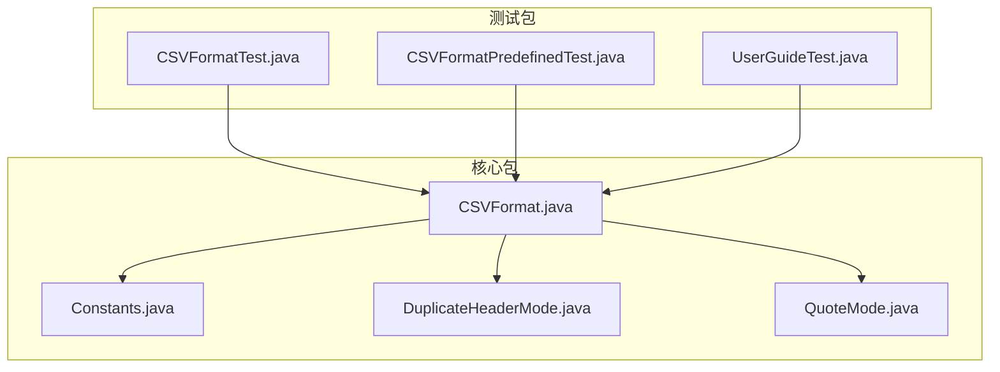
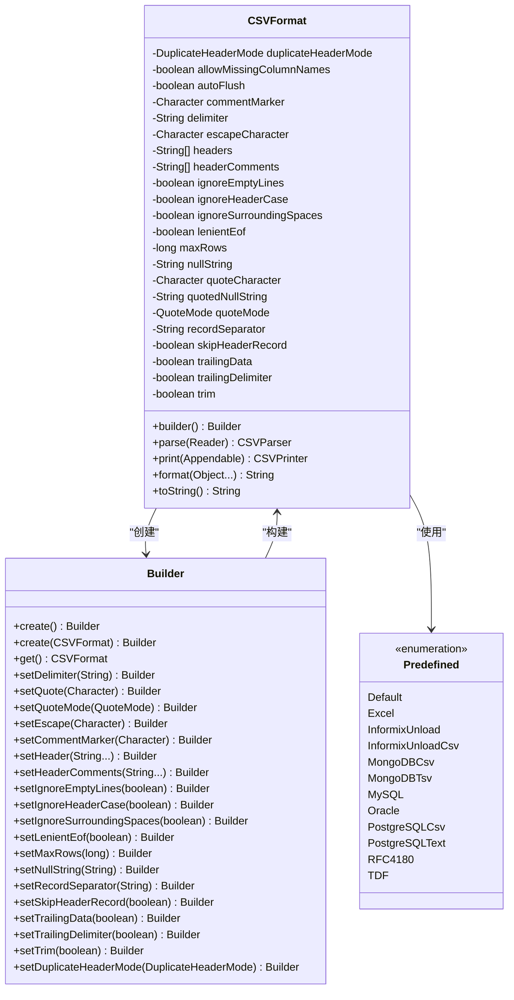
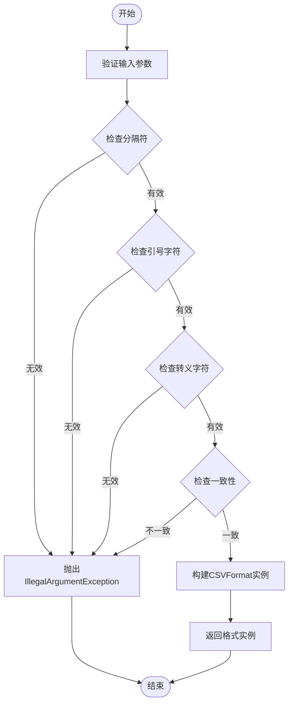
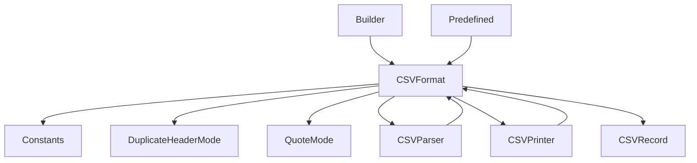

# CSVFormat类API

<cite>
**本文档引用的文件**
- [CSVFormat.java](file://src/main/java/org/apache/commons/csv/CSVFormat.java)
- [Constants.java](file://src/main/java/org/apache/commons/csv/Constants.java)
- [DuplicateHeaderMode.java](file://src/main/java/org/apache/commons/csv/DuplicateHeaderMode.java)
- [QuoteMode.java](file://src/main/java/org/apache/commons/csv/QuoteMode.java)
- [CSVFormatTest.java](file://src/test/java/org/apache/commons/csv/CSVFormatTest.java)
- [CSVFormatPredefinedTest.java](file://src/test/java/org/apache/commons/csv/CSVFormatPredefinedTest.java)
- [UserGuideTest.java](file://src/test/java/org/apache/commons/csv/UserGuideTest.java)
</cite>

## 目录
1. [简介](#简介)
2. [项目结构](#项目结构)
3. [核心组件](#核心组件)
4. [架构概览](#架构概览)
5. [详细组件分析](#详细组件分析)
6. [依赖分析](#依赖分析)
7. [性能考虑](#性能考虑)
8. [故障排除指南](#故障排除指南)
9. [结论](#结论)
10. [附录](#附录)

## 简介
CSVFormat类是Apache Commons CSV库的核心配置类，用于定义CSV文件的解析和写入格式。它提供了丰富的配置选项，支持多种预定义格式，并通过Builder模式实现了灵活的格式定制。

## 项目结构
该项目采用标准的Maven目录结构，主要代码位于`src/main/java/org/apache/commons/csv/`目录下，包含以下关键文件：
- CSVFormat.java：主格式配置类
- Constants.java：内部常量定义
- DuplicateHeaderMode.java：重复头部处理枚举
- QuoteMode.java：引号策略枚举
- 相关测试文件验证功能正确性



**图表来源**
- [CSVFormat.java:1-50](file://src/main/java/org/apache/commons/csv/CSVFormat.java#L1-L50)
- [Constants.java:1-30](file://src/main/java/org/apache/commons/csv/Constants.java#L1-L30)

**章节来源**
- [CSVFormat.java:1-182](file://src/main/java/org/apache/commons/csv/CSVFormat.java#L1-L182)
- [README.md:43-58](file://README.md#L43-L58)

## 核心组件

### 预定义格式常量
CSVFormat类提供了多种预定义的CSV格式常量，每种格式都针对特定的应用场景进行了优化：

#### DEFAULT格式
- 分隔符：逗号（','）
- 引号字符：双引号（'"'）
- 记录分隔符：CRLF（"\r\n"）
- 忽略空行：true
- 重复头部模式：ALLOW_ALL

#### EXCEL格式
专为Microsoft Excel设计，具有以下特性：
- 允许空行
- 支持缺失列名
- 允许尾随数据
- 宽松EOF处理
- 适用于Excel兼容性需求

#### RFC4180格式
严格遵循RFC 4180标准：
- 分隔符：逗号
- 引号字符：双引号
- 记录分隔符：CRLF
- 忽略空行：false

#### 数据库特定格式
- **MYSQL**：MySQL导出格式，制表符分隔，反斜杠转义
- **POSTGRESQL_CSV**：PostgreSQL CSV格式，双引号包装
- **POSTGRESQL_TEXT**：PostgreSQL文本格式，反斜杠转义
- **ORACLE**：Oracle SQL*Loader格式，系统行分隔符
- **INFORMIX_UNLOAD**：Informix UNLOAD格式，管道符分隔

#### 特殊用途格式
- **MONGODB_CSV**：MongoDB导出格式，最小引号策略
- **MONGODB_TSV**：MongoDB TSV格式，制表符分隔
- **TDF**：Tab-Delimited Format，制表符分隔

**章节来源**
- [CSVFormat.java:1031-1415](file://src/main/java/org/apache/commons/csv/CSVFormat.java#L1031-L1415)
- [CSVFormatPredefinedTest.java:31-85](file://src/test/java/org/apache/commons/csv/CSVFormatPredefinedTest.java#L31-L85)

## 架构概览

CSVFormat类采用不可变对象设计，通过Builder模式实现配置的链式设置。整个架构围绕以下几个核心概念：



**图表来源**
- [CSVFormat.java:182-3204](file://src/main/java/org/apache/commons/csv/CSVFormat.java#L182-L3204)

### 处理流程图



**图表来源**
- [CSVFormat.java:2606-2640](file://src/main/java/org/apache/commons/csv/CSVFormat.java#L2606-L2640)

**章节来源**
- [CSVFormat.java:1616-1640](file://src/main/java/org/apache/commons/csv/CSVFormat.java#L1616-L1640)
- [CSVFormat.java:2606-2640](file://src/main/java/org/apache/commons/csv/CSVFormat.java#L2606-L2640)

## 详细组件分析

### Builder模式实现

Builder类提供了完整的配置接口，支持链式调用和类型安全的配置设置：

#### 基础配置方法
- `setDelimiter(String)`：设置字段分隔符
- `setQuote(Character)`：设置引号字符
- `setEscape(Character)`：设置转义字符
- `setRecordSeparator(String)`：设置记录分隔符

#### 头部配置方法
- `setHeader(String...)`：设置自定义头部名称
- `setHeader(ResultSet)`：从数据库结果集元数据提取头部
- `setHeaderComments(String...)`：设置头部注释

#### 解析行为配置
- `setIgnoreEmptyLines(boolean)`：忽略空行
- `setIgnoreHeaderCase(boolean)`：忽略头部大小写
- `setIgnoreSurroundingSpaces(boolean)`：忽略周围空格
- `setAllowMissingColumnNames(boolean)`：允许缺失列名

#### 输出行为配置
- `setQuoteMode(QuoteMode)`：设置引号策略
- `setNullString(String)`：设置空值字符串
- `setTrailingDelimiter(boolean)`：添加尾随分隔符
- `setTrim(boolean)`：修剪空白字符

#### 高级配置
- `setDuplicateHeaderMode(DuplicateHeaderMode)`：设置重复头部处理模式
- `setSkipHeaderRecord(boolean)`：跳过头部记录
- `setLenientEof(boolean)`：宽松EOF处理
- `setMaxRows(long)`：设置最大行数限制

**章节来源**
- [CSVFormat.java:189-900](file://src/main/java/org/apache/commons/csv/CSVFormat.java#L189-L900)

### 配置选项详解

#### 分隔符配置
- 支持单字符和多字符分隔符
- 不允许使用换行符作为分隔符
- 与引号字符、转义字符、注释标记不能相同

#### 引号策略（QuoteMode）
- **ALL**：对所有字段加引号
- **ALL_NON_NULL**：对非空字段加引号
- **MINIMAL**：仅在必要时加引号
- **NON_NUMERIC**：对非数字字段加引号
- **NONE**：永不加引号（需要转义字符）

#### 重复头部处理（DuplicateHeaderMode）
- **ALLOW_ALL**：允许所有重复头部
- **ALLOW_EMPTY**：仅允许空字符串重复
- **DISALLOW**：完全不允许重复头部

#### 行为控制选项
- **lenientEof**：Excel兼容性，允许EOF错误
- **trailingData**：允许记录中的尾随数据
- **maxRows**：限制处理的行数

**章节来源**
- [QuoteMode.java:26-54](file://src/main/java/org/apache/commons/csv/QuoteMode.java#L26-L54)
- [DuplicateHeaderMode.java:28-44](file://src/main/java/org/apache/commons/csv/DuplicateHeaderMode.java#L28-L44)

### 异常处理机制

CSVFormat在以下情况下会抛出IllegalArgumentException：

1. **分隔符验证失败**：分隔符为空或包含换行符
2. **字符冲突检测**：分隔符与引号字符、转义字符、注释标记相同
3. **引号字符验证**：引号字符为换行符
4. **转义字符验证**：转义字符为换行符
5. **QuoteMode验证**：QuoteMode设为NONE但未设置转义字符
6. **重复头部验证**：违反重复头部处理规则

**章节来源**
- [CSVFormat.java:462-510](file://src/main/java/org/apache/commons/csv/CSVFormat.java#L462-L510)
- [CSVFormat.java:2606-2640](file://src/main/java/org/apache/commons/csv/CSVFormat.java#L2606-L2640)

## 依赖分析

### 内部依赖关系



**图表来源**
- [CSVFormat.java:20-49](file://src/main/java/org/apache/commons/csv/CSVFormat.java#L20-L49)
- [CSVFormat.java:1616-1640](file://src/main/java/org/apache/commons/csv/CSVFormat.java#L1616-L1640)

### 外部依赖
- **Apache Commons IO**：I/O操作支持
- **Apache Commons Codec**：Base64编码支持
- **Java标准库**：核心功能依赖

**章节来源**
- [CSVFormat.java:22-48](file://src/main/java/org/apache/commons/csv/CSVFormat.java#L22-L48)

## 性能考虑

### 内存使用优化
- 使用不可变对象设计，避免并发修改开销
- 字符串数组采用克隆策略，确保数据隔离
- 流式处理支持大文件处理

### 序列化兼容性
CSVFormat实现了Serializable接口，但存在版本兼容性限制：
- 版本1.0到1.9：serialVersionUID = 1L
- 版本1.10及以后：serialVersionUID = 2L
- 不同版本间不支持序列化兼容

**章节来源**
- [CSVFormat.java:158-172](file://src/main/java/org/apache/commons/csv/CSVFormat.java#L158-L172)
- [CSVFormat.java:1394](file://src/main/java/org/apache/commons/csv/CSVFormat.java#L1394)

## 故障排除指南

### 常见问题及解决方案

#### 配置验证错误
**问题**：IllegalArgumentException关于字符冲突
**原因**：分隔符与引号字符或转义字符相同
**解决**：确保各配置项互不冲突

#### 头部处理问题
**问题**：重复头部导致异常
**原因**：违反DuplicateHeaderMode设置
**解决**：调整DuplicateHeaderMode或清理头部数据

#### Excel兼容性问题
**问题**：Excel文件解析失败
**解决**：使用EXCEL格式或启用lenientEof和trailingData选项

#### 大文件处理问题
**问题**：内存不足
**解决**：设置maxRows限制或使用流式处理

**章节来源**
- [CSVFormatTest.java:92-131](file://src/test/java/org/apache/commons/csv/CSVFormatTest.java#L92-L131)
- [CSVFormatTest.java:144-195](file://src/test/java/org/apache/commons/csv/CSVFormatTest.java#L144-L195)

## 结论
CSVFormat类提供了强大而灵活的CSV格式配置能力，通过预定义格式和Builder模式实现了易用性和灵活性的平衡。其严格的验证机制确保了配置的正确性，而丰富的配置选项满足了各种应用场景的需求。

## 附录

### 实际使用场景示例

#### Excel兼容性场景
```java
// 创建Excel兼容格式
CSVFormat excelFormat = CSVFormat.EXCEL.builder()
    .setHeader("姓名", "邮箱", "电话")
    .setSkipHeaderRecord(true)
    .get();
```

#### 自定义数据库导出场景
```java
// 创建MySQL导出格式
CSVFormat mysqlFormat = CSVFormat.MYSQL.builder()
    .setNullString("\\N")
    .setIgnoreEmptyLines(false)
    .get();
```

#### 复杂头部处理场景
```java
// 处理重复头部
CSVFormat complexFormat = CSVFormat.DEFAULT.builder()
    .setHeader("ID", "Name", "Name", "Email")
    .setDuplicateHeaderMode(DuplicateHeaderMode.ALLOW_EMPTY)
    .get();
```

**章节来源**
- [UserGuideTest.java:64-85](file://src/test/java/org/apache/commons/csv/UserGuideTest.java#L64-L85)
- [CSVFormatTest.java:724-759](file://src/test/java/org/apache/commons/csv/CSVFormatTest.java#L724-L759)

### 最佳实践建议

1. **选择合适的预定义格式**：优先使用内置的预定义格式
2. **严格验证配置**：利用Builder的验证机制提前发现配置错误
3. **合理设置头部**：根据数据源特点选择合适的头部处理策略
4. **注意性能影响**：对于大文件，考虑设置maxRows限制
5. **保持向后兼容**：避免在不同版本间直接序列化CSVFormat实例