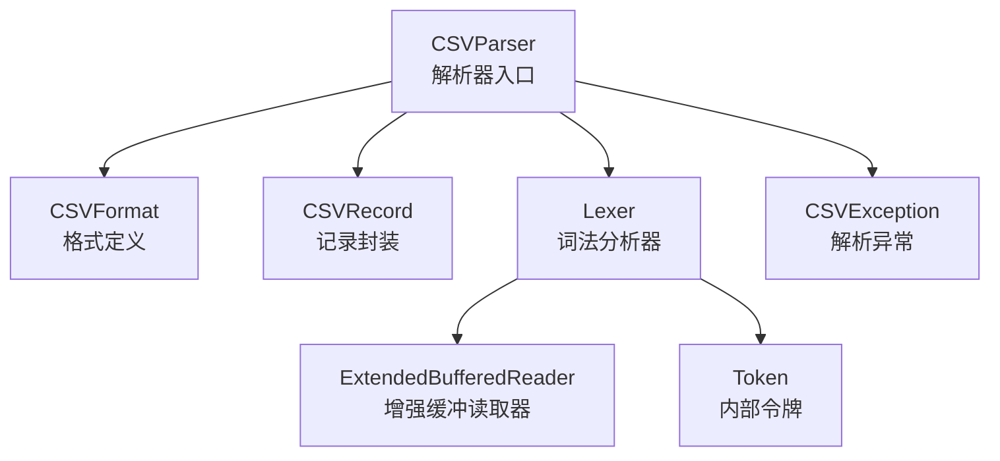
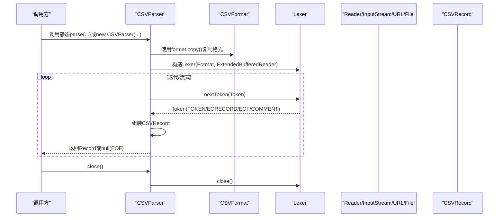
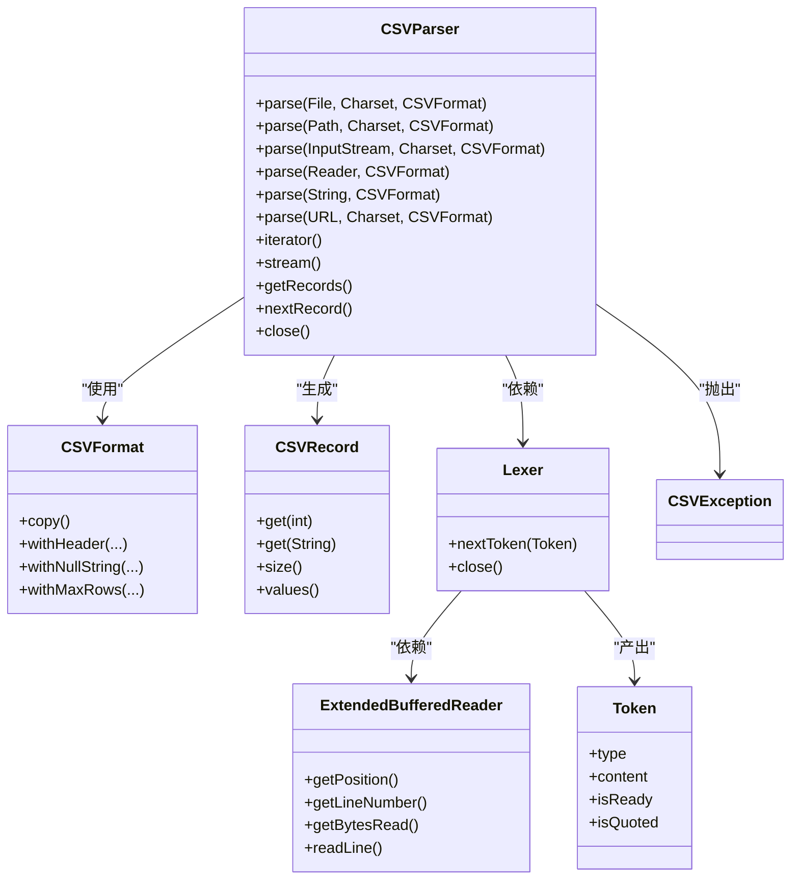

# CSVParser类API

<cite>
**本文引用的文件**
- [CSVParser.java](file://src/main/java/org/apache/commons/csv/CSVParser.java)
- [CSVFormat.java](file://src/main/java/org/apache/commons/csv/CSVFormat.java)
- [CSVRecord.java](file://src/main/java/org/apache/commons/csv/CSVRecord.java)
- [Lexer.java](file://src/main/java/org/apache/commons/csv/Lexer.java)
- [ExtendedBufferedReader.java](file://src/main/java/org/apache/commons/csv/ExtendedBufferedReader.java)
- [Token.java](file://src/main/java/org/apache/commons/csv/Token.java)
- [CSVException.java](file://src/main/java/org/apache/commons/csv/CSVException.java)
- [CSVParserTest.java](file://src/test/java/org/apache/commons/csv/CSVParserTest.java)
- [UserGuideTest.java](file://src/test/java/org/apache/commons/csv/UserGuideTest.java)
</cite>

## 目录
1. [简介](#简介)
2. [项目结构](#项目结构)
3. [核心组件](#核心组件)
4. [架构总览](#架构总览)
5. [详细组件分析](#详细组件分析)
6. [依赖分析](#依赖分析)
7. [性能考虑](#性能考虑)
8. [故障排查指南](#故障排查指南)
9. [结论](#结论)
10. [附录](#附录)

## 简介
本文件为CSVParser类的完整API参考文档，覆盖以下主题：
- 静态工厂方法parse的多种重载形式及输入源（File、Reader、InputStream、URL、String、Path）
- 迭代器模式：nextRecord()与foreach循环支持
- 异常处理机制与错误恢复策略
- 性能优化与内存管理建议
- 流式处理最佳实践与大文件处理技巧
- 与CSVFormat类的协作关系与配置选项
- 各种输入场景的实际使用示例

## 项目结构
CSVParser位于org.apache.commons.csv包中，与之紧密协作的类型包括：
- CSVFormat：格式定义与构建器
- CSVRecord：单条记录封装
- Lexer：词法分析器
- ExtendedBufferedReader：增强缓冲读取器
- Token：内部令牌表示
- CSVException：CSV解析异常

图表来源
- [CSVParser.java:147-949](file://src/main/java/org/apache/commons/csv/CSVParser.java#L147-L949)
- [CSVFormat.java:182-3205](file://src/main/java/org/apache/commons/csv/CSVFormat.java#L182-L3205)
- [CSVRecord.java:43-373](file://src/main/java/org/apache/commons/csv/CSVRecord.java#L43-L373)
- [Lexer.java:32-521](file://src/main/java/org/apache/commons/csv/Lexer.java#L32-L521)
- [ExtendedBufferedReader.java:44-277](file://src/main/java/org/apache/commons/csv/ExtendedBufferedReader.java#L44-L277)
- [Token.java:30-81](file://src/main/java/org/apache/commons/csv/Token.java#L30-L81)
- [CSVException.java:31-47](file://src/main/java/org/apache/commons/csv/CSVException.java#L31-L47)

章节来源
- [CSVParser.java:56-146](file://src/main/java/org/apache/commons/csv/CSVParser.java#L56-L146)
- [CSVFormat.java:50-181](file://src/main/java/org/apache/commons/csv/CSVFormat.java#L50-L181)

## 核心组件
- CSVParser：面向用户的解析器，支持多种输入源与迭代访问；提供流式API与内存一次性读取能力。
- CSVFormat：定义分隔符、引号、注释、空值字符串、行分隔符、忽略空白等格式参数，并可作为解析入口。
- CSVRecord：封装一行解析结果，支持按索引或列名访问，提供位置信息与注释。
- Lexer：负责从Reader中逐个产出Token（TOKEN/EORECORD/EOF/COMMENT），处理转义、引号、注释等。
- ExtendedBufferedReader：提供行号、字符位置、字节计数跟踪，支持预读与标记/重置。
- Token：内部状态机的最小单元，承载类型、内容与就绪标志。
- CSVException：当检测到无效输入时抛出的异常。

章节来源
- [CSVParser.java:147-949](file://src/main/java/org/apache/commons/csv/CSVParser.java#L147-L949)
- [CSVFormat.java:182-3205](file://src/main/java/org/apache/commons/csv/CSVFormat.java#L182-L3205)
- [CSVRecord.java:43-373](file://src/main/java/org/apache/commons/csv/CSVRecord.java#L43-L373)
- [Lexer.java:32-521](file://src/main/java/org/apache/commons/csv/Lexer.java#L32-L521)
- [ExtendedBufferedReader.java:44-277](file://src/main/java/org/apache/commons/csv/ExtendedBufferedReader.java#L44-L277)
- [Token.java:30-81](file://src/main/java/org/apache/commons/csv/Token.java#L30-L81)
- [CSVException.java:31-47](file://src/main/java/org/apache/commons/csv/CSVException.java#L31-L47)

## 架构总览
CSVParser通过CSVFormat控制解析行为，借助Lexer将Reader转换为Token序列，再组装为CSVRecord对象。解析过程支持：
- 迭代器遍历（iterator/hasNext/next）
- foreach循环
- 流式API（stream）
- 内存一次性读取（getRecords）

图表来源
- [CSVParser.java:556-567](file://src/main/java/org/apache/commons/csv/CSVParser.java#L556-L567)
- [Lexer.java:235-307](file://src/main/java/org/apache/commons/csv/Lexer.java#L235-L307)
- [CSVParser.java:885-929](file://src/main/java/org/apache/commons/csv/CSVParser.java#L885-L929)

章节来源
- [CSVParser.java:556-567](file://src/main/java/org/apache/commons/csv/CSVParser.java#L556-L567)
- [Lexer.java:235-307](file://src/main/java/org/apache/commons/csv/Lexer.java#L235-L307)

## 详细组件分析

### 静态工厂方法 parse 的重载与输入源
CSVParser提供多重重载的静态工厂方法，用于从不同输入源创建解析器实例。这些方法均会返回新的CSVParser实例，且在使用后应确保关闭资源。

- parse(File, Charset, CSVFormat)
  - 输入：File路径、字符集、CSVFormat
  - 行为：将File转换为Path后委托给parse(Path, Charset, CSVFormat)
  - 异常：非法参数、IO异常、CSV异常
  - 章节来源
    - [CSVParser.java:321-324](file://src/main/java/org/apache/commons/csv/CSVParser.java#L321-L324)

- parse(Path, Charset, CSVFormat)
  - 输入：Path、字符集、CSVFormat
  - 行为：打开InputStream并委托给parse(InputStream, Charset, CSVFormat)
  - 异常：非法参数、IO异常、CSV异常
  - 章节来源
    - [CSVParser.java:372-375](file://src/main/java/org/apache/commons/csv/CSVParser.java#L372-L375)

- parse(InputStream, Charset, CSVFormat)
  - 输入：InputStream、字符集、CSVFormat
  - 行为：包装为InputStreamReader并委托给parse(Reader, CSVFormat)
  - 异常：非法参数、IO异常、CSV异常
  - 章节来源
    - [CSVParser.java:348-351](file://src/main/java/org/apache/commons/csv/CSVParser.java#L348-L351)

- parse(Reader, CSVFormat)
  - 输入：Reader、CSVFormat
  - 行为：使用Builder构建CSVParser
  - 异常：非法参数、IO异常、CSV异常
  - 章节来源
    - [CSVParser.java:397-399](file://src/main/java/org/apache/commons/csv/CSVParser.java#L397-L399)

- parse(String, CSVFormat)
  - 输入：字符串、CSVFormat
  - 行为：包装为StringReader并委托给parse(Reader, CSVFormat)
  - 异常：非法参数、IO异常、CSV异常
  - 章节来源
    - [CSVParser.java:416-419](file://src/main/java/org/apache/commons/csv/CSVParser.java#L416-L419)

- parse(URL, Charset, CSVFormat)
  - 输入：URL、字符集、CSVFormat
  - 行为：打开URL流并委托给parse(InputStream, Charset, CSVFormat)
  - 异常：非法参数、IO异常、CSV异常
  - 章节来源
    - [CSVParser.java:444-447](file://src/main/java/org/apache/commons/csv/CSVParser.java#L444-L447)

- 构造函数（已弃用）
  - 新代码请使用builder()或parse(Reader, CSVFormat)
  - 章节来源
    - [CSVParser.java:497-528](file://src/main/java/org/apache/commons/csv/CSVParser.java#L497-L528)

- Builder模式
  - CSVParser.builder()返回Builder，支持设置Reader、Format、字符偏移、记录号、字节跟踪等
  - get()返回CSVParser实例
  - 章节来源
    - [CSVParser.java:154-219](file://src/main/java/org/apache/commons/csv/CSVParser.java#L154-L219)

章节来源
- [CSVParser.java:321-324](file://src/main/java/org/apache/commons/csv/CSVParser.java#L321-L324)
- [CSVParser.java:348-351](file://src/main/java/org/apache/commons/csv/CSVParser.java#L348-L351)
- [CSVParser.java:372-375](file://src/main/java/org/apache/commons/csv/CSVParser.java#L372-L375)
- [CSVParser.java:397-399](file://src/main/java/org/apache/commons/csv/CSVParser.java#L397-L399)
- [CSVParser.java:416-419](file://src/main/java/org/apache/commons/csv/CSVParser.java#L416-L419)
- [CSVParser.java:444-447](file://src/main/java/org/apache/commons/csv/CSVParser.java#L444-L447)
- [CSVParser.java:154-219](file://src/main/java/org/apache/commons/csv/CSVParser.java#L154-L219)

### 迭代器模式与nextRecord()
- 迭代器
  - iterator()返回内部CSVRecordIterator
  - hasNext()/next()基于内部缓存与懒加载实现
  - 关闭后迭代器不再产生新元素
  - 章节来源
    - [CSVParser.java:874-876](file://src/main/java/org/apache/commons/csv/CSVParser.java#L874-L876)
    - [CSVParser.java:221-271](file://src/main/java/org/apache/commons/csv/CSVParser.java#L221-L271)

- nextRecord()
  - 解析下一个记录，返回CSVRecord或null（EOF）
  - 支持注释收集与尾部注释存储
  - 抛出IOException或CSVException
  - 章节来源
    - [CSVParser.java:885-929](file://src/main/java/org/apache/commons/csv/CSVParser.java#L885-L929)

- foreach循环支持
  - CSVParser实现Iterable<CSVRecord>，可直接用于for-each
  - 章节来源
    - [CSVParser.java:147-147](file://src/main/java/org/apache/commons/csv/CSVParser.java#L147-L147)

- 流式API
  - stream()返回基于Spliterator的顺序流
  - 可结合maxRows限制行数
  - 章节来源
    - [CSVParser.java:944-946](file://src/main/java/org/apache/commons/csv/CSVParser.java#L944-L946)

- 内存一次性读取
  - getRecords()将当前游标之后的内容全部读入内存为List<CSVRecord>
  - 受maxRows影响
  - 章节来源
    - [CSVParser.java:768-770](file://src/main/java/org/apache/commons/csv/CSVParser.java#L768-L770)

章节来源
- [CSVParser.java:221-271](file://src/main/java/org/apache/commons/csv/CSVParser.java#L221-L271)
- [CSVParser.java:874-876](file://src/main/java/org/apache/commons/csv/CSVParser.java#L874-L876)
- [CSVParser.java:885-929](file://src/main/java/org/apache/commons/csv/CSVParser.java#L885-L929)
- [CSVParser.java:944-946](file://src/main/java/org/apache/commons/csv/CSVParser.java#L944-L946)
- [CSVParser.java:768-770](file://src/main/java/org/apache/commons/csv/CSVParser.java#L768-L770)

### 与CSVFormat的协作关系与配置选项
- CSVFormat决定解析行为，如分隔符、引号、注释、空值字符串、忽略空白、行分隔符、最大行数等
- CSVParser在构造时复制format副本，避免外部修改影响解析状态
- 常用配置项（示例）
  - setHeader(...)：自动或显式指定列名
  - setSkipHeaderRecord(...)：是否跳过首行作为标题
  - setNullString(...)：将特定字符串映射为null
  - setIgnoreEmptyLines(...)：是否忽略空行
  - setMaxRows(...)：限制解析行数
  - setCommentMarker(...)：注释起始字符
- 章节来源
  - [CSVParser.java:561-561](file://src/main/java/org/apache/commons/csv/CSVParser.java#L561-L561)
  - [CSVFormat.java:228-326](file://src/main/java/org/apache/commons/csv/CSVFormat.java#L228-L326)
  - [CSVFormat.java:533-624](file://src/main/java/org/apache/commons/csv/CSVFormat.java#L533-L624)

章节来源
- [CSVParser.java:561-561](file://src/main/java/org/apache/commons/csv/CSVParser.java#L561-L561)
- [CSVFormat.java:228-326](file://src/main/java/org/apache/commons/csv/CSVFormat.java#L228-L326)
- [CSVFormat.java:533-624](file://src/main/java/org/apache/commons/csv/CSVFormat.java#L533-L624)

### 异常处理机制与错误恢复策略
- CSVException
  - 当检测到无效解析序列或不合法输入时抛出
  - 提供格式化消息，包含行号等上下文
  - 章节来源
    - [CSVException.java:31-47](file://src/main/java/org/apache/commons/csv/CSVException.java#L31-L47)
    - [Lexer.java:369-370](file://src/main/java/org/apache/commons/csv/Lexer.java#L369-L370)
    - [CSVParser.java:909-909](file://src/main/java/org/apache/commons/csv/CSVParser.java#L909-L909)

- IOException
  - 由底层Reader/InputStream/URL访问失败或解析过程中读取异常触发
  - 章节来源
    - [CSVParser.java:882-883](file://src/main/java/org/apache/commons/csv/CSVParser.java#L882-L883)

- 错误恢复策略
  - 使用try-with-resources确保资源及时关闭
  - 在迭代过程中捕获异常并根据业务需求进行跳过或终止
  - 对于不规范输入，可通过CSVFormat的lenientEof、trailingData等选项提升兼容性
  - 章节来源
    - [CSVParser.java:874-876](file://src/main/java/org/apache/commons/csv/CSVParser.java#L874-L876)
    - [Lexer.java:377-383](file://src/main/java/org/apache/commons/csv/Lexer.java#L377-L383)

章节来源
- [CSVException.java:31-47](file://src/main/java/org/apache/commons/csv/CSVException.java#L31-L47)
- [CSVParser.java:882-883](file://src/main/java/org/apache/commons/csv/CSVParser.java#L882-L883)
- [Lexer.java:369-370](file://src/main/java/org/apache/commons/csv/Lexer.java#L369-L370)
- [CSVParser.java:874-876](file://src/main/java/org/apache/commons/csv/CSVParser.java#L874-L876)
- [Lexer.java:377-383](file://src/main/java/org/apache/commons/csv/Lexer.java#L377-L383)

### 实际使用示例（场景与要点）
- 从文件解析（File/Path）
  - 使用parse(File, Charset, CSVFormat)或parse(Path, Charset, CSVFormat)
  - 章节来源
    - [CSVParserTest.java:469-474](file://src/test/java/org/apache/commons/csv/CSVParserTest.java#L469-L474)

- 从Reader解析
  - 使用parse(Reader, CSVFormat)，适合StringReader、InputStreamReader等
  - 章节来源
    - [CSVParserTest.java:637-649](file://src/test/java/org/apache/commons/csv/CSVParserTest.java#L637-L649)

- 从URL解析
  - 使用parse(URL, Charset, CSVFormat)
  - 章节来源
    - [CSVParserTest.java:337-365](file://src/test/java/org/apache/commons/csv/CSVParserTest.java#L337-L365)

- 从字符串解析
  - 使用parse(String, CSVFormat)
  - 章节来源
    - [CSVParserTest.java:423-428](file://src/test/java/org/apache/commons/csv/CSVParserTest.java#L423-L428)

- 使用Builder模式
  - 通过builder().setReader(...).setFormat(...).get()创建解析器
  - 章节来源
    - [UserGuideTest.java:61-87](file://src/test/java/org/apache/commons/csv/UserGuideTest.java#L61-L87)

- 迭代与流式处理
  - for-each遍历、stream()与maxRows限制
  - 章节来源
    - [CSVParserTest.java:637-649](file://src/test/java/org/apache/commons/csv/CSVParserTest.java#L637-L649)
    - [CSVParserTest.java:423-428](file://src/test/java/org/apache/commons/csv/CSVParserTest.java#L423-L428)

- 处理注释与头部/尾部注释
  - hasHeaderComment()/getHeaderComment()/hasTrailerComment()/getTrailerComment()
  - 章节来源
    - [CSVParserTest.java:652-689](file://src/test/java/org/apache/commons/csv/CSVParserTest.java#L652-L689)

章节来源
- [CSVParserTest.java:469-474](file://src/test/java/org/apache/commons/csv/CSVParserTest.java#L469-L474)
- [CSVParserTest.java:637-649](file://src/test/java/org/apache/commons/csv/CSVParserTest.java#L637-L649)
- [CSVParserTest.java:337-365](file://src/test/java/org/apache/commons/csv/CSVParserTest.java#L337-L365)
- [CSVParserTest.java:423-428](file://src/test/java/org/apache/commons/csv/CSVParserTest.java#L423-L428)
- [UserGuideTest.java:61-87](file://src/test/java/org/apache/commons/csv/UserGuideTest.java#L61-L87)
- [CSVParserTest.java:652-689](file://src/test/java/org/apache/commons/csv/CSVParserTest.java#L652-L689)

## 依赖分析
CSVParser与各组件之间的依赖关系如下：

图表来源
- [CSVParser.java:147-949](file://src/main/java/org/apache/commons/csv/CSVParser.java#L147-L949)
- [CSVFormat.java:182-3205](file://src/main/java/org/apache/commons/csv/CSVFormat.java#L182-L3205)
- [CSVRecord.java:43-373](file://src/main/java/org/apache/commons/csv/CSVRecord.java#L43-L373)
- [Lexer.java:32-521](file://src/main/java/org/apache/commons/csv/Lexer.java#L32-L521)
- [ExtendedBufferedReader.java:44-277](file://src/main/java/org/apache/commons/csv/ExtendedBufferedReader.java#L44-L277)
- [Token.java:30-81](file://src/main/java/org/apache/commons/csv/Token.java#L30-L81)
- [CSVException.java:31-47](file://src/main/java/org/apache/commons/csv/CSVException.java#L31-L47)

章节来源
- [CSVParser.java:147-949](file://src/main/java/org/apache/commons/csv/CSVParser.java#L147-L949)
- [CSVFormat.java:182-3205](file://src/main/java/org/apache/commons/csv/CSVFormat.java#L182-L3205)
- [CSVRecord.java:43-373](file://src/main/java/org/apache/commons/csv/CSVRecord.java#L43-L373)
- [Lexer.java:32-521](file://src/main/java/org/apache/commons/csv/Lexer.java#L32-L521)
- [ExtendedBufferedReader.java:44-277](file://src/main/java/org/apache/commons/csv/ExtendedBufferedReader.java#L44-L277)
- [Token.java:30-81](file://src/main/java/org/apache/commons/csv/Token.java#L30-L81)
- [CSVException.java:31-47](file://src/main/java/org/apache/commons/csv/CSVException.java#L31-L47)

## 性能考虑
- 流式处理优先
  - 使用iterator()/stream()逐条处理，避免一次性加载至内存
  - 结合CSVFormat.Builder.setMaxRows(...)限制处理行数
  - 章节来源
    - [CSVParser.java:944-946](file://src/main/java/org/apache/commons/csv/CSVParser.java#L944-L946)
    - [CSVParser.java:768-770](file://src/main/java/org/apache/commons/csv/CSVParser.java#L768-L770)

- 字节跟踪与编码开销
  - 启用字节跟踪会增加编码计算成本，仅在需要bytePosition时开启
  - 章节来源
    - [ExtendedBufferedReader.java:83-84](file://src/main/java/org/apache/commons/csv/ExtendedBufferedReader.java#L83-L84)
    - [ExtendedBufferedReader.java:200-202](file://src/main/java/org/apache/commons/csv/ExtendedBufferedReader.java#L200-L202)

- 缓冲区与预读
  - 使用ExtendedBufferedReader提供的预读与行号跟踪，减少系统调用次数
  - 章节来源
    - [ExtendedBufferedReader.java:194-231](file://src/main/java/org/apache/commons/csv/ExtendedBufferedReader.java#L194-L231)

- 注释与空行处理
  - 合理设置ignoreEmptyLines与commentMarker，减少无效解析开销
  - 章节来源
    - [Lexer.java:243-256](file://src/main/java/org/apache/commons/csv/Lexer.java#L243-L256)
    - [Lexer.java:263-274](file://src/main/java/org/apache/commons/csv/Lexer.java#L263-L274)

- 内存管理
  - getRecords()会将剩余内容全部读入内存，适用于小/中型文件
  - 大文件建议使用迭代或流式处理
  - 章节来源
    - [CSVParser.java:768-770](file://src/main/java/org/apache/commons/csv/CSVParser.java#L768-L770)

## 故障排查指南
- 常见问题与定位
  - EOF提前或引号未闭合：Lexer会在相应位置抛出CSVException
  - 空值字符串与引号冲突：handleNull()根据QuoteMode与nullString决定是否转为null
  - 多行值导致行号与记录号不一致：注意getCurrentLineNumber()与getRecordNumber()的区别
  - 章节来源
    - [Lexer.java:377-383](file://src/main/java/org/apache/commons/csv/Lexer.java#L377-L383)
    - [CSVParser.java:790-800](file://src/main/java/org/apache/commons/csv/CSVParser.java#L790-L800)
    - [CSVParser.java:668-751](file://src/main/java/org/apache/commons/csv/CSVParser.java#L668-L751)

- 资源关闭
  - 使用try-with-resources确保CSVParser与底层Reader/InputStream正确关闭
  - 章节来源
    - [CSVParser.java:584-586](file://src/main/java/org/apache/commons/csv/CSVParser.java#L584-L586)

- 迭代器与关闭后的行为
  - 关闭后iterator()不再产生新元素，next()抛出NoSuchElementException
  - 章节来源
    - [CSVParser.java:252-264](file://src/main/java/org/apache/commons/csv/CSVParser.java#L252-L264)

章节来源
- [Lexer.java:377-383](file://src/main/java/org/apache/commons/csv/Lexer.java#L377-L383)
- [CSVParser.java:790-800](file://src/main/java/org/apache/commons/csv/CSVParser.java#L790-L800)
- [CSVParser.java:668-751](file://src/main/java/org/apache/commons/csv/CSVParser.java#L668-L751)
- [CSVParser.java:584-586](file://src/main/java/org/apache/commons/csv/CSVParser.java#L584-L586)
- [CSVParser.java:252-264](file://src/main/java/org/apache/commons/csv/CSVParser.java#L252-L264)

## 结论
CSVParser提供了灵活而强大的CSV解析能力，支持多种输入源、迭代与流式处理、丰富的格式定制与严格的异常报告。通过合理选择解析策略（流式 vs 内存一次性）、正确配置CSVFormat、及时关闭资源与妥善处理异常，可在保证正确性的前提下获得良好的性能表现。

## 附录
- API速查
  - parse(...)：静态工厂方法，支持File/Path/InputStream/Reader/String/URL
  - iterator()/stream()/getRecords()：三种消费方式
  - nextRecord()：手动推进解析
  - close()：释放底层资源
  - hasHeaderComment()/getHeaderComment()/hasTrailerComment()/getTrailerComment()：注释访问
  - getCurrentLineNumber()/getRecordNumber()：位置与行号信息
  - 章节来源
    - [CSVParser.java:321-447](file://src/main/java/org/apache/commons/csv/CSVParser.java#L321-L447)
    - [CSVParser.java:874-946](file://src/main/java/org/apache/commons/csv/CSVParser.java#L874-L946)
    - [CSVParser.java:814-829](file://src/main/java/org/apache/commons/csv/CSVParser.java#L814-L829)
    - [CSVParser.java:668-751](file://src/main/java/org/apache/commons/csv/CSVParser.java#L668-L751)