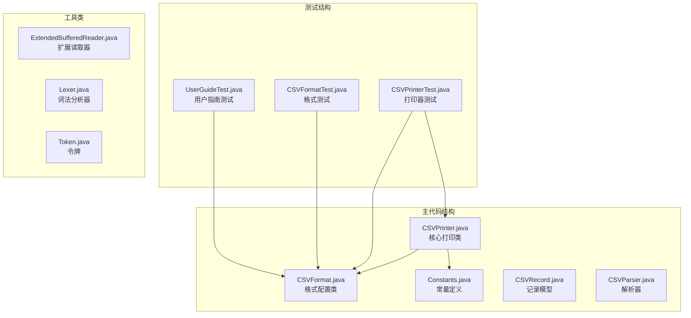
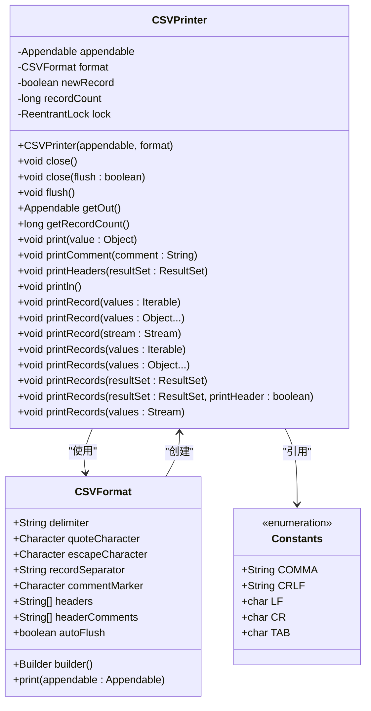
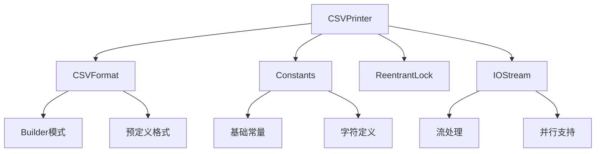

# CSVPrinter类API

<cite>
**本文档引用的文件**
- [CSVPrinter.java](file://src/main/java/org/apache/commons/csv/CSVPrinter.java)
- [CSVFormat.java](file://src/main/java/org/apache/commons/csv/CSVFormat.java)
- [Constants.java](file://src/main/java/org/apache/commons/csv/Constants.java)
- [CSVPrinterTest.java](file://src/test/java/org/apache/commons/csv/CSVPrinterTest.java)
- [UserGuideTest.java](file://src/test/java/org/apache/commons/csv/UserGuideTest.java)
- [package-info.java](file://src/main/java/org/apache/commons/csv/package-info.java)
- [README.md](file://README.md)
</cite>

## 目录
1. [简介](#简介)
2. [项目结构](#项目结构)
3. [核心组件](#核心组件)
4. [架构概览](#架构概览)
5. [详细组件分析](#详细组件分析)
6. [依赖分析](#依赖分析)
7. [性能考虑](#性能考虑)
8. [故障排除指南](#故障排除指南)
9. [结论](#结论)
10. [附录](#附录)

## 简介
CSVPrinter是Apache Commons CSV库中用于将数据以CSV格式打印到输出流的核心类。它提供了灵活的API来处理各种CSV格式配置，支持注释、头部信息、批量写入和流式输出等功能。本文档将详细介绍CSVPrinter类的完整API参考，包括构造函数、初始化选项、记录写入方法、批量写入支持、注释和头部信息功能，以及与CSVFormat类的协作关系。

## 项目结构
commons-csv项目采用标准的Maven目录结构，主要源代码位于`src/main/java/org/apache/commons/csv/`目录下，测试代码位于`src/test/java/org/apache/commons/csv/`目录下。



**图表来源**
- [CSVPrinter.java:1-580](file://src/main/java/org/apache/commons/csv/CSVPrinter.java#L1-L580)
- [CSVFormat.java:1-800](file://src/main/java/org/apache/commons/csv/CSVFormat.java#L1-L800)

**章节来源**
- [README.md:43-58](file://README.md#L43-L58)

## 核心组件
CSVPrinter类是整个CSV处理系统的核心组件，负责将数据值按照指定的CSV格式写入到目标输出流中。它实现了Flushable和Closeable接口，提供了完整的资源管理和自动刷新机制。

### 主要特性
- **线程安全**：使用ReentrantLock确保并发安全性
- **灵活的输出目标**：支持Writer、OutputStream、Appendable等多种输出类型
- **丰富的格式配置**：与CSVFormat类深度集成，支持多种预定义格式
- **批处理能力**：支持批量记录写入和流式处理
- **注释支持**：可选的注释功能，支持多行注释
- **头部管理**：自动生成和管理CSV头部信息

**章节来源**
- [CSVPrinter.java:80-123](file://src/main/java/org/apache/commons/csv/CSVPrinter.java#L80-L123)
- [CSVPrinter.java:199-206](file://src/main/java/org/apache/commons/csv/CSVPrinter.java#L199-L206)

## 架构概览
CSVPrinter采用分层架构设计，与CSVFormat紧密协作，形成完整的CSV处理生态系统。



**图表来源**
- [CSVPrinter.java:80-580](file://src/main/java/org/apache/commons/csv/CSVPrinter.java#L80-L580)
- [CSVFormat.java:182-326](file://src/main/java/org/apache/commons/csv/CSVFormat.java#L182-L326)
- [Constants.java:25-91](file://src/main/java/org/apache/commons/csv/Constants.java#L25-L91)

## 详细组件分析

### 构造函数和初始化
CSVPrinter的构造函数接受两个必需参数：输出目标和CSV格式配置。

#### 构造函数签名
```java
public CSVPrinter(final Appendable appendable, final CSVFormat format) throws IOException
```

#### 初始化流程
1. **参数验证**：确保输出目标和格式配置都不为null
2. **格式复制**：创建CSVFormat的副本以避免外部修改影响
3. **注释处理**：如果设置了头部注释，则立即写入
4. **头部处理**：如果配置了头部且不跳过首行，则写入头部行

#### 输出目标支持
CSVPrinter支持以下类型的输出目标：
- **Writer**：字符输出流，如FileWriter、StringWriter
- **OutputStream**：字节输出流，如FileOutputStream
- **Appendable**：通用追加接口，支持StringBuilder等

**章节来源**
- [CSVPrinter.java:107-123](file://src/main/java/org/apache/commons/csv/CSVPrinter.java#L107-L123)

### 记录写入方法

#### 单值打印方法
```java
public void print(final Object value) throws IOException
```
- **功能**：将单个值作为下一个字段打印
- **行为**：自动进行转义和封装处理
- **线程安全**：使用锁机制保证并发安全

#### 记录结束方法
```java
public void println() throws IOException
```
- **功能**：打印记录分隔符并重置新记录标志
- **内部实现**：调用CSVFormat.println()方法

#### 基础打印方法
```java
private void printRaw(final Object value) throws IOException
```
- **功能**：直接打印原始值，不进行额外处理
- **用途**：内部方法，供其他打印方法调用

**章节来源**
- [CSVPrinter.java:199-206](file://src/main/java/org/apache/commons/csv/CSVPrinter.java#L199-L206)
- [CSVPrinter.java:290-298](file://src/main/java/org/apache/commons/csv/CSVPrinter.java#L290-L298)
- [CSVPrinter.java:308-311](file://src/main/java/org/apache/commons/csv/CSVPrinter.java#L308-L311)

### 批量记录写入方法

#### Iterable批量写入
```java
public void printRecord(final Iterable<?> values) throws IOException
```
- **功能**：从Iterable中逐个打印值，然后结束当前记录
- **适用场景**：List、数组等集合类型

#### 可变参数批量写入
```java
public void printRecord(final Object... values) throws IOException
```
- **功能**：直接打印多个值作为单个记录
- **内部实现**：转换为List后调用printRecord(Iterable)

#### Stream批量写入
```java
public void printRecord(final Stream<?> stream) throws IOException
```
- **功能**：从Stream中逐个打印值，支持并行处理
- **性能优化**：并行流时使用printRaw以避免额外同步开销

#### 批量记录处理
```java
public void printRecords(final Iterable<?> values) throws IOException
```
- **功能**：处理嵌套集合/数组，每个元素作为单独记录
- **智能识别**：自动检测Object[]、Iterable或简单对象

**章节来源**
- [CSVPrinter.java:327-352](file://src/main/java/org/apache/commons/csv/CSVPrinter.java#L327-L352)
- [CSVPrinter.java:369-377](file://src/main/java/org/apache/commons/csv/CSVPrinter.java#L369-L377)
- [CSVPrinter.java:433-435](file://src/main/java/org/apache/commons/csv/CSVPrinter.java#L433-L435)

### JDBC集成支持

#### ResultSet批量写入
```java
public void printRecords(final ResultSet resultSet) throws SQLException, IOException
```
- **功能**：直接从JDBC ResultSet中读取并打印所有记录
- **特殊处理**：自动处理Clob和Blob类型的列
- **性能优化**：逐行处理，避免一次性加载所有数据

#### 头部自动处理
```java
public void printHeaders(final ResultSet resultSet) throws IOException, SQLException
```
- **功能**：从ResultSet元数据中提取列标签作为CSV头部
- **用途**：简化数据库导出操作

#### 条件头部写入
```java
public void printRecords(final ResultSet resultSet, final boolean printHeader) throws SQLException, IOException
```
- **功能**：根据布尔参数决定是否先写入头部
- **灵活性**：支持有头和无头两种导出模式

**章节来源**
- [CSVPrinter.java:489-513](file://src/main/java/org/apache/commons/csv/CSVPrinter.java#L489-L513)
- [CSVPrinter.java:272-282](file://src/main/java/org/apache/commons/csv/CSVPrinter.java#L272-L282)
- [CSVPrinter.java:528-533](file://src/main/java/org/apache/commons/csv/CSVPrinter.java#L528-L533)

### 注释和头部信息

#### 注释写入
```java
public void printComment(final String comment) throws IOException
```
- **条件检查**：只有当格式启用了注释标记时才写入
- **多行支持**：自动处理换行符，每行前添加注释标记
- **格式化**：在注释标记后添加空格

#### 头部注释配置
通过CSVFormat.Builder设置：
- `setHeaderComments(String... headerComments)`
- `setCommentMarker(char commentMarker)`

#### 自动头部处理
构造函数会自动处理：
- 头部注释的优先级高于普通头部
- 跳过头部记录的配置

**章节来源**
- [CSVPrinter.java:229-262](file://src/main/java/org/apache/commons/csv/CSVPrinter.java#L229-L262)
- [CSVPrinter.java:114-122](file://src/main/java/org/apache/commons/csv/CSVPrinter.java#L114-L122)

### 资源管理和自动刷新

#### 关闭方法
```java
public void close() throws IOException
public void close(final boolean flush) throws IOException
```
- **默认行为**：检查CSVFormat的autoFlush设置
- **强制刷新**：当flush参数为true时强制刷新
- **资源清理**：关闭底层输出流（如果实现Closeable）

#### 刷新方法
```java
public void flush() throws IOException
```
- **条件刷新**：仅当底层输出流实现Flushable接口时才刷新
- **延迟策略**：配合autoFlush设置实现延迟刷新

#### 记录计数
```java
public long getRecordCount() {
    return recordCount;
}
```
- **统计功能**：跟踪实际写入的记录数量（不含注释和头部）
- **用途**：监控导出进度和验证输出完整性

**章节来源**
- [CSVPrinter.java:125-146](file://src/main/java/org/apache/commons/csv/CSVPrinter.java#L125-L146)
- [CSVPrinter.java:165-170](file://src/main/java/org/apache/commons/csv/CSVPrinter.java#L165-L170)
- [CSVPrinter.java:187-189](file://src/main/java/org/apache/commons/csv/CSVPrinter.java#L187-L189)

## 依赖分析

### 内部依赖关系
CSVPrinter类具有清晰的依赖层次结构：



**图表来源**
- [CSVPrinter.java:26-41](file://src/main/java/org/apache/commons/csv/CSVPrinter.java#L26-L41)
- [CSVFormat.java:189-326](file://src/main/java/org/apache/commons/csv/CSVFormat.java#L189-L326)
- [Constants.java:25-91](file://src/main/java/org/apache/commons/csv/Constants.java#L25-L91)

### 外部依赖
CSVPrinter依赖于以下外部库：
- **Apache Commons IO**：提供IOStream工具类和AppendableOutputStream
- **Java标准库**：java.io、java.util.concurrent等

**章节来源**
- [CSVPrinter.java:41](file://src/main/java/org/apache/commons/csv/CSVPrinter.java#L41)

## 性能考虑

### 线程安全设计
CSVPrinter使用ReentrantLock确保线程安全，但需要注意：
- 锁粒度适中，避免长时间持有锁
- 并行Stream处理时使用printRaw避免额外同步开销
- 大量并发写入时考虑使用缓冲输出流

### 内存使用优化
- **流式处理**：优先使用Stream API进行大文件处理
- **延迟加载**：ResultSet处理采用逐行方式
- **最小化复制**：避免不必要的字符串和数组复制

### I/O性能优化
- **缓冲策略**：结合BufferedWriter使用提高I/O效率
- **批量写入**：使用printRecords方法减少系统调用次数
- **自动刷新**：合理配置autoFlush避免频繁磁盘写入

### 最佳实践建议
1. **资源管理**：始终使用try-with-resources语句
2. **格式选择**：根据数据特点选择合适的CSVFormat
3. **流式处理**：大数据集使用Stream API而非一次性加载
4. **错误处理**：妥善处理IOException和SQLException

## 故障排除指南

### 常见问题和解决方案

#### 空指针异常
**症状**：构造函数抛出NullPointerException
**原因**：传入了null的输出目标或格式配置
**解决**：确保传入有效的非null参数

#### 格式配置错误
**症状**：IllegalArgumentException
**原因**：格式配置包含无效字符（如换行符作为分隔符）
**解决**：检查并修正CSVFormat配置

#### 数据库连接问题
**症状**：SQLException
**原因**：ResultSet已关闭或数据库连接失效
**解决**：确保ResultSet在CSVPrinter生命周期内保持有效

#### 编码问题
**症状**：中文或其他字符显示异常
**解决**：使用正确的字符编码创建Writer

**章节来源**
- [CSVPrinterTest.java:1167-1174](file://src/test/java/org/apache/commons/csv/CSVPrinterTest.java#L1167-L1174)
- [CSVPrinterTest.java:791-793](file://src/test/java/org/apache/commons/csv/CSVPrinterTest.java#L791-L793)

### 调试技巧
1. **启用日志**：使用简单的Writer包装器跟踪写入过程
2. **验证格式**：使用CSVFormat.parse()验证生成的CSV格式
3. **单元测试**：编写针对特定场景的测试用例

## 结论
CSVPrinter类提供了强大而灵活的CSV写入功能，通过与CSVFormat的深度集成，能够满足各种复杂的CSV处理需求。其设计充分考虑了线程安全、性能优化和资源管理，在保证功能完整性的同时提供了良好的用户体验。

通过本文档的详细API参考，开发者可以充分利用CSVPrinter的各项功能，包括灵活的格式配置、高效的批量处理、完善的注释支持以及与数据库的良好集成。建议在实际使用中遵循本文档提供的最佳实践，以获得最优的性能和可靠性。

## 附录

### 预定义格式支持
CSVFormat类提供了多种预定义格式，适用于不同的应用场景：
- **DEFAULT**：标准CSV格式
- **EXCEL**：Excel兼容格式
- **MYSQL**：MySQL导出格式
- **POSTGRESQL_CSV**：PostgreSQL CSV格式
- **MONGODB_CSV/TAB**：MongoDB导出格式

### 使用示例路径
以下是一些关键使用示例的代码路径：
- [基本记录写入示例:729-736](file://src/test/java/org/apache/commons/csv/CSVPrinterTest.java#L729-L736)
- [批量记录写入示例:623-630](file://src/test/java/org/apache/commons/csv/CSVPrinterTest.java#L623-L630)
- [JDBC导出示例:796-827](file://src/test/java/org/apache/commons/csv/CSVPrinterTest.java#L796-L827)
- [注释功能示例:331-343](file://src/test/java/org/apache/commons/csv/CSVPrinterTest.java#L331-L343)

### 性能基准测试
项目包含专门的性能测试模块，可用于评估不同场景下的性能表现：
- [性能测试入口](file://src/test/java/org/apache/commons/csv/PerformanceTest.java)
- [CSV基准测试](file://src/test/java/org/apache/commons/csv/CSVBenchmark.java)