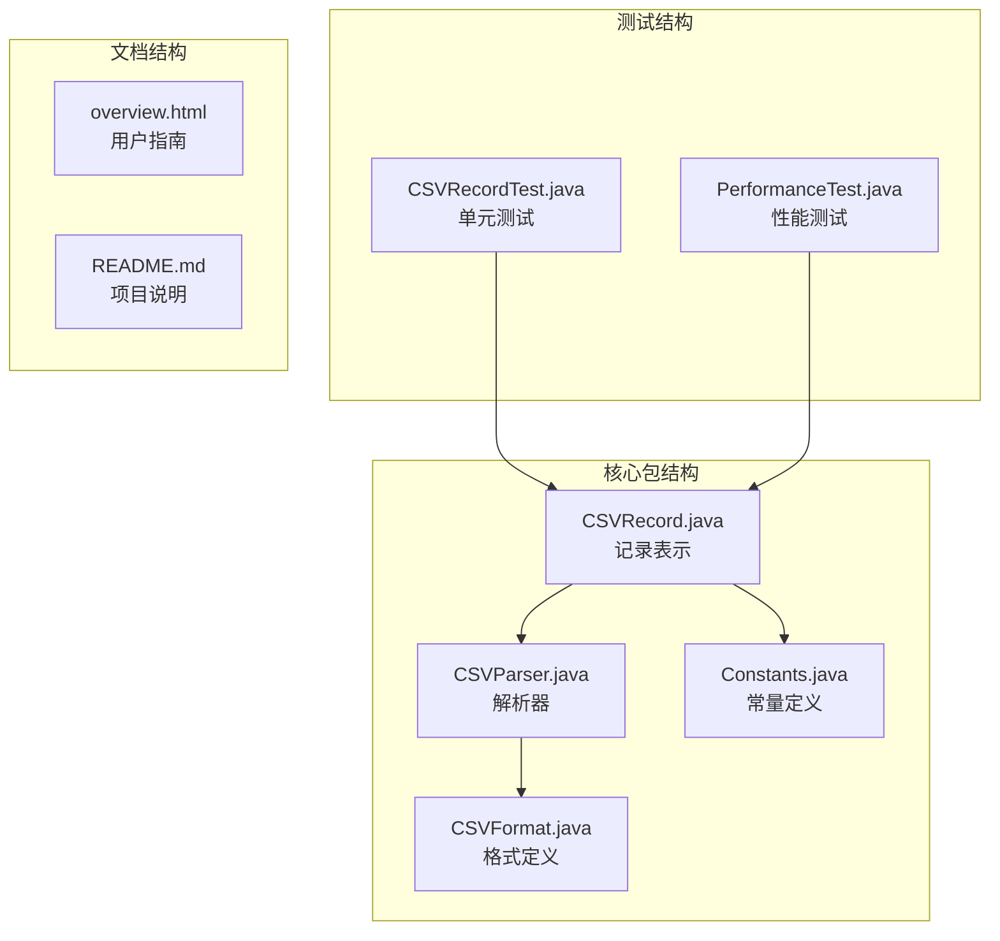
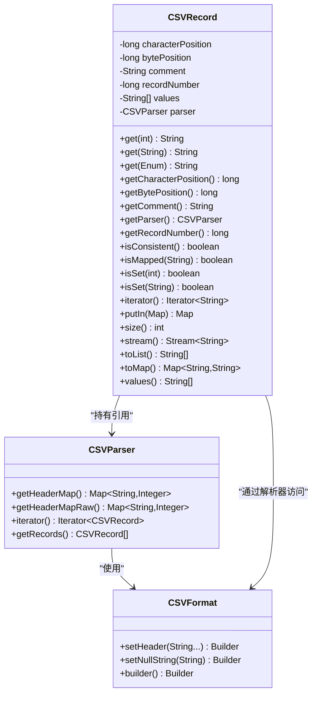
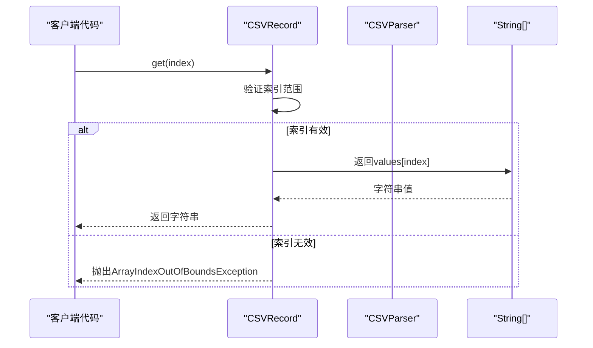
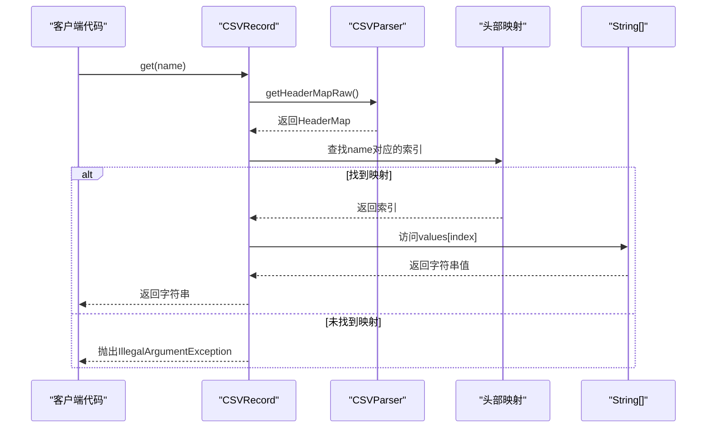
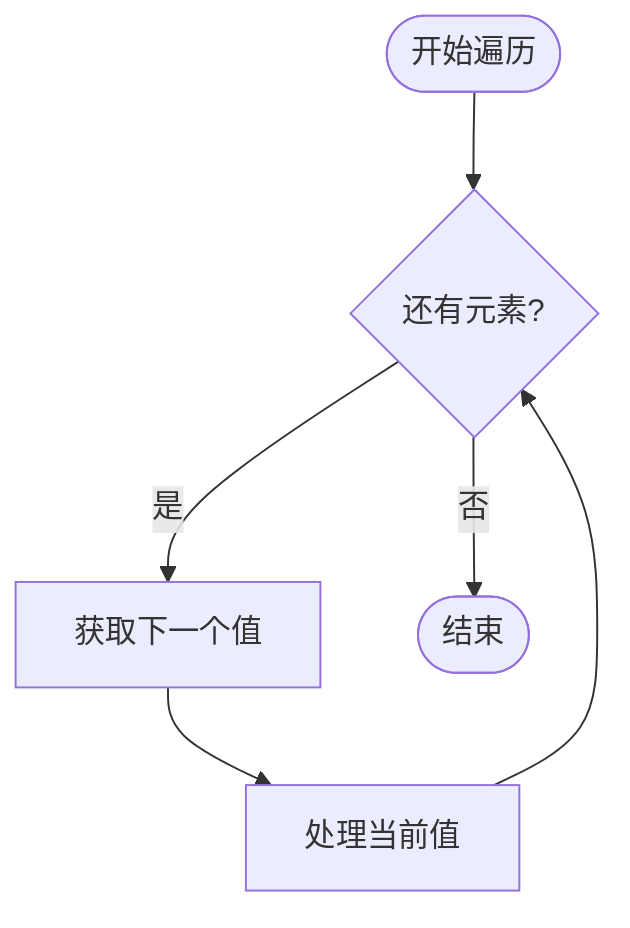
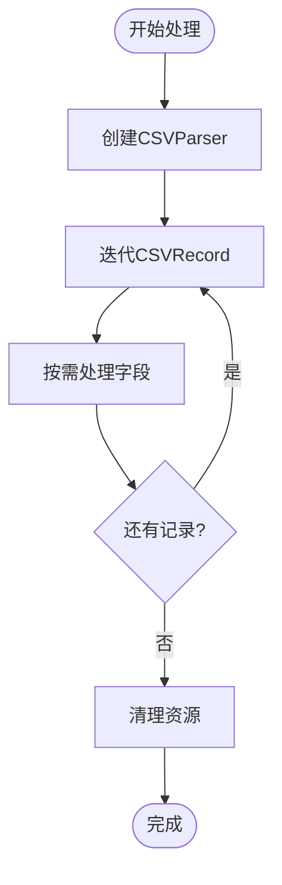

# CSVRecord类API

<cite>
**本文档引用的文件**
- [CSVRecord.java](file://src/main/java/org/apache/commons/csv/CSVRecord.java)
- [CSVParser.java](file://src/main/java/org/apache/commons/csv/CSVParser.java)
- [CSVFormat.java](file://src/main/java/org/apache/commons/csv/CSVFormat.java)
- [Constants.java](file://src/main/java/org/apache/commons/csv/Constants.java)
- [CSVRecordTest.java](file://src/test/java/org/apache/commons/csv/CSVRecordTest.java)
- [PerformanceTest.java](file://src/test/java/org/apache/commons/csv/PerformanceTest.java)
- [overview.html](file://src/main/javadoc/overview.html)
</cite>

## 目录
1. [简介](#简介)
2. [项目结构](#项目结构)
3. [核心组件](#核心组件)
4. [架构概览](#架构概览)
5. [详细组件分析](#详细组件分析)
6. [依赖关系分析](#依赖关系分析)
7. [性能考量](#性能考量)
8. [故障排除指南](#故障排除指南)
9. [结论](#结论)
10. [附录](#附录)

## 简介
CSVRecord类是Apache Commons CSV库中用于表示单个CSV记录的核心数据结构。它提供了多种访问字段值的方式，包括按索引访问和按名称访问，并支持迭代遍历、位置信息获取、映射转换等功能。该类设计为不可变对象，确保线程安全和数据一致性。

## 项目结构
Apache Commons CSV项目采用标准的Maven目录结构，主要源码位于`src/main/java/org/apache/commons/csv/`目录下，测试代码位于`src/test/java/org/apache/commons/csv/`目录下。



**图表来源**
- [CSVRecord.java:1-372](file://src/main/java/org/apache/commons/csv/CSVRecord.java#L1-L372)
- [CSVParser.java:147-949](file://src/main/java/org/apache/commons/csv/CSVParser.java#L147-L949)
- [CSVFormat.java:182-3205](file://src/main/java/org/apache/commons/csv/CSVFormat.java#L182-L3205)

**章节来源**
- [CSVRecord.java:1-372](file://src/main/java/org/apache/commons/csv/CSVRecord.java#L1-L372)
- [CSVParser.java:1-949](file://src/main/java/org/apache/commons/csv/CSVParser.java#L1-L949)

## 核心组件
CSVRecord类作为CSV数据处理的核心组件，具有以下关键特性：

### 主要功能特性
- **字段访问**：支持按索引和按名称两种访问方式
- **迭代支持**：实现Iterable接口，支持for-each循环
- **位置追踪**：提供字符位置和字节位置信息
- **映射转换**：支持转换为Map和List结构
- **状态检查**：提供一致性检查和映射状态查询

### 数据结构设计
- 使用`String[]`数组存储字段值，确保内存效率
- 维护解析器引用以支持按名称访问
- 存储位置信息用于调试和错误定位
- 支持注释信息的关联存储

**章节来源**
- [CSVRecord.java:43-78](file://src/main/java/org/apache/commons/csv/CSVRecord.java#L43-L78)
- [CSVRecord.java:87-146](file://src/main/java/org/apache/commons/csv/CSVRecord.java#L87-L146)

## 架构概览
CSVRecord类在整体架构中扮演着数据载体的角色，与CSVParser和CSVFormat紧密协作。



**图表来源**
- [CSVRecord.java:43-372](file://src/main/java/org/apache/commons/csv/CSVRecord.java#L43-L372)
- [CSVParser.java:147-949](file://src/main/java/org/apache/commons/csv/CSVParser.java#L147-L949)
- [CSVFormat.java:182-3205](file://src/main/java/org/apache/commons/csv/CSVFormat.java#L182-L3205)

## 详细组件分析

### 字段访问方法

#### 按索引访问


**图表来源**
- [CSVRecord.java:98-101](file://src/main/java/org/apache/commons/csv/CSVRecord.java#L98-L101)

#### 按名称访问


**图表来源**
- [CSVRecord.java:126-146](file://src/main/java/org/apache/commons/csv/CSVRecord.java#L126-L146)
- [CSVParser.java:719-721](file://src/main/java/org/apache/commons/csv/CSVParser.java#L719-L721)

**章节来源**
- [CSVRecord.java:87-146](file://src/main/java/org/apache/commons/csv/CSVRecord.java#L87-L146)

### 迭代器支持
CSVRecord实现了Iterable接口，提供多种遍历方式：

#### 基本迭代


**图表来源**
- [CSVRecord.java:280-282](file://src/main/java/org/apache/commons/csv/CSVRecord.java#L280-L282)

**章节来源**
- [CSVRecord.java:279-334](file://src/main/java/org/apache/commons/csv/CSVRecord.java#L279-L334)

### 位置信息获取
CSVRecord提供两种位置信息：
- **字符位置**：基于字符编码的位置信息
- **字节位置**：基于字节流的位置信息

**章节来源**
- [CSVRecord.java:152-167](file://src/main/java/org/apache/commons/csv/CSVRecord.java#L152-L167)

### 字段映射和验证
CSVRecord支持多种验证和映射功能：

#### 映射状态检查
- `isMapped(String)`: 检查列名是否已映射
- `isSet(int)`: 检查指定索引是否有值
- `isSet(String)`: 检查指定列名是否有值
- `isConsistent()`: 检查记录大小与头部大小是否一致

#### 映射转换
- `toMap()`: 转换为Map结构
- `putIn(Map)`: 将值放入现有Map
- `toList()`: 转换为List结构
- `stream()`: 获取Stream视图

**章节来源**
- [CSVRecord.java:247-348](file://src/main/java/org/apache/commons/csv/CSVRecord.java#L247-L348)

## 依赖关系分析

### 内部依赖关系
```mermaid
graph TB
subgraph "CSVRecord内部依赖"
A[String[] values<br/>字段值数组]
B[CSVParser parser<br/>解析器引用]
C[Map~String,Integer~ headerMap<br/>头部映射]
D[long recordNumber<br/>记录编号]
E[String comment<br/>注释信息]
F[long characterPosition<br/>字符位置]
G[long bytePosition<br/>字节位置]
end
B --> C
A --> D
A --> E
A --> F
A --> G
```

**图表来源**
- [CSVRecord.java:64-68](file://src/main/java/org/apache/commons/csv/CSVRecord.java#L64-L68)
- [CSVParser.java:588-656](file://src/main/java/org/apache/commons/csv/CSVParser.java#L588-L656)

### 外部依赖关系
CSVRecord与以下外部组件协作：
- **CSVParser**: 提供头部映射和解析上下文
- **CSVFormat**: 定义解析格式和空值处理规则
- **Constants**: 提供系统常量定义

**章节来源**
- [CSVRecord.java:178-183](file://src/main/java/org/apache/commons/csv/CSVRecord.java#L178-L183)
- [CSVParser.java:588-656](file://src/main/java/org/apache/commons/csv/CSVParser.java#L588-L656)

## 性能考量

### 访问模式性能对比

#### 按索引访问 vs 按名称访问
| 访问方式 | 时间复杂度 | 空间复杂度 | 适用场景 |
|---------|-----------|-----------|----------|
| 按索引访问 | O(1) | O(1) | 已知列位置、频繁访问 |
| 按名称访问 | O(k) | O(n) | 需要可读性、列位置可能变化 |

其中k为映射查找的平均时间，n为头部数量。

#### 内存使用优化
- 字段值存储为`String[]`数组，避免包装开销
- 头部映射仅在需要时通过解析器提供
- 迭代器返回列表副本，避免直接暴露内部数组

### 大数据处理优化建议

#### 流式处理


**图表来源**
- [PerformanceTest.java:72-87](file://src/test/java/org/apache/commons/csv/PerformanceTest.java#L72-L87)

**章节来源**
- [PerformanceTest.java:63-137](file://src/test/java/org/apache/commons/csv/PerformanceTest.java#L63-L137)

## 故障排除指南

### 常见异常处理

#### 索引越界异常
当访问不存在的字段索引时抛出：
- 异常类型：`ArrayIndexOutOfBoundsException`
- 触发条件：索引小于0或大于等于字段数量
- 解决方案：先调用`isSet()`方法检查，或使用`size()`获取字段数量

#### 名称映射异常
当访问未映射的列名时抛出：
- 异常类型：`IllegalArgumentException`
- 触发条件：解析器未提供头部映射或列名不存在
- 解决方案：确认CSVFormat配置了正确的头部，或使用按索引访问

#### 序列化兼容性
- `getBytePosition()`方法在当前版本返回固定字符串而非实际字节位置
- 序列化后无法恢复头部映射功能
- 建议在序列化前转换为按索引访问

**章节来源**
- [CSVRecord.java:98-101](file://src/main/java/org/apache/commons/csv/CSVRecord.java#L98-L101)
- [CSVRecord.java:126-146](file://src/main/java/org/apache/commons/csv/CSVRecord.java#L126-L146)
- [CSVRecord.java:152-157](file://src/main/java/org/apache/commons/csv/CSVRecord.java#L152-L157)

### 边界情况处理

#### 空值处理
- `CSVFormat.getNullString()`定义的空字符串会被转换为`null`
- 在严格引用模式下，空字符串和缺失值有明确区分
- 可通过`isSet()`方法区分空字符串和缺失值

#### 重复列名处理
- 支持重复列名，但按名称访问时只返回最后出现的值
- 可通过`isConsistent()`检查记录与头部的一致性

**章节来源**
- [CSVParser.java:790-800](file://src/main/java/org/apache/commons/csv/CSVParser.java#L790-L800)
- [CSVRecordTest.java:98-126](file://src/test/java/org/apache/commons/csv/CSVRecordTest.java#L98-L126)

## 结论
CSVRecord类提供了高效、灵活的CSV记录访问能力。其设计平衡了性能和易用性，既支持高效的按索引访问，又提供了按名称访问的便利性。通过合理的使用策略和性能优化技巧，可以在处理大规模CSV数据时获得最佳性能表现。

## 附录

### 实际使用场景示例

#### 基本字段访问
```java
// 按索引访问
String firstName = record.get(0);
String lastName = record.get(1);

// 按名称访问
String email = record.get("Email");
String phone = record.get("Phone");

// 检查字段存在性
if (record.isSet("Email")) {
    // 处理邮箱字段
}
```

#### 数据验证和转换
```java
// 验证记录一致性
if (!record.isConsistent()) {
    throw new IllegalArgumentException("记录与头部不匹配");
}

// 转换为Map进行处理
Map<String, String> recordMap = record.toMap();
for (Map.Entry<String, String> entry : recordMap.entrySet()) {
    String key = entry.getKey();
    String value = entry.getValue();
    // 处理键值对
}
```

#### 大数据处理优化
```java
// 流式处理避免内存占用
try (CSVParser parser = CSVFormat.DEFAULT.parse(reader)) {
    for (CSVRecord record : parser) {
        // 处理单条记录
        processRecord(record);
        
        // 及时释放不需要的对象
        if (shouldReleaseMemory()) {
            record = null;
        }
    }
}
```

**章节来源**
- [overview.html:218-250](file://src/main/javadoc/overview.html#L218-L250)
- [CSVRecordTest.java:232-348](file://src/test/java/org/apache/commons/csv/CSVRecordTest.java#L232-L348)