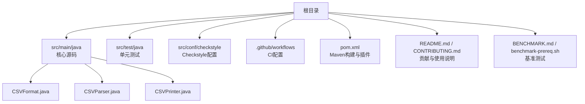
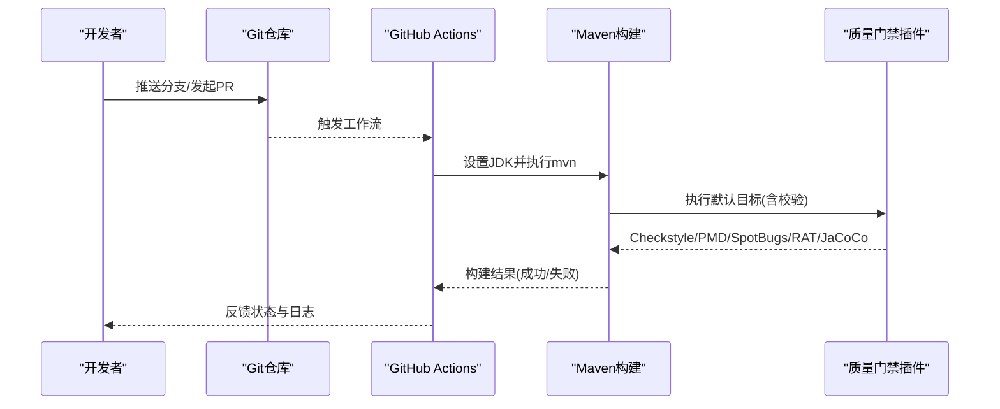
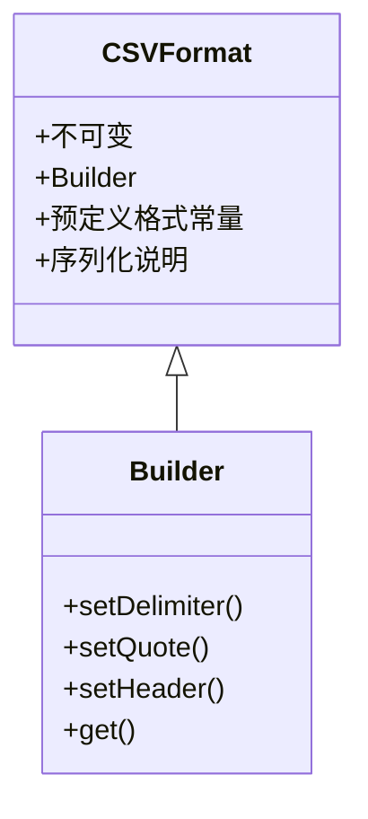
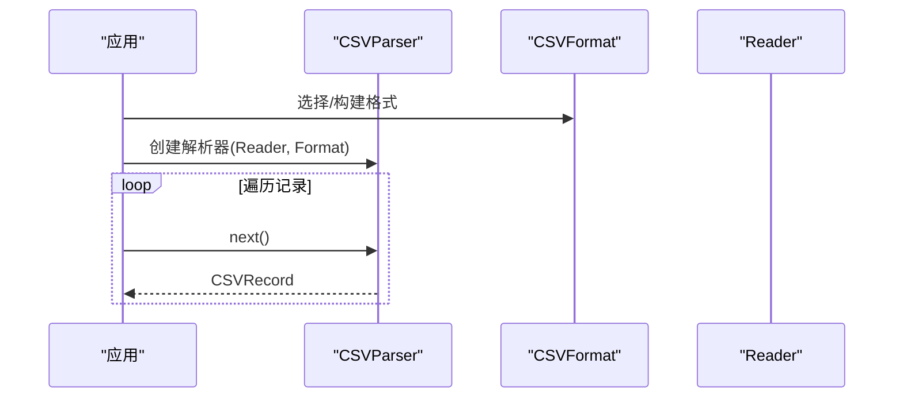
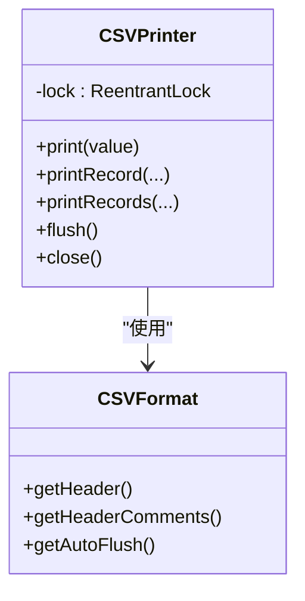
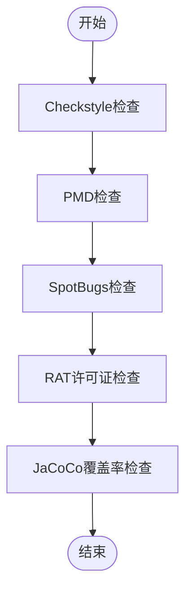
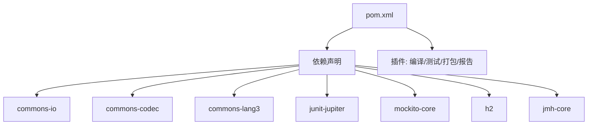

# 开发者指南

<cite>
**本文引用的文件**
- [pom.xml](file://pom.xml)
- [CONTRIBUTING.md](file://CONTRIBUTING.md)
- [CODE_OF_CONDUCT.md](file://CODE_OF_CONDUCT.md)
- [README.md](file://README.md)
- [SECURITY.md](file://SECURITY.md)
- [.github/workflows/maven.yml](file://.github/workflows/maven.yml)
- [BENCHMARK.md](file://BENCHMARK.md)
- [benchmark-prereq.sh](file://benchmark-prereq.sh)
- [.asf.yaml](file://.asf.yaml)
- [src/conf/checkstyle/checkstyle.xml](file://src/conf/checkstyle/checkstyle.xml)
- [src/conf/checkstyle/checkstyle-suppressions.xml](file://src/conf/checkstyle/checkstyle-suppressions.xml)
- [src/main/java/org/apache/commons/csv/CSVFormat.java](file://src/main/java/org/apache/commons/csv/CSVFormat.java)
- [src/main/java/org/apache/commons/csv/CSVParser.java](file://src/main/java/org/apache/commons/csv/CSVParser.java)
- [src/main/java/org/apache/commons/csv/CSVPrinter.java](file://src/main/java/org/apache/commons/csv/CSVPrinter.java)
- [src/main/java/org/apache/commons/csv/package-info.java](file://src/main/java/org/apache/commons/csv/package-info.java)
</cite>

## 目录
1. [简介](#简介)
2. [项目结构](#项目结构)
3. [核心组件](#核心组件)
4. [架构总览](#架构总览)
5. [详细组件分析](#详细组件分析)
6. [依赖分析](#依赖分析)
7. [性能考虑](#性能考虑)
8. [故障排查指南](#故障排查指南)
9. [结论](#结论)
10. [附录](#附录)

## 简介
本指南面向Apache Commons CSV项目的贡献者与维护者，帮助新贡献者快速理解开发环境、构建流程、代码规范、质量门禁、贡献流程、发布与版本管理策略，并提供调试与开发工具使用建议。内容基于仓库中的实际配置与源码进行整理，确保可操作性与一致性。

## 项目结构
该项目采用标准的Maven多模块布局，核心源码位于src/main/java，测试位于src/test/java，构建与质量门禁通过Maven插件实现，CI由GitHub Actions驱动。关键目录与文件如下：
- 构建与质量：pom.xml、.github/workflows/maven.yml、src/conf/checkstyle
- 核心源码：src/main/java/org/apache/commons/csv 下的CSVFormat、CSVParser、CSVPrinter等
- 测试与资源：src/test/java、src/test/resources
- 文档与站点：README.md、CONTRIBUTING.md、SECURITY.md、CODE_OF_CONDUCT.md、.asf.yaml
- 基准测试：BENCHMARK.md、benchmark-prereq.sh

**图表来源**
- [pom.xml](file://pom.xml)
- [.github/workflows/maven.yml](file://.github/workflows/maven.yml)
- [src/conf/checkstyle/checkstyle.xml](file://src/conf/checkstyle/checkstyle.xml)
- [src/main/java/org/apache/commons/csv/CSVFormat.java](file://src/main/java/org/apache/commons/csv/CSVFormat.java)
- [src/main/java/org/apache/commons/csv/CSVParser.java](file://src/main/java/org/apache/commons/csv/CSVParser.java)
- [src/main/java/org/apache/commons/csv/CSVPrinter.java](file://src/main/java/org/apache/commons/csv/CSVPrinter.java)

**章节来源**
- [pom.xml](file://pom.xml)
- [.github/workflows/maven.yml](file://.github/workflows/maven.yml)
- [README.md](file://README.md)

## 核心组件
- CSVFormat：定义CSV解析与写入格式（分隔符、引号、换行、注释、空行处理、预定义方言等），支持Builder模式与序列化特性说明。
- CSVParser：按记录逐条解析输入流，支持多种静态工厂方法与迭代器接口；内部状态由格式与读取器状态决定。
- CSVPrinter：以指定格式打印值与记录，支持批量打印、自动刷新、锁保护并发安全；可选打印头部与注释。
- 包级文档：概述CSV数据模型、支持的方言特性与示例用法。

这些类共同构成CSV读写的核心API，遵循不可变性与线程安全设计原则（如加锁的打印器）。

**章节来源**
- [src/main/java/org/apache/commons/csv/CSVFormat.java](file://src/main/java/org/apache/commons/csv/CSVFormat.java)
- [src/main/java/org/apache/commons/csv/CSVParser.java](file://src/main/java/org/apache/commons/csv/CSVParser.java)
- [src/main/java/org/apache/commons/csv/CSVPrinter.java](file://src/main/java/org/apache/commons/csv/CSVPrinter.java)
- [src/main/java/org/apache/commons/csv/package-info.java](file://src/main/java/org/apache/commons/csv/package-info.java)

## 架构总览
下图展示从提交到CI执行、再到质量门禁与报告的整体流程，映射到实际的CI工作流与Maven插件配置。

**图表来源**
- [.github/workflows/maven.yml](file://.github/workflows/maven.yml)
- [pom.xml](file://pom.xml)

## 详细组件分析

### 组件A：CSVFormat（格式定义）
- 设计要点
  - 不可变类，提供Builder用于构建实例
  - 支持预定义格式（Excel、RFC4180等）与自定义扩展
  - 序列化说明与版本兼容性提示
- 关键流程
  - 使用静态工厂或Builder创建实例
  - 通过CSVParser.parse或CSVPrinter构造函数应用格式
- 并发与线程安全
  - 作为不可变对象，读取时无需同步
- 性能与复杂度
  - 格式解析在构造阶段完成，运行时O(1)访问
- 错误处理
  - 非法参数会抛出异常；建议在调用前验证格式一致性

**图表来源**
- [src/main/java/org/apache/commons/csv/CSVFormat.java](file://src/main/java/org/apache/commons/csv/CSVFormat.java)

**章节来源**
- [src/main/java/org/apache/commons/csv/CSVFormat.java](file://src/main/java/org/apache/commons/csv/CSVFormat.java)

### 组件B：CSVParser（解析器）
- 设计要点
  - 迭代器接口，逐条解析记录
  - 提供静态工厂方法与Builder
  - 内部状态仅依赖格式与读取器
- 关键流程
  - 从Reader或文件创建
  - 逐条读取并返回CSVRecord
  - 支持一次性读入内存（谨慎使用大文件）
- 并发与线程安全
  - 单实例非线程安全；多线程需各自持有独立实例
- 性能与复杂度
  - 记录级解析，时间复杂度O(n)，空间取决于实现选择

**图表来源**
- [src/main/java/org/apache/commons/csv/CSVParser.java](file://src/main/java/org/apache/commons/csv/CSVParser.java)
- [src/main/java/org/apache/commons/csv/CSVFormat.java](file://src/main/java/org/apache/commons/csv/CSVFormat.java)

**章节来源**
- [src/main/java/org/apache/commons/csv/CSVParser.java](file://src/main/java/org/apache/commons/csv/CSVParser.java)

### 组件C：CSVPrinter（打印器）
- 设计要点
  - 实现Flushable/Closeable，支持自动刷新与关闭
  - 内置锁保证并发安全
  - 支持批量打印、注释与头部输出
- 关键流程
  - 构造时可打印头部与注释
  - print/printRecord/printRecords按需输出
  - close/flush控制资源释放
- 并发与线程安全
  - 内部使用ReentrantLock，适合多线程场景
- 性能与复杂度
  - 输出为流式，时间复杂度O(n)，注意I/O瓶颈

**图表来源**
- [src/main/java/org/apache/commons/csv/CSVPrinter.java](file://src/main/java/org/apache/commons/csv/CSVPrinter.java)
- [src/main/java/org/apache/commons/csv/CSVFormat.java](file://src/main/java/org/apache/commons/csv/CSVFormat.java)

**章节来源**
- [src/main/java/org/apache/commons/csv/CSVPrinter.java](file://src/main/java/org/apache/commons/csv/CSVPrinter.java)

### 组件D：质量门禁与检查样式
- Checkstyle规则
  - 行长度限制、禁止制表符、尾随空白、导入顺序、修饰符顺序、括号与空白、未使用导入等
  - 头文件校验、特定文件抑制（如CSVParser.java长行、pom属性文件）
- PMD/SpotBugs/RAT/JaCoCo
  - PMD与SpotBugs在CI中执行静态分析
  - RAT检查许可证头
  - JaCoCo覆盖率阈值配置（类/指令/方法/分支/行/复杂度）

**图表来源**
- [pom.xml](file://pom.xml)
- [src/conf/checkstyle/checkstyle.xml](file://src/conf/checkstyle/checkstyle.xml)
- [src/conf/checkstyle/checkstyle-suppressions.xml](file://src/conf/checkstyle/checkstyle-suppressions.xml)

**章节来源**
- [pom.xml](file://pom.xml)
- [src/conf/checkstyle/checkstyle.xml](file://src/conf/checkstyle/checkstyle.xml)
- [src/conf/checkstyle/checkstyle-suppressions.xml](file://src/conf/checkstyle/checkstyle-suppressions.xml)

## 依赖分析
- 构建与运行
  - Maven编译源码与目标版本均为Java 8
  - 默认执行顺序包含清理、测试、校验与文档生成
- 测试与基准
  - 单元测试由Surefire执行，排除性能测试
  - 基准测试通过JMH在独立profile中启用
- 外部依赖
  - commons-io、commons-codec、commons-lang3、JUnit Jupiter、Mockito、H2数据库、JMH等

**图表来源**
- [pom.xml](file://pom.xml)

**章节来源**
- [pom.xml](file://pom.xml)

## 性能考虑
- 解析与打印
  - 优先使用逐条记录解析，避免一次性读入内存
  - 合理设置缓冲区与字符集，减少I/O开销
- 基准测试
  - 使用JMH进行微基准测试，支持对比不同实现
  - 脚本安装缺失依赖后方可运行基准测试
- 性能测试
  - 提供独立的性能测试类，使用简单计时指标

**章节来源**
- [BENCHMARK.md](file://BENCHMARK.md)
- [benchmark-prereq.sh](file://benchmark-prereq.sh)

## 故障排查指南
- 构建失败
  - 检查Java版本是否满足maven.compiler.source/target（Java 8）
  - 在本地先执行默认目标以复现问题
- 质量门禁失败
  - Checkstyle/PMD/SpotBugs/RAT/JaCoCo分别有对应报告与抑制配置
  - 使用交互式插件运行以定位问题
- 覆盖率不达标
  - 可临时关闭haltOnFailure查看报告，但最终必须满足阈值
- CI差异
  - CI在多个JDK版本与操作系统矩阵上运行，确保跨平台兼容

**章节来源**
- [pom.xml](file://pom.xml)
- [.github/workflows/maven.yml](file://.github/workflows/maven.yml)

## 结论
本指南总结了开发环境、构建与CI、代码规范与质量门禁、贡献流程、版本与发布策略、调试与工具使用以及社区行为准则。建议贡献者在提交前先在本地完整执行默认构建目标，确保所有质量门禁通过，并参考Pull Request模板与邮件列表沟通。

## 附录

### A. 开发环境设置
- JDK要求
  - 源码与目标版本：Java 8
- IDE配置
  - 导入Maven项目，启用注解处理器
  - 配置Checkstyle与PMD插件以获得实时反馈
- 开发工具链
  - Maven、Git、JDK、IDE（推荐IntelliJ IDEA或Eclipse）

**章节来源**
- [pom.xml](file://pom.xml)
- [README.md](file://README.md)

### B. 构建流程与CI/CD
- Maven命令
  - 默认目标：clean verify（包含所有质量门禁）
  - 基准测试：mvn test -Pbenchmark
  - 覆盖率报告：mvn clean site -Dcommons.jacoco.haltOnFailure=false -Pjacoco
- CI配置
  - 工作流触发：push/pull_request
  - 矩阵：Ubuntu/MacOS + JDK 8/11/17/21/26-ea
  - 步骤：检出、缓存依赖、设置JDK、构建

**章节来源**
- [.github/workflows/maven.yml](file://.github/workflows/maven.yml)
- [pom.xml](file://pom.xml)

### C. 代码贡献流程
- 准备工作
  - Fork仓库并在本地创建主题分支
  - 遵循提交信息格式（包含JIRA编号）
- 提交规范
  - 使用空格缩进、最小化diff、保留有意义的提交历史
  - 为变更编写单元测试
- 审查与合并
  - 通过GitHub PR提交，保持Files Changed仅包含预期更改
  - 维护者可能squash合并

**章节来源**
- [CONTRIBUTING.md](file://CONTRIBUTING.md)

### D. 代码规范与质量要求
- Checkstyle
  - 行长度、制表符、尾随空白、导入顺序、修饰符顺序、空白与括号、未使用导入等
  - 特定文件抑制（如CSVParser.java长行、pom属性文件）
- 其他质量工具
  - PMD、SpotBugs、RAT、JaCoCo均有配置与阈值

**章节来源**
- [src/conf/checkstyle/checkstyle.xml](file://src/conf/checkstyle/checkstyle.xml)
- [src/conf/checkstyle/checkstyle-suppressions.xml](file://src/conf/checkstyle/checkstyle-suppressions.xml)
- [pom.xml](file://pom.xml)

### E. 发布流程与版本管理
- 版本属性
  - 当前快照版本、发布版本描述、组件ID、模块名、JIRA信息
- 分发与站点
  - 分发至Apache网站与Maven中央仓库
- 发布步骤（维护者）
  - 准备RC、投票、签名与发布

**章节来源**
- [pom.xml](file://pom.xml)

### F. 社区行为准则与沟通渠道
- 行为准则
  - 遵守Apache行为准则
- 沟通渠道
  - 开发邮件列表为主要沟通渠道
  - Slack频道与Twitter账号用于社区互动

**章节来源**
- [CODE_OF_CONDUCT.md](file://CODE_OF_CONDUCT.md)
- [README.md](file://README.md)
- [.asf.yaml](file://.asf.yaml)