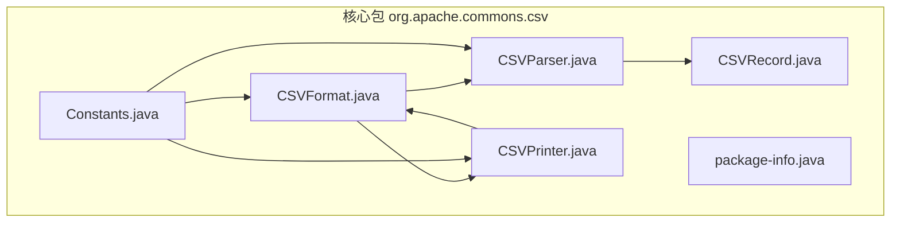
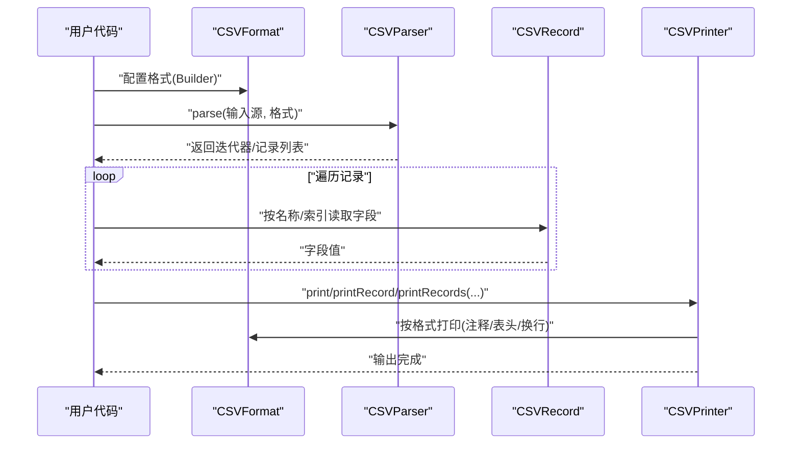
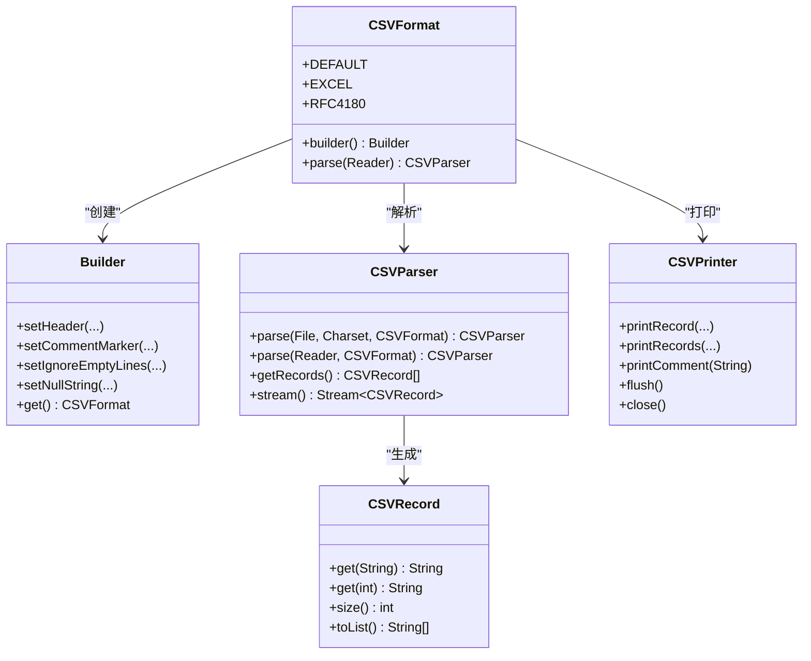

# 快速开始

<cite>
**本文引用的文件**
- [README.md](file://README.md)
- [pom.xml](file://pom.xml)
- [CSVFormat.java](file://src/main/java/org/apache/commons/csv/CSVFormat.java)
- [CSVParser.java](file://src/main/java/org/apache/commons/csv/CSVParser.java)
- [CSVPrinter.java](file://src/main/java/org/apache/commons/csv/CSVPrinter.java)
- [CSVRecord.java](file://src/main/java/org/apache/commons/csv/CSVRecord.java)
- [package-info.java](file://src/main/java/org/apache/commons/csv/package-info.java)
- [Constants.java](file://src/main/java/org/apache/commons/csv/Constants.java)
- [UserGuideTest.java](file://src/test/java/org/apache/commons/csv/UserGuideTest.java)
- [test.csv](file://src/test/resources/org/apache/commons/csv/CSVFileParser/test.csv)
- [test_default.txt](file://src/test/resources/org/apache/commons/csv/CSVFileParser/test_default.txt)
- [test_default_comment.txt](file://src/test/resources/org/apache/commons/csv/CSVFileParser/test_default_comment.txt)
</cite>

## 目录
1. [简介](#简介)
2. [项目结构](#项目结构)
3. [核心组件](#核心组件)
4. [架构总览](#架构总览)
5. [详细组件分析](#详细组件分析)
6. [依赖分析](#依赖分析)
7. [性能考虑](#性能考虑)
8. [故障排查指南](#故障排查指南)
9. [结论](#结论)
10. [附录](#附录)

## 简介
本指南面向初学者，带你用最短路径掌握 Apache Commons CSV 的基础用法：安装与依赖配置、基本读取与写入、常见操作模式（含注释、转义、换行、空值处理等），并提供可直接运行的示例思路与预期输出。你将学会：
- 如何在项目中引入依赖（Maven）
- 如何使用默认格式或自定义格式进行 CSV 解析与打印
- 如何安全地通过列名或索引访问记录字段
- 如何处理注释、空行、转义与多行值
- 如何进行流式处理与内存一次性加载

## 项目结构
仓库采用标准 Maven 结构，核心源码位于 src/main/java 下的 org.apache.commons.csv 包内，包含以下关键类：
- CSVFormat：定义 CSV 格式（分隔符、引号、注释、换行、空行跳过、空值字符串等）
- CSVParser：按格式解析 CSV 输入，支持多种输入源（文件、URL、Reader、String）
- CSVPrinter：按格式打印 CSV 输出，支持注释、表头、批量打印
- CSVRecord：表示一条解析出的记录，支持按名称或索引访问字段
- Constants：包内常量（分隔符、换行符、注释符等）
- package-info：包级文档与基本概念说明

图表来源
- [CSVFormat.java](file://src/main/java/org/apache/commons/csv/CSVFormat.java)
- [CSVParser.java](file://src/main/java/org/apache/commons/csv/CSVParser.java)
- [CSVPrinter.java](file://src/main/java/org/apache/commons/csv/CSVPrinter.java)
- [CSVRecord.java](file://src/main/java/org/apache/commons/csv/CSVRecord.java)
- [Constants.java](file://src/main/java/org/apache/commons/csv/Constants.java)
- [package-info.java](file://src/main/java/org/apache/commons/csv/package-info.java)

章节来源
- [package-info.java:20-85](file://src/main/java/org/apache/commons/csv/package-info.java#L20-L85)

## 核心组件
- CSVFormat：用于描述 CSV 的“方言”，包括分隔符、引号、注释符、是否忽略空行、是否忽略首行等。它提供多种预定义格式（如 EXCEL、RFC4180 等）以及 Builder 模式来自定义。
- CSVParser：负责将输入流解析为记录序列；支持文件、URL、Reader、String 等输入源；支持迭代器与流式处理。
- CSVPrinter：负责将数据以指定格式打印为 CSV；支持单条/批量记录打印、注释、表头、自动刷新等。
- CSVRecord：表示一条记录，支持按名称（需要设置表头映射）或索引访问字段。

章节来源
- [CSVFormat.java:50-182](file://src/main/java/org/apache/commons/csv/CSVFormat.java#L50-L182)
- [CSVParser.java:56-147](file://src/main/java/org/apache/commons/csv/CSVParser.java#L56-L147)
- [CSVPrinter.java:43-80](file://src/main/java/org/apache/commons/csv/CSVPrinter.java#L43-L80)
- [CSVRecord.java:31-43](file://src/main/java/org/apache/commons/csv/CSVRecord.java#L31-L43)

## 架构总览
下图展示了从输入到输出的典型流程：输入源经由 CSVFormat 定义的规则交给 CSVParser 解析为 CSVRecord 序列；CSVPrinter 则根据 CSVFormat 将数据写回输出目标。

图表来源
- [CSVFormat.java:182-327](file://src/main/java/org/apache/commons/csv/CSVFormat.java#L182-L327)
- [CSVParser.java:321-447](file://src/main/java/org/apache/commons/csv/CSVParser.java#L321-L447)
- [CSVPrinter.java:107-123](file://src/main/java/org/apache/commons/csv/CSVPrinter.java#L107-L123)

## 详细组件分析

### 安装与依赖配置（Maven）
- 使用 Maven 引入依赖：在项目的 pom.xml 中添加 org.apache.commons:commons-csv 依赖，版本建议使用当前稳定版。
- Java 版本要求：构建属性显示最低 Java 版本为 1.8。

章节来源
- [README.md:65-73](file://README.md#L65-L73)
- [pom.xml:102-103](file://pom.xml#L102-L103)

### 基本概念：CSV 格式、记录访问与流式处理
- CSV 是“以换行分隔的记录，记录由分隔符分隔的值组成”。Commons CSV 支持多种方言，可通过 CSVFormat 配置。
- 记录访问：若设置了表头，可用名称访问；否则只能按索引访问。
- 流式处理：CSVParser 实现了 Iterable，可直接 for-each 迭代；也可转换为 Stream。

章节来源
- [package-info.java:23-81](file://src/main/java/org/apache/commons/csv/package-info.java#L23-L81)
- [CSVParser.java:84-116](file://src/main/java/org/apache/commons/csv/CSVParser.java#L84-L116)
- [CSVRecord.java:80-143](file://src/main/java/org/apache/commons/csv/CSVRecord.java#L80-L143)

### Hello World：最简单的读取与写入
- 读取：使用 CSVFormat.DEFAULT 或 EXCEL，调用 parse(...) 获取迭代器，遍历 CSVRecord 并按名称或索引取值。
- 写入：使用 CSVPrinter，先打印表头（可选），再逐条打印数据，最后 flush/close。

提示
- 示例代码路径参考：[UserGuideTest.java:56-92](file://src/test/java/org/apache/commons/csv/UserGuideTest.java#L56-L92)，该测试展示了带 BOM 的 UTF-8 文件读取与按名称访问字段。

章节来源
- [UserGuideTest.java:56-92](file://src/test/java/org/apache/commons/csv/UserGuideTest.java#L56-L92)
- [CSVParser.java:321-447](file://src/main/java/org/apache/commons/csv/CSVParser.java#L321-L447)
- [CSVPrinter.java:107-123](file://src/main/java/org/apache/commons/csv/CSVPrinter.java#L107-L123)

### 常见操作模式

#### 1) 读取文件并按名称访问字段
- 设置表头：使用 CSVFormat.Builder.setHeader(...) 或 setHeader() 自动从第一行读取。
- 遍历记录：for (CSVRecord record : parser)。
- 字段访问：record.get("列名") 或 record.get(索引)。

章节来源
- [CSVFormat.java:100-156](file://src/main/java/org/apache/commons/csv/CSVFormat.java#L100-L156)
- [CSVParser.java:84-116](file://src/main/java/org/apache/commons/csv/CSVParser.java#L84-L116)
- [CSVRecord.java:102-143](file://src/main/java/org/apache/commons/csv/CSVRecord.java#L102-L143)

#### 2) 写入 CSV 并打印注释与表头
- 注释：CSVPrinter.printComment(...) 可打印注释行（需格式允许）。
- 表头：构造 CSVPrinter 时会自动打印格式中的表头（若未跳过）。
- 批量打印：printRecords(...) 支持数组、集合、Stream 等。

章节来源
- [CSVPrinter.java:208-262](file://src/main/java/org/apache/commons/csv/CSVPrinter.java#L208-L262)
- [CSVPrinter.java:326-377](file://src/main/java/org/apache/commons/csv/CSVPrinter.java#L326-L377)

#### 3) 处理注释、空行与特殊字符
- 注释：通过 CSVFormat.Builder.setCommentMarker(...) 设置注释起始字符；注释行会被解析器跳过。
- 空行：默认忽略空行；可通过 setIgnoreEmptyLines(false) 保留为空记录。
- 转义与引号：默认使用双引号作为封装符；遇到换行、逗号等特殊字符会自动转义或封装。

章节来源
- [CSVFormat.java:364-444](file://src/main/java/org/apache/commons/csv/CSVFormat.java#L364-L444)
- [CSVFormat.java:708-741](file://src/main/java/org/apache/commons/csv/CSVFormat.java#L708-L741)
- [package-info.java:46-67](file://src/main/java/org/apache/commons/csv/package-info.java#L46-L67)

#### 4) 处理多行值与空值
- 多行值：被引号包裹的值可包含换行；解析器会正确识别。
- 空值：可通过 CSVFormat.Builder.setNullString(...) 指定空字符串与 null 的互转策略。

章节来源
- [CSVFormat.java:770-785](file://src/main/java/org/apache/commons/csv/CSVFormat.java#L770-L785)
- [CSVParser.java:783-800](file://src/main/java/org/apache/commons/csv/CSVParser.java#L783-L800)

### 错误处理与最佳实践
- 资源管理：解析器与打印机实现 Closeable，务必在 try-with-resources 中使用，或显式 close。
- 异常类型：解析异常抛出 CSVException；I/O 异常抛出 IOException；非法参数抛出 IllegalArgumentException。
- 最佳实践：
  - 明确字符集（如 UTF-8），必要时使用 BOMInputStream 处理 BOM。
  - 优先使用表头映射访问字段，避免硬编码索引。
  - 对大文件采用流式处理，避免一次性加载到内存。

章节来源
- [CSVParser.java:577-586](file://src/main/java/org/apache/commons/csv/CSVParser.java#L577-L586)
- [CSVPrinter.java:125-146](file://src/main/java/org/apache/commons/csv/CSVPrinter.java#L125-L146)
- [UserGuideTest.java:50-54](file://src/test/java/org/apache/commons/csv/UserGuideTest.java#L50-L54)

### 类关系图（代码级）

图表来源
- [CSVFormat.java:182-327](file://src/main/java/org/apache/commons/csv/CSVFormat.java#L182-L327)
- [CSVParser.java:321-447](file://src/main/java/org/apache/commons/csv/CSVParser.java#L321-L447)
- [CSVRecord.java:80-143](file://src/main/java/org/apache/commons/csv/CSVRecord.java#L80-L143)
- [CSVPrinter.java:107-123](file://src/main/java/org/apache/commons/csv/CSVPrinter.java#L107-L123)

## 依赖分析
- Maven 依赖：commons-csv 本身不直接依赖业务代码，但其构建脚本声明了对 commons-io、commons-codec 等工具库的依赖，用于 I/O 与编码处理。
- Java 版本：最低 Java 8。

章节来源
- [pom.xml:31-58](file://pom.xml#L31-L58)
- [pom.xml:102-103](file://pom.xml#L102-L103)

## 性能考虑
- 流式处理：对于大文件，推荐使用迭代器或 Stream，避免一次性将全部内容载入内存。
- 格式选择：RFC4180 更严格，适合跨平台兼容；Excel 格式更宽松，适合多数电子表格导出。
- I/O：尽量使用缓冲 Reader/Writer，减少小块写入；必要时开启自动刷新策略。

## 故障排查指南
- “无法按名称访问字段”：检查是否已设置表头（setHeader(...) 或 setHeader()），否则按名称访问会抛出异常。
- “注释未生效”：确认 CSVFormat 已设置注释起始字符且注释行位于文件开头。
- “空行被忽略”：默认行为；如需保留，请关闭忽略空行选项。
- “中文乱码”：明确字符集（如 UTF-8），必要时使用 BOMInputStream 处理 BOM。
- “资源未关闭”：确保在 try-with-resources 中使用解析器与打印机，或显式调用 close。

章节来源
- [CSVRecord.java:116-143](file://src/main/java/org/apache/commons/csv/CSVRecord.java#L116-L143)
- [CSVFormat.java:364-444](file://src/main/java/org/apache/commons/csv/CSVFormat.java#L364-L444)
- [CSVParser.java:708-741](file://src/main/java/org/apache/commons/csv/CSVParser.java#L708-L741)
- [UserGuideTest.java:50-54](file://src/test/java/org/apache/commons/csv/UserGuideTest.java#L50-L54)

## 结论
通过本快速开始，你已经掌握了 Apache Commons CSV 的核心能力：安装依赖、配置格式、读取与写入、处理注释与特殊字符、以及流式处理与最佳实践。建议在实际项目中结合测试资源与示例进行演练，逐步扩展到更复杂的场景（如数据库导出、批处理、性能优化等）。

## 附录

### 示例文件与期望行为参考
- 示例输入文件：test.csv 展示了带注释、空值、引号与空行的混合情况。
- 默认行为对照：test_default.txt 与 test_default_comment.txt 展示了不同格式下的解析结果预期。

章节来源
- [test.csv:1-17](file://src/test/resources/org/apache/commons/csv/CSVFileParser/test.csv#L1-L17)
- [test_default.txt:1-15](file://src/test/resources/org/apache/commons/csv/CSVFileParser/test_default.txt#L1-L15)
- [test_default_comment.txt:1-8](file://src/test/resources/org/apache/commons/csv/CSVFileParser/test_default_comment.txt#L1-L8)