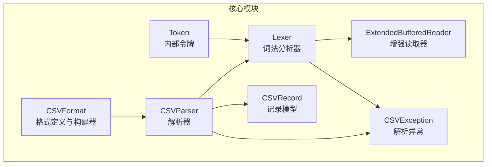
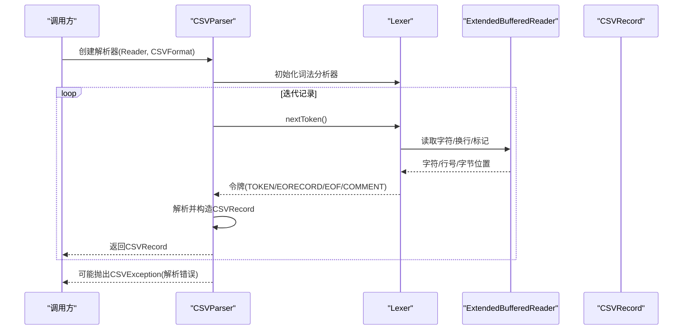
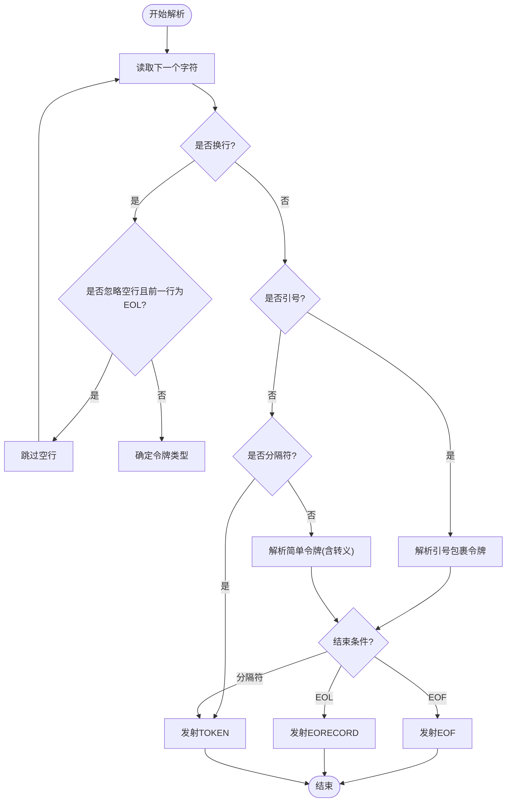
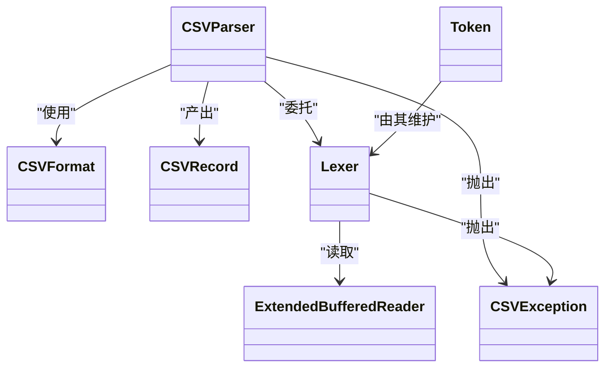

# 故障排除

<cite>
**本文引用的文件**
- [README.md](file://README.md)
- [CONTRIBUTING.md](file://CONTRIBUTING.md)
- [SECURITY.md](file://SECURITY.md)
- [RELEASE-NOTES.txt](file://RELEASE-NOTES.txt)
- [BENCHMARK.md](file://BENCHMARK.md)
- [CSVException.java](file://src/main/java/org/apache/commons/csv/CSVException.java)
- [CSVFormat.java](file://src/main/java/org/apache/commons/csv/CSVFormat.java)
- [CSVParser.java](file://src/main/java/org/apache/commons/csv/CSVParser.java)
- [CSVRecord.java](file://src/main/java/org/apache/commons/csv/CSVRecord.java)
- [ExtendedBufferedReader.java](file://src/main/java/org/apache/commons/csv/ExtendedBufferedReader.java)
- [Lexer.java](file://src/main/java/org/apache/commons/csv/Lexer.java)
- [Token.java](file://src/main/java/org/apache/commons/csv/Token.java)
- [JiraCsv196Test.java](file://src/test/java/org/apache/commons/csv/JiraCsv196Test.java)
- [PerformanceTest.java](file://src/test/java/org/apache/commons/csv/PerformanceTest.java)
</cite>

## 目录
1. [简介](#简介)
2. [项目结构](#项目结构)
3. [核心组件](#核心组件)
4. [架构总览](#架构总览)
5. [详细组件分析](#详细组件分析)
6. [依赖关系分析](#依赖关系分析)
7. [性能考虑](#性能考虑)
8. [故障排除指南](#故障排除指南)
9. [结论](#结论)
10. [附录](#附录)

## 简介
本指南面向使用 Apache Commons CSV 的开发者与运维人员，聚焦于常见问题的诊断与修复：解析错误、格式不兼容、性能问题、边界与异常场景处理，以及社区支持与问题报告流程。文档基于源码与测试用例提炼出可操作的排障步骤，并提供可视化图示帮助快速定位问题。

## 项目结构
仓库采用按模块分层的组织方式，核心代码位于 src/main/java 下，测试位于 src/test/java，站点与构建配置在 site、assembly、changes 等目录中；README 提供入门信息，RELEASE-NOTES 记录版本变更与已知问题，BENCHMARK.md 提供性能测试说明。

图表来源
- [CSVFormat.java](file://src/main/java/org/apache/commons/csv/CSVFormat.java)
- [CSVParser.java](file://src/main/java/org/apache/commons/csv/CSVParser.java)
- [CSVRecord.java](file://src/main/java/org/apache/commons/csv/CSVRecord.java)
- [Lexer.java](file://src/main/java/org/apache/commons/csv/Lexer.java)
- [ExtendedBufferedReader.java](file://src/main/java/org/apache/commons/csv/ExtendedBufferedReader.java)
- [Token.java](file://src/main/java/org/apache/commons/csv/Token.java)
- [CSVException.java](file://src/main/java/org/apache/commons/csv/CSVException.java)

章节来源
- [README.md](file://README.md)
- [BENCHMARK.md](file://BENCHMARK.md)

## 核心组件
- CSVFormat：定义分隔符、引号、注释、空值字符串、换行、忽略空白、重复头策略等；提供 Builder 模式以安全地组合参数。
- CSVParser：从 Reader/URL/File 等输入源创建解析器，逐条产出 CSVRecord；支持流式迭代、内存一次性读取、最大行数限制。
- CSVRecord：封装单行数据、注释、位置信息（字符/字节）、记录号；支持按名称或索引访问。
- Lexer：将输入流分解为 TOKEN/EORECORD/EOF/COMMENT 等令牌；处理转义、引号包裹、多字符分隔符、尾随数据与宽松 EOF。
- ExtendedBufferedReader：提供行号、字符位置、字节计数跟踪，支持标记/重置与编码长度计算。
- Token：内部令牌结构，承载类型、内容、是否引号包裹、就绪状态。
- CSVException：继承 IOException，用于无效输入时抛出，便于区分解析错误与其他 I/O 错误。

章节来源
- [CSVFormat.java](file://src/main/java/org/apache/commons/csv/CSVFormat.java)
- [CSVParser.java](file://src/main/java/org/apache/commons/csv/CSVParser.java)
- [CSVRecord.java](file://src/main/java/org/apache/commons/csv/CSVRecord.java)
- [Lexer.java](file://src/main/java/org/apache/commons/csv/Lexer.java)
- [ExtendedBufferedReader.java](file://src/main/java/org/apache/commons/csv/ExtendedBufferedReader.java)
- [Token.java](file://src/main/java/org/apache/commons/csv/Token.java)
- [CSVException.java](file://src/main/java/org/apache/commons/csv/CSVException.java)

## 架构总览
下图展示从输入到记录的端到端流程，以及异常与位置信息的传播路径。

图表来源
- [CSVParser.java](file://src/main/java/org/apache/commons/csv/CSVParser.java)
- [Lexer.java](file://src/main/java/org/apache/commons/csv/Lexer.java)
- [ExtendedBufferedReader.java](file://src/main/java/org/apache/commons/csv/ExtendedBufferedReader.java)
- [CSVRecord.java](file://src/main/java/org/apache/commons/csv/CSVRecord.java)
- [CSVException.java](file://src/main/java/org/apache/commons/csv/CSVException.java)

## 详细组件分析

### 组件A：解析流程与异常传播
- 关键点
  - Lexer 在解析引号包裹、转义序列、多字符分隔符、尾随数据与 EOF 宽松策略时可能抛出 CSVException。
  - CSVParser 在创建头部映射、处理空值字符串、忽略空白、记录号与位置信息时进行校验与转换。
  - CSVRecord 提供按名/索引访问、一致性检查、注释与位置信息。
- 常见错误来源
  - 引号未闭合、转义序列非法、分隔符设置不当、多行单元格与注释混叠。
- 调试要点
  - 使用 getFirstEndOfLine()/getCurrentLineNumber()/getRecordNumber() 辅助定位。
  - 启用字节位置跟踪以定位具体偏移。

图表来源
- [Lexer.java](file://src/main/java/org/apache/commons/csv/Lexer.java)
- [ExtendedBufferedReader.java](file://src/main/java/org/apache/commons/csv/ExtendedBufferedReader.java)

章节来源
- [CSVParser.java](file://src/main/java/org/apache/commons/csv/CSVParser.java)
- [Lexer.java](file://src/main/java/org/apache/commons/csv/Lexer.java)
- [ExtendedBufferedReader.java](file://src/main/java/org/apache/commons/csv/ExtendedBufferedReader.java)
- [CSVRecord.java](file://src/main/java/org/apache/commons/csv/CSVRecord.java)

### 组件B：格式与头部策略
- 关键点
  - CSVFormat.Builder 支持设置分隔符、引号、注释、空值字符串、忽略空白、重复头策略、最大行数等。
  - 头部映射在解析首行或显式指定时建立；重复头名、空头名、大小写忽略等影响访问行为。
- 常见问题
  - 重复头名导致解析失败；空头名与允许策略不匹配；大小写敏感导致按名访问失败。
- 诊断方法
  - 使用 getHeaderMap()/getHeaderNames() 检查映射与顺序。
  - 使用 DuplicateHeaderMode 控制严格程度。

章节来源
- [CSVFormat.java](file://src/main/java/org/apache/commons/csv/CSVFormat.java)
- [CSVParser.java](file://src/main/java/org/apache/commons/csv/CSVParser.java)

### 组件C：位置与字节跟踪
- 关键点
  - ExtendedBufferedReader 提供行号、字符位置与字节计数；支持标记/重置。
  - 测试用例验证字节位置与字符位置的对应关系，有助于定位编码与多字节字符问题。
- 适用场景
  - 需要精确定位错误行/列或进行审计日志记录。
- 注意事项
  - 字节计数依赖字符集编码，UTF-16/UTF-32 等需谨慎处理代理对。

章节来源
- [ExtendedBufferedReader.java](file://src/main/java/org/apache/commons/csv/ExtendedBufferedReader.java)
- [JiraCsv196Test.java](file://src/test/java/org/apache/commons/csv/JiraCsv196Test.java)

## 依赖关系分析
- CSVParser 依赖 CSVFormat 与 Lexer；Lexer 依赖 ExtendedBufferedReader。
- CSVRecord 依赖 CSVParser 以获取头部映射与解析上下文。
- CSVException 作为统一的解析异常类型，贯穿解析链路。

图表来源
- [CSVFormat.java](file://src/main/java/org/apache/commons/csv/CSVFormat.java)
- [CSVParser.java](file://src/main/java/org/apache/commons/csv/CSVParser.java)
- [CSVRecord.java](file://src/main/java/org/apache/commons/csv/CSVRecord.java)
- [Lexer.java](file://src/main/java/org/apache/commons/csv/Lexer.java)
- [ExtendedBufferedReader.java](file://src/main/java/org/apache/commons/csv/ExtendedBufferedReader.java)
- [Token.java](file://src/main/java/org/apache/commons/csv/Token.java)
- [CSVException.java](file://src/main/java/org/apache/commons/csv/CSVException.java)

## 性能考虑
- 性能测试与基准
  - 项目提供独立性能测试与 JMH 基准测试说明；可通过 Maven Profile 或测试类运行。
  - 建议在真实数据规模上对比不同格式与策略（如忽略空白、引号包裹、多字符分隔符）对吞吐的影响。
- 优化建议
  - 优先使用流式迭代而非一次性读入内存。
  - 合理设置 CSVFormat 参数，避免不必要的转义与引号包裹。
  - 对超长行或大文件启用最大行数限制，防止内存压力。
  - 利用字节位置跟踪进行定位，减少二次扫描成本。

章节来源
- [BENCHMARK.md](file://BENCHMARK.md)
- [PerformanceTest.java](file://src/test/java/org/apache/commons/csv/PerformanceTest.java)
- [CSVParser.java](file://src/main/java/org/apache/commons/csv/CSVParser.java)
- [CSVFormat.java](file://src/main/java/org/apache/commons/csv/CSVFormat.java)

## 故障排除指南

### 一、解析错误与异常诊断
- 常见症状
  - 抛出 CSVException，提示“无效字符”、“引号未闭合”、“转义序列非法”、“EOF 之前未结束”等。
- 快速定位
  - 获取当前行号与记录号：getCurrentLineNumber()/getRecordNumber()。
  - 获取首个换行符类型：getFirstEndOfLine()，确认 CRLF/LF/CR 差异。
  - 检查最近一次读取的字符位置与字节位置，结合测试用例思路进行交叉验证。
- 修复建议
  - 确保引号成对出现，转义字符合法；必要时启用 lenientEof 以兼容部分 Excel 场景。
  - 若存在尾随数据或非标准 EOF 结束，调整 trailingData 与 lenientEof。
  - 对多字符分隔符，确保 setDelimiter(String) 非空且非换行。

章节来源
- [Lexer.java](file://src/main/java/org/apache/commons/csv/Lexer.java)
- [CSVParser.java](file://src/main/java/org/apache/commons/csv/CSVParser.java)
- [ExtendedBufferedReader.java](file://src/main/java/org/apache/commons/csv/ExtendedBufferedReader.java)
- [CSVException.java](file://src/main/java/org/apache/commons/csv/CSVException.java)

### 二、格式不兼容与头部问题
- 常见症状
  - 按名访问抛出 IllegalArgumentException；重复头名导致解析失败；空头名引发校验异常。
- 诊断方法
  - 使用 getHeaderMap()/getHeaderNames() 检查映射与顺序。
  - 检查 CSVFormat 的重复头策略与空头名允许策略。
- 修复建议
  - 显式设置 setHeader(...) 并配合 setSkipHeaderRecord(true) 跳过首行。
  - 使用 DuplicateHeaderMode.ALLOW_ALL 或 ALLOW_EMPTY 允许特定重复场景。
  - 对大小写敏感需求，启用 ignoreHeaderCase(false) 或统一命名。

章节来源
- [CSVParser.java](file://src/main/java/org/apache/commons/csv/CSVParser.java)
- [CSVFormat.java](file://src/main/java/org/apache/commons/csv/CSVFormat.java)

### 三、性能问题排查
- 症状
  - 内存占用高、CPU 占用上升、解析耗时长。
- 排查步骤
  - 使用性能测试与基准测试对比不同实现与策略。
  - 评估是否一次性读入内存，改为流式迭代。
  - 检查是否启用了 ignoreSurroundingSpaces/trim 等额外处理。
- 优化建议
  - 设置 CSVFormat.Builder.setMaxRows(...) 限制输出规模。
  - 减少不必要的转义与引号包裹，简化格式。
  - 对超长行进行预处理或拆分。

章节来源
- [BENCHMARK.md](file://BENCHMARK.md)
- [PerformanceTest.java](file://src/test/java/org/apache/commons/csv/PerformanceTest.java)
- [CSVParser.java](file://src/main/java/org/apache/commons/csv/CSVParser.java)
- [CSVFormat.java](file://src/main/java/org/apache/commons/csv/CSVFormat.java)

### 四、边界与异常场景
- 多行单元格与注释混叠
  - 注释附着在下一条记录上；若注释在 EOF 前，将被忽略。检查 getHeaderComment()/getTrailerComment()。
- 字节位置与编码
  - UTF-16/UTF-32 中代理对需正确编码长度计算；通过字节位置与字符位置对照定位问题。
- 转义与分隔符冲突
  - 当分隔符与转义字符组合时，确保转义序列合法；必要时使用 isEscapeDelimiter() 逻辑进行判断。

章节来源
- [CSVParser.java](file://src/main/java/org/apache/commons/csv/CSVParser.java)
- [ExtendedBufferedReader.java](file://src/main/java/org/apache/commons/csv/ExtendedBufferedReader.java)
- [JiraCsv196Test.java](file://src/test/java/org/apache/commons/csv/JiraCsv196Test.java)

### 五、调试技巧与工具
- 位置信息
  - getCurrentLineNumber()/getRecordNumber()：定位行号与记录号。
  - getFirstEndOfLine()：确认换行风格。
  - getBytePosition()/getCharacterPosition()：结合测试用例思路进行交叉验证。
- 头部与一致性
  - getHeaderMap()/getHeaderNames()：核对映射与顺序。
  - isConsistent()：检查记录长度与头部数量是否一致。
- 最大行数限制
  - setMaxRows(...)：控制解析规模，避免内存压力。

章节来源
- [CSVParser.java](file://src/main/java/org/apache/commons/csv/CSVParser.java)
- [CSVRecord.java](file://src/main/java/org/apache/commons/csv/CSVRecord.java)
- [CSVFormat.java](file://src/main/java/org/apache/commons/csv/CSVFormat.java)

### 六、社区支持与问题报告
- 获取帮助
  - 文档与 Javadoc：参阅 README 与 Javadoc 页面。
  - 用户邮件列表：用于使用问题咨询。
- 问题报告
  - 使用 Apache JIRA 提交问题，清晰描述复现步骤与期望结果。
  - 提供最小可复现样例与环境信息（Java 版本、CSVFormat 配置、输入数据片段）。
- 贡献流程
  - Fork 仓库，创建特性分支，提交 PR 并附带单元测试。

章节来源
- [README.md](file://README.md)
- [CONTRIBUTING.md](file://CONTRIBUTING.md)

### 七、实际案例研究
- 案例：字节位置跟踪验证
  - 使用测试用例思路，启用字节位置跟踪，逐条比对记录的字节偏移，验证 UTF-8/UTF-16 编码下的位置一致性。
- 案例：多字符分隔符与转义序列
  - 当分隔符为 “|” 且存在 “\|” 转义时，确认 isEscapeDelimiter() 逻辑正确处理；否则会误判为普通分隔符。

章节来源
- [JiraCsv196Test.java](file://src/test/java/org/apache/commons/csv/JiraCsv196Test.java)
- [Lexer.java](file://src/main/java/org/apache/commons/csv/Lexer.java)

## 结论
通过理解解析链路、掌握位置与异常信息、合理配置 CSVFormat、结合性能测试与社区资源，可以高效定位并解决 Apache Commons CSV 的常见问题。建议在生产环境中启用最大行数限制、字节位置跟踪与严格的头部策略校验，以提升稳定性与可观测性。

## 附录
- 版本变更与已知问题
  - 参考发布说明，了解已修复的 CSVException、并发打印、Excel 兼容性等问题。
- 社区与安全
  - 安全公告与联系方式请参考 SECURITY 与 README。

章节来源
- [RELEASE-NOTES.txt](file://RELEASE-NOTES.txt)
- [SECURITY.md](file://SECURITY.md)
- [README.md](file://README.md)