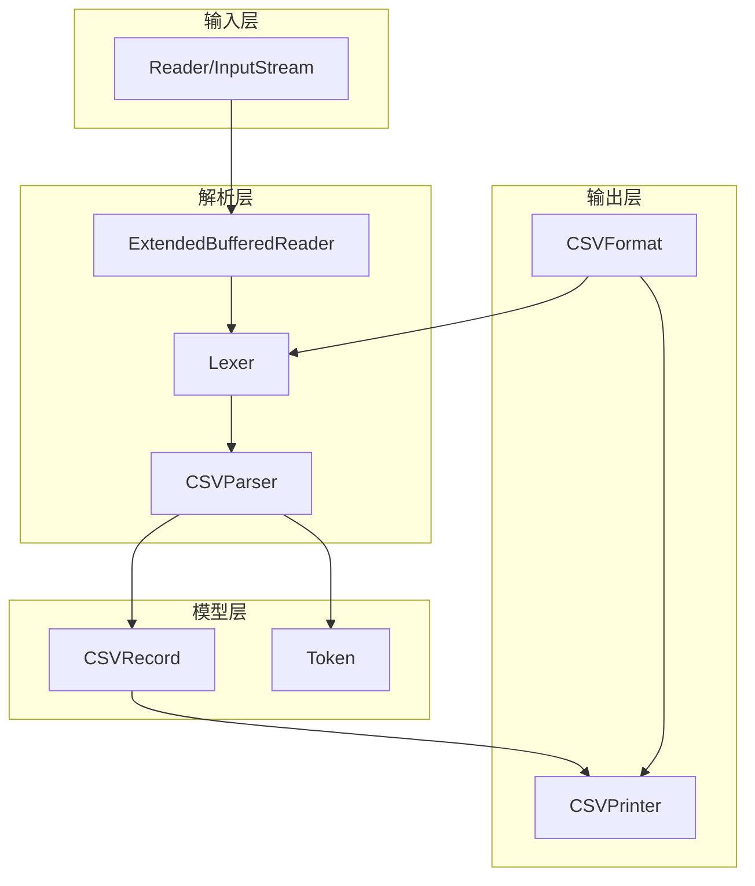
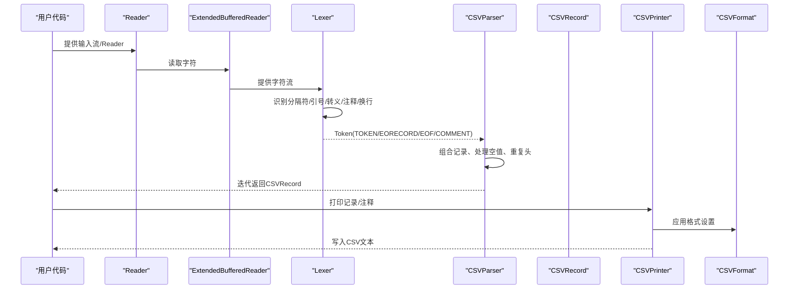
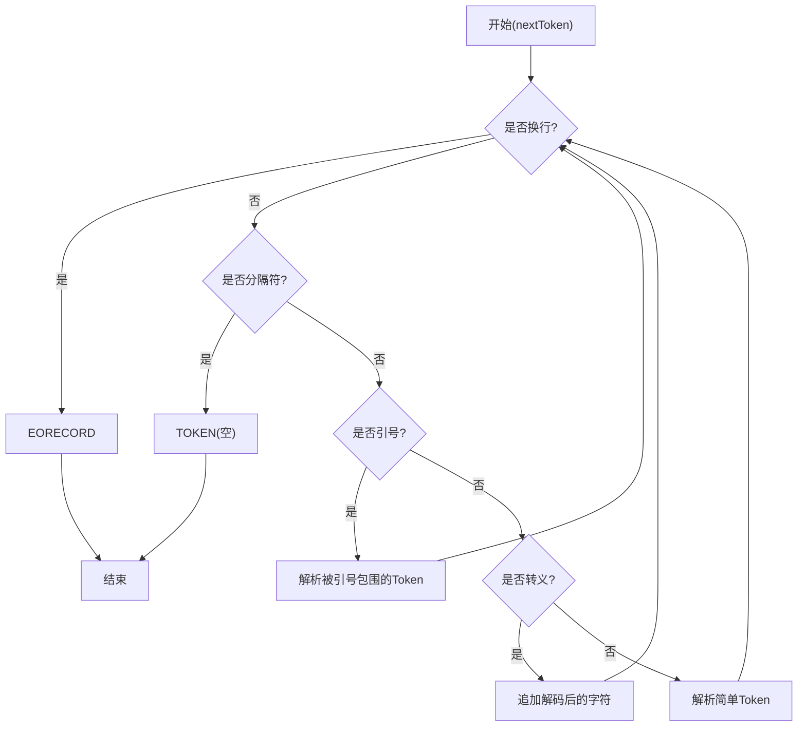
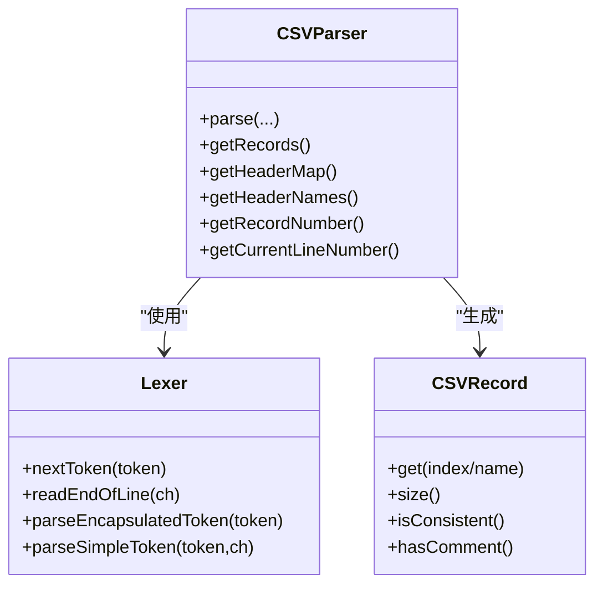
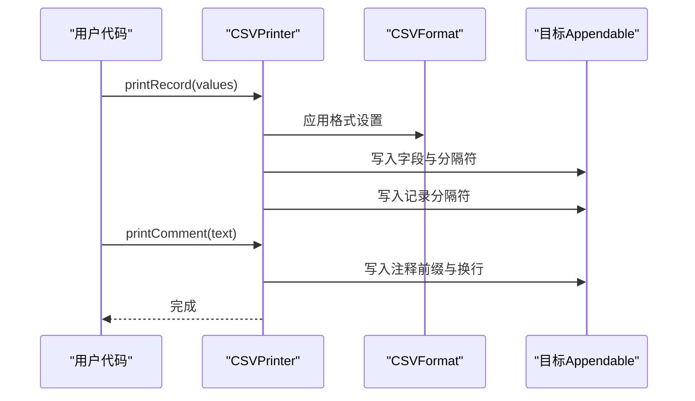
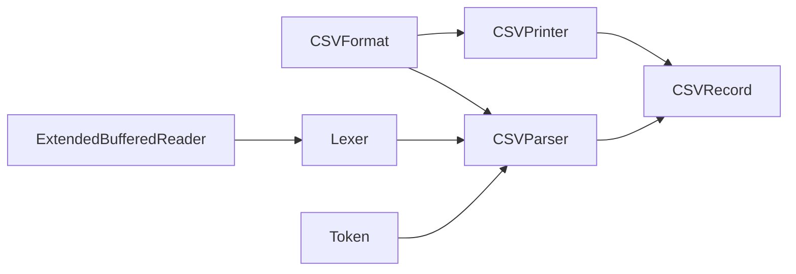

# CSV格式基础

<cite>
**本文引用的文件**
- [CSVFormat.java](file://src/main/java/org/apache/commons/csv/CSVFormat.java)
- [Lexer.java](file://src/main/java/org/apache/commons/csv/Lexer.java)
- [CSVParser.java](file://src/main/java/org/apache/commons/csv/CSVParser.java)
- [CSVPrinter.java](file://src/main/java/org/apache/commons/csv/CSVPrinter.java)
- [Constants.java](file://src/main/java/org/apache/commons/csv/Constants.java)
- [Token.java](file://src/main/java/org/apache/commons/csv/Token.java)
- [CSVRecord.java](file://src/main/java/org/apache/commons/csv/CSVRecord.java)
- [ExtendedBufferedReader.java](file://src/main/java/org/apache/commons/csv/ExtendedBufferedReader.java)
- [QuoteMode.java](file://src/main/java/org/apache/commons/csv/QuoteMode.java)
- [DuplicateHeaderMode.java](file://src/main/java/org/apache/commons/csv/DuplicateHeaderMode.java)
- [CSVException.java](file://src/main/java/org/apache/commons/csv/CSVException.java)
- [test_rfc4180.txt](file://src/test/resources/org/apache/commons/csv/CSVFileParser/test_rfc4180.txt)
- [test_default.txt](file://src/test/resources/org/apache/commons/csv/CSVFileParser/test_default.txt)
- [test_default_comment.txt](file://src/test/resources/org/apache/commons/csv/CSVFileParser/test_default_comment.txt)
</cite>

## 目录
1. [简介](#简介)
2. [项目结构](#项目结构)
3. [核心组件](#核心组件)
4. [架构总览](#架构总览)
5. [详细组件分析](#详细组件分析)
6. [依赖分析](#依赖分析)
7. [性能考虑](#性能考虑)
8. [故障排查指南](#故障排查指南)
9. [结论](#结论)
10. [附录：格式与配置详解](#附录格式与配置详解)

## 简介
本文件围绕CSV格式的基础理论与实现细节展开，结合Apache Commons CSV代码库中的核心类，系统阐述以下主题：
- CSV文件的基本结构：字段、记录、分隔符、封装字符与注释字符
- RFC 4180标准与其他常见CSV变体的差异
- 特殊字符处理：逗号、换行符、引号与转义规则
- 字符编码处理：UTF-8、UTF-16等编码在读写中的支持方式
- 空值处理、空白字符处理与数据类型推断机制
- 实际示例：简单CSV、带引号的CSV、带注释的CSV等
- 不同操作系统下的换行符差异（LF、CR、CRLF）
- 格式配置选项与最佳实践

## 项目结构
该项目采用按职责分层的组织方式：
- 核心解析器：CSVParser负责从Reader中逐记录解析
- 词法分析器：Lexer负责识别分隔符、引号、转义、注释与换行
- 输出器：CSVPrinter负责根据格式打印记录与注释
- 数据模型：CSVRecord表示单条记录；Token为词法单元
- 基础常量：Constants定义常用字符与字符串
- 编码与缓冲：ExtendedBufferedReader提供行号、位置与字节统计跟踪
- 配置枚举：QuoteMode与DuplicateHeaderMode控制输出策略与头部重复行为

图表来源
- [CSVParser.java:556-567](file://src/main/java/org/apache/commons/csv/CSVParser.java#L556-L567)
- [Lexer.java:54-66](file://src/main/java/org/apache/commons/csv/Lexer.java#L54-L66)
- [ExtendedBufferedReader.java:68-84](file://src/main/java/org/apache/commons/csv/ExtendedBufferedReader.java#L68-L84)
- [CSVRecord.java:70-78](file://src/main/java/org/apache/commons/csv/CSVRecord.java#L70-L78)
- [CSVPrinter.java:107-123](file://src/main/java/org/apache/commons/csv/CSVPrinter.java#L107-L123)
- [CSVFormat.java:182-326](file://src/main/java/org/apache/commons/csv/CSVFormat.java#L182-L326)

章节来源
- [CSVParser.java:147-147](file://src/main/java/org/apache/commons/csv/CSVParser.java#L147-L147)
- [Lexer.java:32-32](file://src/main/java/org/apache/commons/csv/Lexer.java#L32-L32)
- [CSVPrinter.java:80-80](file://src/main/java/org/apache/commons/csv/CSVPrinter.java#L80-L80)
- [ExtendedBufferedReader.java:44-44](file://src/main/java/org/apache/commons/csv/ExtendedBufferedReader.java#L44-L44)

## 核心组件
- CSVFormat：描述CSV格式的所有配置项，包括分隔符、引号、注释、换行、空行跳过、大小写忽略、空值字符串、引号模式、最大行数等。支持通过Builder创建与复制。
- Lexer：基于词法分析的状态机，识别TOKEN、EORECORD、EOF、COMMENT，并处理转义、引号嵌套、空白修剪、空行跳过、尾随数据校验等。
- CSVParser：面向记录的迭代器，将Lexer产出的Token组合成CSVRecord，支持头部映射、重复头处理、空值转换、行号与字节位置跟踪。
- CSVPrinter：将对象序列化为符合格式的CSV文本，支持注释打印、自动刷新、批量打印记录与ResultSet导出。
- CSVRecord：不可变记录容器，提供按索引或名称访问、一致性检查、注释关联、位置信息等。
- ExtendedBufferedReader：增强的缓冲Reader，支持前瞻读取、行号统计、字符位置统计与可选的字节统计（基于CharsetEncoder）。
- Constants：包内常量集合，统一管理分隔符、引号、换行符、注释符等。
- QuoteMode：控制字段是否引号包裹的策略枚举。
- DuplicateHeaderMode：控制头部重复行为的策略枚举。

章节来源
- [CSVFormat.java:182-326](file://src/main/java/org/apache/commons/csv/CSVFormat.java#L182-L326)
- [Lexer.java:32-66](file://src/main/java/org/apache/commons/csv/Lexer.java#L32-L66)
- [CSVParser.java:147-147](file://src/main/java/org/apache/commons/csv/CSVParser.java#L147-L147)
- [CSVPrinter.java:80-123](file://src/main/java/org/apache/commons/csv/CSVPrinter.java#L80-L123)
- [CSVRecord.java:43-78](file://src/main/java/org/apache/commons/csv/CSVRecord.java#L43-L78)
- [ExtendedBufferedReader.java:44-84](file://src/main/java/org/apache/commons/csv/ExtendedBufferedReader.java#L44-L84)
- [Constants.java:25-91](file://src/main/java/org/apache/commons/csv/Constants.java#L25-L91)
- [QuoteMode.java:26-54](file://src/main/java/org/apache/commons/csv/QuoteMode.java#L26-L54)
- [DuplicateHeaderMode.java:28-44](file://src/main/java/org/apache/commons/csv/DuplicateHeaderMode.java#L28-L44)

## 架构总览
下图展示了从输入到输出的关键流程：Reader经由ExtendedBufferedReader进入Lexer进行词法分析，Lexer产出Token交由CSVParser组合为CSVRecord；CSVPrinter依据CSVFormat将对象序列化为CSV文本。

图表来源
- [CSVParser.java:556-567](file://src/main/java/org/apache/commons/csv/CSVParser.java#L556-L567)
- [Lexer.java:235-307](file://src/main/java/org/apache/commons/csv/Lexer.java#L235-L307)
- [CSVPrinter.java:107-123](file://src/main/java/org/apache/commons/csv/CSVPrinter.java#L107-L123)
- [CSVFormat.java:182-326](file://src/main/java/org/apache/commons/csv/CSVFormat.java#L182-L326)

## 详细组件分析

### CSVFormat：格式定义与Builder
- 关键配置
  - 分隔符：setDelimiter，不接受换行符且不能为空串
  - 引号：setQuote，用于封装含特殊字符的字段
  - 注释：setCommentMarker，注释仅在行首识别
  - 转义：setEscape，转义序列支持常见的控制字符与元字符
  - 换行：recordSeparator，默认CRLF（RFC 4180），但可自定义
  - 空行：setIgnoreEmptyLines，控制空行是否作为空记录
  - 头部：setHeader、setSkipHeaderRecord、setAllowMissingColumnNames、setDuplicateHeaderMode
  - 空值：setNullString，控制空字符串与null之间的互转
  - 引号模式：setQuoteMode，配合QuoteMode枚举
  - 其他：autoFlush、trim、lenientEof、trailingData、trailingDelimiter、maxRows等
- 预定义格式：DEFAULT、RFC4180、EXCEL、MYSQL、ORACLE、POSTGRESQL_*、TDF等

章节来源
- [CSVFormat.java:182-326](file://src/main/java/org/apache/commons/csv/CSVFormat.java#L182-L326)
- [CSVFormat.java:452-471](file://src/main/java/org/apache/commons/csv/CSVFormat.java#L452-L471)
- [CSVFormat.java:781-785](file://src/main/java/org/apache/commons/csv/CSVFormat.java#L781-L785)
- [CSVFormat.java:211-220](file://src/main/java/org/apache/commons/csv/CSVFormat.java#L211-L220)

### Lexer：词法分析与特殊字符处理
- 核心能力
  - 识别分隔符：支持多字符分隔符，使用peek缓冲避免误判
  - 识别换行：统一处理LF、CR、CRLF，记录firstEol
  - 引号处理：双引号转义（""）与转义字符（escape）两种方式
  - 转义序列：支持\r、\n、\t、\b、\f以及部分元字符原样保留
  - 注释：行首注释标记，注释行独立Token类型
  - 空白修剪：可配置忽略前后空白
  - 空行跳过：可配置忽略连续空行
  - 尾随数据校验：在严格模式下拒绝引号字段后出现非空白字符
  - EOF宽松处理：可配置lenientEof以兼容某些Excel风格
- 错误处理：对非法转义、未闭合引号、引号后非法字符抛出CSVException

图表来源
- [Lexer.java:235-307](file://src/main/java/org/apache/commons/csv/Lexer.java#L235-L307)
- [Lexer.java:336-389](file://src/main/java/org/apache/commons/csv/Lexer.java#L336-L389)
- [Lexer.java:409-440](file://src/main/java/org/apache/commons/csv/Lexer.java#L409-L440)

章节来源
- [Lexer.java:32-66](file://src/main/java/org/apache/commons/csv/Lexer.java#L32-L66)
- [Lexer.java:235-307](file://src/main/java/org/apache/commons/csv/Lexer.java#L235-L307)
- [Lexer.java:336-389](file://src/main/java/org/apache/commons/csv/Lexer.java#L336-L389)
- [Lexer.java:409-440](file://src/main/java/org/apache/commons/csv/Lexer.java#L409-L440)
- [Lexer.java:447-468](file://src/main/java/org/apache/commons/csv/Lexer.java#L447-L468)
- [Lexer.java:479-509](file://src/main/java/org/apache/commons/csv/Lexer.java#L479-L509)

### CSVParser：记录解析与头部映射
- 解析流程
  - 构造时创建Lexer与ExtendedBufferedReader
  - 可选读取头部行并建立名称到索引的映射（支持忽略大小写）
  - 迭代调用nextRecord，将Token序列组装为CSVRecord
  - 支持空值转换、重复头处理策略、最大行限制
- 位置与统计
  - 行号、字符位置、字节位置跟踪（可选）
  - 记录号递增，支持从指定偏移开始解析

图表来源
- [CSVParser.java:556-567](file://src/main/java/org/apache/commons/csv/CSVParser.java#L556-L567)
- [Lexer.java:54-66](file://src/main/java/org/apache/commons/csv/Lexer.java#L54-L66)
- [CSVRecord.java:70-78](file://src/main/java/org/apache/commons/csv/CSVRecord.java#L70-L78)

章节来源
- [CSVParser.java:147-147](file://src/main/java/org/apache/commons/csv/CSVParser.java#L147-L147)
- [CSVParser.java:556-567](file://src/main/java/org/apache/commons/csv/CSVParser.java#L556-L567)
- [CSVParser.java:601-656](file://src/main/java/org/apache/commons/csv/CSVParser.java#L601-L656)
- [CSVParser.java:784-800](file://src/main/java/org/apache/commons/csv/CSVParser.java#L784-L800)

### CSVPrinter：格式化输出与注释
- 输出策略
  - print/printRecord/printRecords支持多种数据源（数组、Iterable、Stream、ResultSet）
  - 根据QuoteMode决定是否引号包裹字段
  - 自动处理转义与换行符
  - 支持打印注释（需启用注释标记），注释会插入在记录之前
- 自动刷新与关闭
  - 可配置autoFlush，在必要时自动flush
  - close方法可选择是否先flush

图表来源
- [CSVPrinter.java:107-123](file://src/main/java/org/apache/commons/csv/CSVPrinter.java#L107-L123)
- [CSVPrinter.java:229-262](file://src/main/java/org/apache/commons/csv/CSVPrinter.java#L229-L262)
- [CSVPrinter.java:327-352](file://src/main/java/org/apache/commons/csv/CSVPrinter.java#L327-L352)

章节来源
- [CSVPrinter.java:80-123](file://src/main/java/org/apache/commons/csv/CSVPrinter.java#L80-L123)
- [CSVPrinter.java:229-262](file://src/main/java/org/apache/commons/csv/CSVPrinter.java#L229-L262)
- [CSVPrinter.java:327-352](file://src/main/java/org/apache/commons/csv/CSVPrinter.java#L327-L352)
- [QuoteMode.java:26-54](file://src/main/java/org/apache/commons/csv/QuoteMode.java#L26-L54)

### CSVRecord：记录模型与访问
- 字段访问
  - 支持按索引与按名称访问（需要头部映射）
  - isConsistent用于校验记录长度与头部数量一致
  - hasComment/isMapped用于注释与映射状态判断
- 位置信息
  - 记录号、字符位置、字节位置（基于ExtendedBufferedReader）

章节来源
- [CSVRecord.java:43-78](file://src/main/java/org/apache/commons/csv/CSVRecord.java#L43-L78)
- [CSVRecord.java:127-145](file://src/main/java/org/apache/commons/csv/CSVRecord.java#L127-L145)
- [CSVRecord.java:236-239](file://src/main/java/org/apache/commons/csv/CSVRecord.java#L236-L239)

### ExtendedBufferedReader：编码与位置跟踪
- 功能
  - 统一行号、字符位置、字节位置（可选）
  - 支持surrogate pair编码长度计算，确保多字节字符正确计数
  - 提供mark/reset以支持回溯
- 用途
  - 为Lexer与Parser提供精确的位置信息，便于错误定位与调试

章节来源
- [ExtendedBufferedReader.java:68-84](file://src/main/java/org/apache/commons/csv/ExtendedBufferedReader.java#L68-L84)
- [ExtendedBufferedReader.java:134-148](file://src/main/java/org/apache/commons/csv/ExtendedBufferedReader.java#L134-L148)
- [ExtendedBufferedReader.java:194-231](file://src/main/java/org/apache/commons/csv/ExtendedBufferedReader.java#L194-L231)

### Constants：基础常量
- 包含分隔符、引号、换行符、注释符、控制字符等常量
- 为Lexer与Parser提供统一的字符语义

章节来源
- [Constants.java:25-91](file://src/main/java/org/apache/commons/csv/Constants.java#L25-L91)

### QuoteMode与DuplicateHeaderMode：策略枚举
- QuoteMode
  - ALL/NONE/MINIMAL/ALL_NON_NULL/NON_NUMERIC
- DuplicateHeaderMode
  - ALLOW_ALL/ALLOW_EMPTY/DISALLOW

章节来源
- [QuoteMode.java:26-54](file://src/main/java/org/apache/commons/csv/QuoteMode.java#L26-L54)
- [DuplicateHeaderMode.java:28-44](file://src/main/java/org/apache/commons/csv/DuplicateHeaderMode.java#L28-L44)

## 依赖分析
- CSVParser依赖Lexer与ExtendedBufferedReader，负责记录级解析
- CSVPrinter依赖CSVFormat与Appendable，负责格式化输出
- Token为Lexer与Parser之间的契约对象
- CSVRecord不可变，持有CSVParser引用以便访问头部映射（序列化时不包含）

图表来源
- [CSVParser.java:556-567](file://src/main/java/org/apache/commons/csv/CSVParser.java#L556-L567)
- [Lexer.java:54-66](file://src/main/java/org/apache/commons/csv/Lexer.java#L54-L66)
- [CSVPrinter.java:107-123](file://src/main/java/org/apache/commons/csv/CSVPrinter.java#L107-L123)
- [Token.java:30-48](file://src/main/java/org/apache/commons/csv/Token.java#L30-L48)

章节来源
- [CSVParser.java:556-567](file://src/main/java/org/apache/commons/csv/CSVParser.java#L556-L567)
- [CSVPrinter.java:107-123](file://src/main/java/org/apache/commons/csv/CSVPrinter.java#L107-L123)
- [Token.java:30-48](file://src/main/java/org/apache/commons/csv/Token.java#L30-L48)

## 性能考虑
- 流式解析：CSVParser按记录迭代，避免一次性加载全部内容，适合大文件
- 缓冲读取：ExtendedBufferedReader提供高效缓冲与位置跟踪
- 词法缓冲：Lexer使用固定容量StringBuilder与peek缓冲减少分配
- 最大行限制：通过CSVFormat.Builder.setMaxRows限制输出规模
- 并发安全：CSVPrinter内部使用ReentrantLock保证线程安全

章节来源
- [CSVParser.java:768-770](file://src/main/java/org/apache/commons/csv/CSVParser.java#L768-L770)
- [ExtendedBufferedReader.java:68-84](file://src/main/java/org/apache/commons/csv/ExtendedBufferedReader.java#L68-L84)
- [CSVPrinter.java:92-92](file://src/main/java/org/apache/commons/csv/CSVPrinter.java#L92-L92)

## 故障排查指南
- 常见异常
  - CSVException：当输入不符合格式约定时抛出，例如未闭合引号、引号后非法字符、EOF提前等
- 常见问题定位
  - 使用getRecordNumber/getCurrentLineNumber/getCharacterPosition/getBytePosition定位记录与位置
  - 检查是否启用了lenientEof以兼容某些Excel风格
  - 确认注释标记、分隔符、引号、转义设置是否与输入一致
- 资源管理
  - 确保在不再使用时调用close或flush，避免数据丢失

章节来源
- [CSVException.java:31-46](file://src/main/java/org/apache/commons/csv/CSVException.java#L31-L46)
- [CSVParser.java:668-751](file://src/main/java/org/apache/commons/csv/CSVParser.java#L668-L751)
- [Lexer.java:365-383](file://src/main/java/org/apache/commons/csv/Lexer.java#L365-L383)

## 结论
Apache Commons CSV通过清晰的分层设计与严谨的词法/语法处理，提供了对CSV格式的全面支持。其配置灵活、扩展性强，既满足RFC 4180等标准格式，也能适配多种实际应用场景。结合本文档的理论与实现要点，读者可在工程实践中高效地处理各类CSV文件，同时获得良好的性能与可维护性。

## 附录：格式与配置详解

### RFC 4180标准与常见变体
- RFC 4180要点
  - 默认分隔符为逗号，引号为双引号
  - 字段若包含分隔符、换行、引号或空白，必须用引号包围
  - 引号字符使用双引号转义
  - 记录以CRLF结尾
- 项目中的体现
  - Constants定义了CRLF为默认换行符
  - CSVFormat.Builder.create默认允许空行，与RFC 4180保持一致
  - RFC4180预设格式可通过CSVFormat.RFC4180使用

章节来源
- [Constants.java:40-41](file://src/main/java/org/apache/commons/csv/Constants.java#L40-L41)
- [CSVFormat.java:211-220](file://src/main/java/org/apache/commons/csv/CSVFormat.java#L211-L220)

### 特殊字符处理机制
- 逗号：作为分隔符，可能被转义或引号包围
- 换行符：统一识别LF、CR、CRLF，记录firstEol
- 引号：双引号转义（""）与转义字符（escape）两种方式
- 转义字符：支持常见控制字符与元字符，非法转义序列会被拒绝

章节来源
- [Lexer.java:447-468](file://src/main/java/org/apache/commons/csv/Lexer.java#L447-L468)
- [Lexer.java:479-509](file://src/main/java/org/apache/commons/csv/Lexer.java#L479-L509)

### 字符编码处理
- 输入编码：通过parse(File/InputStream/Path/URL, Charset, ...)指定
- 字节统计：启用ExtendedBufferedReader的字节跟踪时，基于CharsetEncoder计算每个字符的字节数
- 多字节字符：正确处理surrogate pair，避免字节计数错误

章节来源
- [CSVParser.java:321-375](file://src/main/java/org/apache/commons/csv/CSVParser.java#L321-L375)
- [ExtendedBufferedReader.java:134-148](file://src/main/java/org/apache/commons/csv/ExtendedBufferedReader.java#L134-L148)
- [ExtendedBufferedReader.java:194-231](file://src/main/java/org/apache/commons/csv/ExtendedBufferedReader.java#L194-L231)

### 空值处理、空白字符处理与数据类型推断
- 空值处理
  - setNullString定义空字符串与null的互转
  - 在严格引号模式下，空字符串与未引号的空值可能被识别为null
- 空白字符处理
  - 可配置忽略前后空白（ignoreSurroundingSpaces）
  - 引号字段内的空白保留
- 数据类型推断
  - 代码库未内置类型推断逻辑，字段以字符串形式存储；上层应用可自行转换

章节来源
- [CSVFormat.java:781-785](file://src/main/java/org/apache/commons/csv/CSVFormat.java#L781-L785)
- [CSVParser.java:790-800](file://src/main/java/org/apache/commons/csv/CSVParser.java#L790-L800)
- [Lexer.java:511-519](file://src/main/java/org/apache/commons/csv/Lexer.java#L511-L519)

### 实际示例与测试资源
- RFC 4180示例：包含普通值、带空格值、空值、空行等
- 默认示例：忽略空行，展示基本字段与注释
- 注释示例：启用注释标记，注释位于记录之前

章节来源
- [test_rfc4180.txt:1-18](file://src/test/resources/org/apache/commons/csv/CSVFileParser/test_rfc4180.txt#L1-L18)
- [test_default.txt:1-15](file://src/test/resources/org/apache/commons/csv/CSVFileParser/test_default.txt#L1-L15)
- [test_default_comment.txt:1-8](file://src/test/resources/org/apache/commons/csv/CSVFileParser/test_default_comment.txt#L1-L8)

### 不同操作系统的换行符差异
- LF（\n）、CR（\r）、CRLF（\r\n）均被识别
- firstEol记录首次遇到的换行符序列，便于诊断与兼容

章节来源
- [Lexer.java:447-468](file://src/main/java/org/apache/commons/csv/Lexer.java#L447-L468)
- [CSVParser.java:678-680](file://src/main/java/org/apache/commons/csv/CSVParser.java#L678-L680)

### 格式配置选项与最佳实践
- 选择合适的预设格式：RFC4180、EXCEL、MYSQL等
- 明确注释标记与分隔符，避免歧义
- 合理使用引号模式：MINIMAL适用于大多数场景，NONE需确保escape字符可用
- 控制空行与空白：根据数据质量选择忽略空行与修剪空白
- 设置空值字符串：明确空值语义，避免与空字符串混淆
- 限制最大行数：防止内存溢出
- 错误处理：启用严格的引号与尾随数据校验，及时发现格式问题

章节来源
- [CSVFormat.java:182-326](file://src/main/java/org/apache/commons/csv/CSVFormat.java#L182-L326)
- [CSVFormat.java:781-785](file://src/main/java/org/apache/commons/csv/CSVFormat.java#L781-L785)
- [QuoteMode.java:26-54](file://src/main/java/org/apache/commons/csv/QuoteMode.java#L26-L54)
- [DuplicateHeaderMode.java:28-44](file://src/main/java/org/apache/commons/csv/DuplicateHeaderMode.java#L28-L44)