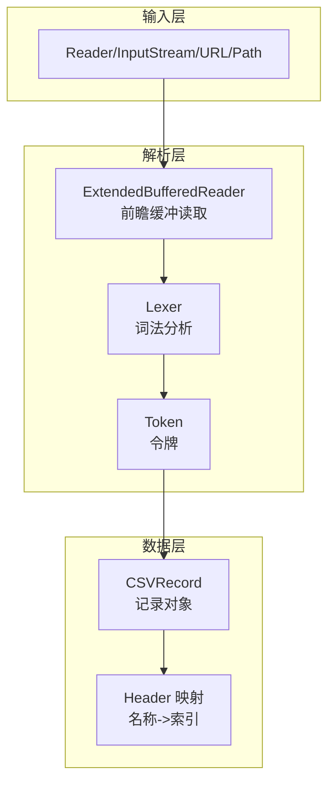
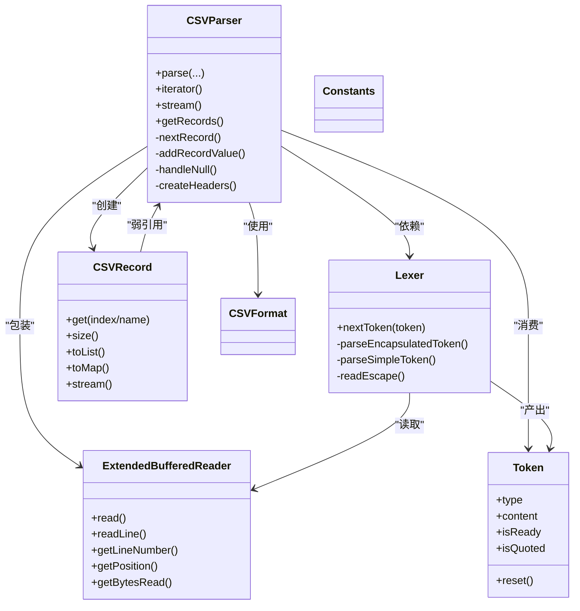

# 数据流处理

<cite>
**本文引用的文件列表**
- [CSVParser.java](file://src/main/java/org/apache/commons/csv/CSVParser.java)
- [Lexer.java](file://src/main/java/org/apache/commons/csv/Lexer.java)
- [ExtendedBufferedReader.java](file://src/main/java/org/apache/commons/csv/ExtendedBufferedReader.java)
- [CSVRecord.java](file://src/main/java/org/apache/commons/csv/CSVRecord.java)
- [Token.java](file://src/main/java/org/apache/commons/csv/Token.java)
- [CSVFormat.java](file://src/main/java/org/apache/commons/csv/CSVFormat.java)
- [Constants.java](file://src/main/java/org/apache/commons/csv/Constants.java)
- [PerformanceTest.java](file://src/test/java/org/apache/commons/csv/PerformanceTest.java)
- [CSVParserTest.java](file://src/test/java/org/apache/commons/csv/CSVParserTest.java)
</cite>

## 目录
1. [简介](#简介)
2. [项目结构](#项目结构)
3. [核心组件](#核心组件)
4. [架构总览](#架构总览)
5. [详细组件分析](#详细组件分析)
6. [依赖关系分析](#依赖关系分析)
7. [性能考量](#性能考量)
8. [故障排查指南](#故障排查指南)
9. [结论](#结论)
10. [附录](#附录)

## 简介
本文件系统性阐述 Apache Commons CSV 在数据从输入到输出的完整处理流程，覆盖输入读取、词法分析、语法解析与数据组织四个阶段；解释 CSVParser 如何协调各组件完成数据处理；说明 CSVRecord 的数据结构与访问模式（按索引与按名称）；介绍数据验证与清理（空值处理、类型转换与格式检查）；并给出内存管理与垃圾回收优化策略，以支撑大规模数据处理。最后提供时序图与架构图，辅以测试用例路径与性能分析，帮助开发者定位效率瓶颈。

## 项目结构
该项目采用按职责分层的模块化设计：
- 输入层：Reader/InputStream/URL/Path 等多种来源，统一由 CSVParser 构建器或工厂方法创建解析器。
- 解析层：Lexer 负责词法扫描，产生 Token；CSVParser 协调 Lexer 并组织记录。
- 数据层：CSVRecord 表示单条记录，内部以字符串数组承载字段值。
- 工具层：ExtendedBufferedReader 提供前瞻读取、行号与字节计数等能力；Constants 定义常量；CSVFormat 描述格式参数。



图表来源
- [CSVParser.java:556-567](file://src/main/java/org/apache/commons/csv/CSVParser.java#L556-L567)
- [Lexer.java:54-66](file://src/main/java/org/apache/commons/csv/Lexer.java#L54-L66)
- [ExtendedBufferedReader.java:81-84](file://src/main/java/org/apache/commons/csv/ExtendedBufferedReader.java#L81-L84)
- [Token.java:30-81](file://src/main/java/org/apache/commons/csv/Token.java#L30-L81)
- [CSVRecord.java:43-78](file://src/main/java/org/apache/commons/csv/CSVRecord.java#L43-L78)

章节来源
- [CSVParser.java:556-567](file://src/main/java/org/apache/commons/csv/CSVParser.java#L556-L567)
- [Lexer.java:54-66](file://src/main/java/org/apache/commons/csv/Lexer.java#L54-L66)
- [ExtendedBufferedReader.java:81-84](file://src/main/java/org/apache/commons/csv/ExtendedBufferedReader.java#L81-L84)
- [CSVRecord.java:43-78](file://src/main/java/org/apache/commons/csv/CSVRecord.java#L43-L78)
- [Token.java:30-81](file://src/main/java/org/apache/commons/csv/Token.java#L30-L81)

## 核心组件
- CSVParser：面向用户的主入口，负责协调 Lexer、构建 CSVRecord、维护记录号与位置信息、处理注释与头部映射。
- Lexer：词法分析器，基于 CSVFormat 配置识别分隔符、引号、转义、换行、注释等，产出 Token。
- ExtendedBufferedReader：增强的缓冲读取器，支持前瞻 peek、行号统计、字符位置与字节计数（可选）。
- CSVRecord：不可变记录对象，保存字段数组、注释、记录号与起始位置信息。
- Token：内部令牌类型（TOKEN/EORECORD/EOF/COMMENT/INVALID），承载内容与状态。
- CSVFormat：格式配置，控制分隔符、引号、转义、忽略空白、空值字符串、严格引号模式等。
- Constants：包级常量定义。

章节来源
- [CSVParser.java:147-147](file://src/main/java/org/apache/commons/csv/CSVParser.java#L147-L147)
- [Lexer.java:32-32](file://src/main/java/org/apache/commons/csv/Lexer.java#L32-L32)
- [ExtendedBufferedReader.java:44-44](file://src/main/java/org/apache/commons/csv/ExtendedBufferedReader.java#L44-L44)
- [CSVRecord.java:43-43](file://src/main/java/org/apache/commons/csv/CSVRecord.java#L43-L43)
- [Token.java:30-30](file://src/main/java/org/apache/commons/csv/Token.java#L30-L30)
- [CSVFormat.java:182-182](file://src/main/java/org/apache/commons/csv/CSVFormat.java#L182-L182)
- [Constants.java:25-25](file://src/main/java/org/apache/commons/csv/Constants.java#L25-L25)

## 架构总览
下图展示从输入到输出的整体交互：输入通过 ExtendedBufferedReader 逐字符读取，Lexer 基于 CSVFormat 进行词法识别，生成 Token；CSVParser 将 Token 组织为 CSVRecord，支持迭代、流式处理与一次性加载。

```mermaid
sequenceDiagram
participant SRC as "输入源<br/>Reader/URL/Path"
participant BUF as "ExtendedBufferedReader"
participant LEX as "Lexer"
participant TOK as "Token"
participant PAR as "CSVParser"
participant REC as "CSVRecord"
SRC->>BUF : 打开并读取
BUF->>LEX : 提供字符/前瞻
loop 逐令牌解析
LEX->>TOK : 生成 TOKEN/EORECORD/EOF/COMMENT
TOK-->>PAR : 传递令牌
PAR->>PAR : addRecordValue()/handleNull()
PAR->>REC : 构造记录
end
PAR-->>SRC : 返回迭代器/流/列表
```

图表来源
- [CSVParser.java:885-929](file://src/main/java/org/apache/commons/csv/CSVParser.java#L885-L929)
- [Lexer.java:235-307](file://src/main/java/org/apache/commons/csv/Lexer.java#L235-L307)
- [ExtendedBufferedReader.java:194-206](file://src/main/java/org/apache/commons/csv/ExtendedBufferedReader.java#L194-L206)
- [Token.java:30-81](file://src/main/java/org/apache/commons/csv/Token.java#L30-L81)
- [CSVRecord.java:70-78](file://src/main/java/org/apache/commons/csv/CSVRecord.java#L70-L78)

## 详细组件分析

### 输入读取与缓冲
- ExtendedBufferedReader 提供：
  - 前瞻读取（peek）与逐字符读取（read）
  - 行号统计（getLineNumber）、字符位置（getPosition）
  - 可选字节计数（getBytesRead），在启用字节跟踪时使用 CharsetEncoder 计算编码长度
  - 支持标记/重置（mark/reset）以便回溯
- CSVParser 构造时将 Reader 包装为 ExtendedBufferedReader，并传入 Lexer；同时记录字符偏移与起始记录号。

章节来源
- [ExtendedBufferedReader.java:81-84](file://src/main/java/org/apache/commons/csv/ExtendedBufferedReader.java#L81-L84)
- [ExtendedBufferedReader.java:194-206](file://src/main/java/org/apache/commons/csv/ExtendedBufferedReader.java#L194-L206)
- [ExtendedBufferedReader.java:246-265](file://src/main/java/org/apache/commons/csv/ExtendedBufferedReader.java#L246-L265)
- [CSVParser.java:556-567](file://src/main/java/org/apache/commons/csv/CSVParser.java#L556-L567)

### 词法分析（Lexer）
- Lexer 基于 CSVFormat 配置：
  - 分隔符、引号、转义、注释、是否忽略空白、是否宽松 EOF、是否允许尾随数据等
- 主要流程：
  - nextToken：读取下一个字符，识别换行、注释、分隔符、引号包裹与普通令牌
  - parseEncapsulatedToken：处理引号包裹的令牌，支持双引号转义与转义序列
  - parseSimpleToken：处理非包裹令牌，遇到换行、EOF 或未转义分隔符结束
  - readEscape：解析转义序列（如 \r/\n/\t 等），并校验非法转义
- 输出：Token 类型与内容，供 CSVParser 组织记录。

章节来源
- [Lexer.java:54-66](file://src/main/java/org/apache/commons/csv/Lexer.java#L54-L66)
- [Lexer.java:235-307](file://src/main/java/org/apache/commons/csv/Lexer.java#L235-L307)
- [Lexer.java:336-389](file://src/main/java/org/apache/commons/csv/Lexer.java#L336-L389)
- [Lexer.java:409-440](file://src/main/java/org/apache/commons/csv/Lexer.java#L409-L440)
- [Lexer.java:479-509](file://src/main/java/org/apache/commons/csv/Lexer.java#L479-L509)

### 语法解析与记录组织（CSVParser）
- nextRecord：核心解析函数
  - 清空当前记录缓冲，循环读取 Token
  - TOKEN：追加字段值（addRecordValue）
  - EORECORD：追加字段值并结束当前记录
  - EOF：若令牌已就绪则追加最后一个字段；否则收集尾部注释
  - COMMENT：累积注释，继续读取下一个 Token
  - INVALID：抛出异常
  - 最后构造 CSVRecord，更新记录号与起始位置
- addRecordValue：根据 CSVFormat.trim 处理空白，结合 handleNull 判定空值
- handleNull：依据 CSVFormat.nullString 与 QuoteMode 决定空值判定规则
- 头部映射：createHeaders 构建 headerMap 与 headerNames，支持大小写不敏感与重复头名策略

章节来源
- [CSVParser.java:885-929](file://src/main/java/org/apache/commons/csv/CSVParser.java#L885-L929)
- [CSVParser.java:569-575](file://src/main/java/org/apache/commons/csv/CSVParser.java#L569-L575)
- [CSVParser.java:790-800](file://src/main/java/org/apache/commons/csv/CSVParser.java#L790-L800)
- [CSVParser.java:601-656](file://src/main/java/org/apache/commons/csv/CSVParser.java#L601-L656)

### CSVRecord 数据结构与访问模式
- 字段存储：String[] values，不可变数组
- 访问方式：
  - 按索引：get(int i)，边界检查
  - 按名称：get(String name)，依赖 headerMap 映射
  - 兼容枚举键：get(Enum<?>)
  - 辅助方法：size()、toList()、toMap()、stream()、isConsistent()、isMapped()、isSet()
- 位置与注释：记录字符/字节起始位置、注释、记录号

章节来源
- [CSVRecord.java:43-78](file://src/main/java/org/apache/commons/csv/CSVRecord.java#L43-L78)
- [CSVRecord.java:98-147](file://src/main/java/org/apache/commons/csv/CSVRecord.java#L98-L147)
- [CSVRecord.java:312-372](file://src/main/java/org/apache/commons/csv/CSVRecord.java#L312-L372)

### 数据验证与清理
- 空值处理：
  - CSVFormat.nullString：匹配字符串即为空
  - QuoteMode 严格模式：在特定模式下区分空字符串与缺失值
  - 引号包裹与转义：parseEncapsulatedToken 中严格校验
- 格式检查：
  - 重复头名：DuplicateHeaderMode 控制策略
  - 缺失列名：allowMissingColumnNames 控制
  - 注释：仅在行首识别，累积到记录或尾注释
- 行号与位置：
  - getCurrentLineNumber/getRecordNumber 提供行号与记录号
  - getFirstEndOfLine 记录首个换行序列

章节来源
- [CSVParser.java:636-642](file://src/main/java/org/apache/commons/csv/CSVParser.java#L636-L642)
- [CSVParser.java:790-800](file://src/main/java/org/apache/commons/csv/CSVParser.java#L790-L800)
- [Lexer.java:336-389](file://src/main/java/org/apache/commons/csv/Lexer.java#L336-L389)
- [CSVParser.java:668-680](file://src/main/java/org/apache/commons/csv/CSVParser.java#L668-L680)

### 内存管理与垃圾回收优化
- 对象复用：
  - Lexer 使用可复用 Token.reusableToken，避免频繁分配
  - CSVParser 使用 recordList 作为记录缓冲，逐次 clear/reuse
- 字符串与数组：
  - CSVRecord 内部持有 values 数组，避免复制
  - toList/toMap 返回新集合，不影响原记录
- 流式处理优先：
  - 推荐使用 iterator/stream，避免一次性加载至 List
  - getRecords 会将剩余内容全部读入内存，注意资源消耗
- 字节跟踪：
  - ExtendedBufferedReader 在启用字节跟踪时计算编码长度，可能带来额外开销

章节来源
- [CSVParser.java:575-575](file://src/main/java/org/apache/commons/csv/CSVParser.java#L575-L575)
- [CSVParser.java:887-887](file://src/main/java/org/apache/commons/csv/CSVParser.java#L887-L887)
- [CSVParser.java:768-770](file://src/main/java/org/apache/commons/csv/CSVParser.java#L768-L770)
- [ExtendedBufferedReader.java:134-148](file://src/main/java/org/apache/commons/csv/ExtendedBufferedReader.java#L134-L148)

## 依赖关系分析
- CSVParser 依赖：
  - CSVFormat：格式配置
  - Lexer：词法分析
  - ExtendedBufferedReader：底层读取
  - Token：令牌
  - Constants：常量
- CSVRecord 依赖：
  - CSVParser（弱引用，仅用于获取 headerMapRaw）
  - Constants：空数组常量



图表来源
- [CSVParser.java:556-567](file://src/main/java/org/apache/commons/csv/CSVParser.java#L556-L567)
- [Lexer.java:235-307](file://src/main/java/org/apache/commons/csv/Lexer.java#L235-L307)
- [ExtendedBufferedReader.java:194-206](file://src/main/java/org/apache/commons/csv/ExtendedBufferedReader.java#L194-L206)
- [CSVRecord.java:70-78](file://src/main/java/org/apache/commons/csv/CSVRecord.java#L70-L78)
- [Token.java:30-81](file://src/main/java/org/apache/commons/csv/Token.java#L30-L81)
- [CSVFormat.java:182-182](file://src/main/java/org/apache/commons/csv/CSVFormat.java#L182-L182)
- [Constants.java:25-25](file://src/main/java/org/apache/commons/csv/Constants.java#L25-L25)

## 性能考量
- I/O 层面：
  - 使用 Buffered Reader/InputStream 可显著降低系统调用次数
  - 合理设置字符集，避免不必要的编码转换
- 解析层面：
  - 优先使用 iterator/stream，避免一次性 getRecords 导致内存峰值
  - 减少不必要的 trim/忽略空白，可通过 CSVFormat 控制
  - 合理使用 lenientEof 与 ignoreEmptyLines 提升兼容性与吞吐
- 内存层面：
  - 复用 Token 与 recordList，减少临时对象
  - 避免在热路径上进行字符串拼接与大对象复制
- 压测参考：
  - PerformanceTest 提供多场景对比（文件、路径、URL、Lexer 实现差异、缓冲策略等）

章节来源
- [PerformanceTest.java:303-326](file://src/test/java/org/apache/commons/csv/PerformanceTest.java#L303-L326)
- [PerformanceTest.java:217-263](file://src/test/java/org/apache/commons/csv/PerformanceTest.java#L217-L263)
- [PerformanceTest.java:265-301](file://src/test/java/org/apache/commons/csv/PerformanceTest.java#L265-L301)

## 故障排查指南
- 常见异常与定位：
  - CSVException：无效解析序列、引号未闭合、转义非法等
  - IllegalArgumentException：重复头名、缺失列名、索引越界
  - NoSuchElementException：迭代器关闭或无更多记录
- 关键检查点：
  - 确认 CSVFormat 配置（分隔符、引号、转义、空值字符串、QuoteMode）
  - 检查输入是否包含不可见字符或 BOM
  - 使用 getCurrentLineNumber/getFirstEndOfLine 辅助定位问题行
- 单元测试参考：
  - CSVParserTest 包含大量边界与错误场景用例，可对照定位问题

章节来源
- [CSVParser.java:908-921](file://src/main/java/org/apache/commons/csv/CSVParser.java#L908-L921)
- [Lexer.java:377-383](file://src/main/java/org/apache/commons/csv/Lexer.java#L377-L383)
- [Lexer.java:499-508](file://src/main/java/org/apache/commons/csv/Lexer.java#L499-L508)
- [CSVParserTest.java:146-200](file://src/test/java/org/apache/commons/csv/CSVParserTest.java#L146-L200)

## 结论
Apache Commons CSV 通过“缓冲读取 + 词法分析 + 记录组织”的清晰分层，实现了高可配置、高性能且易扩展的 CSV 处理能力。CSVParser 作为协调者，将 Lexer 产出的 Token 组织为 CSVRecord，并提供按索引与按名称两种访问模式。通过合理的格式配置、流式处理与对象复用策略，可在大规模数据场景下获得良好性能与稳定性。

## 附录

### 数据流处理时序图（按名称访问）
```mermaid
sequenceDiagram
participant APP as "应用代码"
participant PAR as "CSVParser"
participant LEX as "Lexer"
participant TOK as "Token"
participant REC as "CSVRecord"
APP->>PAR : 获取迭代器/流
PAR->>LEX : nextToken(TOK)
LEX-->>PAR : TOKEN/EORECORD/EOF/COMMENT
PAR->>PAR : addRecordValue()/handleNull()
PAR->>REC : 构造记录
APP->>REC : get("列名")
REC->>REC : 通过 headerMap 查找索引
REC-->>APP : 返回字段值
```

图表来源
- [CSVParser.java:885-929](file://src/main/java/org/apache/commons/csv/CSVParser.java#L885-L929)
- [Lexer.java:235-307](file://src/main/java/org/apache/commons/csv/Lexer.java#L235-L307)
- [CSVRecord.java:129-147](file://src/main/java/org/apache/commons/csv/CSVRecord.java#L129-L147)

### 数据流处理时序图（按索引访问）
```mermaid
sequenceDiagram
participant APP as "应用代码"
participant PAR as "CSVParser"
participant LEX as "Lexer"
participant TOK as "Token"
participant REC as "CSVRecord"
APP->>PAR : 获取迭代器/流
PAR->>LEX : nextToken(TOK)
LEX-->>PAR : TOKEN/EORECORD/EOF
PAR->>PAR : addRecordValue()/handleNull()
PAR->>REC : 构造记录
APP->>REC : get(索引)
REC-->>APP : 返回字段值
```

图表来源
- [CSVParser.java:885-929](file://src/main/java/org/apache/commons/csv/CSVParser.java#L885-L929)
- [Lexer.java:235-307](file://src/main/java/org/apache/commons/csv/Lexer.java#L235-L307)
- [CSVRecord.java:98-104](file://src/main/java/org/apache/commons/csv/CSVRecord.java#L98-L104)

### 实际数据处理示例与性能分析
- 示例路径（测试用例）：
  - [CSVParserTest.java:146-200](file://src/test/java/org/apache/commons/csv/CSVParserTest.java#L146-L200)：基础解析与转义测试
  - [CSVParserTest.java:771-813](file://src/test/java/org/apache/commons/csv/CSVParserTest.java#L771-L813)：行号与单行解析
  - [PerformanceTest.java:303-326](file://src/test/java/org/apache/commons/csv/PerformanceTest.java#L303-L326)：解析性能基准
- 性能建议：
  - 优先使用流式迭代，避免一次性加载
  - 合理设置 CSVFormat 参数，减少运行时判断
  - 使用合适的 Reader/InputStream，避免不必要的字符集转换

章节来源
- [CSVParserTest.java:146-200](file://src/test/java/org/apache/commons/csv/CSVParserTest.java#L146-L200)
- [CSVParserTest.java:771-813](file://src/test/java/org/apache/commons/csv/CSVParserTest.java#L771-L813)
- [PerformanceTest.java:303-326](file://src/test/java/org/apache/commons/csv/PerformanceTest.java#L303-L326)