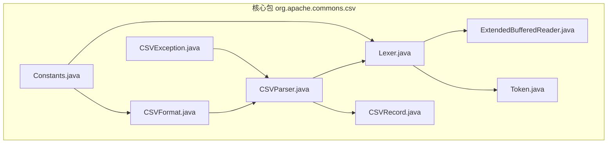
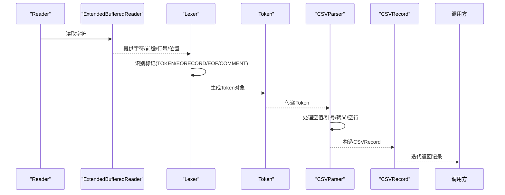
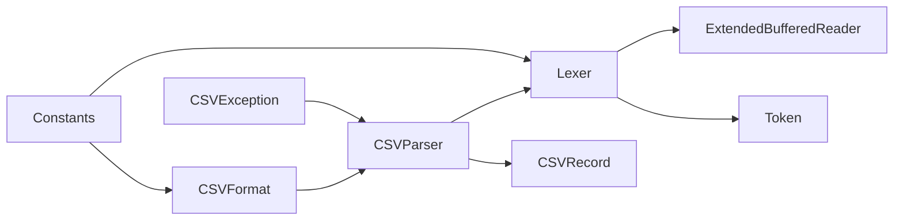
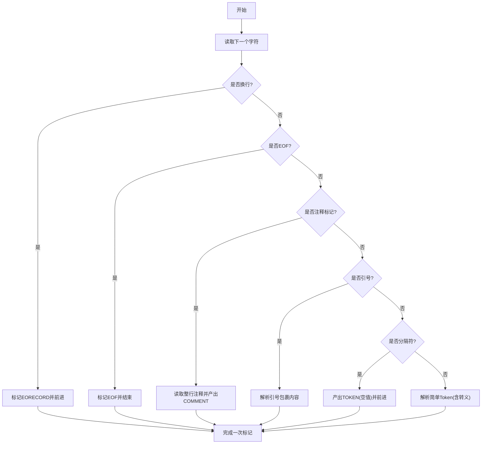

# 核心概念

<cite>
**本文引用的文件**
- [CSVFormat.java](file://src/main/java/org/apache/commons/csv/CSVFormat.java)
- [Lexer.java](file://src/main/java/org/apache/commons/csv/Lexer.java)
- [ExtendedBufferedReader.java](file://src/main/java/org/apache/commons/csv/ExtendedBufferedReader.java)
- [Token.java](file://src/main/java/org/apache/commons/csv/Token.java)
- [CSVParser.java](file://src/main/java/org/apache/commons/csv/CSVParser.java)
- [CSVRecord.java](file://src/main/java/org/apache/commons/csv/CSVRecord.java)
- [Constants.java](file://src/main/java/org/apache/commons/csv/Constants.java)
- [CSVException.java](file://src/main/java/org/apache/commons/csv/CSVException.java)
- [README.md](file://README.md)
- [UserGuideTest.java](file://src/test/java/org/apache/commons/csv/UserGuideTest.java)
</cite>

## 目录
1. [引言](#引言)
2. [项目结构](#项目结构)
3. [核心组件](#核心组件)
4. [架构总览](#架构总览)
5. [详细组件分析](#详细组件分析)
6. [依赖关系分析](#依赖关系分析)
7. [性能考量](#性能考量)
8. [故障排查指南](#故障排查指南)
9. [结论](#结论)
10. [附录](#附录)

## 引言
本文件系统化梳理 Apache Commons CSV 的核心概念与实现机制，围绕以下目标展开：
- 解释 CSV 基础与常见变体（RFC 4180、Excel、MySQL、PostgreSQL、Oracle 等）
- 深入解析词法分析器（Lexer）的标记识别、状态转换与错误检测
- 阐述流式处理架构与 ExtendedBufferedReader 的高效大文件读取策略
- 说明 Token 类型体系及其在解析过程中的作用
- 覆盖字符编码、转义规则与边界情况
- 提供端到端数据流图与序列图，帮助开发者理解从输入源到最终输出的完整流程
- 给出可定位的代码片段路径，便于进一步阅读源码

## 项目结构
该项目采用按功能域划分的包结构，核心位于 org.apache.commons.csv 包内，包含格式定义、词法分析、缓冲读取、记录模型与异常等模块。README 提供了项目概述与构建信息。

图表来源
- [CSVFormat.java](file://src/main/java/org/apache/commons/csv/CSVFormat.java)
- [Lexer.java](file://src/main/java/org/apache/commons/csv/Lexer.java)
- [ExtendedBufferedReader.java](file://src/main/java/org/apache/commons/csv/ExtendedBufferedReader.java)
- [Token.java](file://src/main/java/org/apache/commons/csv/Token.java)
- [CSVParser.java](file://src/main/java/org/apache/commons/csv/CSVParser.java)
- [CSVRecord.java](file://src/main/java/org/apache/commons/csv/CSVRecord.java)
- [Constants.java](file://src/main/java/org/apache/commons/csv/Constants.java)
- [CSVException.java](file://src/main/java/org/apache/commons/csv/CSVException.java)

章节来源
- [README.md](file://README.md)

## 核心组件
- CSVFormat：描述 CSV 文件的格式参数（分隔符、引号、换行、注释、空行处理、空值字符串、大小写忽略、转义、引号策略等），并提供多种预定义格式（DEFAULT、EXCEL、RFC4180、MYSQL、POSTGRESQL_*、ORACLE、MONGODB_*、TDF 等）。它还负责将输入转换为解析器可用的配置，并支持 Builder 模式进行灵活定制。
- Lexer：词法分析器，负责从输入中逐个产出 Token（TOKEN、EORECORD、EOF、COMMENT、INVALID）。它基于 ExtendedBufferedReader 实现前瞻读取、行终止符识别、转义处理、注释识别、引号包裹内容解析等。
- ExtendedBufferedReader：增强的缓冲读取器，支持前瞻读取、行号统计、字符位置跟踪、字节计数（可选），并能正确处理 CRLF、LF、CR 等多种换行组合。
- Token：内部标记表示，包含类型（INVALID、TOKEN、EOF、EORECORD、COMMENT）、内容缓冲区、是否就绪、是否被引号包裹等字段，作为 Lexer 与 CSVParser 的契约对象。
- CSVParser：解析器，面向记录级消费，提供迭代器接口、流式读取、记录号管理、首尾注释提取、头映射构建等功能；支持 Builder 构建器以设置字符偏移、记录号起始、字节跟踪等。
- CSVRecord：解析后的记录对象，封装值数组、记录号、字符/字节位置、注释等元信息，并提供按索引或名称访问的能力。
- Constants：包内常量集合（CR/LF/CRLF、引号、制表符、回车、退格、换页、空格、未定义状态等）。
- CSVException：CSV 解析异常类型，用于报告无效输入等错误。

章节来源
- [CSVFormat.java](file://src/main/java/org/apache/commons/csv/CSVFormat.java)
- [Lexer.java](file://src/main/java/org/apache/commons/csv/Lexer.java)
- [ExtendedBufferedReader.java](file://src/main/java/org/apache/commons/csv/ExtendedBufferedReader.java)
- [Token.java](file://src/main/java/org/apache/commons/csv/Token.java)
- [CSVParser.java](file://src/main/java/org/apache/commons/csv/CSVParser.java)
- [CSVRecord.java](file://src/main/java/org/apache/commons/csv/CSVRecord.java)
- [Constants.java](file://src/main/java/org/apache/commons/csv/Constants.java)
- [CSVException.java](file://src/main/java/org/apache/commons/csv/CSVException.java)

## 架构总览
下图展示了从 Reader 到 CSVRecord 的完整数据流路径，体现流式处理与职责分离：

图表来源
- [ExtendedBufferedReader.java](file://src/main/java/org/apache/commons/csv/ExtendedBufferedReader.java)
- [Lexer.java](file://src/main/java/org/apache/commons/csv/Lexer.java)
- [Token.java](file://src/main/java/org/apache/commons/csv/Token.java)
- [CSVParser.java](file://src/main/java/org/apache/commons/csv/CSVParser.java)
- [CSVRecord.java](file://src/main/java/org/apache/commons/csv/CSVRecord.java)

## 详细组件分析

### CSVFormat：格式定义与预设
- 关键点
  - 支持分隔符、引号、转义、注释、记录分隔符、空行处理、空值字符串、引号策略、大小写忽略、头部行为（自动/指定/跳过）、最大行数限制、宽松 EOF、尾随数据等。
  - 提供 DEFAULT、EXCEL、RFC4180、MYSQL、POSTGRESQL_*、ORACLE、MONGODB_*、TDF 等预设格式，覆盖常见数据库与工具链导出/导入场景。
  - Builder 模式允许链式配置，且对非法配置（如分隔符/转义/注释为换行符）进行校验。
- 使用建议
  - 解析前先确定格式来源（Excel 导出、MySQL 导出、PostgreSQL COPY 等），选择对应预设并按需微调。
  - 若需要严格遵循 RFC 4180，优先使用 RFC4180；若兼容 Excel 的宽松行为，使用 EXCEL。
- 代码片段路径
  - [预设格式定义（EXCEL/RFC4180/MYSQL/ORACLE/POSTGRESQL_* 等）:1034-1392](file://src/main/java/org/apache/commons/csv/CSVFormat.java#L1034-L1392)
  - [Builder 设置项与校验（分隔符/转义/注释/空行/空值/引号策略等）:452-899](file://src/main/java/org/apache/commons/csv/CSVFormat.java#L452-L899)
  - [解析入口与静态工厂方法（parse(File/URL/Reader/String/InputStream)）:321-447](file://src/main/java/org/apache/commons/csv/CSVParser.java#L321-L447)

章节来源
- [CSVFormat.java](file://src/main/java/org/apache/commons/csv/CSVFormat.java)
- [CSVParser.java](file://src/main/java/org/apache/commons/csv/CSVParser.java)

### Lexer：词法分析与状态机
- 工作机制
  - 基于 ExtendedBufferedReader 的前瞻读取，识别换行（CRLF、LF、CR）并统一处理。
  - 识别注释行（以注释标记开头的整行），产出 COMMENT Token。
  - 识别空行（根据 ignoreEmptyLines 决定是否跳过）。
  - 解析简单 Token（非引号包裹）与引号包裹 Token（支持双引号转义与转义序列）。
  - 处理转义序列（如 \r、\n、\t、\b、\f、换行、制表、退格等），并对非法转义给出错误提示。
  - 在引号包裹 Token 中，遇到未转义的引号结束符后，要求其后为分隔符或行终止符，否则抛出异常。
- 状态转换
  - 从字符流中读取当前字符，判断是否为分隔符、换行、引号、转义、注释或 EOF，驱动状态转移。
  - 对于引号包裹内容，进入“等待结束”状态，直到遇到合法的结束条件（分隔符、行终止符或 EOF）。
- 错误检测
  - 引号包裹内容提前 EOF：抛出异常，提示“在引号包裹内容结束前到达 EOF”。
  - 引号包裹内容后出现非法字符（非空白且非分隔符/行终止符）：抛出异常，提示“引号包裹内容与分隔符之间存在非法字符”。
  - 转义序列末尾 EOF：抛出异常，提示“转义序列处理时到达 EOF”。
- 代码片段路径
  - [nextToken 主流程与状态判定:235-307](file://src/main/java/org/apache/commons/csv/Lexer.java#L235-L307)
  - [parseEncapsulatedToken 引号包裹内容解析:336-389](file://src/main/java/org/apache/commons/csv/Lexer.java#L336-L389)
  - [parseSimpleToken 简单 Token 解析:409-440](file://src/main/java/org/apache/commons/csv/Lexer.java#L409-L440)
  - [readEscape 转义序列处理:479-509](file://src/main/java/org/apache/commons/csv/Lexer.java#L479-L509)
  - [readEndOfLine 换行识别与 CRLF 规范化:447-468](file://src/main/java/org/apache/commons/csv/Lexer.java#L447-L468)

章节来源
- [Lexer.java](file://src/main/java/org/apache/commons/csv/Lexer.java)

### ExtendedBufferedReader：流式高效读取
- 特性
  - 支持前瞻读取（peek），便于 Lexer 做多字符匹配（如多字符分隔符、转义序列）。
  - 维护行号、字符位置、字节计数（可选），并正确处理 CRLF、LF、CR 的换行组合。
  - 当启用字节跟踪时，使用 CharsetEncoder 计算每个字符/代理对的字节数，确保字节位置准确。
- 性能
  - 缓冲读取减少系统调用次数，适合大文件流式处理。
  - 字节计数可选，避免不必要的编码计算开销。
- 代码片段路径
  - [构造函数与字节跟踪初始化:81-84](file://src/main/java/org/apache/commons/csv/ExtendedBufferedReader.java#L81-L84)
  - [read/readLine 行号与字节计数更新:194-265](file://src/main/java/org/apache/commons/csv/ExtendedBufferedReader.java#L194-L265)
  - [getEncodedCharLength 代理对字节长度计算:134-148](file://src/main/java/org/apache/commons/csv/ExtendedBufferedReader.java#L134-L148)

章节来源
- [ExtendedBufferedReader.java](file://src/main/java/org/apache/commons/csv/ExtendedBufferedReader.java)

### Token：标记类型与契约
- 类型
  - INVALID：初始状态，尚未有有效内容。
  - TOKEN：普通单元格内容（可能为空字符串）。
  - EOF：输入结束。
  - EORECORD：一行结束（换行）。
  - COMMENT：注释行。
- 字段
  - type：标记类型
  - content：StringBuilder 缓冲区，累积内容
  - isReady：标记是否已就绪（可被解析器消费）
  - isQuoted：是否由引号包裹
- 用途
  - Lexer 生成 Token 并交由 CSVParser 消费；Parser 根据格式规则处理空值、引号、转义、空行等。
- 代码片段路径
  - [Token 类型与字段定义:30-80](file://src/main/java/org/apache/commons/csv/Token.java#L30-L80)

章节来源
- [Token.java](file://src/main/java/org/apache/commons/csv/Token.java)

### CSVParser：记录级解析与消费
- 职责
  - 将 Lexer 产出的 Token 组装为 CSVRecord，维护记录号、字符/字节位置、首尾注释、头映射等。
  - 支持迭代器与流式 API，提供 getRecords() 一次性读取全部记录（谨慎使用，注意内存占用）。
  - 处理空值替换（根据 nullString 与 quoteMode）、尾随分隔符、最大行数限制等。
- 代码片段路径
  - [CSVParser 构造与 Lexer 初始化:557-567](file://src/main/java/org/apache/commons/csv/CSVParser.java#L557-L567)
  - [创建头映射与重复头处理:601-656](file://src/main/java/org/apache/commons/csv/CSVParser.java#L601-L656)
  - [addRecordValue 空值处理与尾随分隔符:569-575](file://src/main/java/org/apache/commons/csv/CSVParser.java#L569-L575)
  - [getRecords 流式收集为列表:768-770](file://src/main/java/org/apache/commons/csv/CSVParser.java#L768-L770)

章节来源
- [CSVParser.java](file://src/main/java/org/apache/commons/csv/CSVParser.java)

### CSVRecord：记录模型与访问
- 字段
  - values：记录值数组
  - recordNumber：记录号
  - characterPosition/bytePosition：字符/字节位置
  - comment：注释（附着在下一条记录上）
  - parser：解析器引用（不参与序列化）
- 访问方式
  - 按索引、按名称（需要头映射）、枚举名、流式遍历、转 Map/List 等。
- 一致性检查
  - isConsistent：检查记录长度与头映射大小是否一致。
- 代码片段路径
  - [CSVRecord 字段与构造:70-78](file://src/main/java/org/apache/commons/csv/CSVRecord.java#L70-L78)
  - [按名称访问 get(String):125-143](file://src/main/java/org/apache/commons/csv/CSVRecord.java#L125-L143)
  - [一致性检查 isConsistent:234-237](file://src/main/java/org/apache/commons/csv/CSVRecord.java#L234-L237)

章节来源
- [CSVRecord.java](file://src/main/java/org/apache/commons/csv/CSVRecord.java)

### CSVException：错误模型
- 用途
  - 抛出解析错误（如引号包裹内容未闭合、转义序列非法、引号包裹内容后出现非法字符等）。
- 代码片段路径
  - [CSVException 定义与格式化消息:31-46](file://src/main/java/org/apache/commons/csv/CSVException.java#L31-L46)

章节来源
- [CSVException.java](file://src/main/java/org/apache/commons/csv/CSVException.java)

## 依赖关系分析
- CSVFormat 与 CSVParser：Parser 依赖 Format 的配置（分隔符、引号、转义、空值、引号策略、空行处理、注释等）。
- Lexer 依赖 ExtendedBufferedReader 提供前瞻与行号/位置信息。
- Token 是 Lexer 与 Parser 的契约对象，贯穿解析流程。
- CSVRecord 依赖 CSVParser 的头映射与位置信息。
- Constants 为 Lexer 与 CSVFormat 提供通用常量。

图表来源
- [CSVFormat.java](file://src/main/java/org/apache/commons/csv/CSVFormat.java)
- [Lexer.java](file://src/main/java/org/apache/commons/csv/Lexer.java)
- [ExtendedBufferedReader.java](file://src/main/java/org/apache/commons/csv/ExtendedBufferedReader.java)
- [Token.java](file://src/main/java/org/apache/commons/csv/Token.java)
- [CSVParser.java](file://src/main/java/org/apache/commons/csv/CSVParser.java)
- [CSVRecord.java](file://src/main/java/org/apache/commons/csv/CSVRecord.java)
- [Constants.java](file://src/main/java/org/apache/commons/csv/Constants.java)
- [CSVException.java](file://src/main/java/org/apache/commons/csv/CSVException.java)

## 性能考量
- 流式处理
  - 使用 ExtendedBufferedReader 与 Lexer 的前瞻能力，避免一次性加载整个文件，降低内存占用。
- 编码与字节计数
  - 字节跟踪会触发 CharsetEncoder 计算，对超大文件有额外 CPU 开销；仅在需要字节位置时开启。
- 空值与引号策略
  - 合理设置 nullString 与 quoteMode 可减少不必要的字符串处理与比较。
- 最大行数限制
  - 使用 CSVFormat.Builder.setMaxRows 可限制解析规模，避免无限增长的内存占用。
- 代码片段路径
  - [字节跟踪开关与编码器初始化:81-84](file://src/main/java/org/apache/commons/csv/ExtendedBufferedReader.java#L81-L84)
  - [字节计数更新逻辑:200-202](file://src/main/java/org/apache/commons/csv/ExtendedBufferedReader.java#L200-L202)
  - [最大行数限制与行号控制:231-237](file://src/main/java/org/apache/commons/csv/CSVParser.java#L231-L237)

章节来源
- [ExtendedBufferedReader.java](file://src/main/java/org/apache/commons/csv/ExtendedBufferedReader.java)
- [CSVParser.java](file://src/main/java/org/apache/commons/csv/CSVParser.java)

## 故障排查指南
- 引号包裹内容未闭合
  - 现象：解析到 EOF 时仍处于引号包裹状态。
  - 处理：检查输入是否缺少闭合引号；必要时调整 quoteCharacter 或关闭引号。
  - 代码片段路径
    - [引号包裹内容 EOF 错误抛出:382-383](file://src/main/java/org/apache/commons/csv/Lexer.java#L382-L383)
- 引号包裹内容后出现非法字符
  - 现象：引号包裹内容结束后，紧邻字符既非分隔符也非行终止符且非空白。
  - 处理：检查 trailingData 设置；若不允许尾随数据，应清理多余字符。
  - 代码片段路径
    - [非法字符检测与异常抛出:365-371](file://src/main/java/org/apache/commons/csv/Lexer.java#L365-L371)
- 转义序列非法或结尾 EOF
  - 现象：转义字符后直接到达 EOF，或转义字符后为未知字符。
  - 处理：修正转义序列；确认 escapeCharacter 设置正确。
  - 代码片段路径
    - [转义序列处理与 EOF 异常:499-500](file://src/main/java/org/apache/commons/csv/Lexer.java#L499-L500)
- 注释标记与换行冲突
  - 现象：注释标记被设置为换行符导致无法识别。
  - 处理：注释标记不可为换行符；分隔符与转义字符亦同。
  - 代码片段路径
    - [注释标记校验（禁止为换行符）:399-443](file://src/main/java/org/apache/commons/csv/CSVFormat.java#L399-L443)
    - [分隔符与转义字符校验（禁止为换行符）:462-468](file://src/main/java/org/apache/commons/csv/CSVFormat.java#L462-L468)
- 头部重复或缺失
  - 现象：重复头名或空头名且不允许。
  - 处理：调整 DuplicateHeaderMode 或 allowMissingColumnNames；或修正输入。
  - 代码片段路径
    - [重复头处理与异常抛出:638-642](file://src/main/java/org/apache/commons/csv/CSVParser.java#L638-L642)
    - [空头名校验与异常抛出:631-633](file://src/main/java/org/apache/commons/csv/CSVParser.java#L631-L633)

章节来源
- [Lexer.java](file://src/main/java/org/apache/commons/csv/Lexer.java)
- [CSVParser.java](file://src/main/java/org/apache/commons/csv/CSVParser.java)
- [CSVFormat.java](file://src/main/java/org/apache/commons/csv/CSVFormat.java)

## 结论
Apache Commons CSV 通过清晰的职责分离与流式架构，提供了高性能、可扩展的 CSV 解析能力。CSVFormat 描述语义，Lexer 负责词法，ExtendedBufferedReader 提供高效读取，Token 作为契约对象连接二者，CSVParser 负责组装记录并暴露易用的 API。借助多种预设格式与严格的错误处理，该库能够稳健地适配多样化的 CSV 场景。

## 附录

### CSV 格式基础与变体
- RFC 4180：标准 CSV，CRLF 作为换行，双引号包裹，逗号分隔，转义规则明确。
- Excel：允许空行、缺失列名、尾随数据、宽松 EOF，更贴近实际导出行为。
- MySQL：制表符分隔、LF 换行、默认空值为 “\N”，引号禁用。
- PostgreSQL CSV/Text：COPY 导出格式，CSV 默认空值为空串，Text 默认空值为 “\N”，引号策略不同。
- Oracle：系统换行符作为记录分隔，引号最小化策略，trim 处理。
- MongoDB CSV/TSV：最小引号策略，转义为双引号，TSV 使用制表符。
- TDF：Tab 分隔，忽略首尾空白。

章节来源
- [CSVFormat.java:1034-1414](file://src/main/java/org/apache/commons/csv/CSVFormat.java#L1034-L1414)

### 词法分析状态机（简化）

图表来源
- [Lexer.java:235-307](file://src/main/java/org/apache/commons/csv/Lexer.java#L235-L307)

### 使用示例（代码片段路径）
- 基本解析（Excel 预设 + 自动头）：[UserGuideTest.java:64-73](file://src/test/java/org/apache/commons/csv/UserGuideTest.java#L64-L73)
- BOM 处理与 UTF-8 读取：[UserGuideTest.java:50-54](file://src/test/java/org/apache/commons/csv/UserGuideTest.java#L50-L54)