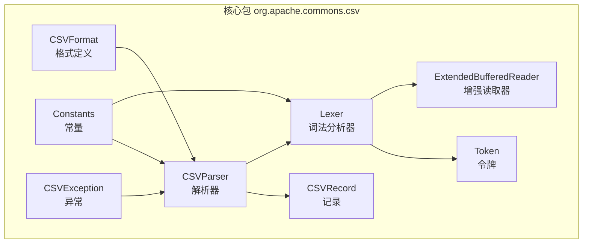
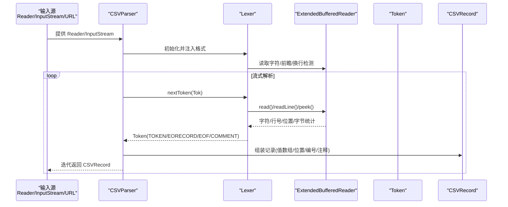
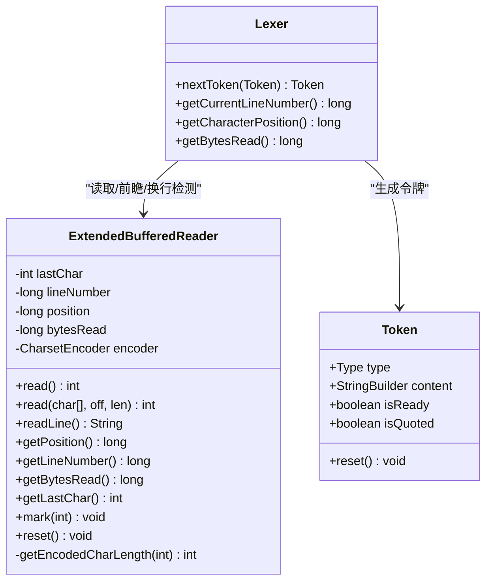
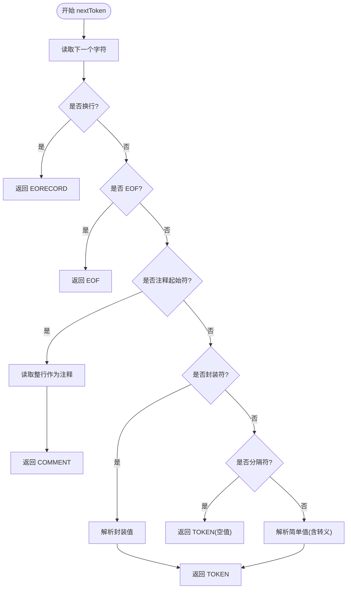
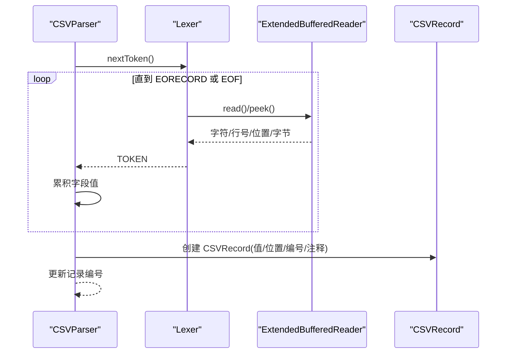
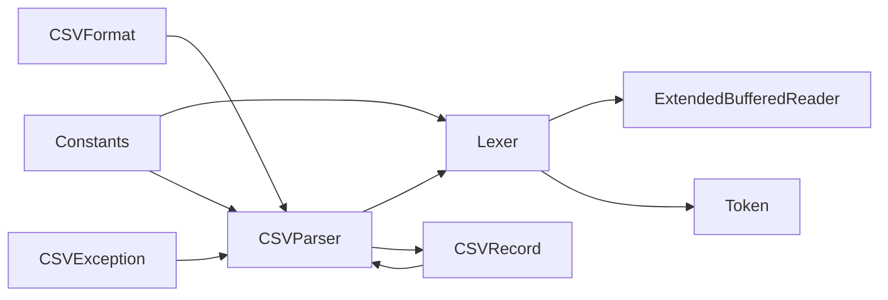

# 流式处理架构

<cite>
**本文引用的文件**   
- [ExtendedBufferedReader.java](file://src/main/java/org/apache/commons/csv/ExtendedBufferedReader.java)
- [CSVParser.java](file://src/main/java/org/apache/commons/csv/CSVParser.java)
- [Lexer.java](file://src/main/java/org/apache/commons/csv/Lexer.java)
- [Token.java](file://src/main/java/org/apache/commons/csv/Token.java)
- [CSVRecord.java](file://src/main/java/org/apache/commons/csv/CSVRecord.java)
- [CSVFormat.java](file://src/main/java/org/apache/commons/csv/CSVFormat.java)
- [Constants.java](file://src/main/java/org/apache/commons/csv/Constants.java)
- [CSVException.java](file://src/main/java/org/apache/commons/csv/CSVException.java)
- [ExtendedBufferedReaderTest.java](file://src/test/java/org/apache/commons/csv/ExtendedBufferedReaderTest.java)
- [PerformanceTest.java](file://src/test/java/org/apache/commons/csv/PerformanceTest.java)
- [README.md](file://README.md)
- [package-info.java](file://src/main/java/org/apache/commons/csv/package-info.java)
</cite>

## 目录
1. [引言](#引言)
2. [项目结构](#项目结构)
3. [核心组件](#核心组件)
4. [架构总览](#架构总览)
5. [详细组件分析](#详细组件分析)
6. [依赖关系分析](#依赖关系分析)
7. [性能考量](#性能考量)
8. [故障排查指南](#故障排查指南)
9. [结论](#结论)
10. [附录：最佳实践与调优建议](#附录最佳实践与调优建议)

## 引言
本文件系统性解析 Apache Commons CSV 的流式处理架构与实现原理，重点围绕以下目标展开：
- 深入解释流式处理的设计思想与优势（内存效率、大文件处理能力、实时处理能力）
- 全面剖析 ExtendedBufferedReader 的增强能力（位置跟踪、字符计数、行号管理、字节统计）
- 描述数据从输入源到最终输出的完整处理链路
- 总结缓冲策略与性能优化技术（缓冲区大小、I/O 操作优化）
- 讲解字符编码处理与多字节字符的正确处理方式
- 说明异常处理与错误恢复机制，保障数据完整性
- 提供最佳实践与性能调优建议，并给出可参考的使用场景与示例路径

## 项目结构
该项目采用按包划分的模块化组织方式，核心解析流程由“格式定义 → 解析器 → 词法分析器 → 增强读取器”构成，配合记录模型与异常类型，形成完整的流式 CSV 处理管线。

图表来源
- [CSVFormat.java](file://src/main/java/org/apache/commons/csv/CSVFormat.java)
- [CSVParser.java](file://src/main/java/org/apache/commons/csv/CSVParser.java)
- [Lexer.java](file://src/main/java/org/apache/commons/csv/Lexer.java)
- [ExtendedBufferedReader.java](file://src/main/java/org/apache/commons/csv/ExtendedBufferedReader.java)
- [Token.java](file://src/main/java/org/apache/commons/csv/Token.java)
- [CSVRecord.java](file://src/main/java/org/apache/commons/csv/CSVRecord.java)
- [Constants.java](file://src/main/java/org/apache/commons/csv/Constants.java)
- [CSVException.java](file://src/main/java/org/apache/commons/csv/CSVException.java)

章节来源
- [README.md](file://README.md)
- [package-info.java](file://src/main/java/org/apache/commons/csv/package-info.java)

## 核心组件
- CSVFormat：定义分隔符、封装符、注释符、空值字符串、是否忽略空白等格式参数；支持预设与自定义格式，提供 Builder 构建器。
- CSVParser：面向流式的解析入口，提供多种 parse 工厂方法；内部通过 Lexer 进行词法扫描；支持迭代器与流式遍历；可选启用字节跟踪。
- Lexer：词法分析器，负责识别分隔符、换行符、注释、转义、封装值等；维护首条换行符类型、当前字符位置与行号；提供 nextToken() 生成 Token。
- ExtendedBufferedReader：增强的缓冲读取器，提供前瞻读取、位置跟踪、行号统计、字符计数与可选字节统计；为 Lexer 提供底层 I/O 能力。
- Token：内部令牌表示，承载内容、类型（TOKEN/EORECORD/EOF/COMMENT/INVALID）与就绪状态。
- CSVRecord：解析后的记录对象，携带值数组、起始字符位置、起始字节位置、记录编号、注释等元信息。
- Constants：包内常量集合（CR/LF/CRLF 等）。
- CSVException：CSV 解析异常类型，用于抛出格式错误或非法输入异常。

章节来源
- [CSVFormat.java](file://src/main/java/org/apache/commons/csv/CSVFormat.java)
- [CSVParser.java](file://src/main/java/org/apache/commons/csv/CSVParser.java)
- [Lexer.java](file://src/main/java/org/apache/commons/csv/Lexer.java)
- [ExtendedBufferedReader.java](file://src/main/java/org/apache/commons/csv/ExtendedBufferedReader.java)
- [Token.java](file://src/main/java/org/apache/commons/csv/Token.java)
- [CSVRecord.java](file://src/main/java/org/apache/commons/csv/CSVRecord.java)
- [Constants.java](file://src/main/java/org/apache/commons/csv/Constants.java)
- [CSVException.java](file://src/main/java/org/apache/commons/csv/CSVException.java)

## 架构总览
下图展示了从输入源到最终记录产出的完整数据流路径，以及各组件之间的交互关系：

图表来源
- [CSVParser.java](file://src/main/java/org/apache/commons/csv/CSVParser.java)
- [Lexer.java](file://src/main/java/org/apache/commons/csv/Lexer.java)
- [ExtendedBufferedReader.java](file://src/main/java/org/apache/commons/csv/ExtendedBufferedReader.java)
- [Token.java](file://src/main/java/org/apache/commons/csv/Token.java)
- [CSVRecord.java](file://src/main/java/org/apache/commons/csv/CSVRecord.java)

## 详细组件分析

### ExtendedBufferedReader：增强读取器与位置跟踪
- 增强能力
  - 前瞻读取：支持 peek，便于 Lexer 预判分隔符、转义序列与换行组合。
  - 行号管理：在 CR、LF 及 CRLF 情况下准确计数，提供 getCurrentLineNumber()。
  - 字符位置与字节统计：getPosition() 返回字符级偏移；当启用字节跟踪时，getBytesRead() 返回字节数。
  - 多字节字符编码：在启用字节跟踪时，基于 CharsetEncoder 计算每个字符/代理对的字节长度，正确处理 BMP 与补充平面字符。
  - 状态标记与回退：mark/reset 支持保存/恢复行号、字符位置、字节计数与最后字符状态。
- 关键行为
  - read()：逐字符读取，更新行号、位置与字节计数；处理 CRLF 特殊情况。
  - read(char[], off, len)：批量读取，逐字符判断换行符并累计行号。
  - readLine()：读取整行并丢弃行终止符，适合注释行处理。
  - getEncodedCharLength()：根据代理对与编码规则计算字节长度，抛出编码异常时中止。
- 与 Lexer 的协作
  - Lexer 通过 EBR 的 read()/readLine()/peek() 获取字符与行终止信息，同时复用行号与位置以定位错误。

图表来源
- [ExtendedBufferedReader.java](file://src/main/java/org/apache/commons/csv/ExtendedBufferedReader.java)
- [Lexer.java](file://src/main/java/org/apache/commons/csv/Lexer.java)
- [Token.java](file://src/main/java/org/apache/commons/csv/Token.java)

章节来源
- [ExtendedBufferedReader.java](file://src/main/java/org/apache/commons/csv/ExtendedBufferedReader.java)
- [ExtendedBufferedReaderTest.java](file://src/test/java/org/apache/commons/csv/ExtendedBufferedReaderTest.java)

### Lexer：词法分析与令牌生成
- 功能职责
  - 识别分隔符、换行符（CR/LF/CRLF）、注释行、转义字符与封装值。
  - 维护首条换行符类型（用于兼容不同平台）。
  - 提供 nextToken() 生成 Token，区分 TOKEN（单元格值）、EORECORD（行结束）、EOF（文件结束）、COMMENT（注释）。
- 关键算法
  - readEndOfLine()：吞掉 \r\n 组合，记录首条换行符类型。
  - isDelimiter()/isEscapeDelimiter()：通过前瞻读取判断复杂分隔符与转义分隔符。
  - parseSimpleToken()/parseEncapsulatedToken()：分别处理简单值与封装值，支持转义与尾随数据策略。
- 错误处理
  - 在封装未闭合、非法转义、行尾过早 EOF 等情况下抛出 CSVException，并附带行号与位置信息以便定位。

图表来源
- [Lexer.java](file://src/main/java/org/apache/commons/csv/Lexer.java)
- [Token.java](file://src/main/java/org/apache/commons/csv/Token.java)

章节来源
- [Lexer.java](file://src/main/java/org/apache/commons/csv/Lexer.java)
- [Token.java](file://src/main/java/org/apache/commons/csv/Token.java)

### CSVParser：流式解析与记录构建
- 流式特性
  - 实现 Iterable<CSVRecord>，支持 for-each 顺序消费；不支持回溯。
  - 提供 getRecords() 将剩余内容一次性收集到内存（非推荐用于超大文件）。
- 关键流程
  - 构造时注入 CSVFormat 与 ExtendedBufferedReader，初始化 Lexer。
  - nextRecord() 通过 Lexer 逐步产出 Token，组装为 CSVRecord。
  - 支持注释行、首行注释、尾注释、首条换行符记录、记录编号与字符偏移设置。
- 字节跟踪
  - 当启用字节跟踪时，通过 ExtendedBufferedReader 的字节统计与 CharsetEncoder 记录每条记录的字节起始位置，便于定位与审计。

图表来源
- [CSVParser.java](file://src/main/java/org/apache/commons/csv/CSVParser.java)
- [Lexer.java](file://src/main/java/org/apache/commons/csv/Lexer.java)
- [ExtendedBufferedReader.java](file://src/main/java/org/apache/commons/csv/ExtendedBufferedReader.java)
- [CSVRecord.java](file://src/main/java/org/apache/commons/csv/CSVRecord.java)

章节来源
- [CSVParser.java](file://src/main/java/org/apache/commons/csv/CSVParser.java)
- [CSVRecord.java](file://src/main/java/org/apache/commons/csv/CSVRecord.java)

### 数据模型与格式配置
- CSVRecord：记录值数组、字符/字节起始位置、记录编号、注释与一致性校验。
- CSVFormat：分隔符、封装符、注释符、空值字符串、忽略空白、首行注释、最大行数、转义策略等；提供 Builder 以灵活定制。
- Constants：统一管理 CR/LF/CRLF 等控制字符与特殊常量。

章节来源
- [CSVRecord.java](file://src/main/java/org/apache/commons/csv/CSVRecord.java)
- [CSVFormat.java](file://src/main/java/org/apache/commons/csv/CSVFormat.java)
- [Constants.java](file://src/main/java/org/apache/commons/csv/Constants.java)

## 依赖关系分析
- 组件耦合
  - CSVParser 依赖 CSVFormat 与 Lexer；Lexer 依赖 ExtendedBufferedReader；Token 为 Lexer 内部契约。
  - CSVRecord 依赖 CSVParser 以访问头映射与格式信息。
- 外部依赖
  - 使用 Apache Commons IO 的 UnsynchronizedBufferedReader 作为基础缓冲读取器，提供高性能与线程安全的缓冲能力。
  - 使用 CharsetEncoder 进行字节长度计算，确保多字节字符的正确统计。
- 循环依赖
  - 无直接循环依赖；Parser 与 Record 之间为单向依赖（Record 持有 Parser 引用但不反向影响）。

图表来源
- [CSVFormat.java](file://src/main/java/org/apache/commons/csv/CSVFormat.java)
- [CSVParser.java](file://src/main/java/org/apache/commons/csv/CSVParser.java)
- [Lexer.java](file://src/main/java/org/apache/commons/csv/Lexer.java)
- [ExtendedBufferedReader.java](file://src/main/java/org/apache/commons/csv/ExtendedBufferedReader.java)
- [Token.java](file://src/main/java/org/apache/commons/csv/Token.java)
- [CSVRecord.java](file://src/main/java/org/apache/commons/csv/CSVRecord.java)
- [Constants.java](file://src/main/java/org/apache/commons/csv/Constants.java)
- [CSVException.java](file://src/main/java/org/apache/commons/csv/CSVException.java)

章节来源
- [CSVParser.java](file://src/main/java/org/apache/commons/csv/CSVParser.java)
- [Lexer.java](file://src/main/java/org/apache/commons/csv/Lexer.java)
- [ExtendedBufferedReader.java](file://src/main/java/org/apache/commons/csv/ExtendedBufferedReader.java)

## 性能考量
- 缓冲策略
  - 使用 Apache Commons IO 的 UnsynchronizedBufferedReader 作为基础缓冲层，减少系统调用次数，提升吞吐。
  - ExtendedBufferedReader 自身也维持内部缓冲，结合批量读取（read(char[], off, len)）降低 JVM 层开销。
- I/O 优化
  - 优先使用字符缓冲 Reader（如 Files.newBufferedReader），避免重复解码带来的 CPU 开销。
  - 对于超大文件，尽量保持流式处理，避免一次性加载至内存。
- 字节统计与编码
  - 启用字节跟踪会引入 CharsetEncoder 的计算成本；仅在需要精确定位与审计时开启。
  - 多字节字符（如代理对）需额外编码计算，注意 UTF-8/UTF-16 等编码差异。
- 并发与流式
  - 流式解析天然适合顺序处理；若需并行，应谨慎评估记录边界与状态共享问题。
- 测试验证
  - 性能测试用例覆盖了不同读取模式与解析路径，可用于对比与回归验证。

章节来源
- [PerformanceTest.java](file://src/test/java/org/apache/commons/csv/PerformanceTest.java)
- [ExtendedBufferedReader.java](file://src/main/java/org/apache/commons/csv/ExtendedBufferedReader.java)

## 故障排查指南
- 常见异常
  - CSVException：封装格式错误、非法转义、未闭合封装值、行尾过早 EOF 等；通常包含行号与位置信息，便于快速定位。
- 定位技巧
  - 利用 getCurrentLineNumber() 与 getCharacterPosition()/getBytePosition() 获取精确位置。
  - 结合 getFirstEndOfLine() 判断换行符类型，排查跨平台兼容问题。
  - 对于注释与空行，检查 CSVFormat 的注释符与忽略空行设置。
- 恢复策略
  - 在捕获异常后，可通过 mark/reset 回退到上一个稳定状态，重新解析或跳过问题片段。
  - 对于部分损坏数据，可考虑放宽严格模式（如 lenientEof）或调整格式参数。

章节来源
- [CSVException.java](file://src/main/java/org/apache/commons/csv/CSVException.java)
- [Lexer.java](file://src/main/java/org/apache/commons/csv/Lexer.java)
- [CSVParser.java](file://src/main/java/org/apache/commons/csv/CSVParser.java)

## 结论
Apache Commons CSV 的流式处理架构以“格式定义 → 解析器 → 词法分析器 → 增强读取器”的清晰分层实现了高扩展性与高性能。ExtendedBufferedReader 提供了位置跟踪、行号管理与可选字节统计，为 Lexer 与上层应用提供了可靠的基础能力。通过合理的缓冲策略、字符编码处理与异常恢复机制，该库能够高效处理大文件与实时数据流，满足多样化的 CSV 解析需求。

## 附录：最佳实践与调优建议
- 选择合适的输入源
  - 优先使用字符缓冲 Reader（如 newBufferedReader），避免重复解码。
- 合理设置格式参数
  - 明确分隔符、封装符、注释符与空值字符串；必要时关闭忽略空白以保留原始格式。
  - 对于 Excel/MySQL 等预设格式，直接使用对应 CSVFormat；需要微调时通过 Builder 设置。
- 控制内存占用
  - 流式处理时避免一次性 getRecords()；如需收集，限制最大行数（setMaxRows）。
- 启用字节跟踪的权衡
  - 仅在需要精确定位与审计时开启字节跟踪；否则可关闭以降低编码计算开销。
- 多字节字符处理
  - 明确字符集并传入 Charset；确保 ExtendedBufferedReader 的字节跟踪与 CharsetEncoder 协同工作。
- 错误处理与日志
  - 捕获 CSVException 并结合行号/位置信息进行告警与重试；对注释与空行进行显式配置。
- 性能调优
  - 使用性能测试用例对比不同读取与解析路径；在生产环境关注 GC 与内存峰值。
  - 对于超大数据，考虑分片读取与并行处理（谨慎设计状态共享）。

章节来源
- [CSVFormat.java](file://src/main/java/org/apache/commons/csv/CSVFormat.java)
- [CSVParser.java](file://src/main/java/org/apache/commons/csv/CSVParser.java)
- [ExtendedBufferedReader.java](file://src/main/java/org/apache/commons/csv/ExtendedBufferedReader.java)
- [PerformanceTest.java](file://src/test/java/org/apache/commons/csv/PerformanceTest.java)