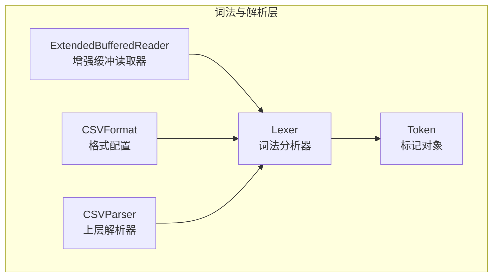
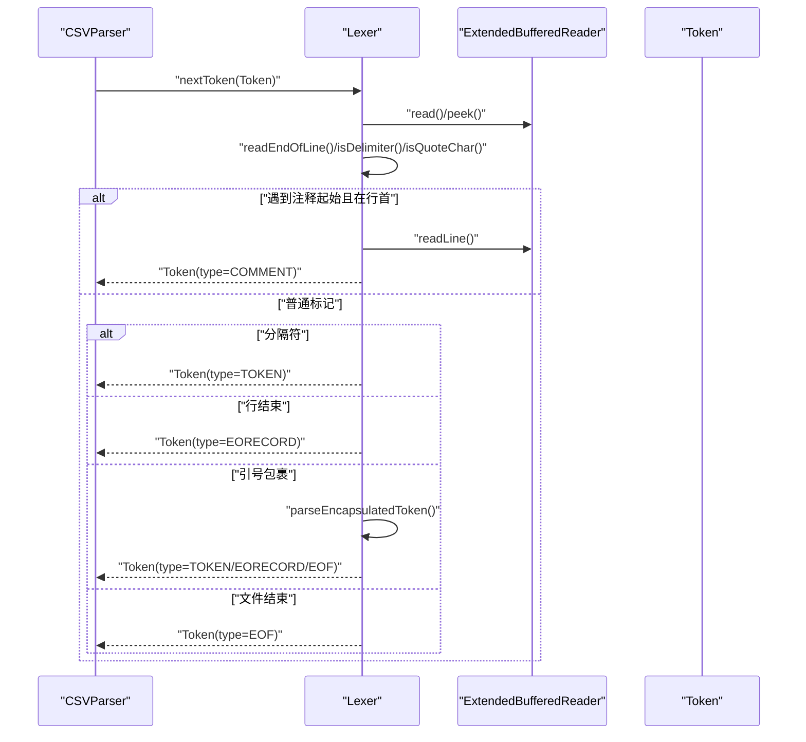
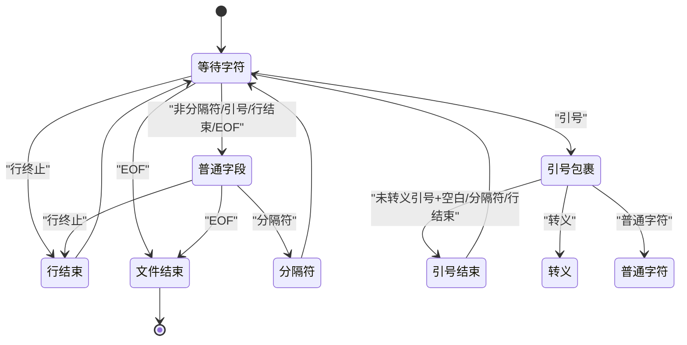
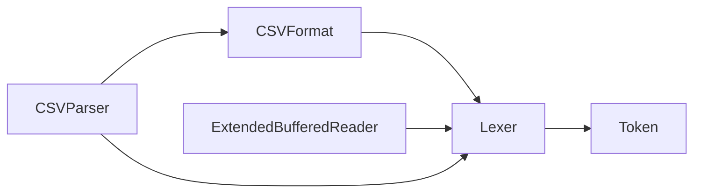

# 词法分析原理

<cite>
**本文引用的文件**
- [Lexer.java](file://src/main/java/org/apache/commons/csv/Lexer.java)
- [Token.java](file://src/main/java/org/apache/commons/csv/Token.java)
- [ExtendedBufferedReader.java](file://src/main/java/org/apache/commons/csv/ExtendedBufferedReader.java)
- [CSVFormat.java](file://src/main/java/org/apache/commons/csv/CSVFormat.java)
- [Constants.java](file://src/main/java/org/apache/commons/csv/Constants.java)
- [CSVParser.java](file://src/main/java/org/apache/commons/csv/CSVParser.java)
- [LexerTest.java](file://src/test/java/org/apache/commons/csv/LexerTest.java)
</cite>

## 目录
1. [简介](#简介)
2. [项目结构](#项目结构)
3. [核心组件](#核心组件)
4. [架构总览](#架构总览)
5. [详细组件分析](#详细组件分析)
6. [依赖关系分析](#依赖关系分析)
7. [性能考量](#性能考量)
8. [故障排查指南](#故障排查指南)
9. [结论](#结论)
10. [附录](#附录)

## 简介
本文件系统性解析 commons-csv 中词法分析器（Lexer）的工作原理与实现机制，覆盖以下关键主题：
- 字符读取与缓冲：基于增强的缓冲读取器，支持前瞻读取、字节计数与行号跟踪。
- 标记识别：区分 TOKEN、EORECORD、EOF、COMMENT 四种类型，并处理空行、注释、分隔符等边界情况。
- 状态转换：以字符驱动的有限状态机，描述从“开始”到“识别出一个标记”的完整流程。
- 特殊字符处理：转义序列、引号嵌套、CRLF 处理、尾随数据策略、宽松 EOF 等。
- 流式处理与缓冲：流式读取、前瞻缓冲、增量构建内容、重用 Token 对象减少分配。
- 错误检测与恢复：在不合法状态抛出异常或按配置宽松处理，保证解析健壮性。
- 性能优化：预分配缓冲区、避免多余拷贝、前瞻匹配、字节计数可选启用。

## 项目结构
commons-csv 的词法分析位于 org.apache.commons.csv 包内，核心文件如下：
- Lexer：词法分析器主体，负责扫描输入并产出 Token。
- Token：内部标记表示，承载类型、内容与就绪标志。
- ExtendedBufferedReader：增强的缓冲读取器，提供前瞻、位置与字节计数能力。
- CSVFormat：格式配置，定义分隔符、引号、转义、注释、空行忽略等行为。
- Constants：包内常量，统一管理控制字符与特殊值。
- CSVParser：上层解析器，组合 Lexer 并消费 Token 构建记录。
- LexerTest：针对词法行为的单元测试，覆盖转义、注释、换行、EOF 等场景。

图表来源
- [Lexer.java:32-66](file://src/main/java/org/apache/commons/csv/Lexer.java#L32-L66)
- [Token.java:30-80](file://src/main/java/org/apache/commons/csv/Token.java#L30-L80)
- [ExtendedBufferedReader.java:44-84](file://src/main/java/org/apache/commons/csv/ExtendedBufferedReader.java#L44-L84)
- [CSVFormat.java:182-326](file://src/main/java/org/apache/commons/csv/CSVFormat.java#L182-L326)
- [CSVParser.java:556-567](file://src/main/java/org/apache/commons/csv/CSVParser.java#L556-L567)

章节来源
- [Lexer.java:1-521](file://src/main/java/org/apache/commons/csv/Lexer.java#L1-L521)
- [Token.java:1-81](file://src/main/java/org/apache/commons/csv/Token.java#L1-L81)
- [ExtendedBufferedReader.java:1-277](file://src/main/java/org/apache/commons/csv/ExtendedBufferedReader.java#L1-L277)
- [CSVFormat.java:1-800](file://src/main/java/org/apache/commons/csv/CSVFormat.java#L1-L800)
- [Constants.java:1-91](file://src/main/java/org/apache/commons/csv/Constants.java#L1-L91)
- [CSVParser.java:1-600](file://src/main/java/org/apache/commons/csv/CSVParser.java#L1-L600)

## 核心组件
- Lexer
  - 负责逐字符扫描，识别 TOKEN、EORECORD、EOF、COMMENT。
  - 支持多字符分隔符、转义、引号嵌套、注释、空行跳过、宽松 EOF。
  - 维护“最后是否为分隔符”的标记，用于区分空 TOKEN 与 EORECORD。
- Token
  - 内部标记对象，包含类型、内容（StringBuilder）、就绪标志、是否被引号包裹。
  - 提供 reset 以便复用，降低 GC 压力。
- ExtendedBufferedReader
  - 提供前瞻 peek、行号与位置追踪、可选字节计数。
  - 在 CRLF 情况下进行吞并处理，确保行终止判断一致。
- CSVFormat
  - 定义分隔符、引号、转义、注释、空行忽略、宽松 EOF、尾随数据等行为。
- CSVParser
  - 组合 Lexer，消费 Token 并构建 CSVRecord；负责生命周期管理与资源关闭。

章节来源
- [Lexer.java:32-307](file://src/main/java/org/apache/commons/csv/Lexer.java#L32-L307)
- [Token.java:30-80](file://src/main/java/org/apache/commons/csv/Token.java#L30-L80)
- [ExtendedBufferedReader.java:44-277](file://src/main/java/org/apache/commons/csv/ExtendedBufferedReader.java#L44-L277)
- [CSVFormat.java:182-326](file://src/main/java/org/apache/commons/csv/CSVFormat.java#L182-L326)
- [CSVParser.java:556-586](file://src/main/java/org/apache/commons/csv/CSVParser.java#L556-L586)

## 架构总览
词法分析器与上层解析器的交互如下：

图表来源
- [CSVParser.java:556-586](file://src/main/java/org/apache/commons/csv/CSVParser.java#L556-L586)
- [Lexer.java:235-307](file://src/main/java/org/apache/commons/csv/Lexer.java#L235-L307)
- [ExtendedBufferedReader.java:194-265](file://src/main/java/org/apache/commons/csv/ExtendedBufferedReader.java#L194-L265)

## 详细组件分析

### Lexer：词法分析器
- 关键职责
  - 字符读取与前瞻：通过 ExtendedBufferedReader 的 read/peek 实现高效扫描。
  - 分隔符识别：支持多字符分隔符，使用缓冲区进行精确匹配。
  - 行终止处理：统一处理 LF、CR、CRLF，必要时吞并 LF。
  - 引号包裹：支持双引号包裹，支持转义与引号重复（Doubling）语法。
  - 注释处理：在行首识别注释标记，整行读取为 COMMENT 类型。
  - 空行处理：根据配置决定是否忽略空行。
  - 转义处理：支持常见控制字符转义，以及元字符转义。
  - EOF 处理：支持严格与宽松两种 EOF 行为。
- 数据结构与复杂度
  - Token 使用 StringBuilder 动态增长，初始容量固定，避免频繁扩容。
  - 分隔符匹配采用一次性 peek + read 的方式，时间复杂度 O(k)，k 为分隔符长度。
  - 行终止判断 O(1)，通过前瞻与吞并策略保证一致性。
- 错误处理
  - 非法转义序列或 EOF 处于转义后会抛出异常。
  - 引号包裹未闭合且非宽松 EOF 时抛出异常。
  - 引号后出现非法字符（非分隔符、非行结束且非宽松模式）抛出异常。

章节来源
- [Lexer.java:32-307](file://src/main/java/org/apache/commons/csv/Lexer.java#L32-L307)
- [Lexer.java:336-389](file://src/main/java/org/apache/commons/csv/Lexer.java#L336-L389)
- [Lexer.java:409-440](file://src/main/java/org/apache/commons/csv/Lexer.java#L409-L440)
- [Lexer.java:447-468](file://src/main/java/org/apache/commons/csv/Lexer.java#L447-L468)
- [Lexer.java:479-509](file://src/main/java/org/apache/commons/csv/Lexer.java#L479-L509)

### Token：标记对象
- 类型枚举
  - INVALID：初始化状态。
  - TOKEN：普通字段内容。
  - EORECORD：行结束（记录结束）。
  - EOF：文件结束。
  - COMMENT：注释行。
- 属性
  - type：标记类型。
  - content：StringBuilder，存储内容。
  - isReady：标记已就绪，可被上层解析器使用。
  - isQuoted：标记是否由引号包裹。
- 复用策略
  - reset 将内容清空、类型置为 INVALID、isReady/isQuoted 置 false，避免频繁分配。

章节来源
- [Token.java:32-80](file://src/main/java/org/apache/commons/csv/Token.java#L32-L80)

### ExtendedBufferedReader：增强缓冲读取器
- 能力
  - 支持 peek 前瞻读取，便于多字符分隔符与转义序列判断。
  - 记录行号、字符位置、可选字节计数，用于错误定位与统计。
  - 统一处理 CRLF，吞并 LF，保证行终止判断一致。
- 性能
  - 通过编码器计算字节长度，仅在启用字节跟踪时生效。
  - 批量读取时更新行号与位置，避免逐字符开销。

章节来源
- [ExtendedBufferedReader.java:44-277](file://src/main/java/org/apache/commons/csv/ExtendedBufferedReader.java#L44-L277)

### CSVFormat：格式配置
- 关键配置项
  - 分隔符、引号、转义、注释标记、空行忽略、宽松 EOF、尾随数据、忽略周围空白等。
- 与 Lexer 的耦合
  - Lexer 依据 CSVFormat 决定分隔符、引号、转义、注释、空行忽略等行为。
  - 通过构造函数传入，影响 Lexer 的识别逻辑。

章节来源
- [CSVFormat.java:182-326](file://src/main/java/org/apache/commons/csv/CSVFormat.java#L182-L326)
- [Lexer.java:54-66](file://src/main/java/org/apache/commons/csv/Lexer.java#L54-L66)

### 状态机模型与状态转换
Lexer 的状态机以字符驱动，主要状态包括：
- 初始状态：等待下一个字符。
- 解析普通字段：遇到非分隔符、非引号、非行结束、非 EOF 即累积字符，直到遇到分隔符或行结束。
- 解析引号包裹字段：遇到引号后进入包裹状态，处理转义与引号重复，直到遇到未转义的引号并跟随空白或分隔符/行结束。
- 行结束：遇到行终止即产生 EORECORD。
- 文件结束：遇到 EOF，根据宽松策略决定是否返回 EOF 或抛错。
- 注释：在行首遇到注释标记，整行读取为 COMMENT。

图表来源
- [Lexer.java:235-307](file://src/main/java/org/apache/commons/csv/Lexer.java#L235-L307)
- [Lexer.java:336-389](file://src/main/java/org/apache/commons/csv/Lexer.java#L336-L389)
- [Lexer.java:409-440](file://src/main/java/org/apache/commons/csv/Lexer.java#L409-L440)

### 特殊字符处理详解
- 转义序列
  - 支持常见控制字符转义（如 r→CR、n→LF、t→TAB、b→BS、f→FF），以及转义后的元字符（引号、转义符、注释符）。
  - EOF 处于转义后抛出异常；未知转义字符则回退为普通字符。
- 引号嵌套与 Doubling
  - 引号重复表示在字段中出现一个引号字符；转义引号允许在字段中出现引号。
  - 引号包裹字段结束后，若紧随空白再跟分隔符或行结束，则视为 TOKEN；否则根据宽松策略或抛错。
- 注释处理
  - 注释标记仅在行首识别；整行读取为 COMMENT 类型。
- 行终止与 CRLF
  - 统一处理 LF、CR、CRLF；在 CR 后若跟 LF 则吞并 LF，保证行终止判断一致。
- 空行与空 TOKEN
  - 空行可被忽略；连续空行在忽略策略下不会产生 TOKEN。
  - 当前字符为分隔符且之前不是分隔符时，产生空 TOKEN；行结束产生 EORECORD。

章节来源
- [Lexer.java:75-86](file://src/main/java/org/apache/commons/csv/Lexer.java#L75-L86)
- [Lexer.java:479-509](file://src/main/java/org/apache/commons/csv/Lexer.java#L479-L509)
- [Lexer.java:336-389](file://src/main/java/org/apache/commons/csv/Lexer.java#L336-L389)
- [Lexer.java:447-468](file://src/main/java/org/apache/commons/csv/Lexer.java#L447-L468)
- [Lexer.java:243-256](file://src/main/java/org/apache/commons/csv/Lexer.java#L243-L256)

### 流式处理与缓冲机制
- 流式读取
  - 通过 ExtendedBufferedReader 进行流式读取，避免一次性加载整个文件。
- 前瞻与缓冲
  - 多字符分隔符匹配使用 peek 缓冲；转义序列与引号包裹使用单字符前瞻。
- 内容累积
  - Token.content 使用 StringBuilder 动态增长，初始容量固定，减少扩容次数。
- 复用策略
  - 上层解析器复用 Token 对象，调用 reset 清空状态，降低内存分配与 GC 压力。

章节来源
- [ExtendedBufferedReader.java:194-231](file://src/main/java/org/apache/commons/csv/ExtendedBufferedReader.java#L194-L231)
- [Token.java:64-69](file://src/main/java/org/apache/commons/csv/Token.java#L64-L69)
- [CSVParser.java:575-575](file://src/main/java/org/apache/commons/csv/CSVParser.java#L575-L575)

### 异常处理与错误恢复
- 异常类型
  - CSVException：用于报告格式错误，如引号未闭合、非法字符、转义序列错误等。
  - IOException：底层 I/O 错误或 EOF 处于转义后等异常情况。
- 错误恢复
  - 宽松 EOF：允许在 EOF 前未闭合引号时返回 EOF，适合兼容某些格式。
  - 忽略空行：在配置开启时跳过空行，避免产生空记录。
  - 引号后非法字符：在非宽松模式下直接抛错，保证数据一致性。

章节来源
- [Lexer.java:369-371](file://src/main/java/org/apache/commons/csv/Lexer.java#L369-L371)
- [Lexer.java:382-384](file://src/main/java/org/apache/commons/csv/Lexer.java#L382-L384)
- [Lexer.java:499-501](file://src/main/java/org/apache/commons/csv/Lexer.java#L499-L501)
- [LexerTest.java:220-230](file://src/test/java/org/apache/commons/csv/LexerTest.java#L220-L230)

## 依赖关系分析
- Lexer 依赖
  - CSVFormat：决定分隔符、引号、转义、注释、空行忽略、宽松 EOF 等行为。
  - ExtendedBufferedReader：提供字符读取、前瞻、行号与位置追踪。
  - Token：作为输出对象，承载类型与内容。
- CSVParser 依赖
  - Lexer：消费 Token 并构建 CSVRecord。
  - CSVFormat：传递给 Lexer 的配置。
- 测试依赖
  - LexerTest：验证转义、注释、换行、EOF 等行为。

图表来源
- [Lexer.java:54-66](file://src/main/java/org/apache/commons/csv/Lexer.java#L54-L66)
- [CSVParser.java:556-567](file://src/main/java/org/apache/commons/csv/CSVParser.java#L556-L567)

章节来源
- [Lexer.java:54-66](file://src/main/java/org/apache/commons/csv/Lexer.java#L54-L66)
- [CSVParser.java:556-567](file://src/main/java/org/apache/commons/csv/CSVParser.java#L556-L567)

## 性能考量
- 缓冲与前瞻
  - 多字符分隔符使用 peek 缓冲，避免多次系统调用。
  - 行终止统一处理 CRLF，减少分支判断开销。
- 字符串累积
  - Token.content 使用 StringBuilder，初始容量固定，降低扩容成本。
- 复用与分配
  - 上层复用 Token 对象，减少对象创建与 GC 压力。
- 可选字节计数
  - 仅在需要时启用字节计数，避免不必要的编码计算。

章节来源
- [ExtendedBufferedReader.java:134-148](file://src/main/java/org/apache/commons/csv/ExtendedBufferedReader.java#L134-L148)
- [Token.java:50-51](file://src/main/java/org/apache/commons/csv/Token.java#L50-L51)
- [CSVParser.java:575-575](file://src/main/java/org/apache/commons/csv/CSVParser.java#L575-L575)

## 故障排查指南
- 常见问题与定位
  - 引号未闭合：检查是否在宽松 EOF 下运行；否则会在 EOF 前抛出异常。
  - 转义序列错误：确认转义字符是否正确，EOF 处的转义会触发异常。
  - 注释标记无效：注释仅在行首识别，注意空格与制表符的影响。
  - 多字符分隔符不匹配：确认分隔符长度与顺序，使用 peek 缓冲进行匹配。
- 调试建议
  - 启用字节计数与行号追踪，结合错误消息定位问题。
  - 使用测试用例覆盖转义、注释、换行、EOF 等边界场景。

章节来源
- [Lexer.java:382-384](file://src/main/java/org/apache/commons/csv/Lexer.java#L382-L384)
- [Lexer.java:499-501](file://src/main/java/org/apache/commons/csv/Lexer.java#L499-L501)
- [LexerTest.java:123-149](file://src/test/java/org/apache/commons/csv/LexerTest.java#L123-L149)

## 结论
commons-csv 的词法分析器通过“增强缓冲读取器 + 状态机 + 可配置格式”的设计，在保证正确性的同时兼顾了性能与可扩展性。其对多字符分隔符、转义、引号嵌套、注释、行终止与 EOF 的处理均体现了工程化与健壮性的考量。配合上层解析器的复用策略与可选字节计数，整体实现了高效的流式 CSV 解析。

## 附录
- 关键流程图与状态图已在前述章节中给出，读者可结合源码路径进一步查阅具体实现细节。
- 测试用例覆盖了转义、注释、换行、EOF 等典型场景，可作为行为参考与回归测试基础。