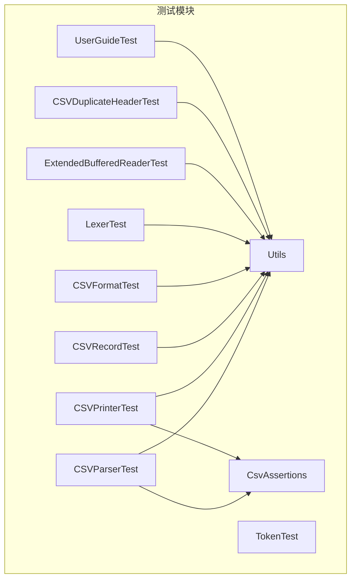
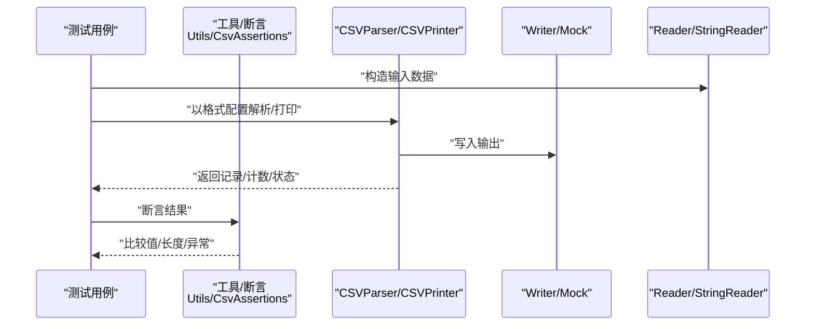
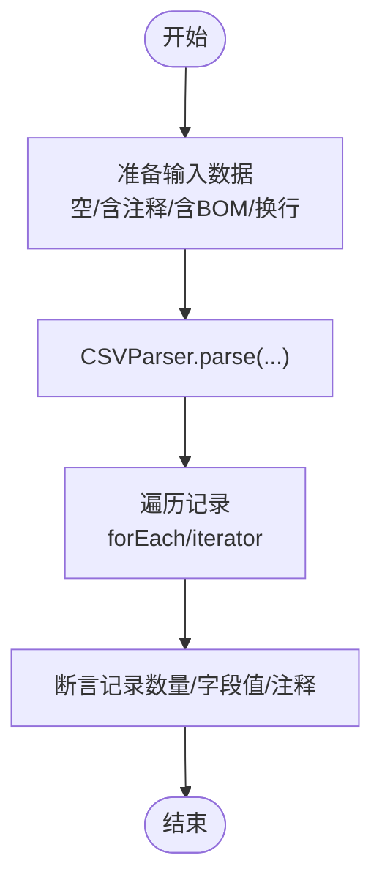
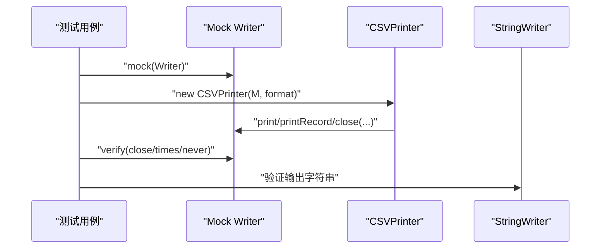
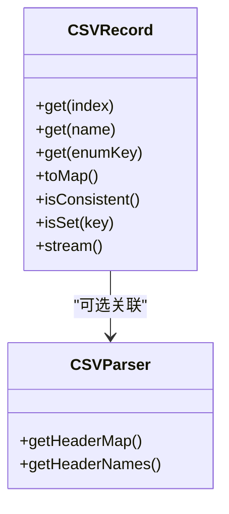
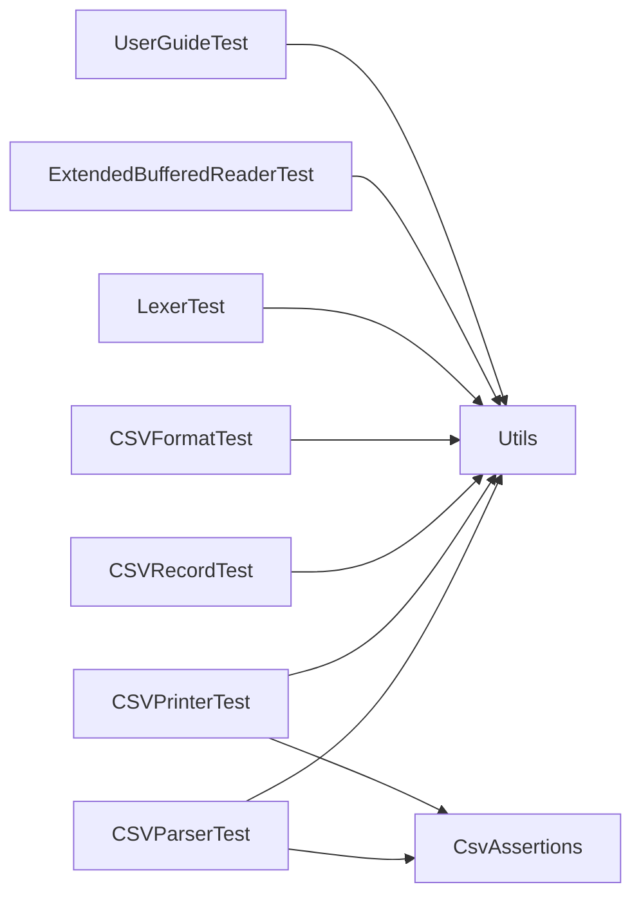

# 单元测试

<cite>
**本文引用的文件**
- [CSVParserTest.java](file://src/test/java/org/apache/commons/csv/CSVParserTest.java)
- [CSVPrinterTest.java](file://src/test/java/org/apache/commons/csv/CSVPrinterTest.java)
- [CSVRecordTest.java](file://src/test/java/org/apache/commons/csv/CSVRecordTest.java)
- [CSVFormatTest.java](file://src/test/java/org/apache/commons/csv/CSVFormatTest.java)
- [LexerTest.java](file://src/test/java/org/apache/commons/csv/LexerTest.java)
- [TokenTest.java](file://src/test/java/org/apache/commons/csv/TokenTest.java)
- [ExtendedBufferedReaderTest.java](file://src/test/java/org/apache/commons/csv/ExtendedBufferedReaderTest.java)
- [CSVDuplicateHeaderTest.java](file://src/test/java/org/apache/commons/csv/CSVDuplicateHeaderTest.java)
- [UserGuideTest.java](file://src/test/java/org/apache/commons/csv/UserGuideTest.java)
- [CsvAssertions.java](file://src/test/java/org/apache/commons/csv/CsvAssertions.java)
- [Utils.java](file://src/test/java/org/apache/commons/csv/Utils.java)
- [CSV-141/csv-141.csv](file://src/test/resources/org/apache/commons/csv/CSV-141/csv-141.csv)
</cite>

## 目录
1. [引言](#引言)
2. [项目结构](#项目结构)
3. [核心组件](#核心组件)
4. [架构总览](#架构总览)
5. [详细组件分析](#详细组件分析)
6. [依赖分析](#依赖分析)
7. [性能考虑](#性能考虑)
8. [故障排查指南](#故障排查指南)
9. [结论](#结论)
10. [附录](#附录)

## 引言
本指南面向Apache Commons CSV项目的单元测试，系统讲解测试设计原则与策略，覆盖以下主题：
- 测试用例组织结构与断言方法
- 测试数据准备与边界条件覆盖
- Mock对象的使用技巧（模拟输入流、Reader、Writer）
- 参数化测试（EnumSource、ValueSource、MethodSource）应用
- 针对CSVRecord字段访问、CSVParser迭代行为、CSVPrinter输出格式的验证
- 错误处理与异常场景测试
- 调试技巧与常见问题解决

## 项目结构
测试模块位于src/test，采用按功能分层的组织方式：
- 核心类测试：CSVParserTest、CSVPrinterTest、CSVRecordTest、CSVFormatTest
- 基础设施测试：LexerTest、TokenTest、ExtendedBufferedReaderTest
- 边界与集成测试：CSVDuplicateHeaderTest、UserGuideTest、各JIRA问题相关测试
- 工具与断言：CsvAssertions、Utils
- 测试资源：CSV-141等样例CSV文件

**图表来源**
- [CSVParserTest.java:1-800](file://src/test/java/org/apache/commons/csv/CSVParserTest.java#L1-L800)
- [CSVPrinterTest.java:1-800](file://src/test/java/org/apache/commons/csv/CSVPrinterTest.java#L1-L800)
- [CSVRecordTest.java:1-390](file://src/test/java/org/apache/commons/csv/CSVRecordTest.java#L1-L390)
- [CSVFormatTest.java:1-200](file://src/test/java/org/apache/commons/csv/CSVFormatTest.java#L1-L200)
- [LexerTest.java:1-200](file://src/test/java/org/apache/commons/csv/LexerTest.java#L1-L200)
- [TokenTest.java:1-51](file://src/test/java/org/apache/commons/csv/TokenTest.java#L1-L51)
- [ExtendedBufferedReaderTest.java:1-200](file://src/test/java/org/apache/commons/csv/ExtendedBufferedReaderTest.java#L1-L200)
- [CSVDuplicateHeaderTest.java:1-337](file://src/test/java/org/apache/commons/csv/CSVDuplicateHeaderTest.java#L1-L337)
- [UserGuideTest.java:1-95](file://src/test/java/org/apache/commons/csv/UserGuideTest.java#L1-L95)
- [CsvAssertions.java:1-30](file://src/test/java/org/apache/commons/csv/CsvAssertions.java#L1-L30)
- [Utils.java:1-68](file://src/test/java/org/apache/commons/csv/Utils.java#L1-L68)

**章节来源**
- [CSVParserTest.java:1-800](file://src/test/java/org/apache/commons/csv/CSVParserTest.java#L1-L800)
- [CSVPrinterTest.java:1-800](file://src/test/java/org/apache/commons/csv/CSVPrinterTest.java#L1-L800)
- [CSVRecordTest.java:1-390](file://src/test/java/org/apache/commons/csv/CSVRecordTest.java#L1-L390)
- [CSVFormatTest.java:1-200](file://src/test/java/org/apache/commons/csv/CSVFormatTest.java#L1-L200)
- [LexerTest.java:1-200](file://src/test/java/org/apache/commons/csv/LexerTest.java#L1-L200)
- [TokenTest.java:1-51](file://src/test/java/org/apache/commons/csv/TokenTest.java#L1-L51)
- [ExtendedBufferedReaderTest.java:1-200](file://src/test/java/org/apache/commons/csv/ExtendedBufferedReaderTest.java#L1-L200)
- [CSVDuplicateHeaderTest.java:1-337](file://src/test/java/org/apache/commons/csv/CSVDuplicateHeaderTest.java#L1-L337)
- [UserGuideTest.java:1-95](file://src/test/java/org/apache/commons/csv/UserGuideTest.java#L1-L95)
- [CsvAssertions.java:1-30](file://src/test/java/org/apache/commons/csv/CsvAssertions.java#L1-L30)
- [Utils.java:1-68](file://src/test/java/org/apache/commons/csv/Utils.java#L1-L68)

## 核心组件
- 断言工具：CsvAssertions提供便捷的值数组断言；Utils提供二维数组与记录列表对比、UTF-8带/不带BOM输入流构造等。
- 解析器与打印器：CSVParserTest与CSVPrinterTest分别覆盖解析与输出的正确性、格式配置与异常处理。
- 记录模型：CSVRecordTest覆盖字段访问、重复头名、序列化、映射转换等。
- 词法与缓冲：LexerTest、TokenTest、ExtendedBufferedReaderTest覆盖换行、注释、回车等边界。
- 格式配置：CSVFormatTest覆盖分隔符、转义、记录分隔符、注释标记等合法性校验。
- 参数化与边界：CSVDuplicateHeaderTest、UserGuideTest等覆盖复杂场景与用户指南示例。

**章节来源**
- [CsvAssertions.java:24-29](file://src/test/java/org/apache/commons/csv/CsvAssertions.java#L24-L29)
- [Utils.java:42-48](file://src/test/java/org/apache/commons/csv/Utils.java#L42-L48)
- [Utils.java:53-63](file://src/test/java/org/apache/commons/csv/Utils.java#L53-L63)

## 架构总览
测试架构围绕“输入数据/格式配置 → 组件执行 → 输出/状态断言”的流水线展开。Mock对象用于隔离外部依赖（如Writer），参数化测试用于覆盖大量组合场景。

**图表来源**
- [CSVParserTest.java:146-203](file://src/test/java/org/apache/commons/csv/CSVParserTest.java#L146-L203)
- [CSVPrinterTest.java:268-302](file://src/test/java/org/apache/commons/csv/CSVPrinterTest.java#L268-L302)
- [Utils.java:42-48](file://src/test/java/org/apache/commons/csv/Utils.java#L42-L48)
- [CsvAssertions.java:26-28](file://src/test/java/org/apache/commons/csv/CsvAssertions.java#L26-L28)

## 详细组件分析

### CSVParser 测试策略与边界条件
- 输入类型与边界
  - 空文件与空字符串：验证nextRecord返回空与getRecords为空列表。
  - 换行符：CR、LF、CRLF均被正确识别与统计首行结束符。
  - 注释与空行：不同格式下忽略空行的行为差异。
  - BOM：通过BOMInputStream与Reader验证头部解析。
- 错误处理
  - 特定格式在特定输入上抛出IO异常，测试期望失败点与异常传播。
- 迭代行为
  - forEach与Iterator遍历一致性；hasNext与nextRecord配合使用。
- 头部与注释
  - 自动/显式头部、多行注释、头部注释提取与存在性判断。

**图表来源**
- [CSVParserTest.java:469-482](file://src/test/java/org/apache/commons/csv/CSVParserTest.java#L469-L482)
- [CSVParserTest.java:278-293](file://src/test/java/org/apache/commons/csv/CSVParserTest.java#L278-L293)
- [CSVParserTest.java:308-400](file://src/test/java/org/apache/commons/csv/CSVParserTest.java#L308-L400)

**章节来源**
- [CSVParserTest.java:146-203](file://src/test/java/org/apache/commons/csv/CSVParserTest.java#L146-L203)
- [CSVParserTest.java:248-275](file://src/test/java/org/apache/commons/csv/CSVParserTest.java#L248-L275)
- [CSVParserTest.java:278-293](file://src/test/java/org/apache/commons/csv/CSVParserTest.java#L278-L293)
- [CSVParserTest.java:469-482](file://src/test/java/org/apache/commons/csv/CSVParserTest.java#L469-L482)
- [CSVParserTest.java:308-400](file://src/test/java/org/apache/commons/csv/CSVParserTest.java#L308-L400)
- [CSV-141/csv-141.csv:1-5](file://src/test/resources/org/apache/commons/csv/CSV-141/csv-141.csv#L1-L5)

### CSVPrinter 测试策略与Mock技巧
- Mock Writer
  - 使用Mockito对Writer进行行为验证：关闭时是否flush、close调用次数与顺序。
- 输出格式
  - 分隔符、引号、转义、记录分隔符、注释、换行符的正确输出。
- 随机化与回归
  - 生成随机数据，打印后解析回检，确保往返一致性。
- JDBC/数据库导出
  - 与H2数据库交互，验证批量导出与大文本处理。

**图表来源**
- [CSVPrinterTest.java:268-302](file://src/test/java/org/apache/commons/csv/CSVPrinterTest.java#L268-L302)
- [CSVPrinterTest.java:345-366](file://src/test/java/org/apache/commons/csv/CSVPrinterTest.java#L345-L366)
- [CSVPrinterTest.java:796-806](file://src/test/java/org/apache/commons/csv/CSVPrinterTest.java#L796-L806)

**章节来源**
- [CSVPrinterTest.java:268-302](file://src/test/java/org/apache/commons/csv/CSVPrinterTest.java#L268-L302)
- [CSVPrinterTest.java:345-366](file://src/test/java/org/apache/commons/csv/CSVPrinterTest.java#L345-L366)
- [CSVPrinterTest.java:796-806](file://src/test/java/org/apache/commons/csv/CSVPrinterTest.java#L796-L806)

### CSVRecord 字段访问与映射
- 字段访问
  - 数字索引、字符串键、枚举键访问；越界与未映射键的异常处理。
- 重复头名
  - 重复头名时取最后值；toMap与isConsistent行为。
- 序列化
  - 反序列化后的状态与行为验证（解析器不可序列化）。
- 列表/流/迭代
  - toList、stream、迭代器行为一致性。

**图表来源**
- [CSVRecordTest.java:128-183](file://src/test/java/org/apache/commons/csv/CSVRecordTest.java#L128-L183)
- [CSVRecordTest.java:186-205](file://src/test/java/org/apache/commons/csv/CSVRecordTest.java#L186-L205)
- [CSVRecordTest.java:266-296](file://src/test/java/org/apache/commons/csv/CSVRecordTest.java#L266-L296)

**章节来源**
- [CSVRecordTest.java:128-183](file://src/test/java/org/apache/commons/csv/CSVRecordTest.java#L128-L183)
- [CSVRecordTest.java:186-205](file://src/test/java/org/apache/commons/csv/CSVRecordTest.java#L186-L205)
- [CSVRecordTest.java:266-296](file://src/test/java/org/apache/commons/csv/CSVRecordTest.java#L266-L296)

### CSVFormat 格式配置与合法性
- 非法配置
  - 分隔符为换行或CR、分隔符与注释/转义冲突、记录分隔符非法等。
- 头部与重复头名
  - 允许/禁止重复头名、空头名、大小写忽略等。
- Builder与equals/hashCode
  - Builder.get()/build()行为差异；对象相等性与哈希一致性。

**章节来源**
- [CSVFormatTest.java:92-131](file://src/test/java/org/apache/commons/csv/CSVFormatTest.java#L92-L131)
- [CSVFormatTest.java:144-195](file://src/test/java/org/apache/commons/csv/CSVFormatTest.java#L144-L195)
- [CSVFormatTest.java:198-240](file://src/test/java/org/apache/commons/csv/CSVFormatTest.java#L198-L240)

### 词法与缓冲区边界
- 词法单元
  - TOKEN、EORECORD、COMMENT、EOF的识别；转义与回退行为。
- 缓冲区
  - 行号统计、peek/read/readLine一致性；CR/LF/CRLF混合场景。
- Token.toString
  - 各类型toString稳定性与内容包含性。

**章节来源**
- [LexerTest.java:74-113](file://src/test/java/org/apache/commons/csv/LexerTest.java#L74-L113)
- [LexerTest.java:123-194](file://src/test/java/org/apache/commons/csv/LexerTest.java#L123-L194)
- [ExtendedBufferedReaderTest.java:47-94](file://src/test/java/org/apache/commons/csv/ExtendedBufferedReaderTest.java#L47-L94)
- [ExtendedBufferedReaderTest.java:108-148](file://src/test/java/org/apache/commons/csv/ExtendedBufferedReaderTest.java#L108-L148)
- [TokenTest.java:33-49](file://src/test/java/org/apache/commons/csv/TokenTest.java#L33-L49)

### 参数化测试与数据驱动
- EnumSource/ValueSource
  - 对枚举类型与数值范围进行参数化覆盖。
- MethodSource
  - 从静态方法生成参数流，覆盖重复头名、缺失列、大小写忽略等复杂组合。
- 随机化测试
  - CSVPrinter中通过随机字符串与随机格式组合，验证往返一致性。

**章节来源**
- [TokenTest.java:33-49](file://src/test/java/org/apache/commons/csv/TokenTest.java#L33-L49)
- [CSVDuplicateHeaderTest.java:53-71](file://src/test/java/org/apache/commons/csv/CSVDuplicateHeaderTest.java#L53-L71)
- [CSVDuplicateHeaderTest.java:84-261](file://src/test/java/org/apache/commons/csv/CSVDuplicateHeaderTest.java#L84-L261)
- [CSVPrinterTest.java:153-157](file://src/test/java/org/apache/commons/csv/CSVPrinterTest.java#L153-L157)

### 用户指南与实际场景
- BOM处理
  - 使用BOMInputStream与Reader处理UTF-8带BOM文件，验证头部解析。
- 临时目录与文件复制
  - 在临时路径生成CSV并读取，确保跨平台兼容性。

**章节来源**
- [UserGuideTest.java:56-92](file://src/test/java/org/apache/commons/csv/UserGuideTest.java#L56-L92)

## 依赖分析
- 组件内聚与耦合
  - 测试用例高度内聚于被测类；Utils与CsvAssertions作为通用工具被广泛复用。
- 外部依赖
  - Commons IO（BOMInputStream、IOUtils）、Commons Lang3（StringUtils）、Mockito（CSVPrinter的Writer Mock）、H2（数据库导出示例）。
- 潜在循环依赖
  - 测试模块内部无循环依赖；工具类为纯工具函数，无反向依赖。

**图表来源**
- [CSVParserTest.java](file://src/test/java/org/apache/commons/csv/CSVParserTest.java#L25)
- [CSVPrinterTest.java:30-34](file://src/test/java/org/apache/commons/csv/CSVPrinterTest.java#L30-L34)
- [CSVRecordTest.java:21-29](file://src/test/java/org/apache/commons/csv/CSVRecordTest.java#L21-L29)
- [CSVFormatTest.java:26-34](file://src/test/java/org/apache/commons/csv/CSVFormatTest.java#L26-L34)
- [LexerTest.java:31-34](file://src/test/java/org/apache/commons/csv/LexerTest.java#L31-L34)
- [ExtendedBufferedReaderTest.java:24-26](file://src/test/java/org/apache/commons/csv/ExtendedBufferedReaderTest.java#L24-L26)
- [UserGuideTest.java](file://src/test/java/org/apache/commons/csv/UserGuideTest.java#L31)

**章节来源**
- [Utils.java:1-68](file://src/test/java/org/apache/commons/csv/Utils.java#L1-L68)
- [CsvAssertions.java:1-30](file://src/test/java/org/apache/commons/csv/CsvAssertions.java#L1-L30)

## 性能考虑
- 随机化测试
  - CSVPrinter中的doRandom通过大量随机组合验证正确性，但注意避免超长运行时间。
- 流式处理
  - 使用Stream接口打印/解析时，结合maxRows限制控制内存占用。
- 缓冲区与I/O
  - 使用StringWriter/StringReader减少磁盘I/O；必要时使用ByteArrayInputStream/OutputStream。

[本节为通用指导，无需列出具体文件来源]

## 故障排查指南
- 断言失败
  - 使用Utils.compare与CsvAssertions.assertValuesEquals定位具体条目与索引。
- BOM相关问题
  - 确认Reader包装为BOMInputStream并指定UTF-8编码；参考UserGuideTest。
- Mock行为验证
  - 关注flush与close调用次数；CSVFormat.autoFlush影响flush时机。
- 参数化用例过多
  - 使用@Disabled或缩小参数范围快速定位问题；逐步放开参数集。
- 大文本与换行
  - 使用ExtendedBufferedReaderTest的行号与peek能力辅助定位换行与缓冲问题。

**章节来源**
- [Utils.java:42-48](file://src/test/java/org/apache/commons/csv/Utils.java#L42-L48)
- [CsvAssertions.java:26-28](file://src/test/java/org/apache/commons/csv/CsvAssertions.java#L26-L28)
- [UserGuideTest.java:56-92](file://src/test/java/org/apache/commons/csv/UserGuideTest.java#L56-L92)
- [CSVPrinterTest.java:294-301](file://src/test/java/org/apache/commons/csv/CSVPrinterTest.java#L294-L301)
- [ExtendedBufferedReaderTest.java:108-148](file://src/test/java/org/apache/commons/csv/ExtendedBufferedReaderTest.java#L108-L148)

## 结论
本测试体系通过：
- 明确的用例组织与断言工具
- 广泛的边界与异常场景覆盖
- Mock与参数化测试的结合
- 与用户指南一致的实际场景
实现了对CSV解析、格式配置与输出打印的全面验证。建议在新增功能时遵循现有断言风格与参数化模式，并补充相应边界与异常测试。

[本节为总结性内容，无需列出具体文件来源]

## 附录

### 测试用例组织与命名规范
- 每个核心类对应一个测试类，方法按功能分组（如“空文件”、“换行符”、“BOM”、“参数化”等）。
- 使用@Test与@ParameterizedTest区分单点与数据驱动测试。
- 使用@Disabled标注暂时跳过的用例或待修复场景。

[本节为通用指导，无需列出具体文件来源]

### 断言方法速查
- 断言数组/列表：Utils.compare、CsvAssertions.assertValuesEquals
- 断言异常：assertThrows
- 断言集合/状态：assertEquals、assertTrue、assertFalse、assertNull、assertNotNull
- 断言Mock行为：verify、times、never

**章节来源**
- [Utils.java:42-48](file://src/test/java/org/apache/commons/csv/Utils.java#L42-L48)
- [CsvAssertions.java:26-28](file://src/test/java/org/apache/commons/csv/CsvAssertions.java#L26-L28)
- [CSVParserTest.java:308-400](file://src/test/java/org/apache/commons/csv/CSVParserTest.java#L308-L400)
- [CSVPrinterTest.java:268-302](file://src/test/java/org/apache/commons/csv/CSVPrinterTest.java#L268-L302)