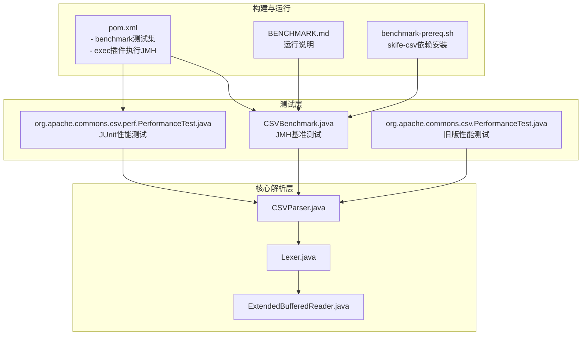
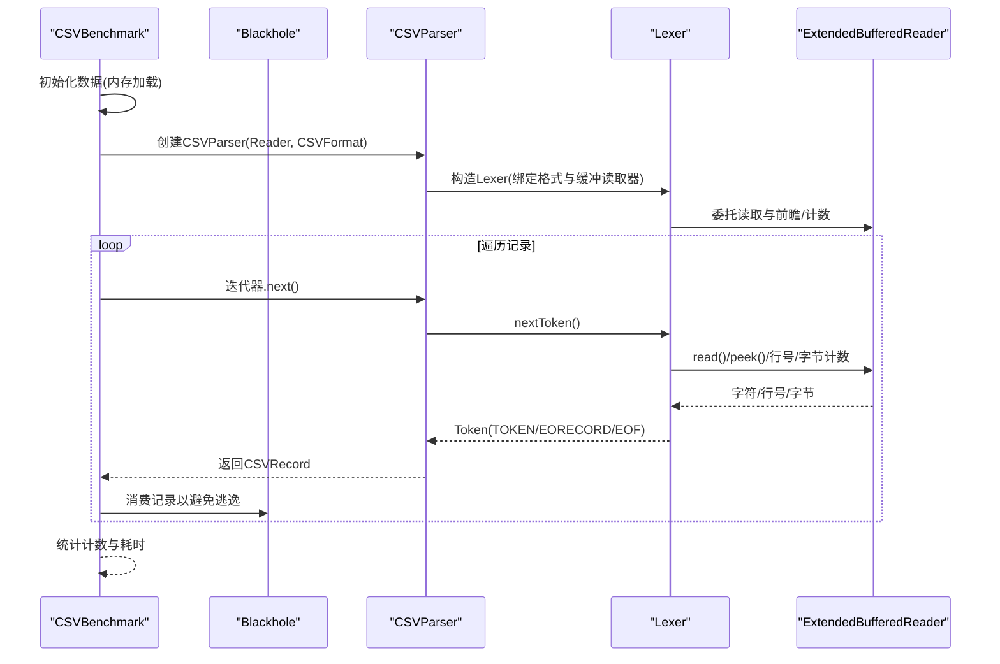
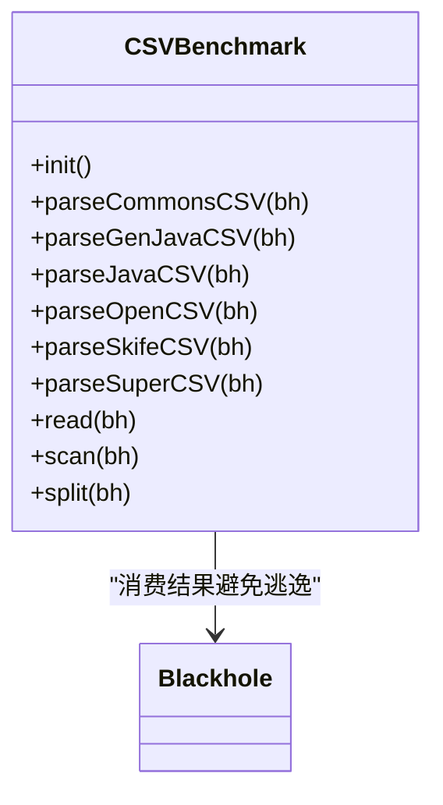
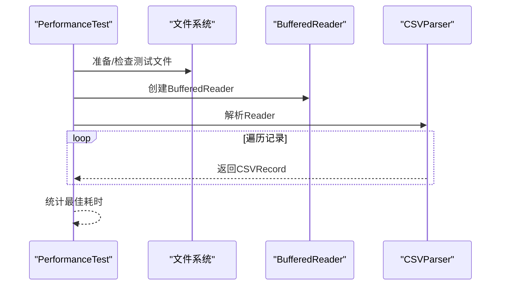
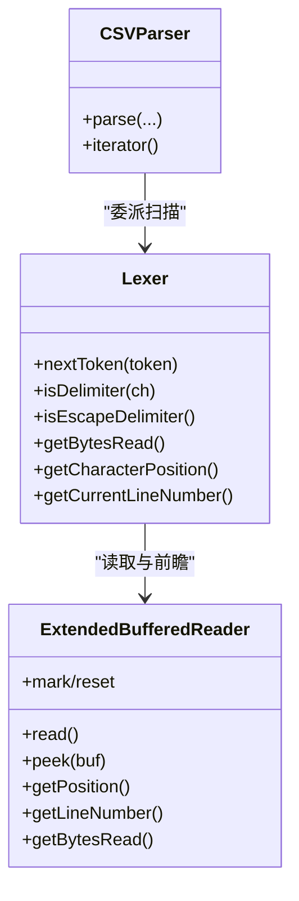
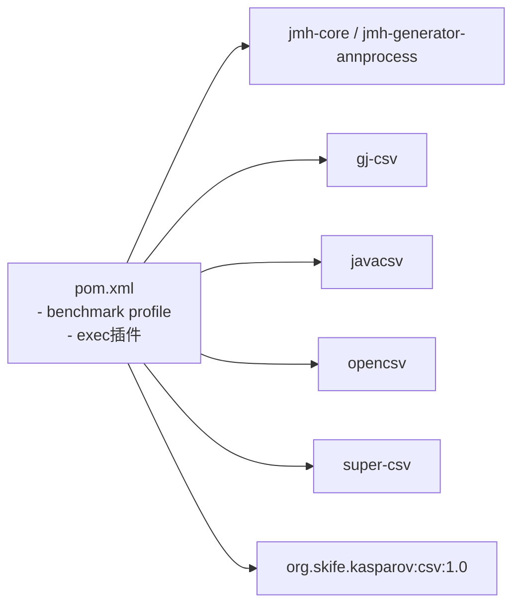

# 性能测试

<cite>
**本文引用的文件**
- [CSVBenchmark.java](file://src/test/java/org/apache/commons/csv/CSVBenchmark.java)
- [PerformanceTest.java（JMH）](file://src/test/java/org/apache/commons/csv/PerformanceTest.java)
- [PerformanceTest.java（JUnit）](file://src/test/java/org/apache/commons/csv/perf/PerformanceTest.java)
- [BENCHMARK.md](file://BENCHMARK.md)
- [benchmark-prereq.sh](file://benchmark-prereq.sh)
- [pom.xml](file://pom.xml)
- [CSVParser.java](file://src/main/java/org/apache/commons/csv/CSVParser.java)
- [Lexer.java](file://src/main/java/org/apache/commons/csv/Lexer.java)
- [ExtendedBufferedReader.java](file://src/main/java/org/apache/commons/csv/ExtendedBufferedReader.java)
</cite>

## 目录
1. [简介](#简介)
2. [项目结构](#项目结构)
3. [核心组件](#核心组件)
4. [架构总览](#架构总览)
5. [详细组件分析](#详细组件分析)
6. [依赖分析](#依赖分析)
7. [性能考量](#性能考量)
8. [故障排查指南](#故障排查指南)
9. [结论](#结论)
10. [附录](#附录)

## 简介
本指南面向Apache Commons CSV的性能测试与调优，系统讲解如何基于仓库内现有的JMH基准测试与独立性能测试套件，设计与实施可复现、可对比的性能评测方案；覆盖解析速度、内存占用、吞吐量与延迟等关键指标；提供大文件流式处理策略、并发测试方法、回归测试流程以及自动化脚本与CI集成建议。读者无需深入源码即可按步骤完成端到端的性能验证。

## 项目结构
仓库中与性能测试直接相关的核心文件与模块如下：
- 基准测试（JMH）：CSVBenchmark.java
- 独立性能测试（JUnit）：org.apache.commons.csv.perf.PerformanceTest
- 性能测试套件（旧版）：org.apache.commons.csv.PerformanceTest
- 文档与运行指引：BENCHMARK.md
- 基准前置安装脚本：benchmark-prereq.sh
- 构建与配置：pom.xml（含benchmark测试集与执行插件）
- 核心CSV解析链路：CSVParser.java、Lexer.java、ExtendedBufferedReader.java

图表来源
- [CSVBenchmark.java:1-229](file://src/test/java/org/apache/commons/csv/CSVBenchmark.java#L1-L229)
- [PerformanceTest.java（JMH）:1-346](file://src/test/java/org/apache/commons/csv/PerformanceTest.java#L1-L346)
- [PerformanceTest.java（JUnit）:1-138](file://src/test/java/org/apache/commons/csv/perf/PerformanceTest.java#L1-L138)
- [pom.xml:352-465](file://pom.xml#L352-L465)
- [BENCHMARK.md:1-80](file://BENCHMARK.md#L1-L80)
- [benchmark-prereq.sh:1-21](file://benchmark-prereq.sh#L1-L21)
- [CSVParser.java:147-200](file://src/main/java/org/apache/commons/csv/CSVParser.java#L147-L200)
- [Lexer.java:32-132](file://src/main/java/org/apache/commons/csv/Lexer.java#L32-L132)
- [ExtendedBufferedReader.java:44-106](file://src/main/java/org/apache/commons/csv/ExtendedBufferedReader.java#L44-L106)

章节来源
- [BENCHMARK.md:18-80](file://BENCHMARK.md#L18-L80)
- [pom.xml:352-465](file://pom.xml#L352-L465)

## 核心组件
- CSVBenchmark：基于JMH的多实现对比基准，包含commons-csv、generation-java、java-csv、open-csv、skife-csv、super-csv、JDK原生读取/扫描/拆分等测试项，统一输出平均耗时，支持预热、fork、线程数与迭代次数配置。
- org.apache.commons.csv.perf.PerformanceTest：JUnit测试，对大文件进行多次最佳耗时统计，验证commons-csv在不同Reader模式下的表现。
- org.apache.commons.csv.PerformanceTest：旧版独立性能测试（非JMH），用于快速对比commons-csv与其他方式的差异。
- 核心解析链路：CSVParser通过Lexer驱动，Lexer再委托ExtendedBufferedReader进行带前瞻与字节跟踪的缓冲读取，形成解析-缓冲-编码长度计算的完整路径。

章节来源
- [CSVBenchmark.java:54-104](file://src/test/java/org/apache/commons/csv/CSVBenchmark.java#L54-L104)
- [PerformanceTest.java（JMH）:303-343](file://src/test/java/org/apache/commons/csv/PerformanceTest.java#L303-L343)
- [PerformanceTest.java（JUnit）:101-136](file://src/test/java/org/apache/commons/csv/perf/PerformanceTest.java#L101-L136)
- [CSVParser.java:147-200](file://src/main/java/org/apache/commons/csv/CSVParser.java#L147-L200)
- [Lexer.java:32-132](file://src/main/java/org/apache/commons/csv/Lexer.java#L32-L132)
- [ExtendedBufferedReader.java:44-106](file://src/main/java/org/apache/commons/csv/ExtendedBufferedReader.java#L44-L106)

## 架构总览
下图展示JMH基准测试的典型调用序列，从CSVBenchmark的各bench方法到CSVParser与底层Lexer/ExtendedBufferedReader的协作。

图表来源
- [CSVBenchmark.java:89-104](file://src/test/java/org/apache/commons/csv/CSVBenchmark.java#L89-L104)
- [CSVParser.java:147-200](file://src/main/java/org/apache/commons/csv/CSVParser.java#L147-L200)
- [Lexer.java:32-132](file://src/main/java/org/apache/commons/csv/Lexer.java#L32-L132)
- [ExtendedBufferedReader.java:194-200](file://src/main/java/org/apache/commons/csv/ExtendedBufferedReader.java#L194-L200)

## 详细组件分析

### CSVBenchmark（JMH基准）
- 设计要点
  - 使用JMH注解控制模式、预热、fork、线程数与输出单位，保证结果稳定可靠。
  - 在@Setup阶段将测试数据一次性加载至内存，排除IO干扰，聚焦解析算法本身。
  - 对比实现包括commons-csv、generation-java、java-csv、open-csv、skife-csv、super-csv及JDK原生读取/扫描/拆分。
- 关键指标
  - 平均耗时（毫秒级），通过BenchmarkMode(AverageTime)与OutputTimeUnit配置。
  - 记录计数校验，使用Blackhole防止JIT优化导致的空循环。
- 大文件策略
  - 通过内存数据源避免磁盘IO波动，适合对比不同解析器的CPU效率。
  - 如需真实磁盘IO场景，可在@Setup中改为文件流并调整缓冲大小。
- 并发测试
  - 可通过@Threads参数扩展到多线程，评估解析器在并发下的稳定性与吞吐。

图表来源
- [CSVBenchmark.java:54-229](file://src/test/java/org/apache/commons/csv/CSVBenchmark.java#L54-L229)

章节来源
- [CSVBenchmark.java:54-104](file://src/test/java/org/apache/commons/csv/CSVBenchmark.java#L54-L104)
- [BENCHMARK.md:35-62](file://BENCHMARK.md#L35-L62)

### org.apache.commons.csv.perf.PerformanceTest（JUnit）
- 设计要点
  - 使用JUnit测试生命周期准备大文件（解压测试数据），多次重复取最佳耗时。
  - 支持两种遍历列的行为开关，便于评估字段访问开销。
- 关键指标
  - 文件解析总耗时、记录条数与行数统计。
  - 最佳耗时作为最终报告指标，减少单次抖动影响。
- 大文件策略
  - 采用BufferedReader+CSVParser组合，适合本地磁盘IO场景。
  - 可替换为NIO Path/BufferedReader或URL输入，验证不同输入源的性能差异。

图表来源
- [PerformanceTest.java（JUnit）:101-136](file://src/test/java/org/apache/commons/csv/perf/PerformanceTest.java#L101-L136)

章节来源
- [PerformanceTest.java（JUnit）:52-136](file://src/test/java/org/apache/commons/csv/perf/PerformanceTest.java#L52-L136)

### org.apache.commons.csv.PerformanceTest（旧版）
- 设计要点
  - 提供多种测试入口（文件读取、切分、解析、路径/URL、Lexer重置/新建、ExtendedBufferedReader对比等）。
  - 自定义统计容器与平均值计算逻辑，便于横向对比。
- 关键指标
  - 各子测试的耗时、行数与字段数，支持跳过首次异常偏移。
- 适用场景
  - 快速定位解析器内部瓶颈（如Lexer行为差异、缓冲策略）。

章节来源
- [PerformanceTest.java（JMH）:117-343](file://src/test/java/org/apache/commons/csv/PerformanceTest.java#L117-L343)

### 核心解析链路（CSVParser/Lexer/ExtendedBufferedReader）
- CSVParser：对外提供工厂方法与迭代接口，内部委派Lexer进行词法扫描。
- Lexer：根据CSVFormat配置判断分隔符、转义、引号、注释等，支持前瞻读取与多字节分隔符匹配。
- ExtendedBufferedReader：提供行号、位置、字节计数与前瞻读取能力，支持编码长度计算，是性能统计与定位的关键。

图表来源
- [CSVParser.java:147-200](file://src/main/java/org/apache/commons/csv/CSVParser.java#L147-L200)
- [Lexer.java:32-132](file://src/main/java/org/apache/commons/csv/Lexer.java#L32-L132)
- [ExtendedBufferedReader.java:44-106](file://src/main/java/org/apache/commons/csv/ExtendedBufferedReader.java#L44-L106)

章节来源
- [CSVParser.java:147-200](file://src/main/java/org/apache/commons/csv/CSVParser.java#L147-L200)
- [Lexer.java:32-132](file://src/main/java/org/apache/commons/csv/Lexer.java#L32-L132)
- [ExtendedBufferedReader.java:44-106](file://src/main/java/org/apache/commons/csv/ExtendedBufferedReader.java#L44-L106)

## 依赖分析
- 测试依赖
  - JMH核心与注解处理器（benchmark profile）
  - 第三方CSV库（generation-java、java-csv、open-csv、super-csv）
  - skife-csv依赖需要手动安装（benchmark-prereq.sh）
- 构建与执行
  - 通过exec-maven-plugin在test阶段启动JMH主类，输出JSON结果文件，便于后续分析。
  - 默认排除某些测试类，避免与基准测试冲突。

图表来源
- [pom.xml:352-465](file://pom.xml#L352-L465)

章节来源
- [pom.xml:352-465](file://pom.xml#L352-L465)
- [benchmark-prereq.sh:19-21](file://benchmark-prereq.sh#L19-L21)

## 性能考量
- 解析速度
  - 使用JMH平均耗时对比不同解析器；对于commons-csv，可通过调整CSVFormat（忽略空白、跳过头记录等）观察对性能的影响。
  - 对于超大文件，优先使用流式迭代而非一次性加载至内存。
- 内存使用
  - commons-csv默认逐记录解析，内存占用与记录数量线性相关；避免不必要的字段访问与字符串拼接。
  - ExtendedBufferedReader支持字节计数与编码长度计算，有助于估算内存压力。
- 吞吐量与延迟
  - 通过@Threads与多轮测量提升统计稳健性；关注第一次迭代的“冷启动”与后续迭代的收敛情况。
  - 将IO从测量中剥离（内存数据源）可更准确评估CPU解析性能。
- 大文件与流式处理
  - 使用NIO Path/BufferedReader或URL输入，结合合适的缓冲大小（参考ExtendedBufferedReader构造参数）。
  - 控制字符集与编码长度计算开销，必要时关闭字节跟踪以减少额外成本。
- 并发性能
  - 通过@Threads设置多线程，观察共享状态（如格式对象）是否需要线程安全封装。
- 回归测试
  - 将关键基准纳入CI，设定阈值告警；对热点变更（词法/缓冲/格式化）增加回归用例。
- 调优建议
  - 缓冲区大小：根据磁盘/网络特征调整缓冲；ExtendedBufferedReader支持指定字符集与字节跟踪。
  - 字符集选择：ISO-8859-1较UTF-8在ASCII场景更快，但需权衡多字节字符。
  - I/O优化：尽量减少中间对象创建（StringBuilder、临时数组），使用迭代器而非收集到列表。

## 故障排查指南
- 依赖缺失
  - skife-csv未安装会导致基准失败，先执行benchmark-prereq.sh完成本地安装。
- 结果不稳定
  - 增加@Warmup与@Measurement迭代次数，或提高@Fork数量；确保系统无其他高负载任务。
- 内存溢出
  - 切换为流式解析，避免一次性读入整个文件；确认CSVFormat配置合理（如跳过头记录、忽略空白）。
- 字节计数异常
  - 确认启用字节跟踪且提供了字符集；ExtendedBufferedReader在构造时决定是否开启编码长度计算。
- CI执行失败
  - 检查exec插件参数与输出目录；确保JMH JSON输出路径存在且可写。

章节来源
- [BENCHMARK.md:24-33](file://BENCHMARK.md#L24-L33)
- [benchmark-prereq.sh:19-21](file://benchmark-prereq.sh#L19-L21)
- [pom.xml:434-461](file://pom.xml#L434-L461)

## 结论
通过CSVBenchmark与JUnit性能测试，可以系统地评估Apache Commons CSV在不同场景下的性能表现。结合核心解析链路的内部机制，能够定位瓶颈并制定针对性优化策略。建议在CI中固化关键基准，建立回归预警，持续保障性能质量。

## 附录

### 基准测试运行与结果解读
- 运行所有基准
  - 使用命令：mvn test -Pbenchmark
- 运行特定基准
  - 使用命令：mvn test -Pbenchmark -Dbenchmark=<名称>
- 结果文件
  - JMH会生成JSON结果文件，便于二次分析与可视化。

章节来源
- [BENCHMARK.md:50-62](file://BENCHMARK.md#L50-L62)
- [pom.xml:434-461](file://pom.xml#L434-L461)

### 性能测试自动化与CI集成
- Maven Profile
  - benchmark profile启用JMH编译与exec插件执行，适合在CI中统一触发。
- 输出与报告
  - JMH JSON输出可用于后续统计分析或生成报告。
- 回归基线
  - 在CI中固定关键基准的阈值，出现回归自动告警。

章节来源
- [pom.xml:352-465](file://pom.xml#L352-L465)