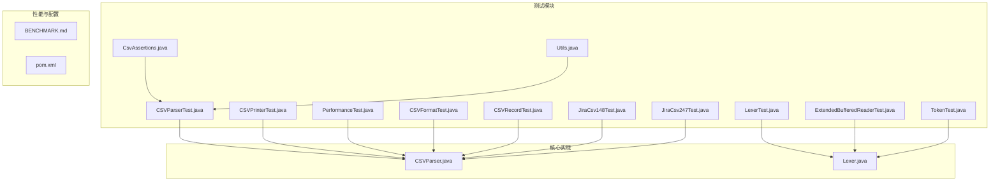
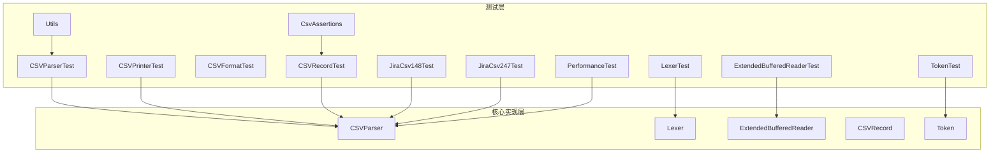
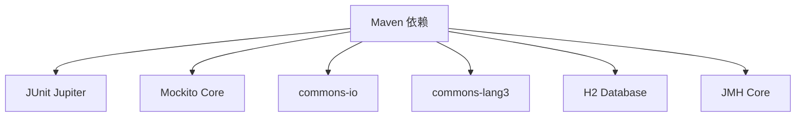

# 测试指南

<cite>
**本文引用的文件**
- [CSVParserTest.java](file://src/test/java/org/apache/commons/csv/CSVParserTest.java)
- [CSVPrinterTest.java](file://src/test/java/org/apache/commons/csv/CSVPrinterTest.java)
- [LexerTest.java](file://src/test/java/org/apache/commons/csv/LexerTest.java)
- [PerformanceTest.java](file://src/test/java/org/apache/commons/csv/PerformanceTest.java)
- [CsvAssertions.java](file://src/test/java/org/apache/commons/csv/CsvAssertions.java)
- [Utils.java](file://src/test/java/org/apache/commons/csv/Utils.java)
- [CSVFormatTest.java](file://src/test/java/org/apache/commons/csv/CSVFormatTest.java)
- [CSVRecordTest.java](file://src/test/java/org/apache/commons/csv/CSVRecordTest.java)
- [ExtendedBufferedReaderTest.java](file://src/test/java/org/apache/commons/csv/ExtendedBufferedReaderTest.java)
- [TokenTest.java](file://src/test/java/org/apache/commons/csv/TokenTest.java)
- [JiraCsv148Test.java](file://src/test/java/org/apache/commons/csv/issues/JiraCsv148Test.java)
- [JiraCsv247Test.java](file://src/test/java/org/apache/commons/csv/issues/JiraCsv247Test.java)
- [CSVParser.java](file://src/main/java/org/apache/commons/csv/CSVParser.java)
- [Lexer.java](file://src/main/java/org/apache/commons/csv/Lexer.java)
- [BENCHMARK.md](file://BENCHMARK.md)
- [pom.xml](file://pom.xml)
</cite>

## 目录
1. [引言](#引言)
2. [项目结构](#项目结构)
3. [核心组件](#核心组件)
4. [架构总览](#架构总览)
5. [详细组件分析](#详细组件分析)
6. [依赖分析](#依赖分析)
7. [性能考量](#性能考量)
8. [故障排查指南](#故障排查指南)
9. [结论](#结论)
10. [附录](#附录)

## 引言
本测试指南面向不同层次的开发者，系统化阐述 Apache Commons CSV 的测试策略与实践，覆盖单元测试设计原则、Mock 使用技巧、边界条件测试、性能测试（基准测试、内存分析、性能监控）、测试用例设计模式与最佳实践，并给出可直接参考的测试代码路径与测试数据准备方法。同时，结合仓库中的现有测试与性能工具，帮助团队建立高质量、可维护、可扩展的测试体系。

## 项目结构
仓库采用标准 Maven 结构，测试代码集中在 src/test 下，按功能模块组织为多个测试类；性能测试位于独立的测试类中，基准测试文档与脚本位于根目录。

图示来源
- [CSVParserTest.java:1-120](file://src/test/java/org/apache/commons/csv/CSVParserTest.java#L1-L120)
- [CSVPrinterTest.java:1-120](file://src/test/java/org/apache/commons/csv/CSVPrinterTest.java#L1-L120)
- [LexerTest.java:1-120](file://src/test/java/org/apache/commons/csv/LexerTest.java#L1-L120)
- [PerformanceTest.java:1-120](file://src/test/java/org/apache/commons/csv/PerformanceTest.java#L1-L120)
- [CSVFormatTest.java:1-120](file://src/test/java/org/apache/commons/csv/CSVFormatTest.java#L1-L120)
- [CSVRecordTest.java:1-120](file://src/test/java/org/apache/commons/csv/CSVRecordTest.java#L1-L120)
- [ExtendedBufferedReaderTest.java:1-120](file://src/test/java/org/apache/commons/csv/ExtendedBufferedReaderTest.java#L1-L120)
- [TokenTest.java:1-51](file://src/test/java/org/apache/commons/csv/TokenTest.java#L1-L51)
- [CsvAssertions.java:1-30](file://src/test/java/org/apache/commons/csv/CsvAssertions.java#L1-L30)
- [Utils.java:1-68](file://src/test/java/org/apache/commons/csv/Utils.java#L1-L68)
- [CSVParser.java:1-120](file://src/main/java/org/apache/commons/csv/CSVParser.java#L1-L120)
- [Lexer.java:1-120](file://src/main/java/org/apache/commons/csv/Lexer.java#L1-L120)
- [BENCHMARK.md:1-80](file://BENCHMARK.md#L1-L80)
- [pom.xml:1-200](file://pom.xml#L1-L200)

章节来源
- [pom.xml:1-200](file://pom.xml#L1-L200)

## 核心组件
- 解析器 CSVParser：负责从多种输入源读取并解析 CSV，支持流式迭代与一次性加载。
- 词法分析器 Lexer：将输入流分解为标记（TOKEN/EORECORD/COMMENT/EOF），处理转义、注释、分隔符等。
- 工具与断言：CsvAssertions 提供 CSV 值比较断言；Utils 提供二维数组与记录列表对比、UTF-8 输入流构造等辅助。
- 打印器 CSVPrinter：将数据序列化为 CSV 输出，支持格式定制、自动刷新、批处理等。
- 记录 CSVRecord：表示一行数据，支持按索引/名称访问、映射转换、序列化等。
- 扩展缓冲读取器 ExtendedBufferedReader：增强换行统计、预读、字符位置跟踪等能力。
- Token：词法单元类型与内容载体。

章节来源
- [CSVParser.java:1-200](file://src/main/java/org/apache/commons/csv/CSVParser.java#L1-L200)
- [Lexer.java:1-200](file://src/main/java/org/apache/commons/csv/Lexer.java#L1-L200)
- [CsvAssertions.java:1-30](file://src/test/java/org/apache/commons/csv/CsvAssertions.java#L1-L30)
- [Utils.java:1-68](file://src/test/java/org/apache/commons/csv/Utils.java#L1-L68)
- [CSVRecordTest.java:1-120](file://src/test/java/org/apache/commons/csv/CSVRecordTest.java#L1-L120)
- [ExtendedBufferedReaderTest.java:1-120](file://src/test/java/org/apache/commons/csv/ExtendedBufferedReaderTest.java#L1-L120)
- [TokenTest.java:1-51](file://src/test/java/org/apache/commons/csv/TokenTest.java#L1-L51)

## 架构总览
下图展示测试与核心实现之间的交互关系，以及性能测试入口。

图示来源
- [CSVParserTest.java:1-120](file://src/test/java/org/apache/commons/csv/CSVParserTest.java#L1-L120)
- [LexerTest.java:1-120](file://src/test/java/org/apache/commons/csv/LexerTest.java#L1-L120)
- [CSVFormatTest.java:1-120](file://src/test/java/org/apache/commons/csv/CSVFormatTest.java#L1-L120)
- [CSVRecordTest.java:1-120](file://src/test/java/org/apache/commons/csv/CSVRecordTest.java#L1-L120)
- [CSVPrinterTest.java:1-120](file://src/test/java/org/apache/commons/csv/CSVPrinterTest.java#L1-L120)
- [ExtendedBufferedReaderTest.java:1-120](file://src/test/java/org/apache/commons/csv/ExtendedBufferedReaderTest.java#L1-L120)
- [TokenTest.java:1-51](file://src/test/java/org/apache/commons/csv/TokenTest.java#L1-L51)
- [JiraCsv148Test.java:1-64](file://src/test/java/org/apache/commons/csv/issues/JiraCsv148Test.java#L1-L64)
- [JiraCsv247Test.java:1-86](file://src/test/java/org/apache/commons/csv/issues/JiraCsv247Test.java#L1-L86)
- [CsvAssertions.java:1-30](file://src/test/java/org/apache/commons/csv/CsvAssertions.java#L1-L30)
- [Utils.java:1-68](file://src/test/java/org/apache/commons/csv/Utils.java#L1-L68)
- [PerformanceTest.java:1-120](file://src/test/java/org/apache/commons/csv/PerformanceTest.java#L1-L120)
- [CSVParser.java:1-120](file://src/main/java/org/apache/commons/csv/CSVParser.java#L1-L120)
- [Lexer.java:1-120](file://src/main/java/org/apache/commons/csv/Lexer.java#L1-L120)

## 详细组件分析

### 单元测试策略与设计原则
- 面向对象测试：对 CSVParser、CSVPrinter、CSVRecord 等进行行为驱动测试，验证状态变化与异常路径。
- 参数化测试：使用 JUnit 参数化运行多组输入，如分隔符、注释符、转义符、换行符组合。
- 断言复用：通过 CsvAssertions 与 Utils 统一断言风格，减少重复代码。
- 边界条件优先：重点覆盖空输入、仅空白行、仅注释、尾随数据、不完整 EOF、BOM、多字节字符等。
- 可重现性：通过固定测试数据与资源文件，保证结果可比对。

章节来源
- [CSVParserTest.java:1-200](file://src/test/java/org/apache/commons/csv/CSVParserTest.java#L1-L200)
- [CSVPrinterTest.java:1-200](file://src/test/java/org/apache/commons/csv/CSVPrinterTest.java#L1-L200)
- [LexerTest.java:1-200](file://src/test/java/org/apache/commons/csv/LexerTest.java#L1-L200)
- [CSVRecordTest.java:1-200](file://src/test/java/org/apache/commons/csv/CSVRecordTest.java#L1-L200)
- [CsvAssertions.java:1-30](file://src/test/java/org/apache/commons/csv/CsvAssertions.java#L1-L30)
- [Utils.java:1-68](file://src/test/java/org/apache/commons/csv/Utils.java#L1-L68)

### Mock 使用技巧
- 模拟输出写入器：在 CSVPrinter 测试中使用 Mockito 模拟 Writer，验证 flush/close 行为与调用次数。
- 验证副作用：确认关闭时是否触发 flush 或 close，以及 AutoFlush 开关对行为的影响。
- 与真实组件协作：通过 StringReader/StringWriter 构造轻量输入输出，避免外部依赖。

章节来源
- [CSVPrinterTest.java:268-328](file://src/test/java/org/apache/commons/csv/CSVPrinterTest.java#L268-L328)

### 错误处理与边界条件测试
- EOF 与不完整输入：Lexer 支持宽松/严格 EOF 处理，测试抛出异常或返回 EOF 的两种行为。
- 尾随数据：当不允许尾随数据时，解析应报错；允许时可接受并返回剩余内容。
- 注释与空行：不同格式对注释与空行的处理差异，需分别验证。
- BOM 与编码：BOM 输入流解析、不同字符集下的首行识别。
- 缺失列名：允许缺失列名时的容错行为，否则抛出非法参数异常。

章节来源
- [LexerTest.java:220-230](file://src/test/java/org/apache/commons/csv/LexerTest.java#L220-L230)
- [LexerTest.java:473-483](file://src/test/java/org/apache/commons/csv/LexerTest.java#L473-L483)
- [CSVParserTest.java:240-275](file://src/test/java/org/apache/commons/csv/CSVParserTest.java#L240-L275)
- [JiraCsv247Test.java:40-84](file://src/test/java/org/apache/commons/csv/issues/JiraCsv247Test.java#L40-L84)

### CSV 解析正确性测试
- 记录一致性：CSVRecord 的一致性检查、映射校验、枚举头访问。
- 头部重复与缺失：重复头部取最后值、缺失列名的容错策略。
- 序列化：CSVRecord 的序列化与反序列化行为验证。

章节来源
- [CSVRecordTest.java:88-126](file://src/test/java/org/apache/commons/csv/CSVRecordTest.java#L88-L126)
- [CSVRecordTest.java:186-205](file://src/test/java/org/apache/commons/csv/CSVRecordTest.java#L186-L205)
- [CSVRecordTest.java:266-296](file://src/test/java/org/apache/commons/csv/CSVRecordTest.java#L266-L296)

### CSV 打印正确性测试
- 转义与引号：不同转义符、引号模式、分隔符字符串下的打印行为。
- 自动刷新与关闭：验证 flush/close 行为与 AutoFlush 设置的关系。
- JDBC/数据库场景：通过 H2 数据库模拟批量导出场景。

章节来源
- [CSVPrinterTest.java:345-377](file://src/test/java/org/apache/commons/csv/CSVPrinterTest.java#L345-L377)
- [CSVPrinterTest.java:796-806](file://src/test/java/org/apache/commons/csv/CSVPrinterTest.java#L796-L806)

### 词法分析器测试
- 控制字符转义：回车、换行、制表符、退格等的转义与保留行为。
- 分隔符与多字符分隔符：单字符与多字符分隔符的识别与拼接。
- 忽略空白与空行：不同开关下的空白处理与空行跳过逻辑。
- 注释解析：注释起始符识别与注释块处理。

章节来源
- [LexerTest.java:115-149](file://src/test/java/org/apache/commons/csv/LexerTest.java#L115-L149)
- [LexerTest.java:206-217](file://src/test/java/org/apache/commons/csv/LexerTest.java#L206-L217)
- [LexerTest.java:313-343](file://src/test/java/org/apache/commons/csv/LexerTest.java#L313-L343)
- [LexerTest.java:346-351](file://src/test/java/org/apache/commons/csv/LexerTest.java#L346-L351)

### 性能测试方法
- JMH 基准测试：BENCHMARK.md 描述了基于 JMH 的多实现对比测试，可通过 Maven Profile 运行。
- 独立性能测试：PerformanceTest 提供简单计时与统计，覆盖文件读取、路径解析、URL 解析、词法器重用/新建等场景。
- 内存与吞吐：通过统计行数、字段数、平均耗时评估不同实现与缓冲策略的性能差异。

章节来源
- [BENCHMARK.md:1-80](file://BENCHMARK.md#L1-L80)
- [PerformanceTest.java:117-184](file://src/test/java/org/apache/commons/csv/PerformanceTest.java#L117-L184)
- [PerformanceTest.java:303-343](file://src/test/java/org/apache/commons/csv/PerformanceTest.java#L303-L343)

### 测试用例设计模式与最佳实践
- 固定输入 + 预期输出：使用二维数组与 Utils.compare 对比解析结果。
- 参数化组合：对分隔符、引号、转义、注释、换行等进行笛卡尔组合测试。
- 资源文件驱动：利用 src/test/resources 中的 CSV 文件作为测试数据，便于回归与对比。
- 断言封装：CsvAssertions 统一封装值数组断言，降低重复代码。
- 边界覆盖：空输入、仅空白、仅注释、BOM、多字节字符、不完整 EOF、尾随数据等。

章节来源
- [Utils.java:42-48](file://src/test/java/org/apache/commons/csv/Utils.java#L42-L48)
- [CsvAssertions.java:26-28](file://src/test/java/org/apache/commons/csv/CsvAssertions.java#L26-L28)
- [CSVParserTest.java:308-400](file://src/test/java/org/apache/commons/csv/CSVParserTest.java#L308-L400)

### 测试覆盖率与质量标准
- 覆盖率阈值：pom.xml 中定义了 JaCoCo 的最低覆盖率阈值（类、指令、方法、分支、行、复杂度）。
- 质量门禁：构建默认目标包含 checkstyle、spotbugs、pmd、javadoc 等质量检查，失败即阻断发布。

章节来源
- [pom.xml:123-131](file://pom.xml#L123-L131)
- [pom.xml:138-140](file://pom.xml#L138-L140)

### 持续集成与自动化测试
- CI 系统：GitHub Actions 用于自动化构建与测试。
- 测试命令：通过 Maven Profile 运行基准测试；直接运行 PerformanceTest 类执行性能测试。
- 资源排除：pom.xml 中对测试数据文件进行了 RAT 排除配置，避免许可证告警。

章节来源
- [pom.xml:80-83](file://pom.xml#L80-L83)
- [BENCHMARK.md:50-72](file://BENCHMARK.md#L50-L72)

## 依赖分析
测试依赖主要来自 JUnit 5、Mockito、commons-io、commons-lang3、H2 数据库与 JMH。这些依赖为测试提供了断言、模拟、IO 工具、数据库模拟与基准测试能力。

图示来源
- [pom.xml:31-71](file://pom.xml#L31-L71)

章节来源
- [pom.xml:31-71](file://pom.xml#L31-L71)

## 性能考量
- 选择合适的缓冲策略：ExtendedBufferedReader 的不同读取方式会影响性能。
- 合理使用 AutoFlush：频繁 flush 会显著影响写入性能。
- 词法器重用：在循环解析中重用 Lexer 实例可减少对象分配。
- 输入源优化：优先使用 Reader/Path/URL 等高效输入源，避免不必要的中间对象。
- 基准测试：使用 JMH 进行微基准测试，对比不同实现与参数设置的性能差异。

章节来源
- [PerformanceTest.java:217-263](file://src/test/java/org/apache/commons/csv/PerformanceTest.java#L217-L263)
- [CSVPrinterTest.java:292-302](file://src/test/java/org/apache/commons/csv/CSVPrinterTest.java#L292-L302)

## 故障排查指南
- 解析异常定位：通过 firstEOL、行号、字符位置等信息定位问题；使用 Lexer 的宽松/严格 EOF 策略区分异常与正常结束。
- 输出行为验证：使用 Mockito 验证 Writer 的 flush/close 调用，确认 AutoFlush 设置是否生效。
- 记录一致性：当 headerMap 发生外部修改时，CSVRecord 的一致性检查会失败，需避免在记录生命周期内修改其解析器的头部映射。
- 资源泄漏：确保 CSVParser/CSVPrinter/ExtendedBufferedReader 在 try-with-resources 中正确关闭。

章节来源
- [Lexer.java:104-132](file://src/main/java/org/apache/commons/csv/Lexer.java#L104-L132)
- [CSVPrinterTest.java:268-328](file://src/test/java/org/apache/commons/csv/CSVPrinterTest.java#L268-L328)
- [CSVRecordTest.java:186-205](file://src/test/java/org/apache/commons/csv/CSVRecordTest.java#L186-L205)
- [ExtendedBufferedReaderTest.java:47-94](file://src/test/java/org/apache/commons/csv/ExtendedBufferedReaderTest.java#L47-L94)

## 结论
本指南总结了 Apache Commons CSV 的测试策略与实践，涵盖单元测试、Mock 技巧、边界条件、性能测试与质量标准。建议在日常开发中遵循参数化测试、断言复用、资源文件驱动与覆盖率门槛等最佳实践，配合 CI 与基准测试工具，持续提升代码质量与性能表现。

## 附录
- 测试数据准备：使用 src/test/resources 下的 CSV 文件作为输入，必要时通过 Utils.createUtf8Input 添加 BOM。
- 基准测试运行：参考 BENCHMARK.md，使用 Maven Profile 运行 JMH 基准测试；或直接运行 PerformanceTest 主函数进行性能测试。
- 质量门禁：确保通过 checkstyle、spotbugs、pmd、javadoc 与 JaCoCo 覆盖率检查。

章节来源
- [Utils.java:53-63](file://src/test/java/org/apache/commons/csv/Utils.java#L53-L63)
- [BENCHMARK.md:50-80](file://BENCHMARK.md#L50-L80)
- [pom.xml:123-131](file://pom.xml#L123-L131)