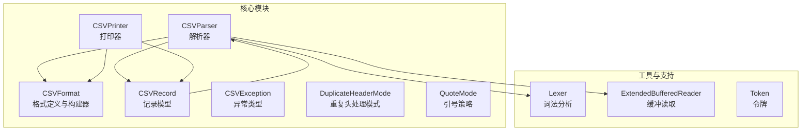
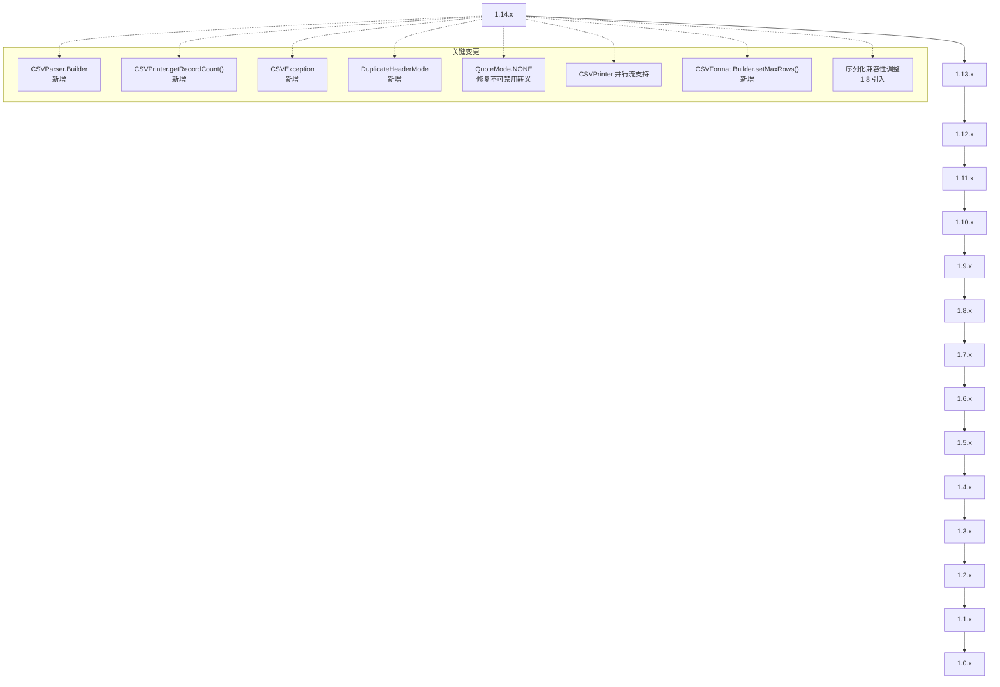
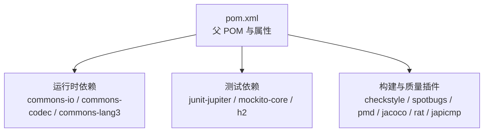

# 版本历史

<cite>
**本文引用的文件**
- [README.md](file://README.md)
- [RELEASE-NOTES.txt](file://RELEASE-NOTES.txt)
- [SECURITY.md](file://SECURITY.md)
- [pom.xml](file://pom.xml)
- [src/changes/changes.xml](file://src/changes/changes.xml)
- [src/main/java/org/apache/commons/csv/CSVFormat.java](file://src/main/java/org/apache/commons/csv/CSVFormat.java)
- [src/main/java/org/apache/commons/csv/CSVParser.java](file://src/main/java/org/apache/commons/csv/CSVParser.java)
- [src/main/java/org/apache/commons/csv/CSVPrinter.java](file://src/main/java/org/apache/commons/csv/CSVPrinter.java)
- [src/main/java/org/apache/commons/csv/CSVRecord.java](file://src/main/java/org/apache/commons/csv/CSVRecord.java)
- [src/main/java/org/apache/commons/csv/CSVException.java](file://src/main/java/org/apache/commons/csv/CSVException.java)
- [src/main/java/org/apache/commons/csv/DuplicateHeaderMode.java](file://src/main/java/org/apache/commons/csv/DuplicateHeaderMode.java)
- [src/main/java/org/apache/commons/csv/QuoteMode.java](file://src/main/java/org/apache/commons/csv/QuoteMode.java)
</cite>

## 目录
1. [简介](#简介)
2. [项目结构](#项目结构)
3. [核心组件](#核心组件)
4. [架构总览](#架构总览)
5. [详细组件分析](#详细组件分析)
6. [依赖分析](#依赖分析)
7. [性能考虑](#性能考虑)
8. [故障排查指南](#故障排查指南)
9. [结论](#结论)
10. [附录](#附录)

## 简介
本文件系统梳理 Apache Commons CSV 的版本演进历史，基于官方发布说明与变更日志，总结各版本的重要更新、新功能、改进与问题修复，并提供向后兼容性说明、升级注意事项、废弃功能迁移指南、版本发布时间表与维护策略、版本选择建议与最佳实践、安全更新与漏洞修复信息，以及 API 变更影响与迁移成本评估。读者可据此了解项目发展轨迹并做出合适的版本选择。

## 项目结构
- 核心模块：org.apache.commons.csv 提供 CSV 解析与打印能力，包含 CSVFormat、CSVParser、CSVPrinter、CSVRecord 等核心类。
- 构建与发布：通过 Maven 管理依赖与构建，使用 commons-parent 父 POM 统一版本与质量控制。
- 文档与变更：RELEASE-NOTES.txt 与 src/changes/changes.xml 记录版本变更；README.md 提供快速入门与下载链接；SECURITY.md 指向 Apache 安全页面。

**图表来源**
- [src/main/java/org/apache/commons/csv/CSVFormat.java](file://src/main/java/org/apache/commons/csv/CSVFormat.java)
- [src/main/java/org/apache/commons/csv/CSVParser.java](file://src/main/java/org/apache/commons/csv/CSVParser.java)
- [src/main/java/org/apache/commons/csv/CSVPrinter.java](file://src/main/java/org/apache/commons/csv/CSVPrinter.java)
- [src/main/java/org/apache/commons/csv/CSVRecord.java](file://src/main/java/org/apache/commons/csv/CSVRecord.java)

**章节来源**
- [README.md:1-120](file://README.md#L1-L120)
- [pom.xml:18-525](file://pom.xml#L18-L525)

## 核心组件
- CSVFormat：定义 CSV 的分隔符、引号、注释、空值字符串、换行符等格式参数，支持 Builder 模式与预设格式（如 EXCEL、RFC4180、POSTGRESQL 等）。
- CSVParser：按指定格式从 Reader/File/URL 等输入源解析 CSV，支持迭代、流式与内存一次性读取。
- CSVPrinter：按指定格式将数据写入 Appendable/Writer，支持单条/多条记录与 ResultSet 打印。
- CSVRecord：表示一行解析结果，提供按索引/名称访问、映射转换、位置信息等。
- CSVException：自 1.12 起用于报告无效输入导致的错误，继承 IOException 子类。
- DuplicateHeaderMode：自 1.10 起支持灵活的重复头处理策略。
- QuoteMode：定义字段引号策略（ALL、ALL_NON_NULL、MINIMAL、NON_NUMERIC、NONE）。

**章节来源**
- [src/main/java/org/apache/commons/csv/CSVFormat.java:182-3205](file://src/main/java/org/apache/commons/csv/CSVFormat.java#L182-L3205)
- [src/main/java/org/apache/commons/csv/CSVParser.java:147-949](file://src/main/java/org/apache/commons/csv/CSVParser.java#L147-L949)
- [src/main/java/org/apache/commons/csv/CSVPrinter.java:80-580](file://src/main/java/org/apache/commons/csv/CSVPrinter.java#L80-L580)
- [src/main/java/org/apache/commons/csv/CSVRecord.java:43-373](file://src/main/java/org/apache/commons/csv/CSVRecord.java#L43-L373)
- [src/main/java/org/apache/commons/csv/CSVException.java:31-47](file://src/main/java/org/apache/commons/csv/CSVException.java#L31-L47)
- [src/main/java/org/apache/commons/csv/DuplicateHeaderMode.java:28-44](file://src/main/java/org/apache/commons/csv/DuplicateHeaderMode.java#L28-L44)
- [src/main/java/org/apache/commons/csv/QuoteMode.java:26-54](file://src/main/java/org/apache/commons/csv/QuoteMode.java#L26-L54)

## 架构总览
下图展示版本演进中的关键变更点与模块交互关系，帮助理解版本间 API 与行为差异。

**图表来源**
- [src/changes/changes.xml:43-434](file://src/changes/changes.xml#L43-L434)
- [RELEASE-NOTES.txt:1-930](file://RELEASE-NOTES.txt#L1-L930)

## 详细组件分析

### 版本 1.14.2（开发中）
- 主要变更：移除 SpotBugs 依赖改为排除过滤；修复网站链接；清理 RAT 插件警告；明确已弃用 API 的行为说明。
- 依赖更新：commons-parent 升级至 97；commons-io、commons-lang3、commons-codec 等依赖更新。

**章节来源**
- [src/changes/changes.xml:43-57](file://src/changes/changes.xml#L43-L57)

### 版本 1.14.1（2025-07-27）
- 修复：并行流打印阻塞问题，改用内部锁替代同步方法；ResultSet 打印逐条写入并加锁。
- 依赖更新：commons-parent、commons-io、commons-lang3、commons-codec 等。

**章节来源**
- [src/changes/changes.xml:58-70](file://src/changes/changes.xml#L58-L70)
- [RELEASE-NOTES.txt:1-47](file://RELEASE-NOTES.txt#L1-L47)

### 版本 1.14.0（2025-03-15）
- 新增：CSVFormat.Builder.setMaxRows(long) 与 getMaxRows()；CSVParser/CSVPrinter/CSVPrinter 支持 maxRows 限制。
- 修复：null 参数映射到默认格式与默认字符集；Token.toString() 空指针风险修复。
- 更新：依赖升级，包括 opencsv、commons-lang3、commons-codec 等。

**章节来源**
- [src/changes/changes.xml:71-96](file://src/changes/changes.xml#L71-L96)
- [RELEASE-NOTES.txt:50-108](file://RELEASE-NOTES.txt#L50-L108)

### 版本 1.13.0（2025-01-08）
- 修复：CSVParser.nextRecord() 抛出 CSVException（继承 IOException）而非多个异常类型；OSGi 导入版本号修正。
- 新增：CSVPrinter.getRecordCount()；CSVParser.Builder 与 builder()；CSVFormat.Builder 实现 Supplier；弃用 CSVFormat.Builder.build()。
- 新增：字节位置跟踪（byte position）。

**章节来源**
- [src/changes/changes.xml:97-113](file://src/changes/changes.xml#L97-L113)
- [RELEASE-NOTES.txt:112-161](file://RELEASE-NOTES.txt#L112-L161)

### 版本 1.12.0（2024-09-21）
- 新增：CSVException（继承 IOException），用于无效输入错误。
- 修复：PMD 升级适配、Javadoc 链接修复、NIO 迁移、转义字符支持、性能提升。
- 更新：依赖升级，包括 commons-lang3、commons-codec、commons-io 等。

**章节来源**
- [src/changes/changes.xml:114-134](file://src/changes/changes.xml#L114-L134)
- [RELEASE-NOTES.txt:164-218](file://RELEASE-NOTES.txt#L164-L218)

### 版本 1.11.0（2024-04-28）
- 新增：Excel 兼容性增强（尾随数据、EOF 宽容）；Javadoc 示例完善；ResultSet Clob/Blob 输出优化。
- 修复：错误消息改善、MongoDB 空首列解析修复、JDBC 资源管理改进。
- 更新：依赖升级，包括 commons-io、commons-lang3、h2、opencsv 等。

**章节来源**
- [src/changes/changes.xml:135-159](file://src/changes/changes.xml#L135-L159)
- [RELEASE-NOTES.txt:222-279](file://RELEASE-NOTES.txt#L222-L279)

### 版本 1.10.0（2023-01-28）
- 新增：CSVRecord.values() 公开；DuplicateHeaderMode；CSVPrinter 并行流支持；头/尾注释访问器。
- 修复：JPMS 自动模块名缺失、多字符分隔符、枚举访问、列表写权限、异常类型统一为 UncheckedIOException。
- 移除：CSVFormat 序列化支持（跨版本不兼容）。

**章节来源**
- [src/changes/changes.xml:160-205](file://src/changes/changes.xml#L160-L205)
- [RELEASE-NOTES.txt:282-361](file://RELEASE-NOTES.txt#L282-L361)

### 版本 1.9.0（2021-07-24）
- 新增：CSVRecord.stream()、CSVParser.stream()；CSVRecord.putIn(Map)；CSVFormat.Builder（弃用 with 方法）；字符串分隔符支持。
- 修复：SpotBugs 替换、Javadoc 错误、测试覆盖率提升、性能优化（词法分析器）。
- 更新：JUnit、Mockito、PMD、SpotBugs、H2 等依赖升级。

**章节来源**
- [src/changes/changes.xml:206-272](file://src/changes/changes.xml#L206-L272)
- [RELEASE-NOTES.txt:364-464](file://RELEASE-NOTES.txt#L364-L464)

### 版本 1.8（2020-02-01）
- 新增：CSVRecord.isSet(int)；修复序列化兼容性（1.8 起不再序列化新字段，2.0 移除序列化）。
- 修复：转义字符、equals/hashCode、空值字符串处理、测试框架升级。

**章节来源**
- [src/changes/changes.xml:273-295](file://src/changes/changes.xml#L273-L295)
- [RELEASE-NOTES.txt:467-521](file://RELEASE-NOTES.txt#L467-L521)

### 版本 1.7（2019-06-01）
- 新增：MongoDB CSV/TSV 预设格式；Clob 支持；从 CSVRecord 获取列顺序头。
- 更新：迁移到 Java 8；H2、Hamcrest、Mockito 升级。

**章节来源**
- [src/changes/changes.xml:296-305](file://src/changes/changes.xml#L296-L305)
- [RELEASE-NOTES.txt:524-568](file://RELEASE-NOTES.txt#L524-L568)

### 版本 1.6（2018-09-22）
- 新增：自动刷新选项；系统记录分隔符；Oracle 预设格式；多迭代器 peek 修复；BufferedReader 冗余创建修复。

**章节来源**
- [src/changes/changes.xml:306-317](file://src/changes/changes.xml#L306-L317)
- [RELEASE-NOTES.txt:572-618](file://RELEASE-NOTES.txt#L572-L618)

### 版本 1.5（2017-09-03）
- 新增：InputStream 工厂方法；File/Path 打印便捷 API；PostgreSQL 预设格式；记录分隔符占位符。
- 更新：平台要求从 Java 6 升级到 7；异常抛出策略调整。

**章节来源**
- [src/changes/changes.xml:318-332](file://src/changes/changes.xml#L318-L332)
- [RELEASE-NOTES.txt:622-671](file://RELEASE-NOTES.txt#L622-L671)

### 版本 1.4（2016-05-28）
- 更新：CSVPrinter.print(Object) GC 友好；允许直接从 CSVFormat 执行打印；移除 ferc.gov 测试。

**章节来源**
- [src/changes/changes.xml:333-337](file://src/changes/changes.xml#L333-L337)
- [RELEASE-NOTES.txt:675-711](file://RELEASE-NOTES.txt#L675-L711)

### 版本 1.3（2016-05-09）
- 新增：首行作为头的快捷方法；枚举头支持；忽略大小写访问；MySQL 空值字符串；Informix 预设格式。
- 更新：参数校验、toString 实现、统一参数验证。

**章节来源**
- [src/changes/changes.xml:338-351](file://src/changes/changes.xml#L338-L351)
- [RELEASE-NOTES.txt:715-756](file://RELEASE-NOTES.txt#L715-L756)

### 版本 1.2（2015-08-24）
- 修复：with* 方法清空头注释；QuoteMode.NONE Javadoc；预设格式枚举。

**章节来源**
- [src/changes/changes.xml:352-356](file://src/changes/changes.xml#L352-L356)
- [RELEASE-NOTES.txt:760-795](file://RELEASE-NOTES.txt#L760-L795)

### 版本 1.1（2014-11-16）
- 修复：Excel 引号模式；头注释；空头处理；toString 实现；参数验证；Map 转换 API；头映射一致性；toMap 边界处理。

**章节来源**
- [src/changes/changes.xml:357-367](file://src/changes/changes.xml#L357-L367)
- [RELEASE-NOTES.txt:799-830](file://RELEASE-NOTES.txt#L799-L830)

### 版本 1.0（2014-08-14）
- 首次发布，提供基础 CSV 解析与打印能力，包含格式定义、解析器、打印器、记录模型与异常体系。

**章节来源**
- [src/changes/changes.xml:368-431](file://src/changes/changes.xml#L368-L431)
- [RELEASE-NOTES.txt:831-930](file://RELEASE-NOTES.txt#L831-L930)

## 依赖分析
- 构建与质量：使用 commons-parent 控制版本；Checkstyle、SpotBugs、PMD、JaCoCo 等插件保障代码质量。
- 运行时依赖：commons-io、commons-codec、commons-lang3；测试依赖 junit-jupiter、mockito-core、h2 等。
- 发布与站点：Maven Assembly、JAR、Surefire、RAT、Javadoc、Checkstyle、PMD、Taglist 等插件。

**图表来源**
- [pom.xml:31-71](file://pom.xml#L31-L71)
- [pom.xml:138-350](file://pom.xml#L138-L350)

**章节来源**
- [pom.xml:18-525](file://pom.xml#L18-L525)

## 性能考虑
- 词法分析器优化：1.9 起对分隔符检测进行缓冲复用与路径优化；1.12 明确性能提升可达 20%。
- 并行流支持：1.10 起 CSVPrinter 对 Stream 增强支持，注意并发写入需加锁。
- 内存占用：CSVParser.getRecords() 会一次性加载到内存，大文件需谨慎使用或配合 maxRows 限制。

**章节来源**
- [src/changes/changes.xml:231-242](file://src/changes/changes.xml#L231-L242)
- [src/changes/changes.xml:126-126](file://src/changes/changes.xml#L126-L126)
- [src/changes/changes.xml:390-390](file://src/changes/changes.xml#L390-L390)

## 故障排查指南
- 异常类型：自 1.12 起使用 CSVException 报告无效输入错误；1.10 起 CSVParser.getRecords() 抛出 UncheckedIOException。
- 错误消息：1.11 改善了错误提示，避免误导；1.12 修复了 QuoteMode.NONE 的错误消息。
- 转义与引号：1.12 修复了转义字符支持；1.10 修复了 QuoteMode.NONE 不可禁用转义的问题。
- 并发与锁：1.14.1 修复并行流打印阻塞，CSVPrinter 使用内部锁；ResultSet 打印逐条写入并加锁。
- 字段访问：CSVRecord.get(Enum) 使用 Enum.name()；CSVRecord.toList() 返回不可变列表。

**章节来源**
- [src/main/java/org/apache/commons/csv/CSVException.java:31-47](file://src/main/java/org/apache/commons/csv/CSVException.java#L31-L47)
- [src/changes/changes.xml:145-151](file://src/changes/changes.xml#L145-L151)
- [src/changes/changes.xml:123-125](file://src/changes/changes.xml#L123-L125)
- [src/changes/changes.xml:60-62](file://src/changes/changes.xml#L60-L62)
- [src/main/java/org/apache/commons/csv/CSVRecord.java:87-145](file://src/main/java/org/apache/commons/csv/CSVRecord.java#L87-L145)

## 结论
- 版本演进以稳定性与兼容性为核心，逐步引入 Builder 模式、并行流支持、重复头处理与异常类型细化。
- 1.10 起开始移除序列化支持，2.0 将完全移除；1.10 起 CSVParser/CSVPrinter/CSVRecord 的 API 更加健壮。
- 建议优先采用 1.14.x 系列以获得最新修复与性能优化；若需严格兼容旧版，可考虑 1.10.x。

## 附录

### 版本发布时间表与维护策略
- 发布周期：版本发布遵循 Apache Commons 项目流程，通过 JIRA CSV 管理缺陷与特性；变更记录在 changes.xml 与 RELEASE-NOTES.txt 中维护。
- 维护策略：使用 commons-parent 统一版本与质量控制；持续升级依赖以修复安全与兼容性问题。

**章节来源**
- [src/changes/changes.xml:43-434](file://src/changes/changes.xml#L43-L434)
- [RELEASE-NOTES.txt:1-930](file://RELEASE-NOTES.txt#L1-L930)
- [pom.xml:20-26](file://pom.xml#L20-L26)

### 向后兼容性与升级注意事项
- 1.10 起移除 CSVFormat 序列化支持；1.8 起 CSVRecord 序列化兼容性调整，2.0 将完全移除序列化。
- 1.10 起 CSVParser.getRecords() 抛出 UncheckedIOException；1.12 起 CSVException 用于无效输入。
- 1.10 起 CSVParser/CSVPrinter/CSVRecord 的构造函数标记弃用，推荐使用 Builder 或静态工厂方法。
- 1.10 起 CSVFormat.Builder 弃用 with 方法，使用 set 方法；1.13 起 CSVFormat.Builder.build() 弃用，使用 get()。

**章节来源**
- [src/changes/changes.xml:175-175](file://src/changes/changes.xml#L175-L175)
- [src/changes/changes.xml:279-279](file://src/changes/changes.xml#L279-L279)
- [src/changes/changes.xml:75-82](file://src/changes/changes.xml#L75-L82)
- [src/changes/changes.xml:312-326](file://src/changes/changes.xml#L312-L326)

### 废弃功能迁移指南与替代方案
- CSVFormat.with* 方法 → 使用 CSVFormat.Builder.set* 方法；CSVFormat.Builder.build() → 使用 get()。
- 直接构造 CSVParser/CSVPrinter → 使用 builder() 或 parse()/print() 静态工厂方法。
- CSVFormat 序列化 → 避免跨版本传输；如需持久化，使用 CSV 文件或 JSON 等替代格式。
- QuoteMode.NONE 不可禁用转义 → 使用 QuoteMode.MINIMAL 或 NONE（当转义字符可用时）。

**章节来源**
- [src/changes/changes.xml:312-326](file://src/changes/changes.xml#L312-L326)
- [src/changes/changes.xml:175-175](file://src/changes/changes.xml#L175-L175)
- [src/changes/changes.xml:123-125](file://src/changes/changes.xml#L123-L125)

### 版本选择建议与最佳实践
- 生产环境：优先选择 1.14.x（最新稳定修复与性能优化）；若受 Java 版本限制，可选 1.10.x（兼容性最佳）。
- 大数据场景：结合 CSVFormat.Builder.setMaxRows() 限制处理行数；使用流式 API（CSVParser.stream()/CSVPrinter.printRecords(Stream)）。
- 并发输出：使用 CSVPrinter.printRecord(Stream) 并注意并行流的线程安全；必要时自行加锁。
- 兼容性：避免依赖序列化；尽量使用 CSV 文件交换数据；关注异常类型变化（CSVException、UncheckedIOException）。

**章节来源**
- [src/changes/changes.xml:765-768](file://src/changes/changes.xml#L765-L768)
- [src/changes/changes.xml:368-368](file://src/changes/changes.xml#L368-L368)
- [src/main/java/org/apache/commons/csv/CSVException.java:31-47](file://src/main/java/org/apache/commons/csv/CSVException.java#L31-L47)

### 安全更新与漏洞修复
- 安全页面：参见 SECURITY.md 指向 Apache 安全页面。
- 依赖升级：定期升级 commons-parent、commons-io、commons-lang3、commons-codec 等以修复已知漏洞与提升安全性。

**章节来源**
- [SECURITY.md:17-18](file://SECURITY.md#L17-L18)
- [src/changes/changes.xml:52-57](file://src/changes/changes.xml#L52-L57)

### API 变更影响与迁移成本
- 构造函数弃用：迁移成本低，仅需替换调用方式；建议使用 builder() 或 parse()/print() 静态工厂方法。
- 异常类型变化：1.12 引入 CSVException，1.10 CSVParser.getRecords() 抛出 UncheckedIOException；迁移成本中等，需调整异常捕获逻辑。
- 序列化移除：迁移成本高，需重构数据持久化方案；建议使用 CSV 文件或 JSON。
- 并行流支持：迁移成本低，但需注意并发写入的线程安全。

**章节来源**
- [src/changes/changes.xml:496-528](file://src/changes/changes.xml#L496-L528)
- [src/changes/changes.xml:75-82](file://src/changes/changes.xml#L75-L82)
- [src/changes/changes.xml:175-175](file://src/changes/changes.xml#L175-L175)
- [src/changes/changes.xml:60-62](file://src/changes/changes.xml#L60-L62)

### 版本比较与特性对比
- 1.14.x：并行流打印修复、maxRows 支持、内部锁优化、依赖升级。
- 1.13.x：CSVParser.Builder、CSVPrinter.getRecordCount()、字节位置跟踪、CSVException 奠基。
- 1.12.x：CSVException、转义修复、性能提升、Javadoc 与 NIO 迁移。
- 1.11.x：Excel 兼容性增强、Clob/Blob 输出优化、错误消息改善。
- 1.10.x：DuplicateHeaderMode、并行流支持、CSVRecord.values()、序列化移除。
- 1.9.x：CSVRecord.stream()/putIn()、CSVFormat.Builder、字符串分隔符支持。
- 1.8：CSVRecord.isSet()、序列化兼容性调整。
- 1.7：MongoDB/TSV 预设格式、Clob 支持。
- 1.6：自动刷新、系统记录分隔符、Oracle 预设格式。
- 1.5：InputStream 工厂方法、PostgreSQL 预设格式。
- 1.4：GC 友好打印、直接从 CSVFormat 打印。
- 1.3：首行头快捷方法、枚举头、忽略大小写、MySQL 空值字符串。
- 1.2：预设格式枚举、Javadoc 修复。
- 1.1：头注释、toString 实现、参数验证、Map 转换 API。
- 1.0：首次发布，基础 CSV 能力。

**章节来源**
- [src/changes/changes.xml:43-434](file://src/changes/changes.xml#L43-L434)
- [RELEASE-NOTES.txt:1-930](file://RELEASE-NOTES.txt#L1-L930)