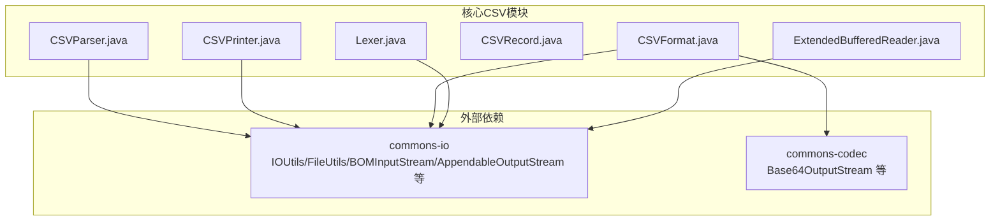
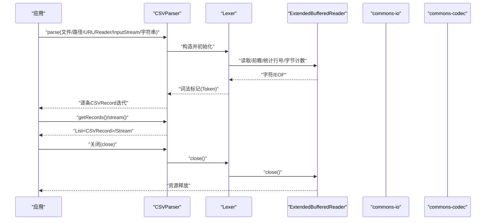
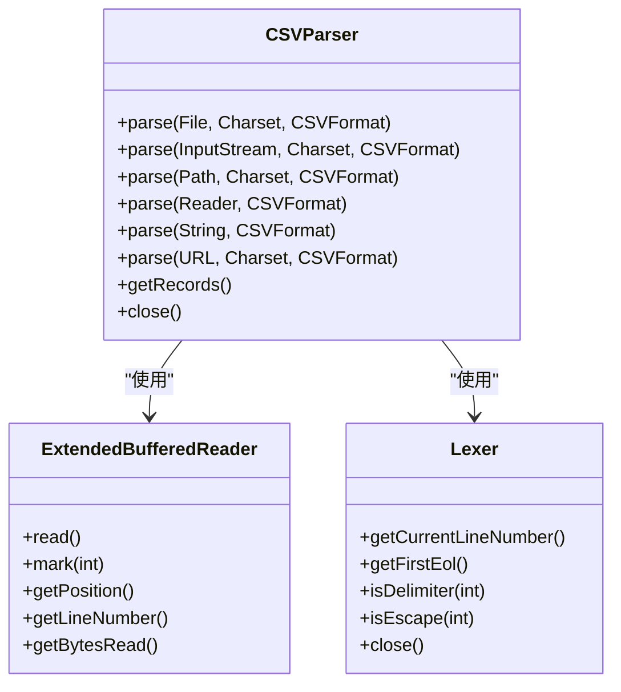
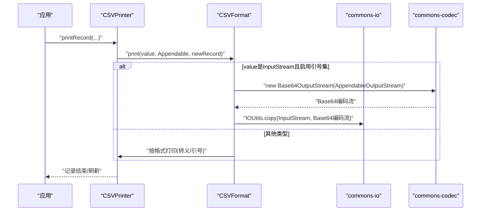
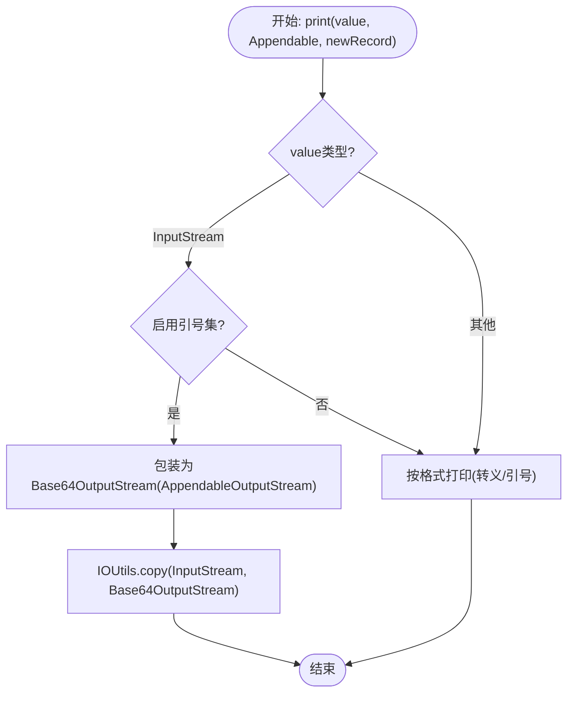
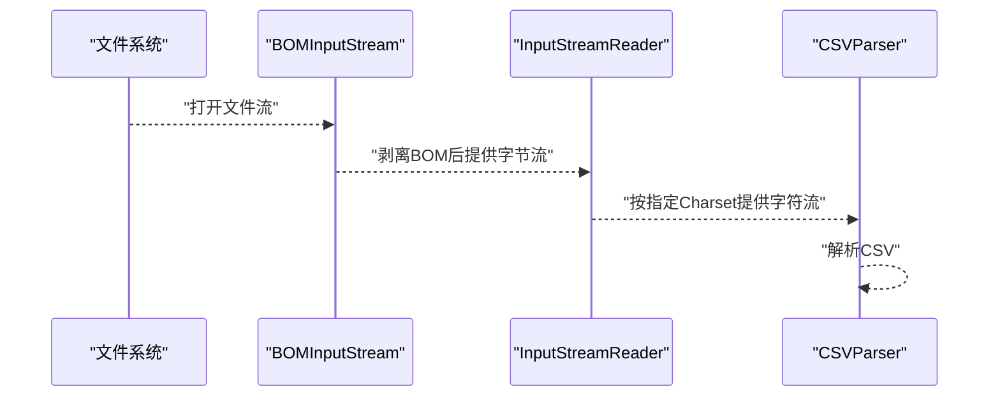
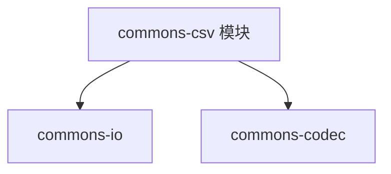

# Apache Commons组件协同

<cite>
**本文引用的文件**
- [pom.xml](file://pom.xml)
- [README.md](file://README.md)
- [CSVParser.java](file://src/main/java/org/apache/commons/csv/CSVParser.java)
- [CSVPrinter.java](file://src/main/java/org/apache/commons/csv/CSVPrinter.java)
- [CSVFormat.java](file://src/main/java/org/apache/commons/csv/CSVFormat.java)
- [ExtendedBufferedReader.java](file://src/main/java/org/apache/commons/csv/ExtendedBufferedReader.java)
- [Lexer.java](file://src/main/java/org/apache/commons/csv/Lexer.java)
- [CSVRecord.java](file://src/main/java/org/apache/commons/csv/CSVRecord.java)
- [PerformanceTest.java](file://src/test/java/org/apache/commons/csv/perf/PerformanceTest.java)
- [UserGuideTest.java](file://src/test/java/org/apache/commons/csv/UserGuideTest.java)
</cite>

## 目录
1. [引言](#引言)
2. [项目结构](#项目结构)
3. [核心组件](#核心组件)
4. [架构总览](#架构总览)
5. [详细组件分析](#详细组件分析)
6. [依赖分析](#依赖分析)
7. [性能考量](#性能考量)
8. [故障排查指南](#故障排查指南)
9. [结论](#结论)
10. [附录](#附录)

## 引言
本指南聚焦于Apache Commons CSV与其他Apache Commons组件（尤其是Apache Commons IO与Apache Commons Codec）的协同工作机制，系统阐述以下主题：
- Commons IO中的流处理类（如FileUtils、IOUtils、BOMInputStream、UnsynchronizedBufferedReader、AppendableOutputStream等）与CSV组件的结合使用，覆盖文件操作、流转换与编码处理。
- Commons Codec在CSV数据编码解码中的应用，重点为Base64输出流的使用场景。
- 组件间依赖关系与集成模式（工厂模式、适配器模式）。
- 实际协同使用示例：如何构建高效的文件处理管道。
- 版本兼容性、依赖冲突解决与性能优化策略。
- 最佳实践建议，帮助开发者选择合适的组件组合以解决具体问题。

## 项目结构
该项目采用标准的Maven多模块布局，核心源码位于src/main/java/org/apache/commons/csv目录下，测试用例位于src/test。根目录的pom.xml声明了对commons-io与commons-codec的依赖，并通过属性统一管理版本号，确保与当前模块版本兼容。

图表来源
- [CSVParser.java:52-54](file://src/main/java/org/apache/commons/csv/CSVParser.java#L52-L54)
- [CSVPrinter.java:41-41](file://src/main/java/org/apache/commons/csv/CSVPrinter.java#L41-L41)
- [CSVFormat.java:44-48](file://src/main/java/org/apache/commons/csv/CSVFormat.java#L44-L48)
- [ExtendedBufferedReader.java:34-35](file://src/main/java/org/apache/commons/csv/ExtendedBufferedReader.java#L34-L35)
- [Lexer.java:22-27](file://src/main/java/org/apache/commons/csv/Lexer.java#L22-L27)

章节来源
- [pom.xml:31-52](file://pom.xml#L31-L52)
- [README.md:67-73](file://README.md#L67-L73)

## 核心组件
- CSVParser：负责从多种输入源（文件、路径、URL、Reader、InputStream、字符串）解析CSV，支持按记录迭代与内存一次性读取，内部使用Lexer与ExtendedBufferedReader进行词法扫描与缓冲读取。
- CSVPrinter：负责将数据以指定格式打印到目标（Writer、Appendable、Path、System.out），支持注释、表头、批量打印与并发安全（锁）。
- CSVFormat：定义CSV格式（分隔符、引号、换行、注释、空值表示、最大行数等），并提供打印与解析的桥接能力；在打印时可使用Base64OutputStream进行二进制数据的Base64编码输出。
- ExtendedBufferedReader：增强的缓冲读取器，支持前瞻读取、行号统计、字符位置跟踪以及可选的字节计数（基于CharsetEncoder）。
- Lexer：词法分析器，根据CSVFormat规则识别分隔符、转义、注释与换行，驱动CSVParser的状态机。
- CSVRecord：单条CSV记录的封装，提供按索引或列名访问的能力，并携带位置与注释信息。

章节来源
- [CSVParser.java:56-147](file://src/main/java/org/apache/commons/csv/CSVParser.java#L56-L147)
- [CSVPrinter.java:43-80](file://src/main/java/org/apache/commons/csv/CSVPrinter.java#L43-L80)
- [CSVFormat.java:50-182](file://src/main/java/org/apache/commons/csv/CSVFormat.java#L50-L182)
- [ExtendedBufferedReader.java:37-44](file://src/main/java/org/apache/commons/csv/ExtendedBufferedReader.java#L37-L44)
- [Lexer.java:29-32](file://src/main/java/org/apache/commons/csv/Lexer.java#L29-L32)
- [CSVRecord.java:31-43](file://src/main/java/org/apache/commons/csv/CSVRecord.java#L31-L43)

## 架构总览
CSV组件与IO/Codec组件的协作体现在以下层面：
- 输入侧：通过commons-io的Reader/InputStream工具（如BOMInputStream、IOUtils）与CSVParser对接，实现BOM处理、大文件复制与流式读取。
- 输出侧：通过commons-io的Writer/Appendable工具与CSVPrinter对接，实现路径写入、批量复制与流式写出；通过commons-codec的Base64OutputStream实现二进制数据的Base64编码输出。
- 内部解析：Lexer与ExtendedBufferedReader共同完成高效、低分配的词法扫描与缓冲读取。

图表来源
- [CSVParser.java:397-447](file://src/main/java/org/apache/commons/csv/CSVParser.java#L397-L447)
- [Lexer.java:54-66](file://src/main/java/org/apache/commons/csv/Lexer.java#L54-L66)
- [ExtendedBufferedReader.java:82-84](file://src/main/java/org/apache/commons/csv/ExtendedBufferedReader.java#L82-L84)

## 详细组件分析

### CSVParser与IO/Codec的协同
- 文件/路径/URL解析：CSVParser提供静态工厂方法，内部通过commons-io的Charset工具与Files/IOUtils进行编码与流转换。
- 流式解析：借助ExtendedBufferedReader与Lexer，实现零拷贝式的前瞻读取与低分配的词法扫描。
- 资源管理：实现Closeable接口，确保底层Reader与BufferedReader正确关闭。

图表来源
- [CSVParser.java:321-447](file://src/main/java/org/apache/commons/csv/CSVParser.java#L321-L447)
- [ExtendedBufferedReader.java:44-84](file://src/main/java/org/apache/commons/csv/ExtendedBufferedReader.java#L44-L84)
- [Lexer.java:32-66](file://src/main/java/org/apache/commons/csv/Lexer.java#L32-L66)

章节来源
- [CSVParser.java:321-447](file://src/main/java/org/apache/commons/csv/CSVParser.java#L321-L447)
- [ExtendedBufferedReader.java:68-84](file://src/main/java/org/apache/commons/csv/ExtendedBufferedReader.java#L68-L84)
- [Lexer.java:54-66](file://src/main/java/org/apache/commons/csv/Lexer.java#L54-L66)

### CSVPrinter与IO/Codec的协同
- 输出目标：支持Writer、Appendable、Path与System.out；内部通过commons-io的AppendableOutputStream适配Appendable到OutputStream。
- 批量打印：支持Iterable、数组与Stream的printRecords/printRecord，内部使用IOStream进行流式适配。
- Base64输出：当值为InputStream且启用引号集时，使用Base64OutputStream进行Base64编码输出，避免将原始二进制直接写入CSV文本。

图表来源
- [CSVPrinter.java:326-377](file://src/main/java/org/apache/commons/csv/CSVPrinter.java#L326-L377)
- [CSVFormat.java:2153-2171](file://src/main/java/org/apache/commons/csv/CSVFormat.java#L2153-L2171)
- [CSVFormat.java:2198-2204](file://src/main/java/org/apache/commons/csv/CSVFormat.java#L2198-L2204)

章节来源
- [CSVPrinter.java:326-377](file://src/main/java/org/apache/commons/csv/CSVPrinter.java#L326-L377)
- [CSVFormat.java:2153-2171](file://src/main/java/org/apache/commons/csv/CSVFormat.java#L2153-L2171)
- [CSVFormat.java:2198-2204](file://src/main/java/org/apache/commons/csv/CSVFormat.java#L2198-L2204)

### CSVFormat与Base64编码
- 场景：当需要将二进制数据以Base64形式嵌入CSV单元格时，CSVFormat在打印阶段自动包装为Base64OutputStream，配合AppendableOutputStream将编码结果写入目标。
- 关键点：仅在启用引号集且值为InputStream时触发Base64编码；否则按常规转义/引号策略处理。

图表来源
- [CSVFormat.java:2153-2171](file://src/main/java/org/apache/commons/csv/CSVFormat.java#L2153-L2171)
- [CSVFormat.java:2198-2204](file://src/main/java/org/apache/commons/csv/CSVFormat.java#L2198-L2204)

章节来源
- [CSVFormat.java:2153-2171](file://src/main/java/org/apache/commons/csv/CSVFormat.java#L2153-L2171)
- [CSVFormat.java:2198-2204](file://src/main/java/org/apache/commons/csv/CSVFormat.java#L2198-L2204)

### 编码处理与BOM支持
- BOM处理：UserGuideTest展示了使用BOMInputStream与InputStreamReader组合处理UTF-8带BOM文件，确保CSV解析的正确性。
- 字符集：CSVParser内部通过commons-io的Charsets工具与Charset参数协作，确保不同编码的正确读取。

图表来源
- [UserGuideTest.java:50-54](file://src/test/java/org/apache/commons/csv/UserGuideTest.java#L50-L54)
- [UserGuideTest.java:80-81](file://src/test/java/org/apache/commons/csv/UserGuideTest.java#L80-L81)

章节来源
- [UserGuideTest.java:50-54](file://src/test/java/org/apache/commons/csv/UserGuideTest.java#L50-L54)
- [UserGuideTest.java:80-81](file://src/test/java/org/apache/commons/csv/UserGuideTest.java#L80-L81)

### 工厂模式与适配器模式的应用
- 工厂模式：CSVParser与CSVFormat均提供静态工厂方法与Builder，简化实例创建与配置。
- 适配器模式：AppendableOutputStream将Appendable适配为OutputStream，使Base64OutputStream能够接入CSV打印流程；IOStream适配Iterable/Stream，提升批量打印的灵活性。

章节来源
- [CSVParser.java:300-302](file://src/main/java/org/apache/commons/csv/CSVParser.java#L300-L302)
- [CSVPrinter.java:369-377](file://src/main/java/org/apache/commons/csv/CSVPrinter.java#L369-L377)
- [CSVFormat.java:2165-2167](file://src/main/java/org/apache/commons/csv/CSVFormat.java#L2165-L2167)

## 依赖分析
- 直接依赖
  - commons-io：用于IO工具（IOUtils、FileUtils、AppendableOutputStream、BOMInputStream、UnsynchronizedBufferedReader等）、函数式适配（IOStream、Uncheck）与字符集工具（Charsets）。
  - commons-codec：用于Base64OutputStream，实现二进制数据的Base64编码输出。
- 版本管理
  - 在pom.xml中通过属性统一管理commons-io与commons-codec版本，确保与当前模块版本兼容。
- OSGi导入
  - pom.xml声明OSGi导入范围，确保运行时可见相关包。

图表来源
- [pom.xml:44-52](file://pom.xml#L44-L52)
- [pom.xml:114-122](file://pom.xml#L114-L122)

章节来源
- [pom.xml:44-52](file://pom.xml#L44-L52)
- [pom.xml:114-122](file://pom.xml#L114-L122)

## 性能考量
- 流式处理：优先使用Reader/InputStream进行解析与打印，避免一次性将整个文件载入内存。
- 复制优化：使用IOUtils.copy进行流复制，减少中间缓冲区的分配与拷贝。
- 编码计数：ExtendedBufferedReader在启用字节跟踪时，利用CharsetEncoder计算每个字符的编码长度，有助于精确的字节位置统计。
- 并发安全：CSVPrinter内部使用ReentrantLock保证多线程下的打印安全。
- 基准测试：PerformanceTest演示了大文件的解析与读取对比，便于评估不同策略的性能表现。

章节来源
- [PerformanceTest.java:52-64](file://src/test/java/org/apache/commons/csv/perf/PerformanceTest.java#L52-L64)
- [PerformanceTest.java:102-110](file://src/test/java/org/apache/commons/csv/perf/PerformanceTest.java#L102-L110)
- [ExtendedBufferedReader.java:134-148](file://src/main/java/org/apache/commons/csv/ExtendedBufferedReader.java#L134-L148)
- [CSVPrinter.java:92-92](file://src/main/java/org/apache/commons/csv/CSVPrinter.java#L92-L92)

## 故障排查指南
- 解析异常
  - CSVException：在输入无效时抛出，定位问题需结合错误的记录号与字符位置。
  - 行号与字符位置：通过ExtendedBufferedReader与Lexer提供的接口获取当前行号与字符位置，辅助定位问题。
- 编码问题
  - BOM导致的解析异常：使用BOMInputStream剥离BOM后再交由CSVParser处理。
  - 字符集不匹配：确保Reader/InputStream与预期Charset一致，必要时使用InputStreamReader显式指定。
- 资源泄漏
  - 确保调用CSVParser/CSVPrinter的close方法，或使用try-with-resources确保资源释放。
- 大文件处理
  - 使用流式解析与打印，避免内存溢出；必要时限制最大行数。

章节来源
- [CSVParser.java:584-586](file://src/main/java/org/apache/commons/csv/CSVParser.java#L584-L586)
- [Lexer.java:122-124](file://src/main/java/org/apache/commons/csv/Lexer.java#L122-L124)
- [ExtendedBufferedReader.java:167-173](file://src/main/java/org/apache/commons/csv/ExtendedBufferedReader.java#L167-L173)
- [UserGuideTest.java:50-54](file://src/test/java/org/apache/commons/csv/UserGuideTest.java#L50-L54)

## 结论
通过将Apache Commons CSV与commons-io、commons-codec协同使用，可以构建高性能、可维护的CSV处理管道。commons-io提供强大的流处理与编码支持，commons-codec提供Base64等编码能力，CSVParser/CSVPrinter则提供灵活的解析与打印接口。遵循工厂与适配器模式、采用流式处理与正确的资源管理策略，能够在保证正确性的同时获得优异的性能表现。

## 附录
- 版本兼容性
  - 当前模块要求Java 8及以上；commons-io与commons-codec版本在pom.xml中统一管理，确保兼容性。
- 依赖冲突解决
  - 若项目中存在多个commons-io/commons-codec版本，请通过Maven依赖树检查并统一到与模块一致的版本。
- 最佳实践
  - 输入侧：优先使用Reader/InputStream并结合BOMInputStream与正确的Charset。
  - 输出侧：优先使用CSVPrinter与CSVFormat，必要时使用Base64OutputStream处理二进制数据。
  - 性能：采用流式处理与IOUtils.copy，避免一次性加载大文件；合理设置最大行数与格式选项。

章节来源
- [README.md:78-81](file://README.md#L78-L81)
- [pom.xml:111-112](file://pom.xml#L111-L112)