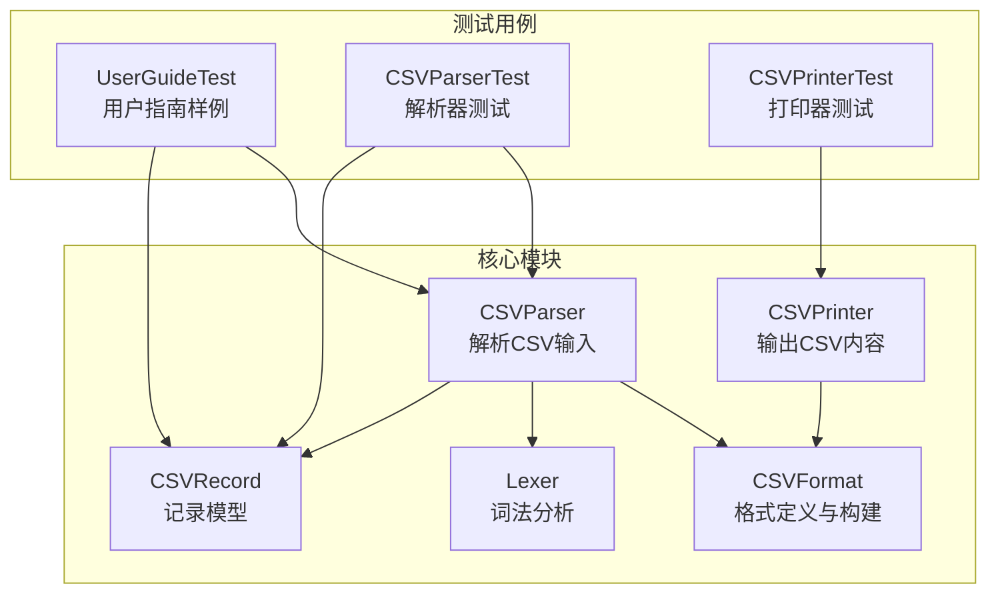
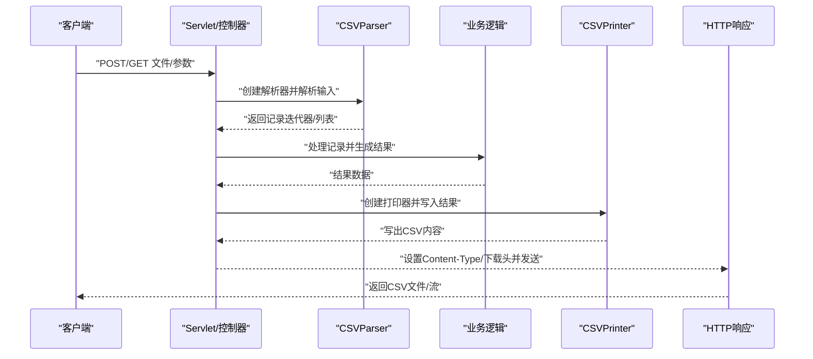
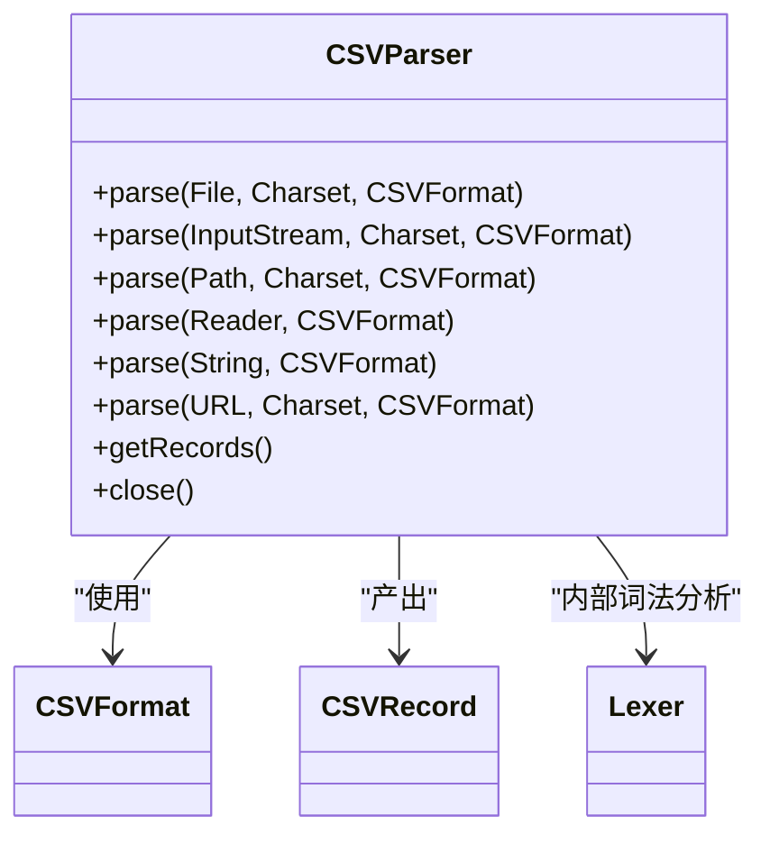
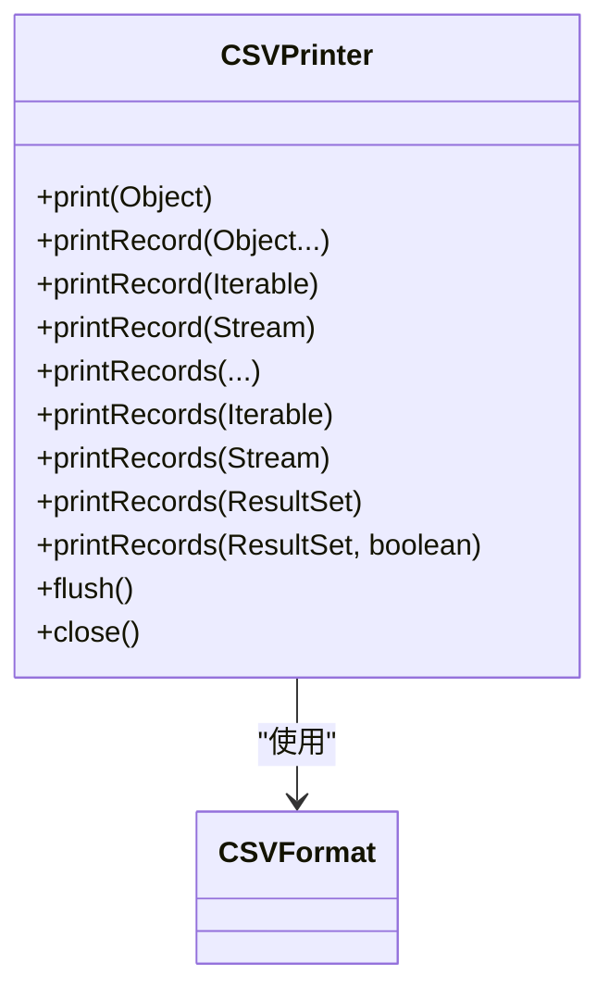
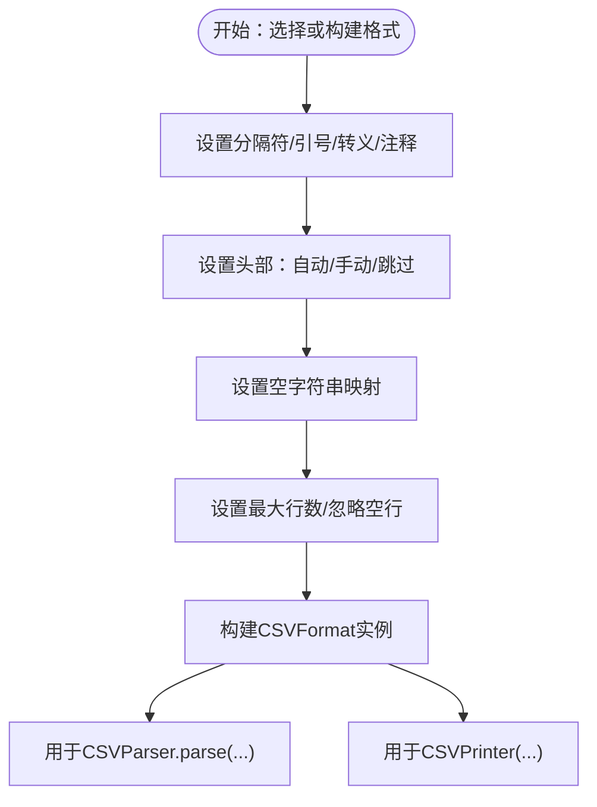
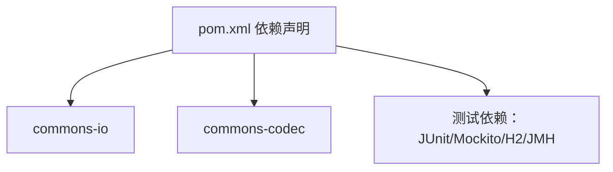

# Web应用集成

<cite>
**本文引用的文件**
- [README.md](file://README.md)
- [pom.xml](file://pom.xml)
- [CSVParser.java](file://src/main/java/org/apache/commons/csv/CSVParser.java)
- [CSVPrinter.java](file://src/main/java/org/apache/commons/csv/CSVPrinter.java)
- [CSVFormat.java](file://src/main/java/org/apache/commons/csv/CSVFormat.java)
- [CSVRecord.java](file://src/main/java/org/apache/commons/csv/CSVRecord.java)
- [Lexer.java](file://src/main/java/org/apache/commons/csv/Lexer.java)
- [UserGuideTest.java](file://src/test/java/org/apache/commons/csv/UserGuideTest.java)
- [CSVParserTest.java](file://src/test/java/org/apache/commons/csv/CSVParserTest.java)
- [CSVPrinterTest.java](file://src/test/java/org/apache/commons/csv/CSVPrinterTest.java)
- [SECURITY.md](file://SECURITY.md)
</cite>

## 目录
1. [简介](#简介)
2. [项目结构](#项目结构)
3. [核心组件](#核心组件)
4. [架构总览](#架构总览)
5. [详细组件分析](#详细组件分析)
6. [依赖分析](#依赖分析)
7. [性能考量](#性能考量)
8. [故障排查指南](#故障排查指南)
9. [结论](#结论)
10. [附录](#附录)

## 简介
本指南面向需要在Web应用中集成Apache Commons CSV的开发者，系统讲解如何在Servlet、Spring MVC、Spring Boot等Web框架中完成CSV文件的上传与下载、REST API的数据处理、WebSocket中的CSV实时传输，并结合Spring Security进行安全控制。文档基于仓库源码，给出可操作的集成步骤、数据流图、错误处理与性能优化建议，帮助快速落地。

## 项目结构
该项目为纯Java库，核心位于org.apache.commons.csv包，包含解析器、打印器、格式定义、记录模型与词法分析器等模块；测试覆盖了典型用例与边界条件。

图表来源
- [CSVParser.java:147-949](file://src/main/java/org/apache/commons/csv/CSVParser.java#L147-L949)
- [CSVPrinter.java:80-580](file://src/main/java/org/apache/commons/csv/CSVPrinter.java#L80-L580)
- [CSVFormat.java:182-3205](file://src/main/java/org/apache/commons/csv/CSVFormat.java#L182-L3205)
- [CSVRecord.java:43-372](file://src/main/java/org/apache/commons/csv/CSVRecord.java#L43-L372)
- [Lexer.java:32-521](file://src/main/java/org/apache/commons/csv/Lexer.java#L32-L521)
- [UserGuideTest.java:38-95](file://src/test/java/org/apache/commons/csv/UserGuideTest.java#L38-L95)
- [CSVParserTest.java:68-200](file://src/test/java/org/apache/commons/csv/CSVParserTest.java#L68-L200)
- [CSVPrinterTest.java:75-200](file://src/test/java/org/apache/commons/csv/CSVPrinterTest.java#L75-L200)

章节来源
- [README.md:43-120](file://README.md#L43-L120)
- [pom.xml:18-71](file://pom.xml#L18-L71)

## 核心组件
- CSVParser：从Reader、File、URL、InputStream或String解析CSV，支持预定义格式与自定义格式，提供迭代器与内存读取能力。
- CSVPrinter：按指定格式打印值、记录与批处理结果集，支持注释、自动刷新与并发安全（内部锁）。
- CSVFormat：格式构建器，支持分隔符、引号、转义、换行、空行忽略、空字符串映射、注释标记、最大行数限制等。
- CSVRecord：解析后的记录对象，支持按索引/名称访问、一致性校验、位置信息与注释。
- Lexer：底层词法分析器，负责字符级扫描、转义、注释识别与行号跟踪。

章节来源
- [CSVParser.java:147-949](file://src/main/java/org/apache/commons/csv/CSVParser.java#L147-L949)
- [CSVPrinter.java:80-580](file://src/main/java/org/apache/commons/csv/CSVPrinter.java#L80-L580)
- [CSVFormat.java:182-3205](file://src/main/java/org/apache/commons/csv/CSVFormat.java#L182-L3205)
- [CSVRecord.java:43-372](file://src/main/java/org/apache/commons/csv/CSVRecord.java#L43-L372)
- [Lexer.java:32-521](file://src/main/java/org/apache/commons/csv/Lexer.java#L32-L521)

## 架构总览
下图展示了Web应用中常见的CSV处理路径：上传文件到后端、解析为记录集合、业务处理、再输出为CSV响应或文件下载。

图表来源
- [CSVParser.java:321-447](file://src/main/java/org/apache/commons/csv/CSVParser.java#L321-L447)
- [CSVPrinter.java:107-123](file://src/main/java/org/apache/commons/csv/CSVPrinter.java#L107-L123)
- [CSVFormat.java:50-132](file://src/main/java/org/apache/commons/csv/CSVFormat.java#L50-L132)

## 详细组件分析

### 组件一：CSVParser（解析）
- 输入来源：File、Path、URL、InputStream、Reader、String。
- 特性：支持预定义格式（Excel、RFC4180等）、自定义格式、头部映射、注释、空字符串映射、最大行数限制、逐条记录迭代与一次性内存读取。
- 错误处理：抛出CSVException与IOException，关闭资源需显式调用close或确保Reader关闭。
- 性能要点：逐条记录迭代适合大文件；一次性读取适合小文件或需要随机访问的场景。

图表来源
- [CSVParser.java:321-447](file://src/main/java/org/apache/commons/csv/CSVParser.java#L321-L447)
- [CSVParser.java:768-770](file://src/main/java/org/apache/commons/csv/CSVParser.java#L768-L770)
- [CSVParser.java:583-586](file://src/main/java/org/apache/commons/csv/CSVParser.java#L583-L586)
- [CSVFormat.java:50-132](file://src/main/java/org/apache/commons/csv/CSVFormat.java#L50-L132)
- [CSVRecord.java:43-372](file://src/main/java/org/apache/commons/csv/CSVRecord.java#L43-L372)
- [Lexer.java:32-521](file://src/main/java/org/apache/commons/csv/Lexer.java#L32-L521)

章节来源
- [CSVParser.java:321-447](file://src/main/java/org/apache/commons/csv/CSVParser.java#L321-L447)
- [CSVParser.java:768-770](file://src/main/java/org/apache/commons/csv/CSVParser.java#L768-L770)
- [CSVParser.java:583-586](file://src/main/java/org/apache/commons/csv/CSVParser.java#L583-L586)

### 组件二：CSVPrinter（打印）
- 输出目标：Writer/Appendable，支持自动刷新、注释、表头打印、批量打印（数组/集合/流/ResultSet）。
- 并发安全：内部使用ReentrantLock保护打印过程。
- JDBC支持：可直接打印ResultSet并处理Clob/Blob字段。

图表来源
- [CSVPrinter.java:199-377](file://src/main/java/org/apache/commons/csv/CSVPrinter.java#L199-L377)
- [CSVPrinter.java:389-578](file://src/main/java/org/apache/commons/csv/CSVPrinter.java#L389-L578)
- [CSVPrinter.java:125-146](file://src/main/java/org/apache/commons/csv/CSVPrinter.java#L125-L146)
- [CSVFormat.java:182-3205](file://src/main/java/org/apache/commons/csv/CSVFormat.java#L182-L3205)

章节来源
- [CSVPrinter.java:199-377](file://src/main/java/org/apache/commons/csv/CSVPrinter.java#L199-L377)
- [CSVPrinter.java:389-578](file://src/main/java/org/apache/commons/csv/CSVPrinter.java#L389-L578)
- [CSVPrinter.java:125-146](file://src/main/java/org/apache/commons/csv/CSVPrinter.java#L125-L146)

### 组件三：CSVFormat（格式）
- 预定义格式：DEFAULT、EXCEL、RFC4180、MYSQL、ORACLE、POSTGRESQL等。
- 构建器：支持设置分隔符、引号、转义、注释、空字符串映射、忽略空行、大小写不敏感头、重复头行为、最大行数、记录分隔符等。
- 头部处理：支持自动解析首行作为头或手动指定头，支持跳过头记录。

图表来源
- [CSVFormat.java:189-326](file://src/main/java/org/apache/commons/csv/CSVFormat.java#L189-L326)
- [CSVFormat.java:50-132](file://src/main/java/org/apache/commons/csv/CSVFormat.java#L50-L132)

章节来源
- [CSVFormat.java:189-326](file://src/main/java/org/apache/commons/csv/CSVFormat.java#L189-L326)
- [CSVFormat.java:50-132](file://src/main/java/org/apache/commons/csv/CSVFormat.java#L50-L132)

### 组件四：CSVRecord（记录）
- 访问方式：按索引、按名称（需有头部映射），支持一致性检查、注释、位置信息。
- 序列化：计划移除序列化支持，版本1.8已移除头映射序列化。

章节来源
- [CSVRecord.java:87-144](file://src/main/java/org/apache/commons/csv/CSVRecord.java#L87-L144)
- [CSVRecord.java:235-238](file://src/main/java/org/apache/commons/csv/CSVRecord.java#L235-L238)

### 组件五：Lexer（词法分析）
- 职责：扫描字符、识别分隔符、转义、注释、换行、空行、位置跟踪。
- 关键点：支持多字符分隔符、转义序列、lenientEOF等特性。

章节来源
- [Lexer.java:54-66](file://src/main/java/org/apache/commons/csv/Lexer.java#L54-L66)
- [Lexer.java:146-164](file://src/main/java/org/apache/commons/csv/Lexer.java#L146-L164)
- [Lexer.java:171-173](file://src/main/java/org/apache/commons/csv/Lexer.java#L171-L173)

## 依赖分析
- 运行时依赖：commons-io、commons-codec（用于流与编码工具）。
- 测试依赖：JUnit、Mockito、commons-lang3、H2数据库、JMH基准测试等。
- OSGi导入：commons-io与commons-codec的版本范围。

图表来源
- [pom.xml:31-71](file://pom.xml#L31-L71)
- [pom.xml:113-122](file://pom.xml#L113-L122)

章节来源
- [pom.xml:31-71](file://pom.xml#L31-L71)
- [pom.xml:113-122](file://pom.xml#L113-L122)

## 性能考量
- 解析策略
  - 大文件：优先逐条记录迭代，避免一次性加载到内存。
  - 小文件：可使用getRecords()一次性读取，便于后续处理。
- 打印策略
  - 使用printRecord/flush减少I/O次数；必要时启用自动刷新。
  - 批量打印（printRecords）可提升吞吐。
- 字符集与BOM
  - 使用带BOM处理的Reader以避免编码问题。
- 最大行数限制
  - 通过CSVFormat.Builder.setMaxRows限制处理行数，防止内存溢出。

章节来源
- [CSVParser.java:768-770](file://src/main/java/org/apache/commons/csv/CSVParser.java#L768-L770)
- [CSVPrinter.java:139-146](file://src/main/java/org/apache/commons/csv/CSVPrinter.java#L139-L146)
- [CSVFormat.java:765-768](file://src/main/java/org/apache/commons/csv/CSVFormat.java#L765-L768)
- [UserGuideTest.java:50-54](file://src/test/java/org/apache/commons/csv/UserGuideTest.java#L50-L54)

## 故障排查指南
- 常见异常
  - CSVException：输入格式非法或解析失败。
  - IOException：I/O错误，如文件不可读、网络异常。
  - IllegalArgumentException：格式参数不一致或头部重复/缺失。
- 定位建议
  - 检查CSVFormat配置（分隔符、引号、转义、空字符串映射、最大行数）。
  - 确保Reader/InputStream正确关闭，或使用try-with-resources。
  - 对于多行值与BOM，确认Reader构造与格式设置。
- 单元测试参考
  - 解析器测试覆盖多种边界情况与错误场景。
  - 打印器测试覆盖随机生成数据与ResultSet打印。

章节来源
- [CSVParser.java:601-656](file://src/main/java/org/apache/commons/csv/CSVParser.java#L601-L656)
- [CSVParserTest.java:146-200](file://src/test/java/org/apache/commons/csv/CSVParserTest.java#L146-L200)
- [CSVPrinterTest.java:121-157](file://src/test/java/org/apache/commons/csv/CSVPrinterTest.java#L121-L157)

## 结论
Apache Commons CSV提供了简洁而强大的CSV处理能力，配合Web框架可轻松实现文件上传下载、REST API数据交换与WebSocket实时传输。通过合理选择解析/打印策略、严格配置格式、妥善处理异常与资源释放，可在保证性能的同时获得良好的可维护性与安全性。

## 附录

### 在Servlet中集成CSV
- 文件上传
  - 使用标准multipart解析获取文件输入流，传入CSVParser.parse(InputStream, Charset, CSVFormat)。
  - 解析完成后逐条处理记录，必要时使用getRecords()一次性读取。
- 下载
  - 使用CSVPrinter将业务结果写入响应输出流，设置Content-Type为text/csv或application/octet-stream。
  - 设置Content-Disposition为附件并提供文件名。

章节来源
- [CSVParser.java:348-351](file://src/main/java/org/apache/commons/csv/CSVParser.java#L348-L351)
- [CSVPrinter.java:107-123](file://src/main/java/org/apache/commons/csv/CSVPrinter.java#L107-L123)

### 在Spring MVC/Spring Boot中集成CSV
- 控制器层
  - 接收MultipartFile或JSON参数，转换为Reader/InputStream。
  - 使用@RequestBody/@ResponseBody处理CSV文本或对象列表。
- 服务层
  - 通过CSVParser解析输入，CSVPrinter输出结果。
- 配置
  - Content-Type：application/csv或text/csv；下载时使用application/octet-stream。
  - 跨域：在WebMvcConfigurer中配置CORS。
  - 缓存：根据业务需求设置Cache-Control与ETag。

章节来源
- [CSVParser.java:397-399](file://src/main/java/org/apache/commons/csv/CSVParser.java#L397-L399)
- [CSVPrinter.java:107-123](file://src/main/java/org/apache/commons/csv/CSVPrinter.java#L107-L123)

### REST API中的CSV处理
- 请求参数解析
  - 表单上传：multipart/form-data，解析文件流。
  - JSON/文本：application/json或text/plain，转换为Reader。
- 响应格式化
  - 文本CSV：text/csv；二进制CSV：application/octet-stream。
  - 分页/流式：使用分块输出或分页查询，避免一次性加载全部数据。
- Content-Type配置
  - 明确设置响应头Content-Type与Content-Disposition。

章节来源
- [CSVParser.java:321-447](file://src/main/java/org/apache/commons/csv/CSVParser.java#L321-L447)
- [CSVPrinter.java:107-123](file://src/main/java/org/apache/commons/csv/CSVPrinter.java#L107-L123)

### WebSocket中的CSV处理
- 消息格式
  - 文本帧：直接发送CSV片段或JSON包装的CSV数据。
  - 二进制帧：发送字节流，前端自行解码。
- 状态管理
  - 服务端维护会话状态，按顺序推送CSV分片，前端拼接显示。
  - 异常时发送错误消息并终止会话。

章节来源
- [CSVParser.java:321-447](file://src/main/java/org/apache/commons/csv/CSVParser.java#L321-L447)
- [CSVPrinter.java:199-377](file://src/main/java/org/apache/commons/csv/CSVPrinter.java#L199-L377)

### Spring Security集成与安全考虑
- 文件访问控制
  - 通过@PreAuthorize/@PostAuthorize限制CSV上传/下载权限。
  - 仅允许受信任的文件类型与大小。
- 数据验证
  - 后端对CSV格式进行严格校验，拒绝异常格式。
  - 对外部输入进行白名单过滤与长度限制。
- 安全公告
  - 参考Apache Commons安全页面获取漏洞修复与最佳实践。

章节来源
- [SECURITY.md:17-18](file://SECURITY.md#L17-L18)

### 跨域、缓存与性能优化
- 跨域
  - 在WebMvcConfigurer中添加CORS配置，允许特定Origin与方法。
- 缓存
  - 对静态CSV文件设置ETag与Last-Modified；对动态CSV设置短生命周期缓存。
- 性能
  - 大文件采用流式解析与分块输出；限制最大行数；避免不必要的对象拷贝。

章节来源
- [CSVFormat.java:765-768](file://src/main/java/org/apache/commons/csv/CSVFormat.java#L765-L768)
- [CSVParser.java:768-770](file://src/main/java/org/apache/commons/csv/CSVParser.java#L768-L770)
- [CSVPrinter.java:139-146](file://src/main/java/org/apache/commons/csv/CSVPrinter.java#L139-L146)