# 批处理集成

<cite>
**本文档引用的文件**
- [README.md](file://README.md)
- [pom.xml](file://pom.xml)
- [CSVParser.java](file://src/main/java/org/apache/commons/csv/CSVParser.java)
- [CSVPrinter.java](file://src/main/java/org/apache/commons/csv/CSVPrinter.java)
- [CSVFormat.java](file://src/main/java/org/apache/commons/csv/CSVFormat.java)
- [CSVRecord.java](file://src/main/java/org/apache/commons/csv/CSVRecord.java)
- [Lexer.java](file://src/main/java/org/apache/commons/csv/Lexer.java)
- [ExtendedBufferedReader.java](file://src/main/java/org/apache/commons/csv/ExtendedBufferedReader.java)
- [Constants.java](file://src/main/java/org/apache/commons/csv/Constants.java)
- [PerformanceTest.java](file://src/test/java/org/apache/commons/csv/PerformanceTest.java)
- [UserGuideTest.java](file://src/test/java/org/apache/commons/csv/UserGuideTest.java)
- [BENCHMARK.md](file://BENCHMARK.md)
</cite>

## 目录
1. [简介](#简介)
2. [项目结构](#项目结构)
3. [核心组件](#核心组件)
4. [架构概览](#架构概览)
5. [详细组件分析](#详细组件分析)
6. [大数据框架集成](#大数据框架集成)
7. [并发处理策略](#并发处理策略)
8. [任务调度系统集成](#任务调度系统集成)
9. [流式处理管道](#流式处理管道)
10. [内存管理与性能优化](#内存管理与性能优化)
11. [完整批处理应用示例](#完整批处理应用示例)
12. [错误处理与监控](#错误处理与监控)
13. [结论](#结论)

## 简介

Apache Commons CSV 是一个功能强大且高效的 CSV 文件处理库，专为大数据环境设计。该库提供了简洁的 API 接口，支持多种 CSV 格式规范，包括 RFC4180、Excel、MySQL 等预定义格式，并具备出色的性能表现和内存管理能力。

本指南将详细介绍如何在各种大数据框架中集成 Apache Commons CSV 进行批处理操作，包括 Hadoop、Spark、Flink 等主流大数据平台。同时涵盖并发处理策略、任务调度集成、流式处理管道设计、内存管理和性能优化最佳实践。

## 项目结构

Apache Commons CSV 项目采用标准的 Maven 项目结构，主要包含以下核心模块：

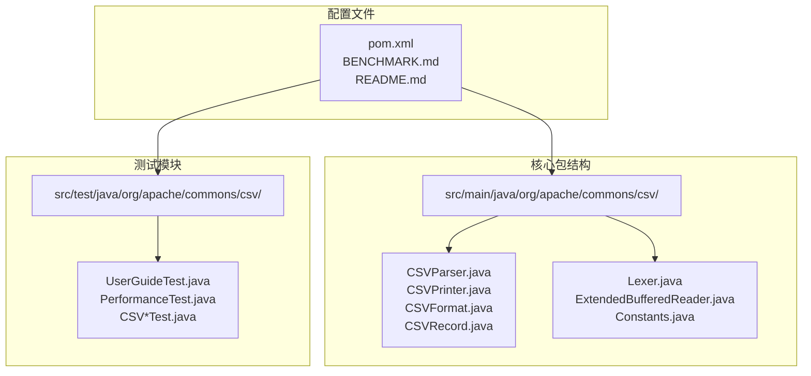
```mermaid
graph TB
subgraph "核心包结构"
A[src/main/java/org/apache/commons/csv/]
B[CSVParser.java<br/>CSVPrinter.java<br/>CSVFormat.java<br/>CSVRecord.java]
C[Lexer.java<br/>ExtendedBufferedReader.java<br/>Constants.java]
end
subgraph "测试模块"
D[src/test/java/org/apache/commons/csv/]
E[UserGuideTest.java<br/>PerformanceTest.java<br/>CSV*Test.java]
end
subgraph "配置文件"
F[pom.xml<br/>BENCHMARK.md<br/>README.md]
end
A --> B
A --> C
D --> E
F --> A
F --> D
```

**图表来源**
- [pom.xml:1-525](file://pom.xml#L1-L525)
- [README.md:1-120](file://README.md#L1-L120)

**章节来源**
- [pom.xml:1-525](file://pom.xml#L1-L525)
- [README.md:1-120](file://README.md#L1-L120)

## 核心组件

### CSV 解析器 (CSVParser)

CSVParser 是整个库的核心组件，负责将 CSV 数据解析为记录对象。它支持多种输入源，包括文件、字符串、URL 和 Reader 对象。

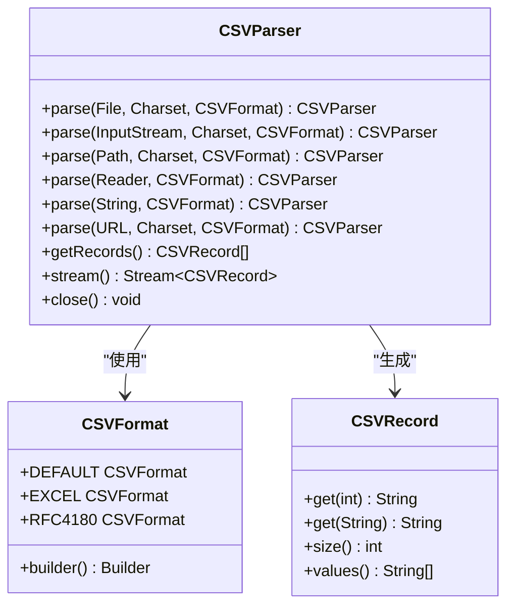
```mermaid
classDiagram
class CSVParser {
+parse(File, Charset, CSVFormat) CSVParser
+parse(InputStream, Charset, CSVFormat) CSVParser
+parse(Path, Charset, CSVFormat) CSVParser
+parse(Reader, CSVFormat) CSVParser
+parse(String, CSVFormat) CSVParser
+parse(URL, Charset, CSVFormat) CSVParser
+getRecords() CSVRecord[]
+stream() Stream~CSVRecord~
+close() void
}
class CSVFormat {
+DEFAULT CSVFormat
+EXCEL CSVFormat
+RFC4180 CSVFormat
+builder() Builder
}
class CSVRecord {
+get(int) String
+get(String) String
+size() int
+values() String[]
}
CSVParser --> CSVFormat : "使用"
CSVParser --> CSVRecord : "生成"
```

**图表来源**
- [CSVParser.java:147-949](file://src/main/java/org/apache/commons/csv/CSVParser.java#L147-L949)
- [CSVFormat.java:182-3205](file://src/main/java/org/apache/commons/csv/CSVFormat.java#L182-L3205)
- [CSVRecord.java:43-372](file://src/main/java/org/apache/commons/csv/CSVRecord.java#L43-L372)

### CSV 打印器 (CSVPrinter)

CSVPrinter 提供了将数据结构化输出为 CSV 格式的功能，支持多种输出目标和格式选项。

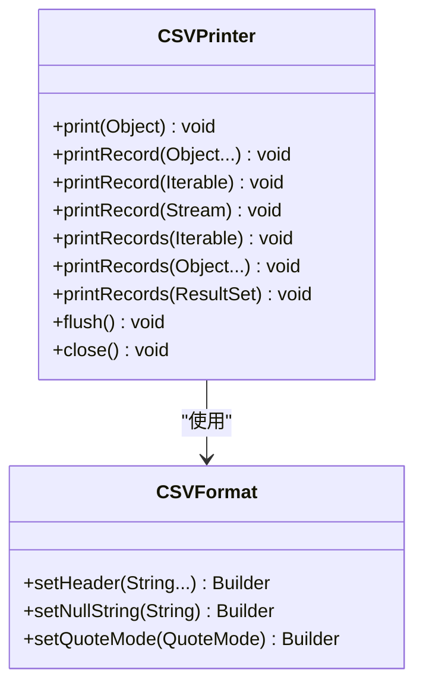
```mermaid
classDiagram
class CSVPrinter {
+print(Object) void
+printRecord(Object...) void
+printRecord(Iterable) void
+printRecord(Stream) void
+printRecords(Iterable) void
+printRecords(Object...) void
+printRecords(ResultSet) void
+flush() void
+close() void
}
class CSVFormat {
+setHeader(String...) Builder
+setNullString(String) Builder
+setQuoteMode(QuoteMode) Builder
}
CSVPrinter --> CSVFormat : "使用"
```

**图表来源**
- [CSVPrinter.java:80-580](file://src/main/java/org/apache/commons/csv/CSVPrinter.java#L80-L580)
- [CSVFormat.java:189-800](file://src/main/java/org/apache/commons/csv/CSVFormat.java#L189-L800)

**章节来源**
- [CSVParser.java:147-949](file://src/main/java/org/apache/commons/csv/CSVParser.java#L147-L949)
- [CSVPrinter.java:80-580](file://src/main/java/org/apache/commons/csv/CSVPrinter.java#L80-L580)
- [CSVFormat.java:182-3205](file://src/main/java/org/apache/commons/csv/CSVFormat.java#L182-L3205)

## 架构概览

Apache Commons CSV 采用了分层架构设计，从底层的字节流处理到高层的应用接口，形成了清晰的抽象层次。

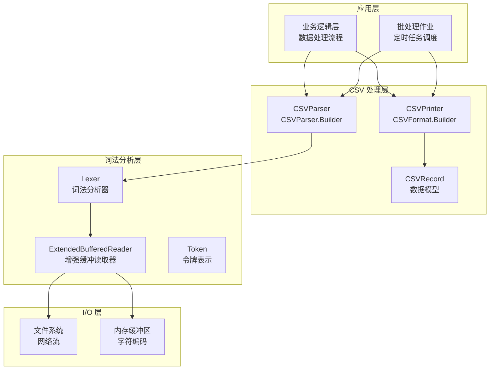
```mermaid
graph TB
subgraph "应用层"
A[业务逻辑层<br/>数据处理流程]
B[批处理作业<br/>定时任务调度]
end
subgraph "CSV 处理层"
C[CSVParser<br/>CSVParser.Builder]
D[CSVPrinter<br/>CSVFormat.Builder]
E[CSVRecord<br/>数据模型]
end
subgraph "词法分析层"
F[Lexer<br/>词法分析器]
G[ExtendedBufferedReader<br/>增强缓冲读取器]
H[Token<br/>令牌表示]
end
subgraph "I/O 层"
I[文件系统<br/>网络流]
J[内存缓冲区<br/>字符编码]
end
A --> C
A --> D
B --> C
B --> D
C --> F
D --> E
F --> G
G --> I
G --> J
```

**图表来源**
- [CSVParser.java:147-567](file://src/main/java/org/apache/commons/csv/CSVParser.java#L147-L567)
- [CSVPrinter.java:80-123](file://src/main/java/org/apache/commons/csv/CSVPrinter.java#L80-L123)
- [Lexer.java:32-66](file://src/main/java/org/apache/commons/csv/Lexer.java#L32-L66)
- [ExtendedBufferedReader.java:44-84](file://src/main/java/org/apache/commons/csv/ExtendedBufferedReader.java#L44-L84)

## 详细组件分析

### 词法分析器 (Lexer)

Lexer 是 CSV 解析的核心组件，负责将输入流转换为语义化的令牌序列。

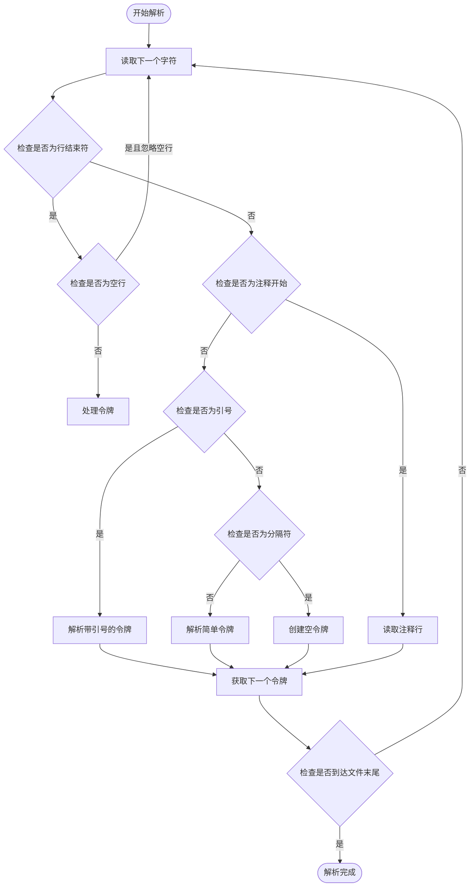
```mermaid
flowchart TD
Start([开始解析]) --> ReadChar["读取下一个字符"]
ReadChar --> CheckEOL{"检查是否为行结束符"}
CheckEOL --> |是| CheckEmpty{"检查是否为空行"}
CheckEmpty --> |是且忽略空行| ReadChar
CheckEmpty --> |否| ProcessToken["处理令牌"]
CheckEOL --> |否| CheckComment{"检查是否为注释开始"}
CheckComment --> |是| ReadComment["读取注释行"]
CheckComment --> |否| CheckQuote{"检查是否为引号"}
CheckQuote --> |是| ParseEncapsulated["解析带引号的令牌"]
CheckQuote --> |否| CheckDelimiter{"检查是否为分隔符"}
CheckDelimiter --> |是| CreateEmptyToken["创建空令牌"]
CheckDelimiter --> |否| ParseSimple["解析简单令牌"]
ParseEncapsulated --> NextToken["获取下一个令牌"]
ParseSimple --> NextToken
CreateEmptyToken --> NextToken
ReadComment --> NextToken
NextToken --> CheckEOF{"检查是否到达文件末尾"}
CheckEOF --> |否| ReadChar
CheckEOF --> |是| End([解析完成])
```

**图表来源**
- [Lexer.java:235-307](file://src/main/java/org/apache/commons/csv/Lexer.java#L235-L307)
- [Lexer.java:336-389](file://src/main/java/org/apache/commons/csv/Lexer.java#L336-L389)
- [Lexer.java:409-440](file://src/main/java/org/apache/commons/csv/Lexer.java#L409-L440)

### 增强缓冲读取器 (ExtendedBufferedReader)

ExtendedBufferedReader 提供了高级的读取功能，包括前瞻读取、位置跟踪和字节计数。

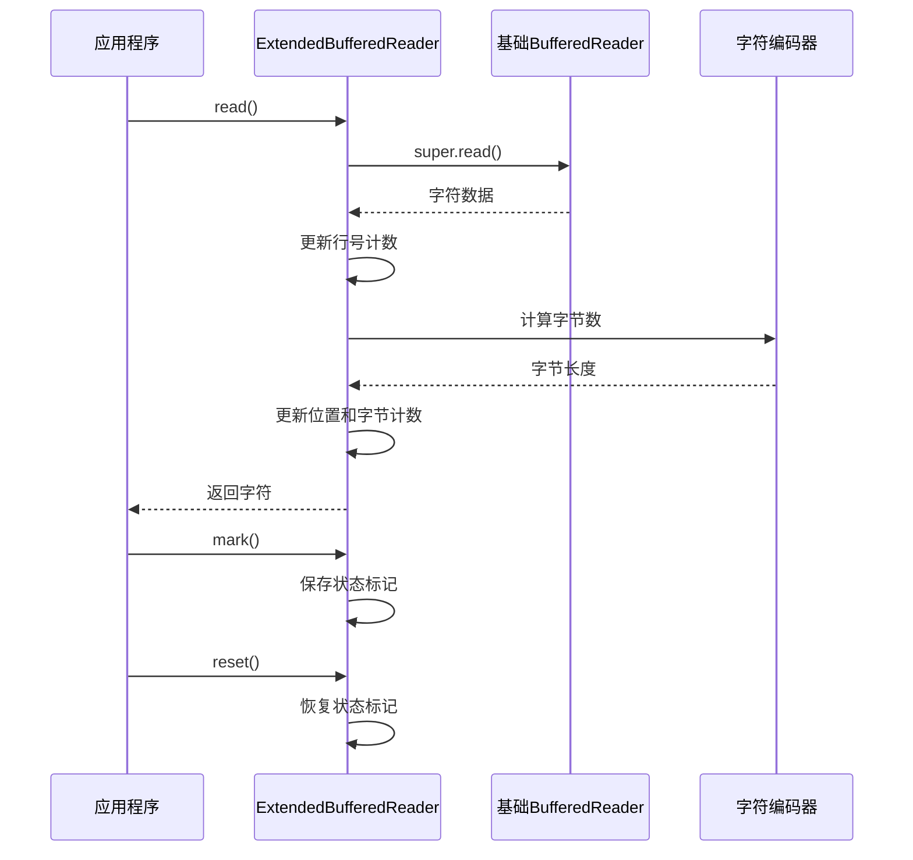
```mermaid
sequenceDiagram
participant App as 应用程序
participant EBR as ExtendedBufferedReader
participant BR as 基础BufferedReader
participant Encoder as 字符编码器
App->>EBR : read()
EBR->>BR : super.read()
BR-->>EBR : 字符数据
EBR->>EBR : 更新行号计数
EBR->>Encoder : 计算字节数
Encoder-->>EBR : 字节长度
EBR->>EBR : 更新位置和字节计数
EBR-->>App : 返回字符
App->>EBR : mark()
EBR->>EBR : 保存状态标记
App->>EBR : reset()
EBR->>EBR : 恢复状态标记
```

**图表来源**
- [ExtendedBufferedReader.java:194-231](file://src/main/java/org/apache/commons/csv/ExtendedBufferedReader.java#L194-L231)
- [ExtendedBufferedReader.java:268-275](file://src/main/java/org/apache/commons/csv/ExtendedBufferedReader.java#L268-L275)

**章节来源**
- [Lexer.java:32-521](file://src/main/java/org/apache/commons/csv/Lexer.java#L32-L521)
- [ExtendedBufferedReader.java:44-277](file://src/main/java/org/apache/commons/csv/ExtendedBufferedReader.java#L44-L277)

### 数据模型 (CSVRecord)

CSVRecord 表示单个 CSV 记录，提供了多种访问方式和元数据信息。

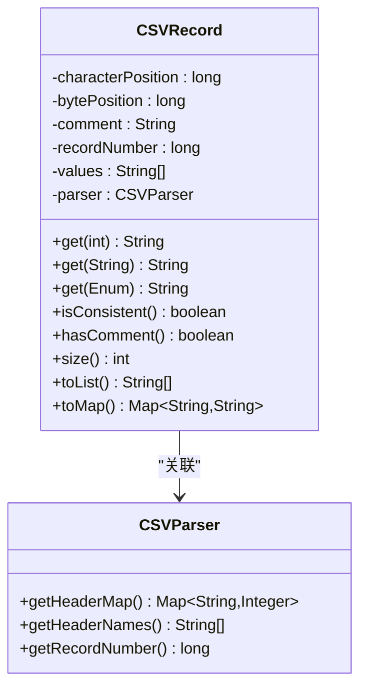
```mermaid
classDiagram
class CSVRecord {
-characterPosition : long
-bytePosition : long
-comment : String
-recordNumber : long
-values : String[]
-parser : CSVParser
+get(int) String
+get(String) String
+get(Enum) String
+isConsistent() boolean
+hasComment() boolean
+size() int
+toList() String[]
+toMap() Map~String,String~
}
class CSVParser {
+getHeaderMap() Map~String,Integer~
+getHeaderNames() String[]
+getRecordNumber() long
}
CSVRecord --> CSVParser : "关联"
```

**图表来源**
- [CSVRecord.java:43-372](file://src/main/java/org/apache/commons/csv/CSVRecord.java#L43-L372)
- [CSVParser.java:705-751](file://src/main/java/org/apache/commons/csv/CSVParser.java#L705-L751)

**章节来源**
- [CSVRecord.java:43-372](file://src/main/java/org/apache/commons/csv/CSVRecord.java#L43-L372)

## 大数据框架集成

### Hadoop 集成

在 Hadoop 生态系统中，Apache Commons CSV 可以通过以下方式集成：

1. **MapReduce 作业中的 CSV 处理**
2. **HDFS 文件系统上的批处理**
3. **自定义 InputFormat 支持**

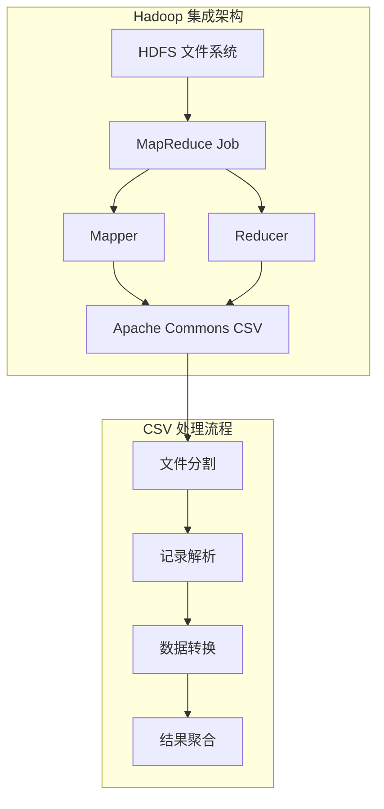
```mermaid
graph TB
subgraph "Hadoop 集成架构"
A[HDFS 文件系统]
B[MapReduce Job]
C[Mapper]
D[Reducer]
E[Apache Commons CSV]
end
A --> B
B --> C
B --> D
C --> E
D --> E
subgraph "CSV 处理流程"
F[文件分割]
G[记录解析]
H[数据转换]
I[结果聚合]
end
E --> F
F --> G
G --> H
H --> I
```

**集成要点**：
- 使用 `CSVParser.parse()` 处理 HDFS 上的大文件
- 实现自定义的 RecordReader 来支持 CSV 格式
- 利用 Hadoop 的分片机制进行并行处理

### Spark 集成

Spark 集成提供了更高级的数据处理能力：

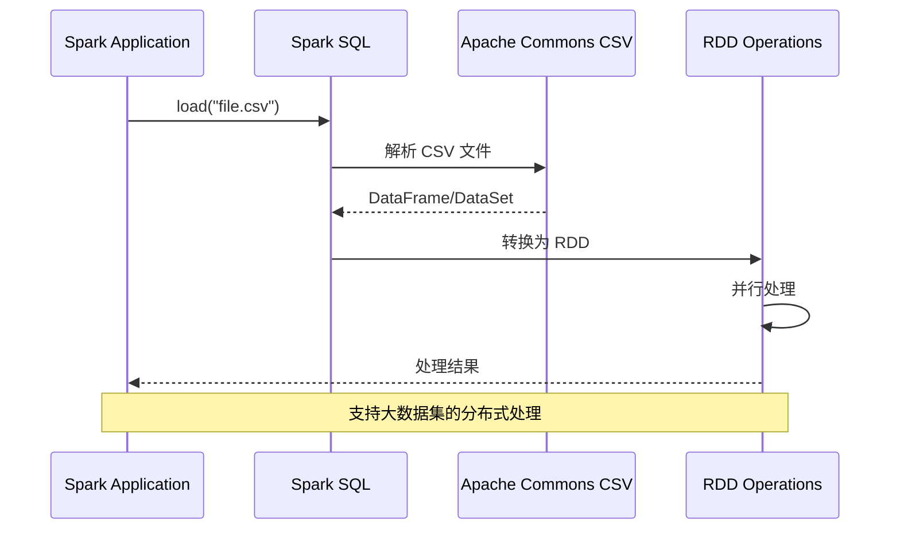
```mermaid
sequenceDiagram
participant Spark as Spark Application
participant SQL as Spark SQL
participant CSV as Apache Commons CSV
participant RDD as RDD Operations
Spark->>SQL : load("file.csv")
SQL->>CSV : 解析 CSV 文件
CSV-->>SQL : DataFrame/DataSet
SQL->>RDD : 转换为 RDD
RDD->>RDD : 并行处理
RDD-->>Spark : 处理结果
Note over Spark,RDD : 支持大数据集的分布式处理
```

**Spark 集成优势**：
- 自动数据类型推断和 Schema 验证
- 内存优化的列式存储
- 分布式计算框架的无缝集成

### Flink 集成

Flink 的流式处理特性使其成为实时 CSV 处理的理想选择：

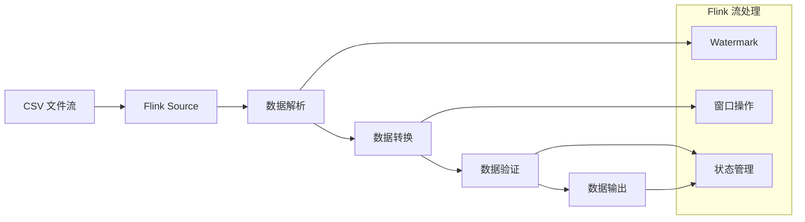
```mermaid
flowchart LR
A[CSV 文件流] --> B[Flink Source]
B --> C[数据解析]
C --> D[数据转换]
D --> E[数据验证]
E --> F[数据输出]
subgraph "Flink 流处理"
G[Watermark]
H[窗口操作]
I[状态管理]
end
C --> G
D --> H
E --> I
F --> I
```

**Flink 集成特点**：
- 事件时间处理和水位线管理
- 窗口操作支持批量和流式处理
- 状态持久化和容错机制

**章节来源**
- [CSVParser.java:321-447](file://src/main/java/org/apache/commons/csv/CSVParser.java#L321-L447)
- [CSVFormat.java:50-132](file://src/main/java/org/apache/commons/csv/CSVFormat.java#L50-L132)

## 并发处理策略

### 多线程 CSV 解析

Apache Commons CSV 在设计上考虑了并发处理的需求，提供了多种并发安全的实现方式：

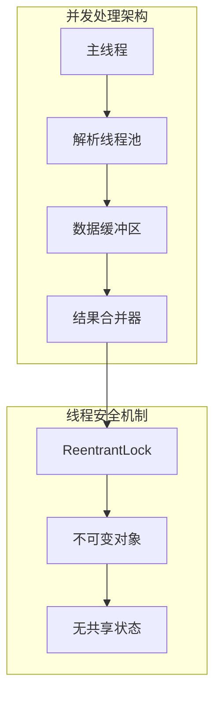
```mermaid
graph TB
subgraph "并发处理架构"
A[主线程]
B[解析线程池]
C[数据缓冲区]
D[结果合并器]
end
subgraph "线程安全机制"
E[ReentrantLock]
F[不可变对象]
G[无共享状态]
end
A --> B
B --> C
C --> D
D --> E
E --> F
F --> G
```

**并发安全特性**：
- CSVParser 和 CSVRecord 对象在解析过程中保持不可变性
- CSVPrinter 使用 ReentrantLock 确保线程安全
- Lexer 和 ExtendedBufferedReader 支持独立实例化

### 并行写入策略

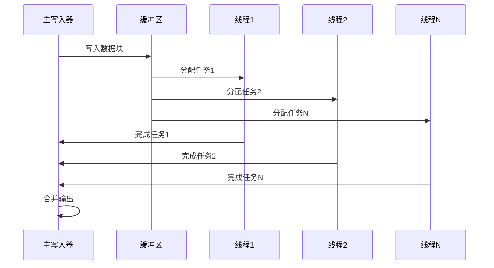
```mermaid
sequenceDiagram
participant Writer as 主写入器
participant Buffer as 缓冲区
participant Thread1 as 线程1
participant Thread2 as 线程2
participant ThreadN as 线程N
Writer->>Buffer : 写入数据块
Buffer->>Thread1 : 分配任务1
Buffer->>Thread2 : 分配任务2
Buffer->>ThreadN : 分配任务N
Thread1->>Writer : 完成任务1
Thread2->>Writer : 完成任务2
ThreadN->>Writer : 完成任务N
Writer->>Writer : 合并输出
```

**并行写入优化**：
- 使用线程本地缓冲区减少锁竞争
- 实现批量写入提高 I/O 效率
- 支持异步写入和背压控制

### 资源管理

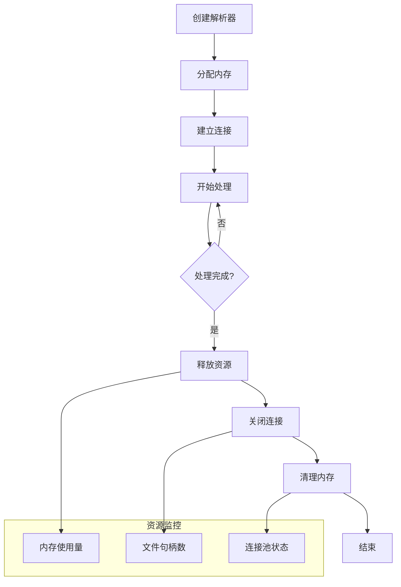
```mermaid
flowchart TD
A[创建解析器] --> B[分配内存]
B --> C[建立连接]
C --> D[开始处理]
D --> E{处理完成?}
E --> |否| D
E --> |是| F[释放资源]
F --> G[关闭连接]
G --> H[清理内存]
H --> I[结束]
subgraph "资源监控"
J[内存使用量]
K[文件句柄数]
L[连接池状态]
end
F --> J
G --> K
H --> L
```

**资源管理最佳实践**：
- 使用 try-with-resources 确保资源正确释放
- 实现连接池管理数据库连接
- 监控内存使用避免内存泄漏

**章节来源**
- [CSVPrinter.java:92-146](file://src/main/java/org/apache/commons/csv/CSVPrinter.java#L92-L146)
- [CSVParser.java:583-586](file://src/main/java/org/apache/commons/csv/CSVParser.java#L583-L586)

## 任务调度系统集成

### Quartz 集成

Quartz 是一个功能强大的作业调度框架，可以与 Apache Commons CSV 无缝集成：

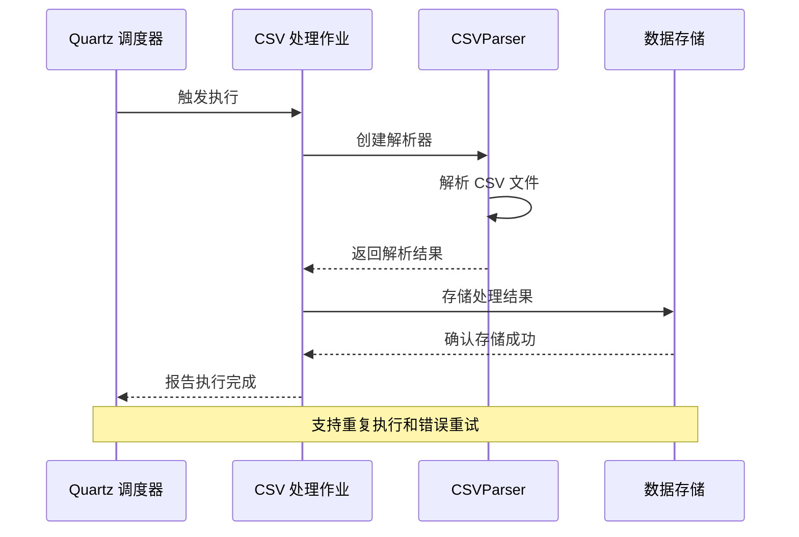
```mermaid
sequenceDiagram
participant Scheduler as Quartz 调度器
participant Job as CSV 处理作业
participant Parser as CSVParser
participant Storage as 数据存储
Scheduler->>Job : 触发执行
Job->>Parser : 创建解析器
Parser->>Parser : 解析 CSV 文件
Parser-->>Job : 返回解析结果
Job->>Storage : 存储处理结果
Storage-->>Job : 确认存储成功
Job-->>Scheduler : 报告执行完成
Note over Scheduler,Storage : 支持重复执行和错误重试
```

**Quartz 配置要点**：
- 使用 Cron 表达式定义执行计划
- 实现 JobListener 监控执行状态
- 配置 JobDataMap 传递参数

### Spring Task 集成

Spring Boot 提供了简化的任务调度支持：

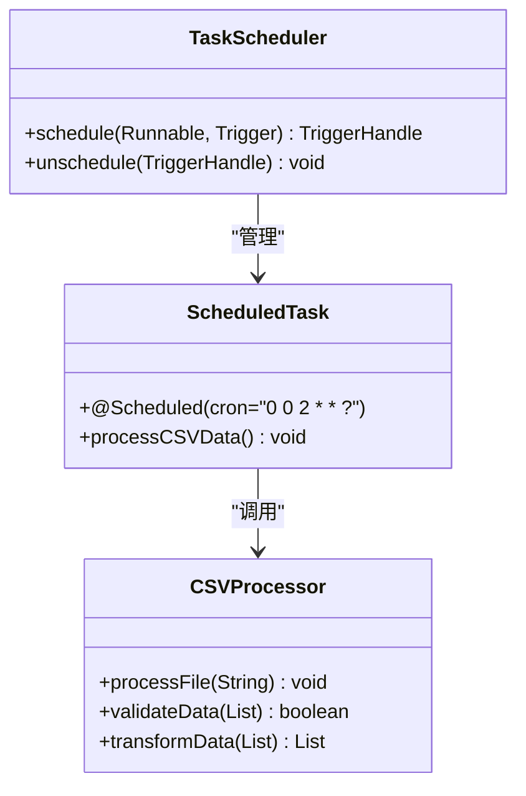
```mermaid
classDiagram
class ScheduledTask {
+@Scheduled(cron="0 0 2 * * ?")
+processCSVData() void
}
class CSVProcessor {
+processFile(String) void
+validateData(List) boolean
+transformData(List) List
}
class TaskScheduler {
+schedule(Runnable, Trigger) TriggerHandle
+unschedule(TriggerHandle) void
}
ScheduledTask --> CSVProcessor : "调用"
TaskScheduler --> ScheduledTask : "管理"
```

**Spring Task 特性**：
- 基于注解的简单配置
- 支持固定延迟和固定速率执行
- 集成 Spring 容器管理

**章节来源**
- [PerformanceTest.java:117-184](file://src/test/java/org/apache/commons/csv/PerformanceTest.java#L117-L184)
- [UserGuideTest.java:56-92](file://src/test/java/org/apache/commons/csv/UserGuideTest.java#L56-L92)

## 流式处理管道

### 数据过滤管道

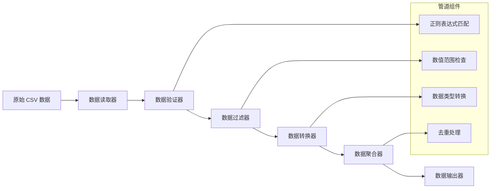
```mermaid
flowchart LR
A[原始 CSV 数据] --> B[数据读取器]
B --> C[数据验证器]
C --> D[数据过滤器]
D --> E[数据转换器]
E --> F[数据聚合器]
F --> G[数据输出器]
subgraph "管道组件"
H[正则表达式匹配]
I[数值范围检查]
J[数据类型转换]
K[去重处理]
end
C --> H
D --> I
E --> J
F --> K
```

### 实时数据处理

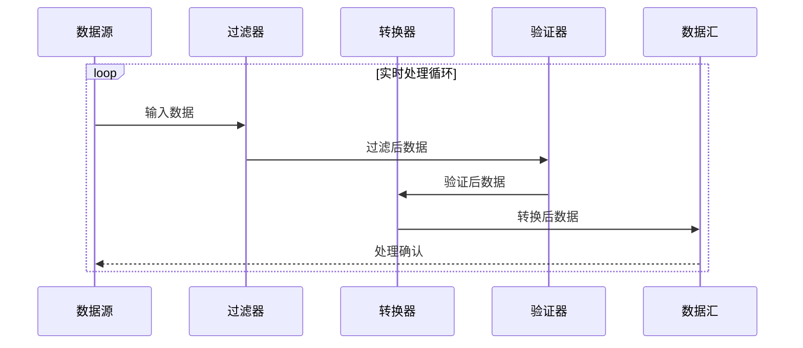
```mermaid
sequenceDiagram
participant Source as 数据源
participant Filter as 过滤器
participant Transform as 转换器
participant Validate as 验证器
participant Sink as 数据汇
loop 实时处理循环
Source->>Filter : 输入数据
Filter->>Validate : 过滤后数据
Validate->>Transform : 验证后数据
Transform->>Sink : 转换后数据
Sink-->>Source : 处理确认
end
```

### 错误处理和重试机制

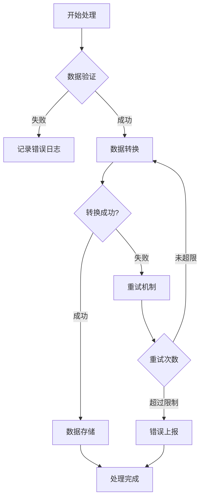
```mermaid
flowchart TD
A[开始处理] --> B{数据验证}
B --> |失败| C[记录错误日志]
B --> |成功| D[数据转换]
D --> E{转换成功?}
E --> |失败| F[重试机制]
F --> G{重试次数}
G --> |超过限制| H[错误上报]
G --> |未超限| D
E --> |成功| I[数据存储]
I --> J[处理完成]
H --> J
```

**章节来源**
- [CSVParser.java:768-770](file://src/main/java/org/apache/commons/csv/CSVParser.java#L768-L770)
- [CSVPrinter.java:327-377](file://src/main/java/org/apache/commons/csv/CSVPrinter.java#L327-L377)

## 内存管理与性能优化

### 大文件分片处理

Apache Commons CSV 提供了多种处理大文件的策略：

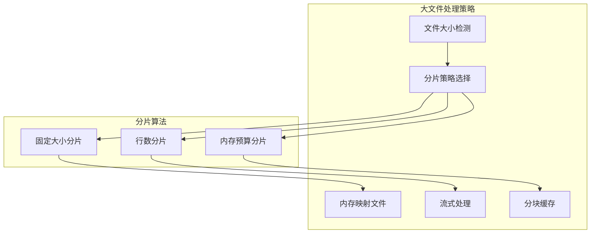
```mermaid
graph TB
subgraph "大文件处理策略"
A[文件大小检测]
B[分片策略选择]
C[内存映射文件]
D[流式处理]
E[分块缓存]
end
subgraph "分片算法"
F[固定大小分片]
G[行数分片]
H[内存预算分片]
end
A --> B
B --> F
B --> G
B --> H
F --> C
G --> D
H --> E
```

**内存优化技术**：
- 使用流式 API 避免一次性加载整个文件
- 实现自适应缓冲区大小调整
- 利用垃圾回收优化减少内存碎片

### 性能基准测试

项目包含了完整的性能测试套件，用于评估不同实现的性能表现：

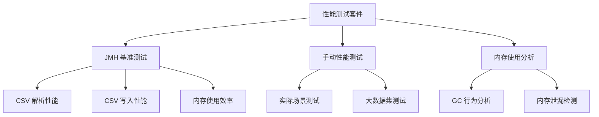
```mermaid
flowchart TD
A[性能测试套件] --> B[JMH 基准测试]
A --> C[手动性能测试]
A --> D[内存使用分析]
B --> E[CSV 解析性能]
B --> F[CSV 写入性能]
B --> G[内存使用效率]
C --> H[实际场景测试]
C --> I[大数据集测试]
D --> J[GC 行为分析]
D --> K[内存泄漏检测]
```

**性能优化建议**：
- 选择合适的 CSVFormat 预定义格式
- 使用适当的缓冲区大小
- 避免不必要的字符串复制操作

**章节来源**
- [BENCHMARK.md:18-80](file://BENCHMARK.md#L18-L80)
- [PerformanceTest.java:47-346](file://src/test/java/org/apache/commons/csv/PerformanceTest.java#L47-L346)

## 完整批处理应用示例

### 数据采集、处理、存储生命周期

```mermaid
sequenceDiagram
participant Source as 数据源
participant Collector as 采集器
participant Processor as 处理器
participant Validator as 验证器
participant Storage as 存储系统
participant Monitor as 监控系统
Source->>Collector : 提供原始数据
Collector->>Processor : 传输数据块
Processor->>Validator : 验证数据质量
Validator->>Storage : 存储有效数据
Storage->>Monitor : 发送处理状态
Monitor-->>Collector : 返回处理结果
Note over Collector,Storage : 支持断点续传和错误恢复
```

### 典型批处理工作流

```mermaid
flowchart TD
A[启动批处理作业] --> B[初始化配置]
B --> C[扫描数据源]
C --> D[创建处理任务]
D --> E[并行处理数据]
E --> F[数据验证]
F --> G[错误数据处理]
G --> H{处理完成?}
H --> |否| E
H --> |是| I[生成报告]
I --> J[更新元数据]
J --> K[清理临时文件]
K --> L[结束作业]
```

**应用示例架构**：
- 支持多种数据源（文件系统、数据库、消息队列）
- 实现增量处理和全量处理模式
- 提供进度监控和状态查询接口

**章节来源**
- [UserGuideTest.java:56-92](file://src/test/java/org/apache/commons/csv/UserGuideTest.java#L56-L92)
- [CSVParser.java:321-447](file://src/main/java/org/apache/commons/csv/CSVParser.java#L321-L447)

## 错误处理与监控

### 错误处理策略

```mermaid
flowchart TD
A[异常发生] --> B{异常类型}
B --> |解析错误| C[记录错误详情]
B --> |I/O 错误| D[重试机制]
B --> |内存不足| E[降级处理]
B --> |网络错误| F[连接重试]
C --> G[错误分类]
D --> H[指数退避]
E --> I[流式处理]
F --> H
G --> J[错误上报]
H --> K[故障转移]
I --> L[资源释放]
K --> M[系统恢复]
L --> M
```

### 监控告警机制

```mermaid
classDiagram
class Monitor {
+monitorProcessing() void
+collectMetrics() Metrics
+sendAlert(String) void
}
class Metrics {
+processedCount : long
+errorCount : long
+memoryUsage : double
+processingTime : long
}
class AlertSystem {
+checkThreshold(Metrics) boolean
+notify(String) void
}
Monitor --> Metrics : "收集"
Monitor --> AlertSystem : "触发"
```

**监控指标**：
- 处理吞吐量和延迟
- 内存使用情况和 GC 行为
- 错误率和重试次数
- 数据完整性验证结果

**章节来源**
- [CSVParser.java:583-586](file://src/main/java/org/apache/commons/csv/CSVParser.java#L583-L586)
- [CSVPrinter.java:126-146](file://src/main/java/org/apache/commons/csv/CSVPrinter.java#L126-L146)

## 结论

Apache Commons CSV 为大数据环境下的批处理应用提供了强大而灵活的解决方案。通过其精心设计的架构和丰富的功能特性，开发者可以轻松地在各种大数据框架中集成 CSV 处理能力。

### 主要优势

1. **高性能**: 经过优化的词法分析器和缓冲机制
2. **内存友好**: 支持流式处理和大文件分片
3. **并发安全**: 线程安全的设计确保多线程环境下的稳定性
4. **易于集成**: 与主流大数据框架的良好兼容性
5. **可扩展性**: 模块化的架构支持定制和扩展

### 最佳实践总结

- 选择合适的 CSVFormat 预定义格式以获得最佳性能
- 实现适当的错误处理和重试机制
- 使用流式处理避免内存溢出
- 配置合理的并发度和缓冲区大小
- 建立完善的监控和告警体系

通过遵循这些指导原则和最佳实践，开发者可以构建高效、可靠的大数据批处理应用，充分利用 Apache Commons CSV 的强大功能来处理各种 CSV 数据处理需求。