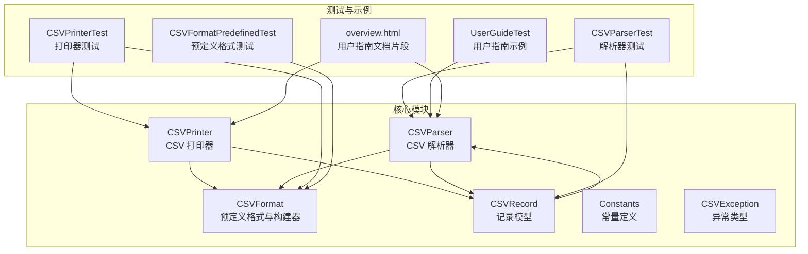
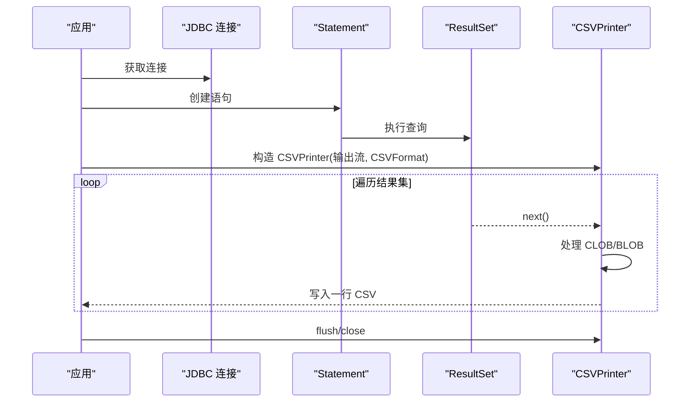
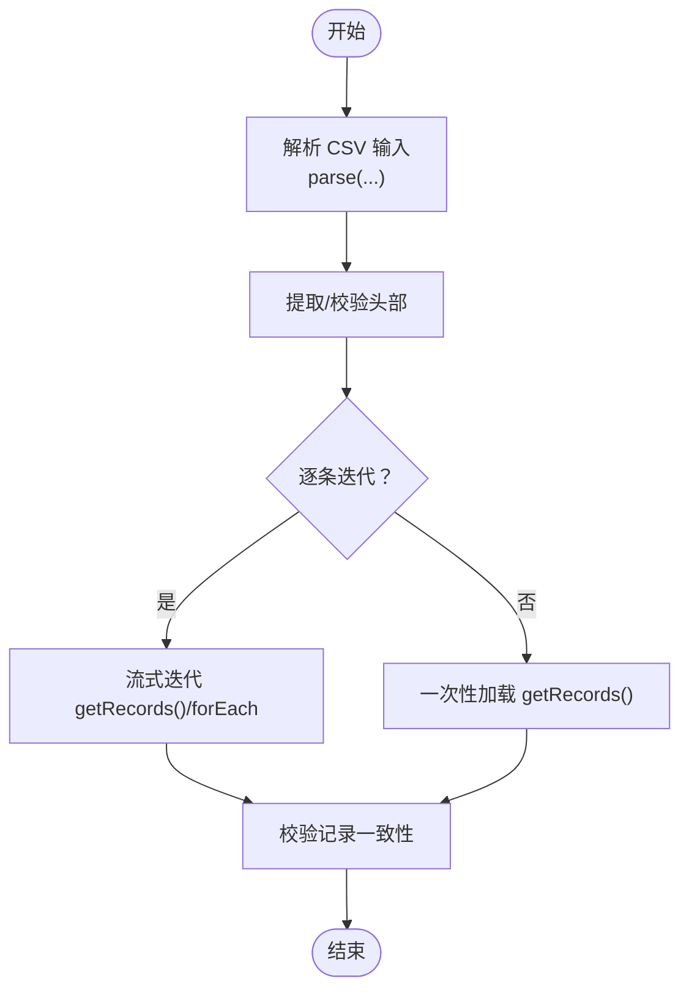
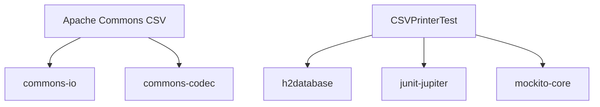

# 数据库集成

<cite>
**本文引用的文件**
- [README.md](file://README.md)
- [pom.xml](file://pom.xml)
- [CSVParser.java](file://src/main/java/org/apache/commons/csv/CSVParser.java)
- [CSVPrinter.java](file://src/main/java/org/apache/commons/csv/CSVPrinter.java)
- [CSVFormat.java](file://src/main/java/org/apache/commons/csv/CSVFormat.java)
- [CSVRecord.java](file://src/main/java/org/apache/commons/csv/CSVRecord.java)
- [Constants.java](file://src/main/java/org/apache/commons/csv/Constants.java)
- [CSVException.java](file://src/main/java/org/apache/commons/csv/CSVException.java)
- [UserGuideTest.java](file://src/test/java/org/apache/commons/csv/UserGuideTest.java)
- [CSVPrinterTest.java](file://src/test/java/org/apache/commons/csv/CSVPrinterTest.java)
- [CSVParserTest.java](file://src/test/java/org/apache/commons/csv/CSVParserTest.java)
- [CSVFormatPredefinedTest.java](file://src/test/java/org/apache/commons/csv/CSVFormatPredefinedTest.java)
- [overview.html](file://src/main/javadoc/overview.html)
</cite>

## 目录
1. [简介](#简介)
2. [项目结构](#项目结构)
3. [核心组件](#核心组件)
4. [架构总览](#架构总览)
5. [详细组件分析](#详细组件分析)
6. [依赖分析](#依赖分析)
7. [性能考虑](#性能考虑)
8. [故障排查指南](#故障排查指南)
9. [结论](#结论)
10. [附录](#附录)

## 简介
本文件面向需要将 Apache Commons CSV 与数据库进行集成的开发者，系统性阐述如何通过 CSVParser、CSVPrinter 和 CSVFormat 实现数据库与 CSV 文件之间的双向转换。内容覆盖：
- 基于 JDBC 的 ResultSet 导出与导入最佳实践
- 针对 MySQL、PostgreSQL、Oracle 的预定义格式与适配策略
- 大数据量导出的性能优化（分批、内存与连接池）
- 异常处理、错误恢复与事务管理建议
- 完整的配置模板与可复用的代码路径指引

## 项目结构
该项目采用标准 Maven 结构，核心源码位于 src/main/java 下，测试位于 src/test/java。与数据库集成最相关的模块为：
- CSVFormat：内置多种数据库兼容格式（MySQL、PostgreSQL、Oracle 等）
- CSVPrinter：支持直接打印 ResultSet，自动处理 CLOB/BLOB 字段
- CSVParser：支持从 CSV 文件解析为记录集合，便于导入
- 测试用例与用户指南：提供实际使用示例与验证



图表来源
- [CSVFormat.java](file://src/main/java/org/apache/commons/csv/CSVFormat.java)
- [CSVParser.java](file://src/main/java/org/apache/commons/csv/CSVParser.java)
- [CSVPrinter.java](file://src/main/java/org/apache/commons/csv/CSVPrinter.java)
- [CSVRecord.java](file://src/main/java/org/apache/commons/csv/CSVRecord.java)
- [Constants.java](file://src/main/java/org/apache/commons/csv/Constants.java)
- [CSVException.java](file://src/main/java/org/apache/commons/csv/CSVException.java)
- [UserGuideTest.java](file://src/test/java/org/apache/commons/csv/UserGuideTest.java)
- [CSVPrinterTest.java](file://src/test/java/org/apache/commons/csv/CSVPrinterTest.java)
- [CSVParserTest.java](file://src/test/java/org/apache/commons/csv/CSVParserTest.java)
- [CSVFormatPredefinedTest.java](file://src/test/java/org/apache/commons/csv/CSVFormatPredefinedTest.java)
- [overview.html](file://src/main/javadoc/overview.html)

章节来源
- [README.md](file://README.md)
- [pom.xml](file://pom.xml)

## 核心组件
- CSVFormat：提供 DEFAULT、EXCEL、MYSQL、ORACLE、POSTGRESQL_CSV、POSTGRESQL_TEXT 等预定义格式；支持通过 Builder 自定义分隔符、引号、转义、换行、空值字符串、是否忽略空白行等；支持从 ResultSet 或 ResultSetMetaData 自动提取列名作为 CSV 头部。
- CSVParser：按指定格式解析 CSV 输入，支持文件、URL、Reader、String 等输入源；支持逐条迭代与一次性读取为列表；支持注释、头注释、尾注释、最大行数限制等。
- CSVPrinter：将数据写入 CSV，支持单条记录、多条记录、流式记录、ResultSet；自动处理 CLOB/BLOB 字段；支持并发安全（内部锁）。
- CSVRecord：表示一条 CSV 记录，支持按索引或列名访问，支持注释、位置信息、一致性校验等。
- Constants：提供常用字符常量（逗号、制表符、换行、反斜杠、SQL 空值字符串等）。
- CSVException：用于包装 CSV 解析与写入过程中的异常。

章节来源
- [CSVFormat.java](file://src/main/java/org/apache/commons/csv/CSVFormat.java)
- [CSVParser.java](file://src/main/java/org/apache/commons/csv/CSVParser.java)
- [CSVPrinter.java](file://src/main/java/org/apache/commons/csv/CSVPrinter.java)
- [CSVRecord.java](file://src/main/java/org/apache/commons/csv/CSVRecord.java)
- [Constants.java](file://src/main/java/org/apache/commons/csv/Constants.java)
- [CSVException.java](file://src/main/java/org/apache/commons/csv/CSVException.java)

## 架构总览
下图展示了数据库与 CSV 的双向转换在代码层面的交互关系：应用层通过 JDBC 获取 ResultSet，使用 CSVPrinter 将其导出为 CSV；导入时通过 CSVParser 读取 CSV 并写入数据库（通常配合批量插入或数据库自带的导入工具）。

```mermaid
graph TB
DB["数据库"]
JDBC["JDBC 连接/Statement/ResultSet"]
CSVPrinter["CSVPrinter<br/>printRecords(ResultSet)"]
CSVParser["CSVParser<br/>parse(...)"]
CSVFile["CSV 文件"]
DB <- --> JDBC
JDBC --> CSVPrinter
CSVPrinter --> CSVFile
CSVFile --> CSVParser
CSVParser --> DB
```

图表来源
- [CSVPrinter.java](file://src/main/java/org/apache/commons/csv/CSVPrinter.java)
- [CSVParser.java](file://src/main/java/org/apache/commons/csv/CSVParser.java)

## 详细组件分析

### 组件一：CSVFormat（数据库格式适配）
- 预定义格式与特性
  - MYSQL：制表符分隔、LF 换行、反斜杠转义、无引号、默认空值为“\N”、QuoteMode.ALL_NON_NULL
  - ORACLE：逗号分隔、系统换行、反斜杠转义、双引号包裹、默认空值为“\N”、QuoteMode.MINIMAL、启用 trim
  - POSTGRESQL_CSV：逗号分隔、LF 换行、无转义、双引号包裹、默认空值为“”、QuoteMode.ALL_NON_NULL
  - POSTGRESQL_TEXT：制表符分隔、LF 换行、反斜杠转义、无引号、默认空值为“\N”
  - EXCEL：逗号分隔、CRLF 换行、双引号包裹、最小化引号策略
  - DEFAULT：通用默认设置
- 使用建议
  - 导出：优先选择与目标数据库导入工具一致的预定义格式（如 MySQL 的 MYSQL、PostgreSQL 的 POSTGRESQL_CSV/TEXT）
  - 导入：解析 CSV 时使用与导出相同的格式，或通过 Builder 显式设置字段属性
  - 头部：可通过 setHeader(ResultSet) 或 setHeader(ResultSetMetaData) 自动提取列名

章节来源
- [CSVFormat.java](file://src/main/java/org/apache/commons/csv/CSVFormat.java)
- [Constants.java](file://src/main/java/org/apache/commons/csv/Constants.java)
- [CSVFormatPredefinedTest.java](file://src/test/java/org/apache/commons/csv/CSVFormatPredefinedTest.java)

### 组件二：CSVPrinter（数据库导出）
- 关键能力
  - printRecords(ResultSet)：逐行遍历 ResultSet，自动处理 CLOB（Reader）、BLOB（InputStream），并输出为 CSV
  - printHeaders(ResultSet)：根据元数据输出列名作为 CSV 头
  - printRecords(ResultSet, boolean)：可选输出头部
  - 并发安全：内部使用 ReentrantLock 保护打印过程
- 最佳实践
  - 对大结果集使用分批（游标/分页）策略，避免一次性加载到内存
  - 合理设置 CSVFormat 的最大行数限制（setMaxRows），防止内存溢出
  - 对包含大字段（CLOB/BLOB）的表，确保数据库驱动支持流式读取



图表来源
- [CSVPrinter.java](file://src/main/java/org/apache/commons/csv/CSVPrinter.java)

章节来源
- [CSVPrinter.java](file://src/main/java/org/apache/commons/csv/CSVPrinter.java)
- [CSVPrinterTest.java](file://src/test/java/org/apache/commons/csv/CSVPrinterTest.java)
- [overview.html](file://src/main/javadoc/overview.html)

### 组件三：CSVParser（数据库导入）
- 关键能力
  - parse(...) 支持 File、URL、Reader、String 等输入源
  - getRecords() 一次性读取为列表；支持流式迭代
  - setHeader(...) 与 setHeader(ResultSet) 自动提取列名
  - setMaxRows(...) 控制解析上限
- 最佳实践
  - 导入前先解析 CSV 头部，确保与目标表结构一致
  - 对超大文件采用流式解析，避免内存压力
  - 使用 CSVRecord 的按列名访问能力，降低列顺序变化带来的风险



图表来源
- [CSVParser.java](file://src/main/java/org/apache/commons/csv/CSVParser.java)
- [CSVRecord.java](file://src/main/java/org/apache/commons/csv/CSVRecord.java)

章节来源
- [CSVParser.java](file://src/main/java/org/apache/commons/csv/CSVParser.java)
- [CSVRecord.java](file://src/main/java/org/apache/commons/csv/CSVRecord.java)
- [CSVParserTest.java](file://src/test/java/org/apache/commons/csv/CSVParserTest.java)

### 组件四：异常与错误处理
- CSVException：用于包装格式化消息的 IO 异常
- 在导出/导入过程中，建议捕获并区分以下异常：
  - SQL 相关异常（数据库连接、权限、SQL 语法）
  - IO 异常（文件不可读写、磁盘空间不足）
  - CSV 解析异常（格式不匹配、非法转义）

章节来源
- [CSVException.java](file://src/main/java/org/apache/commons/csv/CSVException.java)

## 依赖分析
- 项目依赖
  - commons-io：提供 IO 工具与流式处理能力
  - commons-codec：提供 Base64 等编码支持
  - h2database：测试中用于模拟数据库环境
  - junit-jupiter、mockito：单元测试框架
- 与数据库集成的间接依赖
  - JDBC 驱动（MySQL、PostgreSQL、Oracle）由上层应用提供，CSV 库本身不包含驱动



图表来源
- [pom.xml](file://pom.xml)

章节来源
- [pom.xml](file://pom.xml)

## 性能考虑
- 分批导出（大结果集）
  - 使用数据库游标或分页（LIMIT/OFFSET）控制每次导出的数据量
  - 在 CSVFormat 中设置最大行数限制，避免一次性处理过多记录
- 内存管理
  - 导出时尽量使用流式输出，避免将整批数据缓存在内存
  - 对 CLOB/BLOB 字段使用 Reader/InputStream 流式读取
- 连接池配置
  - 使用连接池（如 HikariCP、Druid）管理数据库连接，合理设置最大连接数、空闲超时、连接生命周期
  - 导出期间保持连接活跃，避免长时间空闲导致连接断开
- 并发与锁
  - CSVPrinter 内部使用 ReentrantLock 保证线程安全，但建议在高并发场景下将打印与数据库写入分离，避免共享状态竞争

## 故障排查指南
- 常见问题与对策
  - 导出后空值显示不符合预期：检查 CSVFormat 的空值字符串设置（如 MYSQL/ORACLE 的“\N”）
  - 导入失败（列数不一致）：确认 CSV 头部与目标表结构一致，必要时使用 setHeader(ResultSet) 自动同步
  - 大字段丢失：确保使用 printRecords(ResultSet) 并正确处理 CLOB/BLOB
  - 性能瓶颈：采用分批导出、连接池、流式处理
- 错误恢复
  - 导出中断：记录当前行号与偏移，基于偏移继续导出
  - 导入中断：回滚事务，修复 CSV 文件后重试
- 事务管理
  - 导入大批量数据时，使用事务包裹批量插入，失败时整体回滚
  - 导出时避免长事务占用资源，必要时拆分为多个短事务

章节来源
- [CSVPrinter.java](file://src/main/java/org/apache/commons/csv/CSVPrinter.java)
- [CSVParser.java](file://src/main/java/org/apache/commons/csv/CSVParser.java)

## 结论
通过 Apache Commons CSV 的 CSVFormat、CSVParser 与 CSVPrinter，可以高效地实现数据库与 CSV 文件的双向转换。结合预定义格式与 Builder 的灵活配置，能够在不同数据库（MySQL、PostgreSQL、Oracle）之间实现稳定迁移。配合分批导出、内存与连接池优化、完善的异常处理与事务管理，可满足生产环境对性能与可靠性的要求。

## 附录

### A. 数据库与 CSV 格式映射模板
- MySQL（mysqldump/LOAD DATA INFILE）
  - 分隔符：制表符（\t）
  - 引号：无
  - 转义：反斜杠（\）
  - 换行：LF（\n）
  - 空值：\N
  - QuoteMode：ALL_NON_NULL
  - 参考：[MYSQL 预定义格式](file://src/main/java/org/apache/commons/csv/CSVFormat.java)
- PostgreSQL（COPY）
  - CSV：逗号分隔、LF 换行、双引号包裹、无转义、空值为“”
  - TEXT：制表符分隔、LF 换行、反斜杠转义、无引号、空值为“\N”
  - 参考：[POSTGRESQL_CSV/POSTGRESQL_TEXT 预定义格式](file://src/main/java/org/apache/commons/csv/CSVFormat.java)
- Oracle（SQL*Loader）
  - 逗号分隔、系统换行、双引号包裹、反斜杠转义、空值为“\N”、启用 trim
  - 参考：[ORACLE 预定义格式](file://src/main/java/org/apache/commons/csv/CSVFormat.java)

章节来源
- [CSVFormat.java](file://src/main/java/org/apache/commons/csv/CSVFormat.java)

### B. 导出与导入流程参考
- 导出（ResultSet → CSV）
  - 使用 CSVPrinter.printRecords(ResultSet) 输出
  - 可选：CSVPrinter.printHeaders(ResultSet) 输出头部
  - 参考：[CSVPrinter.printRecords](file://src/main/java/org/apache/commons/csv/CSVPrinter.java)
- 导入（CSV → 数据库）
  - 使用 CSVParser.parse(...) 解析 CSV
  - 使用 CSVRecord.get("列名") 或 get(index) 提取字段
  - 使用 PreparedStatement 批量插入
  - 参考：[CSVParser.parse](file://src/main/java/org/apache/commons/csv/CSVParser.java)、[CSVRecord](file://src/main/java/org/apache/commons/csv/CSVRecord.java)

章节来源
- [CSVPrinter.java](file://src/main/java/org/apache/commons/csv/CSVPrinter.java)
- [CSVParser.java](file://src/main/java/org/apache/commons/csv/CSVParser.java)
- [CSVRecord.java](file://src/main/java/org/apache/commons/csv/CSVRecord.java)

### C. 示例与测试参考
- 用户指南示例（BOM 处理、头部解析）
  - 参考：[UserGuideTest](file://src/test/java/org/apache/commons/csv/UserGuideTest.java)
- 打印器测试（H2 内存数据库、导出示例）
  - 参考：[CSVPrinterTest](file://src/test/java/org/apache/commons/csv/CSVPrinterTest.java)
- 解析器测试（多格式、BOM、注释）
  - 参考：[CSVParserTest](file://src/test/java/org/apache/commons/csv/CSVParserTest.java)
- 预定义格式测试
  - 参考：[CSVFormatPredefinedTest](file://src/test/java/org/apache/commons/csv/CSVFormatPredefinedTest.java)
- 用户指南文档片段（导出/限制行数）
  - 参考：[overview.html](file://src/main/javadoc/overview.html)

章节来源
- [UserGuideTest.java](file://src/test/java/org/apache/commons/csv/UserGuideTest.java)
- [CSVPrinterTest.java](file://src/test/java/org/apache/commons/csv/CSVPrinterTest.java)
- [CSVParserTest.java](file://src/test/java/org/apache/commons/csv/CSVParserTest.java)
- [CSVFormatPredefinedTest.java](file://src/test/java/org/apache/commons/csv/CSVFormatPredefinedTest.java)
- [overview.html](file://src/main/javadoc/overview.html)