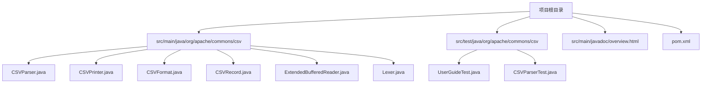
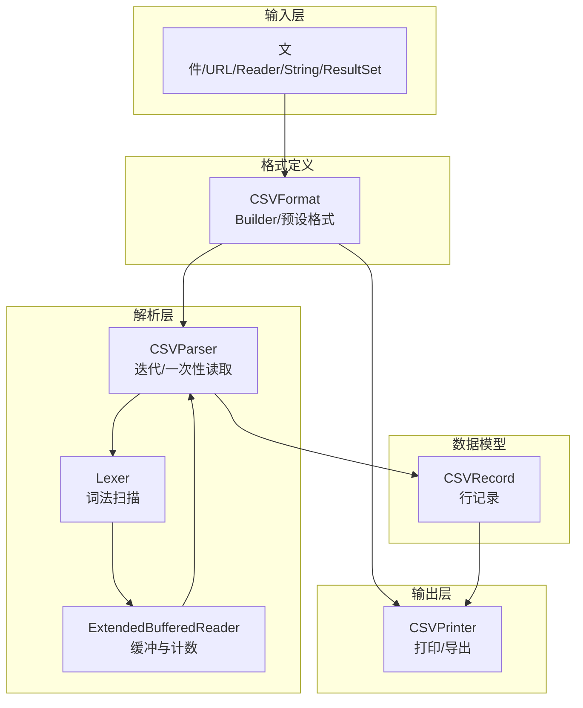
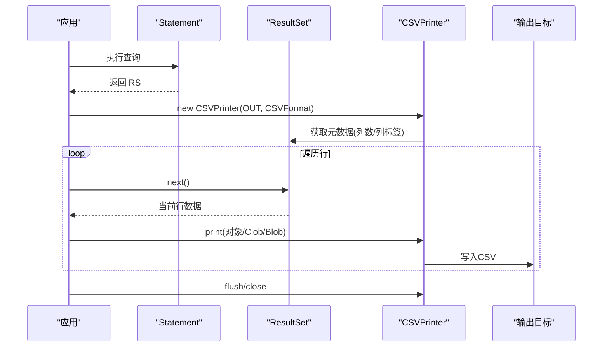
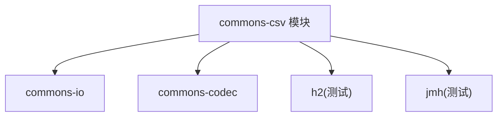

# 集成指南

<cite>
**本文引用的文件**   
- [README.md](file://README.md)
- [pom.xml](file://pom.xml)
- [CSVParser.java](file://src/main/java/org/apache/commons/csv/CSVParser.java)
- [CSVPrinter.java](file://src/main/java/org/apache/commons/csv/CSVPrinter.java)
- [CSVFormat.java](file://src/main/java/org/apache/commons/csv/CSVFormat.java)
- [CSVRecord.java](file://src/main/java/org/apache/commons/csv/CSVRecord.java)
- [ExtendedBufferedReader.java](file://src/main/java/org/apache/commons/csv/ExtendedBufferedReader.java)
- [Lexer.java](file://src/main/java/org/apache/commons/csv/Lexer.java)
- [UserGuideTest.java](file://src/test/java/org/apache/commons/csv/UserGuideTest.java)
- [CSVParserTest.java](file://src/test/java/org/apache/commons/csv/CSVParserTest.java)
- [BENCHMARK.md](file://BENCHMARK.md)
- [overview.html](file://src/main/javadoc/overview.html)
</cite>

## 目录
1. [简介](#简介)
2. [项目结构](#项目结构)
3. [核心组件](#核心组件)
4. [架构总览](#架构总览)
5. [详细组件分析](#详细组件分析)
6. [依赖分析](#依赖分析)
7. [性能考量](#性能考量)
8. [故障排查指南](#故障排查指南)
9. [结论](#结论)
10. [附录](#附录)

## 简介
本指南面向需要在各类系统与框架中集成 Apache Commons CSV 的开发者，覆盖数据库（JDBC）集成、Web 应用（Servlet/Spring/REST）集成、批处理与大数据处理、并发与任务调度、以及与 Apache Commons IO、Apache Commons Codec 等组件的协同使用。文档以仓库中的源码为依据，提供可操作的集成步骤、最佳实践、性能优化建议与常见问题排查方法。

## 项目结构
仓库采用标准 Maven 结构，核心代码位于 src/main/java 下的 org.apache.commons.csv 包中，包含解析器、打印器、格式定义、词法分析器与缓冲读取器等模块；测试位于 src/test 下，涵盖用户指南示例、单元测试与性能基准。

图表来源
- [pom.xml:1-525](file://pom.xml#L1-L525)
- [CSVParser.java:1-800](file://src/main/java/org/apache/commons/csv/CSVParser.java#L1-L800)
- [CSVPrinter.java:1-580](file://src/main/java/org/apache/commons/csv/CSVPrinter.java#L1-L580)
- [CSVFormat.java:1-800](file://src/main/java/org/apache/commons/csv/CSVFormat.java#L1-L800)
- [CSVRecord.java:1-371](file://src/main/java/org/apache/commons/csv/CSVRecord.java#L1-L371)
- [ExtendedBufferedReader.java:1-200](file://src/main/java/org/apache/commons/csv/ExtendedBufferedReader.java#L1-L200)
- [Lexer.java:1-200](file://src/main/java/org/apache/commons/csv/Lexer.java#L1-L200)
- [UserGuideTest.java:1-95](file://src/test/java/org/apache/commons/csv/UserGuideTest.java#L1-L95)
- [CSVParserTest.java:1-200](file://src/test/java/org/apache/commons/csv/CSVParserTest.java#L1-L200)

章节来源
- [pom.xml:1-525](file://pom.xml#L1-L525)
- [README.md:1-120](file://README.md#L1-L120)

## 核心组件
- CSVParser：按指定 CSVFormat 解析输入流，支持文件、URL、Reader、String 等多种输入源，提供迭代访问与内存一次性读取能力。
- CSVPrinter：按 CSVFormat 将数据写入 Appendable，支持单条记录、批量记录、ResultSet 导出与带注释头的输出。
- CSVFormat：定义分隔符、引号、换行、注释、空值字符串、列名、最大行数等格式参数，并提供 Builder 模式构建。
- CSVRecord：表示一行记录，支持按索引或列名访问，提供位置信息与一致性校验。
- Lexer 与 ExtendedBufferedReader：词法扫描与增强缓冲读取，支持字节计数、行号跟踪、多行值识别与 BOM 处理。

章节来源
- [CSVParser.java:147-800](file://src/main/java/org/apache/commons/csv/CSVParser.java#L147-L800)
- [CSVPrinter.java:80-580](file://src/main/java/org/apache/commons/csv/CSVPrinter.java#L80-L580)
- [CSVFormat.java:182-800](file://src/main/java/org/apache/commons/csv/CSVFormat.java#L182-L800)
- [CSVRecord.java:43-371](file://src/main/java/org/apache/commons/csv/CSVRecord.java#L43-L371)
- [ExtendedBufferedReader.java:44-200](file://src/main/java/org/apache/commons/csv/ExtendedBufferedReader.java#L44-L200)
- [Lexer.java:32-200](file://src/main/java/org/apache/commons/csv/Lexer.java#L32-L200)

## 架构总览
下图展示从输入到输出的关键路径：输入通过 CSVFormat 定义格式，CSVParser 使用 Lexer 与 ExtendedBufferedReader 进行词法分析与缓冲读取，最终产出 CSVRecord；CSVPrinter 则根据 CSVFormat 将数据序列化为 CSV 文本。

图表来源
- [CSVParser.java:321-567](file://src/main/java/org/apache/commons/csv/CSVParser.java#L321-L567)
- [CSVPrinter.java:107-533](file://src/main/java/org/apache/commons/csv/CSVPrinter.java#L107-L533)
- [CSVFormat.java:182-800](file://src/main/java/org/apache/commons/csv/CSVFormat.java#L182-L800)
- [ExtendedBufferedReader.java:44-200](file://src/main/java/org/apache/commons/csv/ExtendedBufferedReader.java#L44-L200)
- [Lexer.java:32-200](file://src/main/java/org/apache/commons/csv/Lexer.java#L32-L200)

## 详细组件分析

### 数据库集成（JDBC）
- 导出 ResultSet：使用 CSVPrinter.printRecords(ResultSet) 将查询结果直接写出为 CSV，自动处理 Clob/Blob 字段与列标签作为表头。
- 设置表头：通过 CSVFormat.Builder.setHeader(ResultSet) 或 setHeader(ResultSetMetaData) 自动提取列标签作为 CSV 头。
- 行数限制：通过 CSVFormat.Builder.setMaxRows(...) 限制导出行数，避免大结果集内存压力。
- 最佳实践
  - 在高并发场景下，建议配合连接池与事务隔离级别控制资源占用。
  - 对超大结果集，优先使用流式游标或分页查询，结合 setMaxRows 与分批处理。
  - 对包含大字段（Clob/Blob）的数据，注意内存与网络开销，必要时改用文件落盘或流式传输。

图表来源
- [CSVPrinter.java:489-533](file://src/main/java/org/apache/commons/csv/CSVPrinter.java#L489-L533)
- [CSVFormat.java:563-597](file://src/main/java/org/apache/commons/csv/CSVFormat.java#L563-L597)

章节来源
- [CSVPrinter.java:265-282](file://src/main/java/org/apache/commons/csv/CSVPrinter.java#L265-L282)
- [CSVPrinter.java:489-533](file://src/main/java/org/apache/commons/csv/CSVPrinter.java#L489-L533)
- [CSVFormat.java:563-597](file://src/main/java/org/apache/commons/csv/CSVFormat.java#L563-L597)
- [overview.html:317-351](file://src/main/javadoc/overview.html#L317-L351)

### Web 应用集成（Servlet/Spring/REST）
- Servlet 集成要点
  - 使用 CSVPrinter 将业务数据或查询结果直接写入 HttpServletResponse 输出流。
  - 通过 CSVFormat.Builder.setHeader(...) 生成带表头的响应内容。
  - 注意字符编码与 Content-Type 设置，确保浏览器正确解析。
- Spring/Spring Boot 集成要点
  - 可在控制器中构造 CSVFormat 与 CSVPrinter，将数据写入 StreamingResponseBody 或 ResponseBodyEmitter。
  - 对于复杂导出，建议使用异步线程池与限流策略，避免阻塞主线程。
- REST API 使用
  - 提供 GET/POST 接口，接收查询条件，返回 CSV 流式响应。
  - 对大数据量接口，建议提供分页/分批导出与进度反馈。

章节来源
- [CSVPrinter.java:107-123](file://src/main/java/org/apache/commons/csv/CSVPrinter.java#L107-L123)
- [CSVFormat.java:563-597](file://src/main/java/org/apache/commons/csv/CSVFormat.java#L563-L597)

### 批处理与大数据处理
- 流式处理
  - 使用 CSVParser 迭代方式逐行解析，避免一次性加载至内存。
  - 对于超大文件，结合 CSVFormat.Builder.setMaxRows(...) 控制处理上限。
- 并发处理
  - CSVPrinter 内部使用 ReentrantLock 保证线程安全，可在多线程环境下并行写入不同输出目标。
  - 对于并行流，printRecord(Stream) 支持顺序与并行两种模式，注意下游 Appendable 的线程安全性。
- 任务调度
  - 建议将 CSV 导出/导入封装为独立任务，结合调度器（如 Spring Task/Quartz）定时执行。
  - 对于长耗时任务，提供状态查询接口与断点续传机制。

章节来源
- [CSVParser.java:768-770](file://src/main/java/org/apache/commons/csv/CSVParser.java#L768-L770)
- [CSVPrinter.java:369-377](file://src/main/java/org/apache/commons/csv/CSVPrinter.java#L369-L377)
- [CSVPrinter.java:576-578](file://src/main/java/org/apache/commons/csv/CSVPrinter.java#L576-L578)

### 与 Apache Commons 组件协同
- 与 Commons IO 协同
  - 使用 BOMInputStream 处理 UTF-8-BOM 文件，确保解析正确性。
  - 使用 IOStream 工具类简化流式数据处理与并行打印。
- 与 Commons Codec 协同
  - Base64OutputStream 可用于将二进制数据以 Base64 形式输出，适配某些 CSV 规范要求。
- 与 Commons Lang 协同
  - 在测试与工具类中可复用字符串处理与断言工具（测试依赖）。

章节来源
- [UserGuideTest.java:50-54](file://src/test/java/org/apache/commons/csv/UserGuideTest.java#L50-L54)
- [CSVFormat.java:44-47](file://src/main/java/org/apache/commons/csv/CSVFormat.java#L44-L47)
- [pom.xml:44-52](file://pom.xml#L44-L52)

### 实际集成示例与配置模板
- 示例一：基于用户指南的 BOM 处理与表头解析
  - 使用 CSVFormat.Builder.setCommentMarker('#').setHeader() 自动解析首行作为表头。
  - 使用 BOMInputStream 包装 UTF-8-BOM 文件输入。
- 示例二：JDBC 导出
  - 使用 CSVFormat.Builder.setHeader(resultSet) 生成表头，再调用 CSVPrinter.printRecords(resultSet) 导出。
- 示例三：流式打印与并行处理
  - 使用 CSVPrinter.printRecord(Stream) 处理并行流，提升吞吐。

章节来源
- [UserGuideTest.java:56-92](file://src/test/java/org/apache/commons/csv/UserGuideTest.java#L56-L92)
- [overview.html:304-339](file://src/main/javadoc/overview.html#L304-L339)
- [CSVPrinter.java:369-377](file://src/main/java/org/apache/commons/csv/CSVPrinter.java#L369-L377)

## 依赖分析
- 运行时依赖
  - commons-io：提供 IO 工具、BOM 处理、流式适配等能力。
  - commons-codec：提供 Base64 编解码等能力。
- 测试与性能
  - h2：嵌入式数据库，用于测试 JDBC 场景。
  - jmh：微基准测试框架，用于性能对比与评估。
- 版本与兼容性
  - Java 8+ 兼容，模块名为 org.apache.commons.csv。

图表来源
- [pom.xml:31-71](file://pom.xml#L31-L71)
- [pom.xml:44-64](file://pom.xml#L44-L64)

章节来源
- [pom.xml:31-71](file://pom.xml#L31-L71)
- [pom.xml:44-64](file://pom.xml#L44-L64)

## 性能考量
- 解析性能
  - 使用流式解析（迭代）避免一次性加载，降低内存峰值。
  - 合理设置 CSVFormat 参数（忽略空白行、trim、nullString）减少无效处理。
- 打印性能
  - 使用 CSVPrinter.printRecord(Stream) 的并行模式提升吞吐，但需确保下游 Appendable 线程安全。
  - 合理选择字符集与编码器，避免不必要的字符长度计算。
- 基准测试
  - 项目内置 JMH 基准与性能测试，可用于对比不同实现与版本差异。

章节来源
- [BENCHMARK.md:1-80](file://BENCHMARK.md#L1-L80)
- [CSVParser.java:768-770](file://src/main/java/org/apache/commons/csv/CSVParser.java#L768-L770)
- [CSVPrinter.java:369-377](file://src/main/java/org/apache/commons/csv/CSVPrinter.java#L369-L377)

## 故障排查指南
- 常见问题
  - BOM 导致的解析异常：使用 BOMInputStream 包装输入流，确保 UTF-8-BOM 正确处理。
  - 多行值导致行号与记录号不一致：注意 getCurrentLineNumber() 与 getRecordNumber() 的区别。
  - 空值与 nullString 映射：通过 CSVFormat.Builder.setNullString(...) 控制空字符串与 null 的互转。
  - 注释与表头冲突：确保 setCommentMarker 与 setHeaderComments 的组合符合预期。
- 调试技巧
  - 使用 CSVFormat.Builder.setMaxRows(...) 限定处理范围，快速定位问题。
  - 通过 getHeaderMap() 与 isConsistent() 校验列映射与记录一致性。
  - 在高并发打印场景下，确认 Appendable 的线程安全与背压策略。

章节来源
- [UserGuideTest.java:50-54](file://src/test/java/org/apache/commons/csv/UserGuideTest.java#L50-L54)
- [CSVParser.java:668-751](file://src/main/java/org/apache/commons/csv/CSVParser.java#L668-L751)
- [CSVRecord.java:177-237](file://src/main/java/org/apache/commons/csv/CSVRecord.java#L177-L237)
- [CSVFormat.java:781-785](file://src/main/java/org/apache/commons/csv/CSVFormat.java#L781-L785)

## 结论
Apache Commons CSV 提供了简洁而强大的 CSV 解析与打印能力，结合 JDBC、Web 框架与 Commons IO/Codec 组件，可满足从单机脚本到企业级系统的多样化集成需求。通过流式处理、并发打印与合理的格式配置，可在保证正确性的同时获得优异的性能表现。

## 附录
- 快速开始（Maven 依赖）
  - 引入 commons-csv 与 commons-io、commons-codec 依赖，确保 Java 8+ 运行环境。
- 关键 API 路径参考
  - 解析：CSVParser.parse(...)、CSVFormat.Builder
  - 打印：CSVPrinter.printRecords(...)、CSVFormat.Builder.setHeader(...)
  - 数据模型：CSVRecord、CSVFormat

章节来源
- [README.md:67-73](file://README.md#L67-L73)
- [CSVParser.java:321-447](file://src/main/java/org/apache/commons/csv/CSVParser.java#L321-L447)
- [CSVPrinter.java:489-533](file://src/main/java/org/apache/commons/csv/CSVPrinter.java#L489-L533)
- [CSVFormat.java:563-597](file://src/main/java/org/apache/commons/csv/CSVFormat.java#L563-L597)