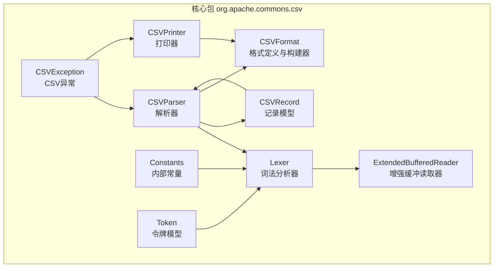
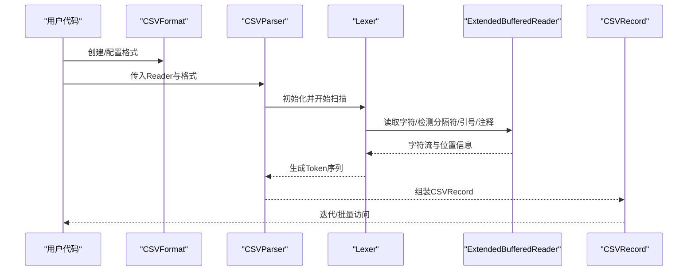
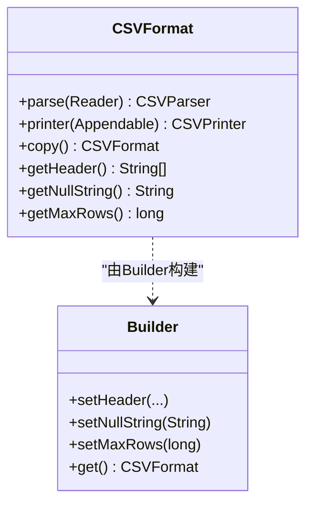
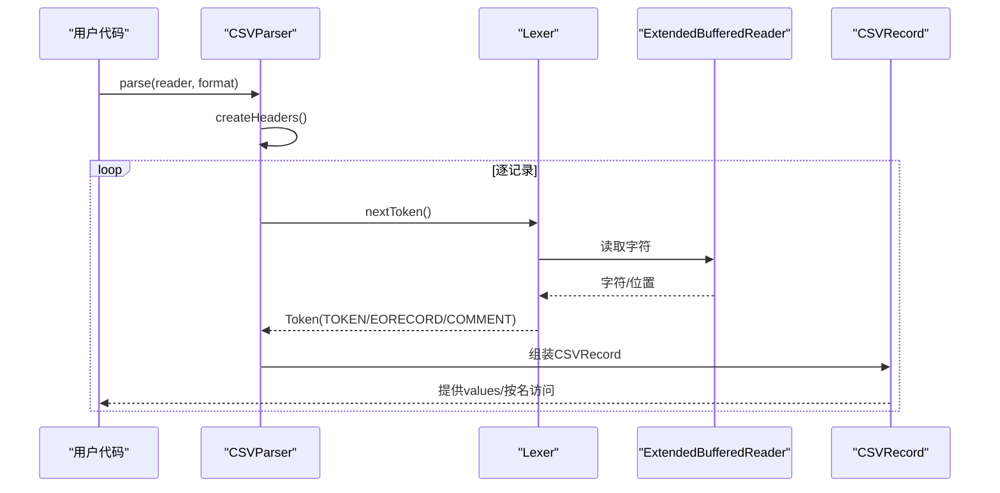
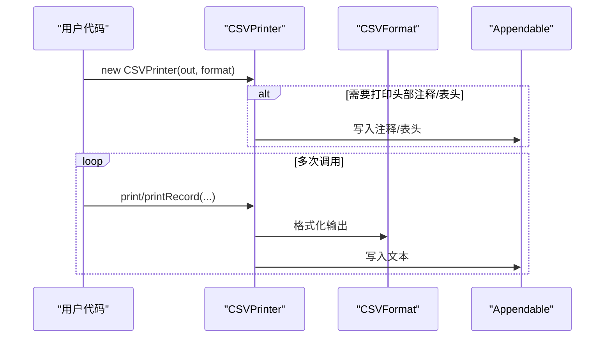
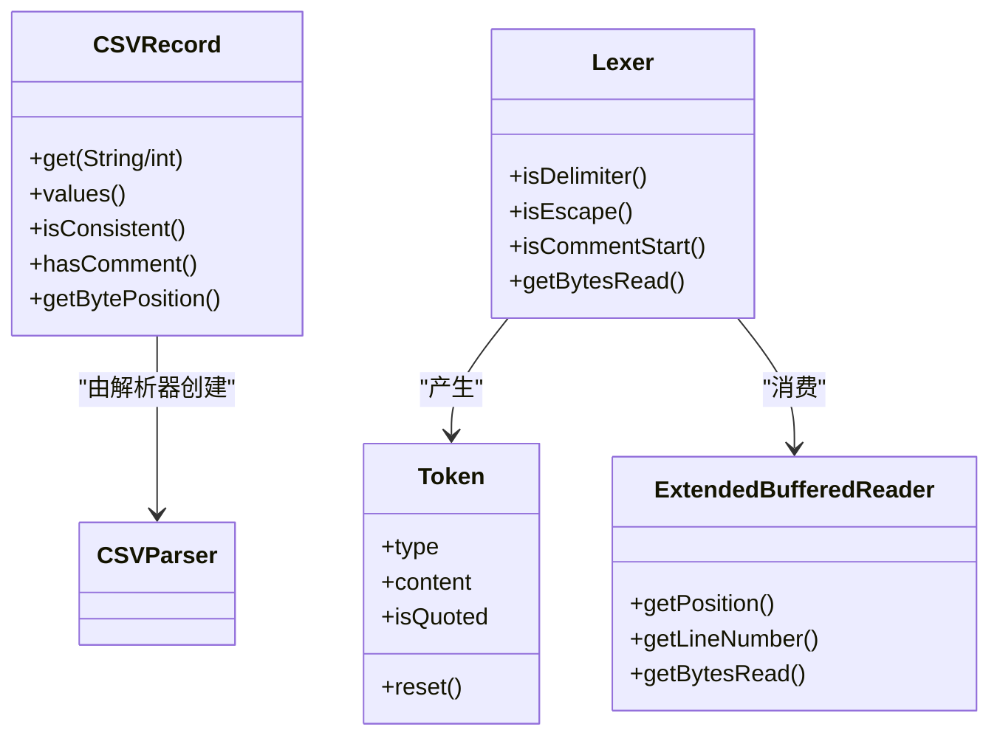
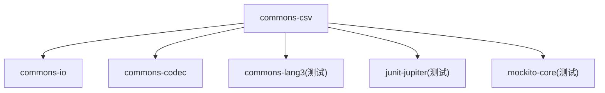

# 项目概述

<cite>
**本文档引用的文件**
- [README.md](file://README.md)
- [pom.xml](file://pom.xml)
- [package-info.java](file://src/main/java/org/apache/commons/csv/package-info.java)
- [CSVFormat.java](file://src/main/java/org/apache/commons/csv/CSVFormat.java)
- [CSVParser.java](file://src/main/java/org/apache/commons/csv/CSVParser.java)
- [CSVPrinter.java](file://src/main/java/org/apache/commons/csv/CSVPrinter.java)
- [CSVRecord.java](file://src/main/java/org/apache/commons/csv/CSVRecord.java)
- [Lexer.java](file://src/main/java/org/apache/commons/csv/Lexer.java)
- [ExtendedBufferedReader.java](file://src/main/java/org/apache/commons/csv/ExtendedBufferedReader.java)
- [Constants.java](file://src/main/java/org/apache/commons/csv/Constants.java)
- [Token.java](file://src/main/java/org/apache/commons/csv/Token.java)
- [CSVException.java](file://src/main/java/org/apache/commons/csv/CSVException.java)
- [LICENSE.txt](file://LICENSE.txt)
- [RELEASE-NOTES.txt](file://RELEASE-NOTES.txt)
</cite>

## 目录
1. [简介](#简介)
2. [项目结构](#项目结构)
3. [核心组件](#核心组件)
4. [架构总览](#架构总览)
5. [详细组件分析](#详细组件分析)
6. [依赖分析](#依赖分析)
7. [性能考虑](#性能考虑)
8. [故障排查指南](#故障排查指南)
9. [结论](#结论)
10. [附录](#附录)

## 简介
Apache Commons CSV 是 Apache Commons 生态系统中的一个轻量级 CSV 处理库，提供简单直观的 API 来读写多种 CSV 变体。其核心价值主张在于：
- 多格式支持：内置多种预定义格式（如 Excel、RFC4180、PostgreSQL 等），并允许灵活自定义分隔符、引号、注释等参数。
- 流式处理能力：解析器按记录逐条消费输入，避免一次性加载到内存，适合大文件处理。
- 内存效率：通过词法分析器与缓冲读取器协作，减少中间对象分配，降低 GC 压力。
- 易用性：提供简洁的构建器模式与便捷工厂方法，支持从字符串、文件、URL、Reader 等多种来源读取；支持直接打印到 Writer 或 Appendable。

该项目在 Apache Commons 生态中定位为“基础工具库”，服务于需要可靠 CSV 解析与生成的各类应用，尤其适用于数据导入导出、ETL、报表生成等场景。

**章节来源**
- [README.md:43-120](file://README.md#L43-L120)
- [pom.xml:25-31](file://pom.xml#L25-L31)

## 项目结构
仓库采用标准 Maven 结构，核心源码位于 src/main/java/org/apache/commons/csv 下，包含以下关键模块：
- CSVFormat：CSV 格式定义与构建器，负责解析/打印行为的配置。
- CSVParser：基于格式的解析器，支持迭代与批量读取。
- CSVPrinter：基于格式的打印器，支持单行/多行/ResultSet 输出。
- CSVRecord：单条记录的数据载体，提供按索引或列名访问。
- Lexer/ExtendedBufferedReader：词法分析与增强缓冲读取，支撑高效流式解析。
- Constants/Token：内部常量与令牌模型，用于词法状态传递。
- 异常类型：CSVException 统一异常模型。

**图表来源**
- [CSVFormat.java:182](file://src/main/java/org/apache/commons/csv/CSVFormat.java#L182)
- [CSVParser.java:147](file://src/main/java/org/apache/commons/csv/CSVParser.java#L147)
- [CSVPrinter.java:80](file://src/main/java/org/apache/commons/csv/CSVPrinter.java#L80)
- [CSVRecord.java:43](file://src/main/java/org/apache/commons/csv/CSVRecord.java#L43)
- [Lexer.java:32](file://src/main/java/org/apache/commons/csv/Lexer.java#L32)
- [ExtendedBufferedReader.java:44](file://src/main/java/org/apache/commons/csv/ExtendedBufferedReader.java#L44)
- [Constants.java:25](file://src/main/java/org/apache/commons/csv/Constants.java#L25)
- [Token.java:30](file://src/main/java/org/apache/commons/csv/Token.java#L30)
- [CSVException.java:31](file://src/main/java/org/apache/commons/csv/CSVException.java#L31)

**章节来源**
- [package-info.java:20-85](file://src/main/java/org/apache/commons/csv/package-info.java#L20-L85)

## 核心组件
本节对三大核心组件进行深入剖析，并说明它们之间的协作关系与职责边界。

- CSVFormat
  - 职责：定义 CSV 的解析/打印行为，包括分隔符、引号、注释、空值字符串、换行策略、是否忽略空白、是否跳过首行头等。
  - 特性：不可变对象，提供 Builder 模式；内置多种预定义格式；支持设置列名、注释、最大行数等。
  - 关键点：通过 setHeader(...) 支持按列名安全访问；通过 setNullString(...) 控制空值转换；通过 setMaxRows(...) 控制输出/解析上限。

- CSVParser
  - 职责：将输入流按指定格式解析为 CSVRecord 序列；支持迭代、批量读取、流式 API。
  - 特性：记录当前位置、行号、字节位置；支持首行作为头、重复头处理策略；支持注释与尾注释。
  - 关键点：内部使用 Lexer 与 ExtendedBufferedReader 进行高效流式解析；提供 getRecords() 与 stream() 等批量接口。

- CSVPrinter
  - 职责：将数据以指定格式打印为 CSV 文本；支持单行、多行、Iterable/Stream、ResultSet 等多种输入。
  - 特性：线程安全（内部锁）；支持自动刷新；支持注释打印；支持 JDBC Blob/Clob 输出。
  - 关键点：通过 format.copy() 避免外部状态污染；支持并发场景下的并行流打印。

**章节来源**
- [CSVFormat.java:50-182](file://src/main/java/org/apache/commons/csv/CSVFormat.java#L50-L182)
- [CSVParser.java:56-147](file://src/main/java/org/apache/commons/csv/CSVParser.java#L56-L147)
- [CSVPrinter.java:43-80](file://src/main/java/org/apache/commons/csv/CSVPrinter.java#L43-L80)

## 架构总览
下图展示了从输入到输出的完整数据流路径，以及各组件间的依赖关系：

**图表来源**
- [CSVParser.java:556-567](file://src/main/java/org/apache/commons/csv/CSVParser.java#L556-L567)
- [Lexer.java:54-66](file://src/main/java/org/apache/commons/csv/Lexer.java#L54-L66)
- [ExtendedBufferedReader.java:81-84](file://src/main/java/org/apache/commons/csv/ExtendedBufferedReader.java#L81-L84)
- [CSVRecord.java:70-78](file://src/main/java/org/apache/commons/csv/CSVRecord.java#L70-L78)

## 详细组件分析

### CSVFormat 分析
- 设计要点
  - 不可变性：所有修改均通过 Builder 返回新实例，保证线程安全与可复用性。
  - 预定义格式：提供 EXCEL、RFC4180、MYSQL、ORACLE、POSTGRESQL_*、MONGODB_* 等常用格式。
  - 列名与注释：支持 setHeader(...) 与 setHeaderComments(...)，实现安全列名访问与元数据输出。
  - 行数限制：setMaxRows(...) 与 useRow(...) 协作，控制解析/打印上限。
- 关键流程（构建与应用）
  - 使用 create()/create(CSVFormat) 获取 Builder。
  - 通过 set* 方法配置分隔符、引号、注释、空值字符串、忽略空白等。
  - 调用 get() 得到不可变 CSVFormat 实例，供 CSVParser/CSVPrinter 使用。

**图表来源**
- [CSVFormat.java:182](file://src/main/java/org/apache/commons/csv/CSVFormat.java#L182)
- [CSVFormat.java:189](file://src/main/java/org/apache/commons/csv/CSVFormat.java#L189)

**章节来源**
- [CSVFormat.java:50-182](file://src/main/java/org/apache/commons/csv/CSVFormat.java#L50-L182)

### CSVParser 分析
- 设计要点
  - 流式解析：基于 Lexer 与 ExtendedBufferedReader，逐记录消费输入。
  - 头部处理：支持自动读取首行作为头、显式头、忽略头等策略；重复头处理策略可配置。
  - 位置追踪：提供 getCurrentLineNumber()/getRecordNumber()/getBytePosition() 等定位信息。
  - 批量读取：getRecords()/stream() 支持一次性读取至内存（谨慎使用）。
- 关键流程（解析）
  - 构造时复制 CSVFormat 并初始化 Lexer。
  - createHeaders() 读取/校验头映射。
  - nextRecord() 通过 Lexer 产出 Token，组装为 CSVRecord。
  - 迭代器/流式接口按需消费记录。

**图表来源**
- [CSVParser.java:556-567](file://src/main/java/org/apache/commons/csv/CSVParser.java#L556-L567)
- [Lexer.java:54-66](file://src/main/java/org/apache/commons/csv/Lexer.java#L54-L66)
- [ExtendedBufferedReader.java:81-84](file://src/main/java/org/apache/commons/csv/ExtendedBufferedReader.java#L81-L84)
- [CSVRecord.java:70-78](file://src/main/java/org/apache/commons/csv/CSVRecord.java#L70-L78)

**章节来源**
- [CSVParser.java:147-782](file://src/main/java/org/apache/commons/csv/CSVParser.java#L147-L782)

### CSVPrinter 分析
- 设计要点
  - 写入策略：根据 CSVFormat 决定是否转义/封装、换行策略、注释输出。
  - 多种输入：支持 print(Object)/printRecord(...)/printRecords(...) 等多种签名；支持 Stream/Iterable/ResultSet。
  - 并发安全：内部使用 ReentrantLock 保护打印操作；支持并行流打印。
  - 自动刷新：可通过 AutoFlush 选项自动刷新底层输出。
- 关键流程（打印）
  - 构造时可打印头部注释与表头。
  - printRecord(...) 将多个值按格式写出并换行。
  - printRecords(ResultSet) 逐行读取结果集并写出。

**图表来源**
- [CSVPrinter.java:107-123](file://src/main/java/org/apache/commons/csv/CSVPrinter.java#L107-L123)
- [CSVPrinter.java:326-377](file://src/main/java/org/apache/commons/csv/CSVPrinter.java#L326-L377)

**章节来源**
- [CSVPrinter.java:80-580](file://src/main/java/org/apache/commons/csv/CSVPrinter.java#L80-L580)

### 数据模型与内部组件
- CSVRecord
  - 表示一条记录，提供按索引与列名访问；支持一致性检查、注释访问、位置信息。
- Token/Lexer
  - Lexer 负责识别分隔符、引号、注释、换行等；Token 作为词法单元在解析器与 Lexer 之间传递。
- ExtendedBufferedReader
  - 提供前瞻读取、行号统计、字符/字节位置跟踪，支撑精确的错误定位与性能优化。
- Constants
  - 定义内部使用的常量（如分隔符、换行符、引号等）。

**图表来源**
- [CSVRecord.java:43](file://src/main/java/org/apache/commons/csv/CSVRecord.java#L43)
- [Token.java:30](file://src/main/java/org/apache/commons/csv/Token.java#L30)
- [Lexer.java:32](file://src/main/java/org/apache/commons/csv/Lexer.java#L32)
- [ExtendedBufferedReader.java:44](file://src/main/java/org/apache/commons/csv/ExtendedBufferedReader.java#L44)

**章节来源**
- [CSVRecord.java:43-371](file://src/main/java/org/apache/commons/csv/CSVRecord.java#L43-L371)
- [Token.java:30-81](file://src/main/java/org/apache/commons/csv/Token.java#L30-L81)
- [Lexer.java:32-200](file://src/main/java/org/apache/commons/csv/Lexer.java#L32-L200)
- [ExtendedBufferedReader.java:44-200](file://src/main/java/org/apache/commons/csv/ExtendedBufferedReader.java#L44-L200)
- [Constants.java:25-91](file://src/main/java/org/apache/commons/csv/Constants.java#L25-L91)

## 依赖分析
- 外部依赖
  - commons-io：提供 IO 工具与缓冲读取器基类。
  - commons-codec：Base64 编码（用于 JDBC Blob 输出）。
  - commons-lang3：测试与工具类（测试依赖）。
  - junit-jupiter/mockito：测试框架。
- 构建与质量保障
  - Maven 插件链：编译、打包、测试、静态检查、SpotBugs、PMD、Checkstyle、RAT 等。
  - 性能基准：JMH 基准测试（可选 profile）。

**图表来源**
- [pom.xml:31-71](file://pom.xml#L31-L71)

**章节来源**
- [pom.xml:31-71](file://pom.xml#L31-L71)

## 性能考虑
- 流式解析优先：建议使用迭代方式逐条处理记录，避免一次性将大文件载入内存。
- 并行打印：CSVPrinter 支持并行流打印，但注意内部锁的开销；对于高吞吐场景建议评估锁竞争。
- 词法优化：Lexer 对单字符分隔符进行了专门优化，多字符分隔符会带来额外开销。
- 字节位置追踪：启用字节追踪会增加编码器计算成本，仅在需要精确定位时开启。
- 最大行数限制：通过 CSVFormat.Builder.setMaxRows(...) 限制解析/打印数量，避免资源耗尽。

[本节为通用指导，无需特定文件引用]

## 故障排查指南
- 常见问题
  - 输入格式不合法：抛出 CSVException（继承 IOException），请检查分隔符、引号、注释配置。
  - 重复头/空头：通过 DuplicateHeaderMode 与 allowMissingColumnNames 控制行为。
  - 空值转换：通过 setNullString(...) 控制空字符串与 null 的互转。
  - 并行流卡顿：CSVPrinter.printRecord(Stream) 在并行流下可能阻塞，建议串行或分批处理。
- 排查步骤
  - 启用更详细的日志与异常堆栈。
  - 使用 getCurrentLineNumber()/getRecordNumber() 精确定位问题记录。
  - 逐步缩小格式配置范围，先用 DEFAULT/RFC4180 验证输入有效性。
  - 对于 JDBC 输出，确认 ResultSet 元数据与列类型（Clob/Blob 会特殊处理）。

**章节来源**
- [CSVException.java:31-47](file://src/main/java/org/apache/commons/csv/CSVException.java#L31-L47)
- [CSVParser.java:668-751](file://src/main/java/org/apache/commons/csv/CSVParser.java#L668-L751)
- [CSVPrinter.java:489-513](file://src/main/java/org/apache/commons/csv/CSVPrinter.java#L489-L513)

## 结论
Apache Commons CSV 以简洁的 API 和强大的流式处理能力，覆盖了从简单到复杂的 CSV 场景需求。其不可变格式、高效的词法分析与缓冲读取、以及丰富的预定义格式，使其成为 Java 生态中 CSV 处理的首选方案之一。对于大规模数据与高并发场景，建议结合流式 API、最大行数限制与并行打印策略，以获得最佳性能与稳定性。

[本节为总结性内容，无需特定文件引用]

## 附录

### 适用场景与目标用户
- 适用场景
  - 数据导入/导出（Excel、数据库导出、报表生成）。
  - ETL/数据清洗（按列名安全访问、注释保留、空值处理）。
  - 日志与审计（注释打印、位置追踪、严格格式控制）。
- 目标用户
  - 后端工程师：快速集成 CSV 导入导出功能。
  - 数据工程师：处理复杂格式与大文件。
  - 测试工程师：配合测试框架验证 CSV 生成与解析。

[本节为概念性说明，无需特定文件引用]

### 版本信息与许可证
- 版本信息
  - 当前稳定版本：1.14.1（参考发布说明）。
  - Java 要求：Java 8 或以上。
- 许可证
  - Apache License 2.0。
- 社区支持
  - 官方主页、下载页、Javadoc、邮件列表、问题跟踪（JIRA）、Slack 频道、Twitter。

**章节来源**
- [README.md:43-120](file://README.md#L43-L120)
- [RELEASE-NOTES.txt:1-50](file://RELEASE-NOTES.txt#L1-L50)
- [LICENSE.txt:1-203](file://LICENSE.txt#L1-L203)