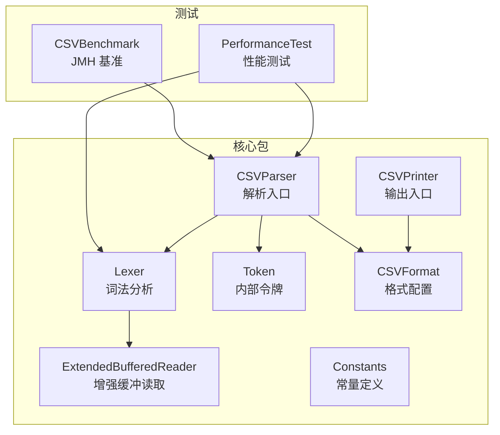
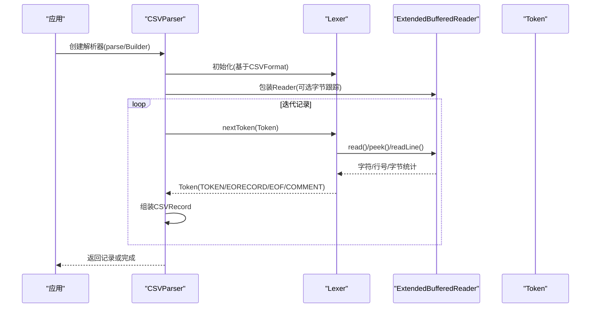
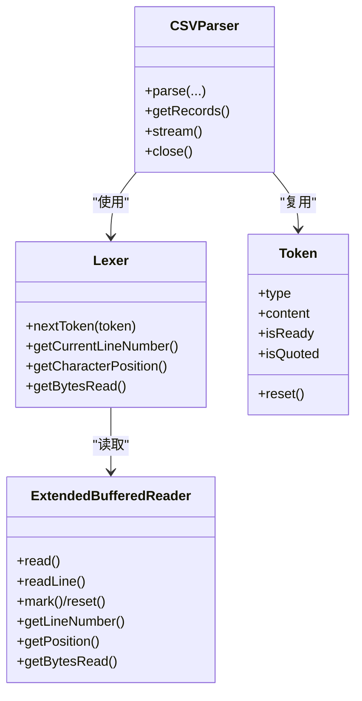
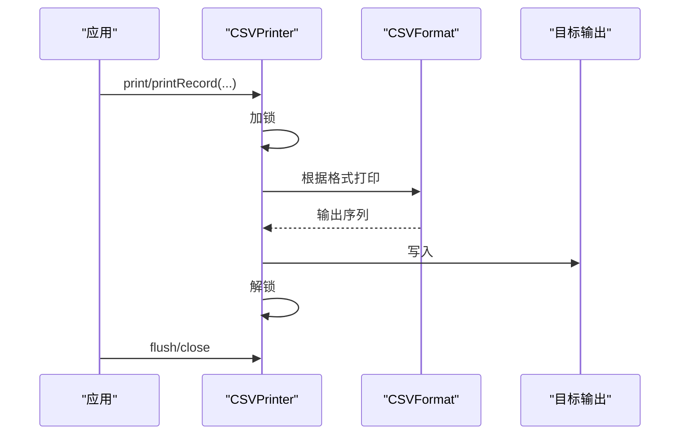
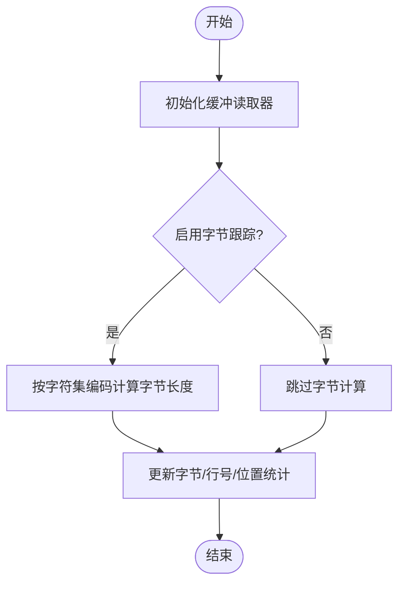
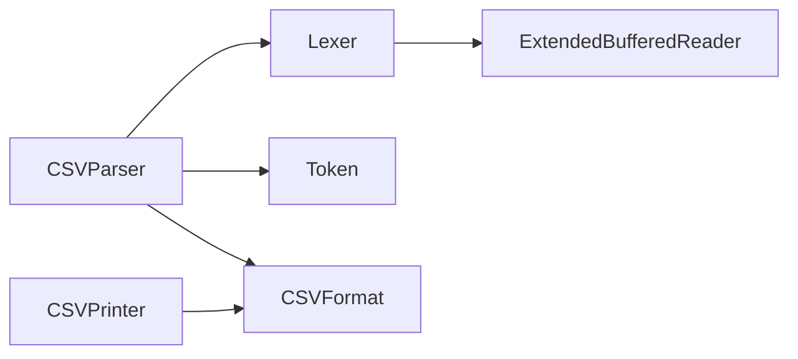

# 性能优化

<cite>
**本文档引用的文件**
- [CSVParser.java](file://src/main/java/org/apache/commons/csv/CSVParser.java)
- [CSVPrinter.java](file://src/main/java/org/apache/commons/csv/CSVPrinter.java)
- [ExtendedBufferedReader.java](file://src/main/java/org/apache/commons/csv/ExtendedBufferedReader.java)
- [Lexer.java](file://src/main/java/org/apache/commons/csv/Lexer.java)
- [CSVFormat.java](file://src/main/java/org/apache/commons/csv/CSVFormat.java)
- [Constants.java](file://src/main/java/org/apache/commons/csv/Constants.java)
- [Token.java](file://src/main/java/org/apache/commons/csv/Token.java)
- [PerformanceTest.java](file://src/test/java/org/apache/commons/csv/PerformanceTest.java)
- [CSVBenchmark.java](file://src/test/java/org/apache/commons/csv/CSVBenchmark.java)
- [BENCHMARK.md](file://BENCHMARK.md)
- [benchmark-prereq.sh](file://benchmark-prereq.sh)
- [pom.xml](file://pom.xml)
</cite>

## 目录
1. [引言](#引言)
2. [项目结构](#项目结构)
3. [核心组件](#核心组件)
4. [架构总览](#架构总览)
5. [详细组件分析](#详细组件分析)
6. [依赖分析](#依赖分析)
7. [性能考虑](#性能考虑)
8. [故障排查指南](#故障排查指南)
9. [结论](#结论)
10. [附录](#附录)

## 引言
本指南围绕 Apache Commons CSV 的解析与打印流程，系统性梳理内存使用优化、流式处理、缓冲区配置、垃圾回收优化、大文件处理最佳实践、JVM 参数调优、I/O 优化、并发策略、CSV 格式对性能的影响，并结合仓库内提供的基准测试与性能测试工具，给出可落地的优化建议与案例研究路径。目标是帮助开发者在不同场景下实现最优的 CSV 处理性能。

## 项目结构
该项目采用标准的 Maven 结构，核心代码位于 src/main/java 下的 org.apache.commons.csv 包中，测试代码位于 src/test 下，包含单元测试、性能测试与 JMH 基准测试。关键模块包括：
- 解析器：CSVParser、Lexer、ExtendedBufferedReader、Token
- 打印器：CSVPrinter
- 格式定义：CSVFormat、Constants
- 测试与基准：PerformanceTest（自研）、CSVBenchmark（JMH）

图表来源
- [CSVParser.java](file://src/main/java/org/apache/commons/csv/CSVParser.java)
- [CSVPrinter.java](file://src/main/java/org/apache/commons/csv/CSVPrinter.java)
- [ExtendedBufferedReader.java](file://src/main/java/org/apache/commons/csv/ExtendedBufferedReader.java)
- [Lexer.java](file://src/main/java/org/apache/commons/csv/Lexer.java)
- [CSVFormat.java](file://src/main/java/org/apache/commons/csv/CSVFormat.java)
- [Constants.java](file://src/main/java/org/apache/commons/csv/Constants.java)
- [Token.java](file://src/main/java/org/apache/commons/csv/Token.java)
- [PerformanceTest.java](file://src/test/java/org/apache/commons/csv/PerformanceTest.java)
- [CSVBenchmark.java](file://src/test/java/org/apache/commons/csv/CSVBenchmark.java)

章节来源
- [CSVParser.java](file://src/main/java/org/apache/commons/csv/CSVParser.java)
- [CSVPrinter.java](file://src/main/java/org/apache/commons/csv/CSVPrinter.java)
- [ExtendedBufferedReader.java](file://src/main/java/org/apache/commons/csv/ExtendedBufferedReader.java)
- [Lexer.java](file://src/main/java/org/apache/commons/csv/Lexer.java)
- [CSVFormat.java](file://src/main/java/org/apache/commons/csv/CSVFormat.java)
- [Constants.java](file://src/main/java/org/apache/commons/csv/Constants.java)
- [Token.java](file://src/main/java/org/apache/commons/csv/Token.java)
- [PerformanceTest.java](file://src/test/java/org/apache/commons/csv/PerformanceTest.java)
- [CSVBenchmark.java](file://src/test/java/org/apache/commons/csv/CSVBenchmark.java)

## 核心组件
- CSVParser：记录级解析入口，支持从文件、URL、Reader 等输入源创建；内部通过 Lexer 和 ExtendedBufferedReader 实现流式读取与词法分析；提供迭代器与流式 API。
- Lexer：词法分析器，负责逐字符扫描、识别分隔符、引号、注释、转义等；维护首行换行符、位置信息与字节计数（当启用字节跟踪时）。
- ExtendedBufferedReader：增强的缓冲读取器，支持前瞻读取、行号统计、字符位置统计与按字符集编码计算字节数（可选）。
- CSVPrinter：面向输出的打印器，支持注释、头、批量打印、自动刷新与并发安全（内部锁）。
- CSVFormat：格式化配置，控制分隔符、引号、转义、忽略空白、空行、最大行数、空字符串替换等；提供 Builder 模式以避免重复对象。
- Token：内部令牌结构，承载类型（TOKEN/EORECORD/EOF/COMMENT/INVALID）、内容（StringBuilder）与就绪状态。
- Constants：包内常量（如分隔符、换行符、制表符等）。

章节来源
- [CSVParser.java](file://src/main/java/org/apache/commons/csv/CSVParser.java)
- [Lexer.java](file://src/main/java/org/apache/commons/csv/Lexer.java)
- [ExtendedBufferedReader.java](file://src/main/java/org/apache/commons/csv/ExtendedBufferedReader.java)
- [CSVPrinter.java](file://src/main/java/org/apache/commons/csv/CSVPrinter.java)
- [CSVFormat.java](file://src/main/java/org/apache/commons/csv/CSVFormat.java)
- [Token.java](file://src/main/java/org/apache/commons/csv/Token.java)
- [Constants.java](file://src/main/java/org/apache/commons/csv/Constants.java)

## 架构总览
下图展示了解析与打印的关键交互路径，以及流式处理与缓冲区的作用点。

图表来源
- [CSVParser.java](file://src/main/java/org/apache/commons/csv/CSVParser.java)
- [Lexer.java](file://src/main/java/org/apache/commons/csv/Lexer.java)
- [ExtendedBufferedReader.java](file://src/main/java/org/apache/commons/csv/ExtendedBufferedReader.java)
- [Token.java](file://src/main/java/org/apache/commons/csv/Token.java)

## 详细组件分析

### 解析器与词法分析（内存与流式）
- 流式处理：CSVParser 通过迭代器逐条消费记录，避免一次性将整文件加载到内存；适合大文件处理。
- 记录缓冲：内部使用列表作为记录缓冲，随需增长但复用，降低频繁分配成本。
- 令牌复用：Lexer 使用 Token 对象并支持 reset，减少对象创建与 GC 压力。
- 行号与位置：Lexer/ExtendedBufferedReader 提供行号与字符位置统计，便于定位与调试。
- 字节跟踪：当启用字节跟踪时，可统计字节数，有助于监控 I/O 成本与编码转换开销。

图表来源
- [CSVParser.java](file://src/main/java/org/apache/commons/csv/CSVParser.java)
- [Lexer.java](file://src/main/java/org/apache/commons/csv/Lexer.java)
- [ExtendedBufferedReader.java](file://src/main/java/org/apache/commons/csv/ExtendedBufferedReader.java)
- [Token.java](file://src/main/java/org/apache/commons/csv/Token.java)

章节来源
- [CSVParser.java](file://src/main/java/org/apache/commons/csv/CSVParser.java)
- [Lexer.java](file://src/main/java/org/apache/commons/csv/Lexer.java)
- [ExtendedBufferedReader.java](file://src/main/java/org/apache/commons/csv/ExtendedBufferedReader.java)
- [Token.java](file://src/main/java/org/apache/commons/csv/Token.java)

### 输出与并发安全（打印器）
- 并发安全：CSVPrinter 内部使用重入锁保护打印过程，避免多线程竞争导致的数据损坏。
- 自动刷新：可通过 CSVFormat 控制自动刷新行为，平衡吞吐与延迟。
- 批量打印：支持批量打印多个记录，减少系统调用次数。
- 注释与头：支持打印注释与头部，遵循格式配置。

图表来源
- [CSVPrinter.java](file://src/main/java/org/apache/commons/csv/CSVPrinter.java)
- [CSVFormat.java](file://src/main/java/org/apache/commons/csv/CSVFormat.java)

章节来源
- [CSVPrinter.java](file://src/main/java/org/apache/commons/csv/CSVPrinter.java)
- [CSVFormat.java](file://src/main/java/org/apache/commons/csv/CSVFormat.java)

### 缓冲区与字节跟踪（I/O 优化）
- 缓冲读取：ExtendedBufferedReader 提供高效缓冲读取，支持前瞻读取与行号统计。
- 字节跟踪：在启用字节跟踪时，按字符集编码计算每个字符的字节长度，累计字节数用于性能度量。
- 位置管理：支持 mark/reset，便于回退与重试场景。

图表来源
- [ExtendedBufferedReader.java](file://src/main/java/org/apache/commons/csv/ExtendedBufferedReader.java)

章节来源
- [ExtendedBufferedReader.java](file://src/main/java/org/apache/commons/csv/ExtendedBufferedReader.java)

### CSV 格式对性能的影响
- 分隔符选择：较短的分隔符（单字符）通常更快；避免使用包含换行符的分隔符，减少词法分析复杂度。
- 引号与转义：引号与转义会增加解析分支判断；在允许的情况下尽量减少引号包裹与转义字符。
- 忽略空白与空行：合理设置忽略空白与空行可减少无效处理；但过度的 trim 会增加 CPU 开销。
- 最大行数限制：通过 CSVFormat.Builder.setMaxRows 限制处理行数，避免不必要的内存占用。
- 空字符串替换：nullString 配置影响空值处理逻辑，避免在严格模式下误判空字符串为 null。

章节来源
- [CSVFormat.java](file://src/main/java/org/apache/commons/csv/CSVFormat.java)
- [Lexer.java](file://src/main/java/org/apache/commons/csv/Lexer.java)

## 依赖分析
- 外部依赖：commons-io、commons-codec、JMH（测试阶段），用于 I/O 工具、编码与基准测试。
- 内部耦合：CSVParser 依赖 Lexer 与 ExtendedBufferedReader；Lexer 依赖 CSVFormat 与 ExtendedBufferedReader；Token 由 Lexer 复用；CSVPrinter 依赖 CSVFormat。

图表来源
- [CSVParser.java](file://src/main/java/org/apache/commons/csv/CSVParser.java)
- [Lexer.java](file://src/main/java/org/apache/commons/csv/Lexer.java)
- [ExtendedBufferedReader.java](file://src/main/java/org/apache/commons/csv/ExtendedBufferedReader.java)
- [Token.java](file://src/main/java/org/apache/commons/csv/Token.java)
- [CSVPrinter.java](file://src/main/java/org/apache/commons/csv/CSVPrinter.java)
- [CSVFormat.java](file://src/main/java/org/apache/commons/csv/CSVFormat.java)

章节来源
- [pom.xml](file://pom.xml)

## 性能考虑

### 内存使用优化策略
- 流式解析优先：使用 CSVParser 的迭代器或流式 API，避免一次性将整文件加载到内存。
- 令牌复用：Lexer 使用 Token.reset 复用对象，减少对象分配与 GC 抖动。
- 记录缓冲复用：CSVParser 内部列表随需增长但复用，降低扩容成本。
- 关闭资源：及时关闭 CSVParser/CSVPrinter，释放底层 Reader/Writer 资源。
- 字节跟踪按需开启：仅在需要监控 I/O 成本时启用字节跟踪，避免额外编码计算开销。

章节来源
- [CSVParser.java](file://src/main/java/org/apache/commons/csv/CSVParser.java)
- [Lexer.java](file://src/main/java/org/apache/commons/csv/Lexer.java)
- [ExtendedBufferedReader.java](file://src/main/java/org/apache/commons/csv/ExtendedBufferedReader.java)

### 大文件处理最佳实践
- 分块读取：结合 BufferedInputStream/BufferedReader 与固定缓冲大小，按块读取大文件。
- 双缓冲（Double Buffering）：在性能测试中提供了“双缓冲”路径，可参考其思路在高吞吐场景下减少阻塞。
- 流式写入：使用 CSVPrinter 进行流式写入，避免构建中间大对象。
- 限制行数：通过 CSVFormat.Builder.setMaxRows 控制处理上限，防止内存膨胀。
- 压缩数据：测试数据使用 GZIP 压缩，实际场景中可结合压缩流减少磁盘与网络 I/O。

章节来源
- [PerformanceTest.java](file://src/test/java/org/apache/commons/csv/PerformanceTest.java)
- [CSVBenchmark.java](file://src/test/java/org/apache/commons/csv/CSVBenchmark.java)

### JVM 参数与并发策略
- 基准测试使用了服务端模式与堆大小参数，可在高吞吐场景下稳定 GC 行为。
- 并发打印：CSVPrinter 内部使用重入锁，适合多线程写入同一目标；注意外部并发控制与共享资源。
- I/O 线程池：对于多源并发解析，建议使用独立线程池与限流策略，避免 I/O 竞争。

章节来源
- [CSVBenchmark.java](file://src/test/java/org/apache/commons/csv/CSVBenchmark.java)
- [CSVPrinter.java](file://src/main/java/org/apache/commons/csv/CSVPrinter.java)

### I/O 操作优化
- 缓冲区大小：根据磁盘与网络特性调整缓冲大小；过大导致内存压力，过小导致系统调用频繁。
- 字节跟踪：在需要精确度量时启用，否则关闭以减少编码计算。
- 行号与位置统计：仅在需要定位问题时使用，避免不必要的统计开销。

章节来源
- [ExtendedBufferedReader.java](file://src/main/java/org/apache/commons/csv/ExtendedBufferedReader.java)
- [Lexer.java](file://src/main/java/org/apache/commons/csv/Lexer.java)

### CSV 格式对性能的影响
- 分隔符：单字符分隔符优于多字符；避免包含换行符的分隔符。
- 引号与转义：减少不必要的引号包裹与转义字符，简化词法分析。
- 空白处理：合理设置忽略空白与空行，避免多余 trim 与空记录处理。
- 最大行数：通过 CSVFormat.Builder.setMaxRows 限制处理规模。

章节来源
- [CSVFormat.java](file://src/main/java/org/apache/commons/csv/CSVFormat.java)
- [Lexer.java](file://src/main/java/org/apache/commons/csv/Lexer.java)

### 基准测试与对比分析
- JMH 基准：CSVBenchmark 提供了与多个 CSV 库的对比，涵盖读取、扫描、分割与解析等场景。
- 自研性能测试：PerformanceTest 提供了针对 Lexer、ExtendedBufferedReader 与不同输入路径的性能测试，便于定位瓶颈。
- 运行方式：BENCHMARK.md 提供了运行 JMH 与自研性能测试的说明。

章节来源
- [CSVBenchmark.java](file://src/test/java/org/apache/commons/csv/CSVBenchmark.java)
- [PerformanceTest.java](file://src/test/java/org/apache/commons/csv/PerformanceTest.java)
- [BENCHMARK.md](file://BENCHMARK.md)

### 实际优化案例研究与代码示例
- 案例一：使用 Builder 模式与流式 API 处理大文件，避免全量加载。
- 案例二：在高并发写入场景下使用 CSVPrinter 的自动刷新与锁机制，保证一致性与性能。
- 案例三：通过 CSVFormat.Builder.setMaxRows 限制处理规模，结合分块读取与流式写入，实现稳定的吞吐。

章节来源
- [CSVParser.java](file://src/main/java/org/apache/commons/csv/CSVParser.java)
- [CSVPrinter.java](file://src/main/java/org/apache/commons/csv/CSVPrinter.java)
- [CSVFormat.java](file://src/main/java/org/apache/commons/csv/CSVFormat.java)

### 性能瓶颈识别与解决
- 瓶颈识别
  - 词法分析：Lexer 在复杂转义与引号场景下的分支判断较多，可通过简化格式或预处理数据降低开销。
  - 编码转换：字节跟踪涉及编码计算，必要时关闭以减少 CPU 开销。
  - I/O 阻塞：磁盘/网络 I/O 可能成为瓶颈，应结合缓冲区大小与并发策略优化。
- 解决方案
  - 采用流式处理与令牌复用，减少对象分配。
  - 合理设置 CSVFormat，减少不必要的 trim、空行与转义处理。
  - 使用 JMH 与自研性能测试定位具体瓶颈模块（Lexer、BufferedReader、Printer）。

章节来源
- [Lexer.java](file://src/main/java/org/apache/commons/csv/Lexer.java)
- [ExtendedBufferedReader.java](file://src/main/java/org/apache/commons/csv/ExtendedBufferedReader.java)
- [PerformanceTest.java](file://src/test/java/org/apache/commons/csv/PerformanceTest.java)
- [CSVBenchmark.java](file://src/test/java/org/apache/commons/csv/CSVBenchmark.java)

## 故障排查指南
- 常见问题
  - 解析异常：检查 CSVFormat 配置（分隔符、引号、转义、空行处理）是否与输入一致。
  - 内存溢出：确认使用流式解析而非一次性加载；检查是否正确关闭资源。
  - 性能不达预期：评估是否启用了不必要的字节跟踪与 trim；检查缓冲区大小与并发策略。
- 排查步骤
  - 使用 PerformanceTest 或 CSVBenchmark 定位瓶颈模块。
  - 逐步关闭功能（如字节跟踪、trim、空行处理）观察性能变化。
  - 检查外部依赖版本与 JVM 参数配置。

章节来源
- [PerformanceTest.java](file://src/test/java/org/apache/commons/csv/PerformanceTest.java)
- [CSVBenchmark.java](file://src/test/java/org/apache/commons/csv/CSVBenchmark.java)
- [CSVParser.java](file://src/main/java/org/apache/commons/csv/CSVParser.java)
- [CSVPrinter.java](file://src/main/java/org/apache/commons/csv/CSVPrinter.java)

## 结论
通过对解析器、词法分析器、缓冲读取器与打印器的深入分析，结合仓库内的基准测试与性能测试工具，可以系统性地优化 CSV 处理性能。关键在于：采用流式处理与令牌复用、合理配置 CSVFormat、按需启用字节跟踪、优化 I/O 缓冲与并发策略，并通过 JMH 与自研测试持续验证与回归。这些实践能够帮助在不同场景下实现稳定且高效的 CSV 处理性能。

## 附录
- 运行基准测试与性能测试
  - JMH 基准：参考 BENCHMARK.md 中的命令行说明，使用 Maven Profile 运行。
  - 自研性能测试：运行 PerformanceTest 类，查看各模块耗时统计。
- 依赖安装脚本：benchmark-prereq.sh 用于安装特定第三方 CSV 库依赖，便于对比测试。

章节来源
- [BENCHMARK.md](file://BENCHMARK.md)
- [benchmark-prereq.sh](file://benchmark-prereq.sh)
- [PerformanceTest.java](file://src/test/java/org/apache/commons/csv/PerformanceTest.java)
- [CSVBenchmark.java](file://src/test/java/org/apache/commons/csv/CSVBenchmark.java)