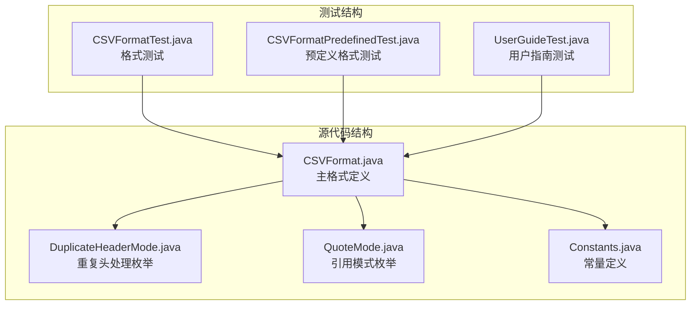
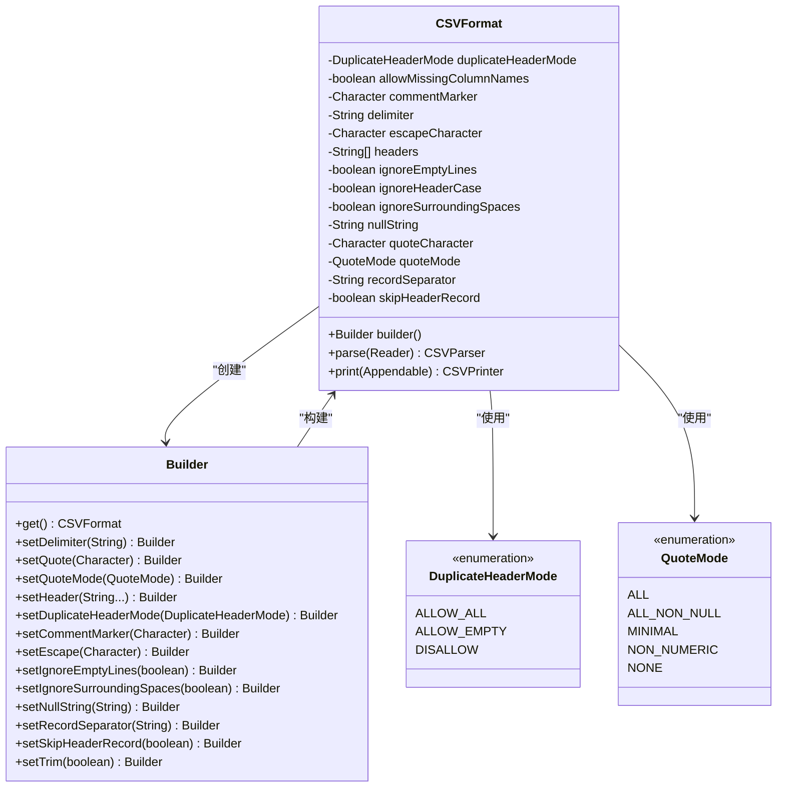
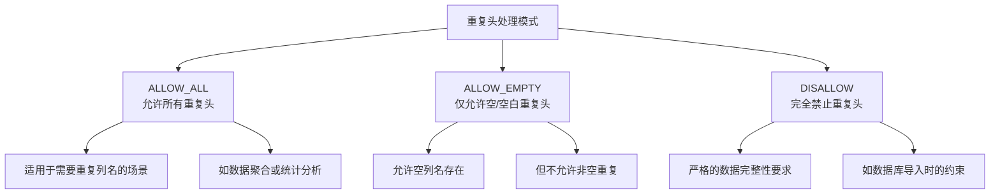
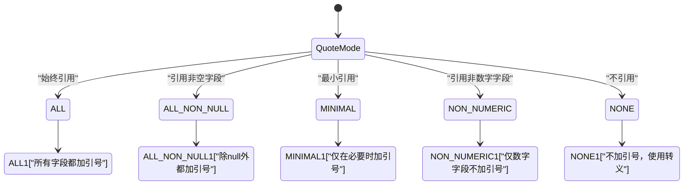
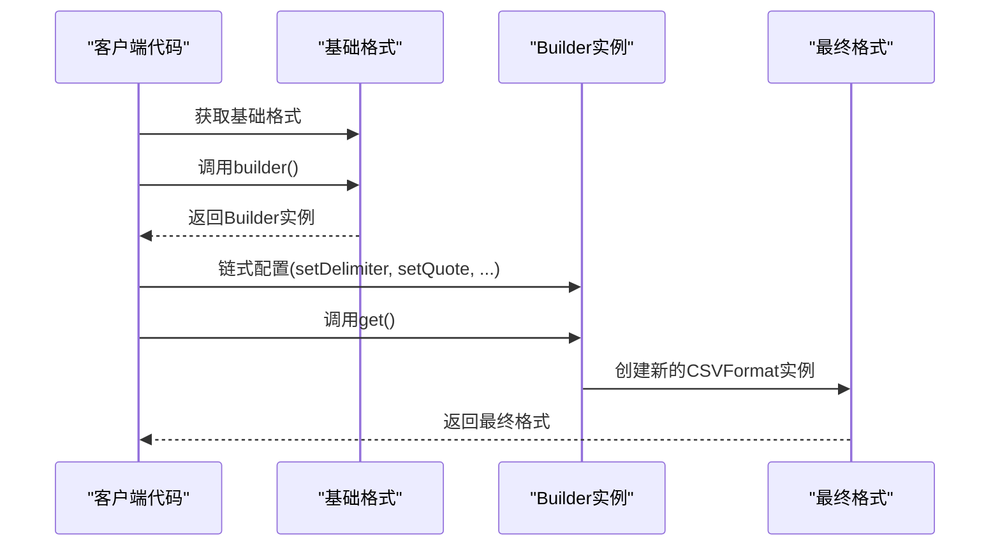
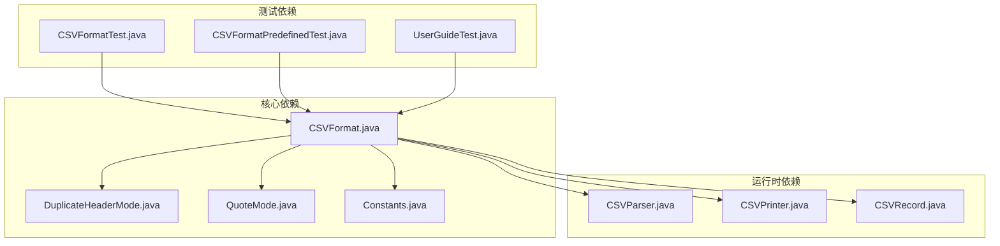

# 自定义格式配置

<cite>
**本文档引用的文件**
- [CSVFormat.java](file://src/main/java/org/apache/commons/csv/CSVFormat.java)
- [DuplicateHeaderMode.java](file://src/main/java/org/apache/commons/csv/DuplicateHeaderMode.java)
- [QuoteMode.java](file://src/main/java/org/apache/commons/csv/QuoteMode.java)
- [Constants.java](file://src/main/java/org/apache/commons/csv/Constants.java)
- [CSVFormatTest.java](file://src/test/java/org/apache/commons/csv/CSVFormatTest.java)
- [CSVFormatPredefinedTest.java](file://src/test/java/org/apache/commons/csv/CSVFormatPredefinedTest.java)
- [UserGuideTest.java](file://src/test/java/org/apache/commons/csv/UserGuideTest.java)
</cite>

## 目录
1. [简介](#简介)
2. [项目结构](#项目结构)
3. [核心组件](#核心组件)
4. [架构概览](#架构概览)
5. [详细组件分析](#详细组件分析)
6. [依赖关系分析](#依赖关系分析)
7. [性能考虑](#性能考虑)
8. [故障排除指南](#故障排除指南)
9. [结论](#结论)
10. [附录](#附录)

## 简介
本指南专注于Apache Commons CSV库中CSVFormat.Builder模式的高级用法，提供完整的自定义CSV格式配置文档。内容涵盖重复头处理模式、引用模式配置、复杂格式定义示例、格式继承与默认值覆盖机制，以及与预定义格式的对比分析。

## 项目结构
该项目采用标准的Java Maven结构，核心代码位于`src/main/java/org/apache/commons/csv/`目录下，测试代码位于`src/test/java/org/apache/commons/csv/`目录下。



**图表来源**
- [CSVFormat.java:1-100](file://src/main/java/org/apache/commons/csv/CSVFormat.java#L1-L100)
- [DuplicateHeaderMode.java:1-45](file://src/main/java/org/apache/commons/csv/DuplicateHeaderMode.java#L1-L45)
- [QuoteMode.java:1-55](file://src/main/java/org/apache/commons/csv/QuoteMode.java#L1-L55)

## 核心组件
本节详细介绍CSV格式配置的核心组件及其作用。

### CSVFormat.Builder模式
CSVFormat.Builder是构建CSV格式实例的工厂类，提供了丰富的配置方法：

- **创建方式**：通过`CSVFormat.DEFAULT.builder()`或`CSVFormat.EXCEL.builder()`等预定义格式进行扩展
- **链式调用**：支持连续的配置方法调用，提高代码可读性
- **不可变性**：最终生成的CSVFormat实例是不可变的，保证线程安全

### 关键配置参数详解

#### 分隔符配置
- **setDelimiter(char)**：设置单字符分隔符
- **setDelimiter(String)**：设置多字符分隔符
- **验证规则**：分隔符不能包含换行符，且不能为空字符串

#### 引用字符配置
- **setQuote(char)**：设置引用字符
- **setQuote(Character)**：可设置为null以禁用引用
- **默认行为**：通常使用双引号作为引用字符

#### 记录分隔符配置
- **setRecordSeparator(String)**：设置输出记录分隔符
- **注意**：仅影响打印操作，不影响解析

#### 引用模式配置
- **setQuoteMode(QuoteMode)**：设置引用策略
- **QuoteMode枚举**：ALL、ALL_NON_NULL、MINIMAL、NON_NUMERIC、NONE

**章节来源**
- [CSVFormat.java:189-326](file://src/main/java/org/apache/commons/csv/CSVFormat.java#L189-L326)
- [CSVFormat.java:446-471](file://src/main/java/org/apache/commons/csv/CSVFormat.java#L446-L471)
- [CSVFormat.java:787-821](file://src/main/java/org/apache/commons/csv/CSVFormat.java#L787-L821)

## 架构概览
CSV格式配置系统采用Builder模式实现，具有清晰的职责分离和良好的扩展性。



**图表来源**
- [CSVFormat.java:182-1839](file://src/main/java/org/apache/commons/csv/CSVFormat.java#L182-L1839)
- [DuplicateHeaderMode.java:28-44](file://src/main/java/org/apache/commons/csv/DuplicateHeaderMode.java#L28-L44)
- [QuoteMode.java:26-54](file://src/main/java/org/apache/commons/csv/QuoteMode.java#L26-L54)

## 详细组件分析

### 重复头处理模式(DuplicateHeaderMode)
DuplicateHeaderMode枚举控制CSV文件中重复头部字段的处理策略。

#### 枚举选项详解



**图表来源**
- [DuplicateHeaderMode.java:28-44](file://src/main/java/org/apache/commons/csv/DuplicateHeaderMode.java#L28-L44)

#### 配置示例与应用场景

| 模式 | 配置方法 | 应用场景 | 示例 |
|------|----------|----------|------|
| ALLOW_ALL | `setDuplicateHeaderMode(DuplicateHeaderMode.ALLOW_ALL)` | 数据分析中的重复列名 | 多维度统计报表 |
| ALLOW_EMPTY | `setDuplicateHeaderMode(DuplicateHeaderMode.ALLOW_EMPTY)` | 允许空列名但禁止重复命名 | 可选字段的灵活处理 |
| DISALLOW | `setDuplicateHeaderMode(DuplicateHeaderMode.DISALLOW)` | 严格的数据完整性 | 数据库导入验证 |

**章节来源**
- [CSVFormat.java:474-483](file://src/main/java/org/apache/commons/csv/CSVFormat.java#L474-L483)
- [CSVFormatTest.java:144-195](file://src/test/java/org/apache/commons/csv/CSVFormatTest.java#L144-L195)

### 引用模式(QuoteMode)配置
QuoteMode枚举定义了字段引用的策略，影响CSV输出的格式化行为。

#### 引用模式详解



**图表来源**
- [QuoteMode.java:26-54](file://src/main/java/org/apache/commons/csv/QuoteMode.java#L26-L54)

#### 各模式的最佳实践

| 模式 | 适用场景 | 性能影响 | 安全性 |
|------|----------|----------|--------|
| ALL | 需要绝对兼容性的场景 | 中等 | 高 |
| ALL_NON_NULL | 大多数标准CSV场景 | 低 | 高 |
| MINIMAL | 需要紧凑格式的场景 | 最低 | 中等 |
| NON_NUMERIC | 数值数据为主的场景 | 低 | 中等 |
| NONE | 需要特殊转义处理的场景 | 中等 | 低 |

**章节来源**
- [CSVFormat.java:2427-2484](file://src/main/java/org/apache/commons/csv/CSVFormat.java#L2427-L2484)
- [CSVFormat.java:2516-2534](file://src/main/java/org/apache/commons/csv/CSVFormat.java#L2516-L2534)

### 复杂格式定义示例
以下展示如何创建复杂的自定义CSV格式配置：

#### 示例1：自定义分隔符和引用字符
```java
// 创建基于RFC4180的格式，但使用分号作为分隔符
CSVFormat customFormat = CSVFormat.RFC4180
    .builder()
    .setDelimiter(';')
    .setQuote('\'')  // 使用单引号作为引用字符
    .setEscape('\\') // 设置转义字符
    .setRecordSeparator("\n")
    .setIgnoreEmptyLines(false)
    .setQuoteMode(QuoteMode.MINIMAL)
    .get();
```

#### 示例2：带注释的格式
```java
// 创建带注释支持的格式
CSVFormat annotatedFormat = CSVFormat.DEFAULT
    .builder()
    .setCommentMarker('#')           // 设置注释标记
    .setHeaderComments("生成时间", "2024-01-01")
    .setIgnoreEmptyLines(true)
    .setTrim(true)
    .get();
```

#### 示例3：数据库导出格式
```java
// 创建适合数据库导出的格式
CSVFormat dbFormat = CSVFormat.DEFAULT
    .builder()
    .setDelimiter('\t')              // 使用制表符
    .setQuote(null)                  // 禁用引用
    .setEscape('\\')                 // 设置转义
    .setNullString("\\N")            // 设置NULL字符串
    .setQuoteMode(QuoteMode.ALL_NON_NULL)
    .setIgnoreEmptyLines(false)
    .get();
```

**章节来源**
- [CSVFormat.java:1042-1062](file://src/main/java/org/apache/commons/csv/CSVFormat.java#L1042-L1062)
- [CSVFormat.java:1246-1254](file://src/main/java/org/apache/commons/csv/CSVFormat.java#L1246-L1254)

### 格式继承与默认值覆盖机制
CSVFormat支持从现有格式继承配置并进行局部修改。



**图表来源**
- [CSVFormat.java:1663-1665](file://src/main/java/org/apache/commons/csv/CSVFormat.java#L1663-L1665)
- [CSVFormat.java:324-326](file://src/main/java/org/apache/commons/csv/CSVFormat.java#L324-L326)

**章节来源**
- [CSVFormat.java:1616-1640](file://src/main/java/org/apache/commons/csv/CSVFormat.java#L1616-L1640)

## 依赖关系分析



**图表来源**
- [CSVFormat.java:1-50](file://src/main/java/org/apache/commons/csv/CSVFormat.java#L1-L50)
- [CSVFormatTest.java:1-52](file://src/test/java/org/apache/commons/csv/CSVFormatTest.java#L1-L52)

**章节来源**
- [CSVFormat.java:1-182](file://src/main/java/org/apache/commons/csv/CSVFormat.java#L1-L182)

## 性能考虑
在配置CSV格式时，需要考虑不同设置对性能的影响：

### 内存使用优化
- **QuoteMode.MINIMAL**：减少不必要的引号，降低输出大小
- **禁用引用**：在不需要引用的场景下可显著减少内存使用
- **合理设置缓冲区**：对于大文件处理，考虑使用流式处理而非一次性加载

### 处理速度优化
- **避免过度引用**：ALL模式会增加处理时间，建议使用MINIMAL或NON_NUMERIC
- **减少字符串操作**：合理使用trim和ignoreSurroundingSpaces设置
- **批量处理**：对于大量数据，使用批量处理而非逐条处理

### 内存管理
- **及时释放资源**：确保CSVParser和CSVPrinter正确关闭
- **避免内存泄漏**：不要长时间持有大型CSV数据的引用

## 故障排除指南

### 常见配置错误及解决方案

#### 分隔符冲突错误
当分隔符与引用字符、转义字符或注释字符相同时会抛出异常：

```java
// 错误示例 - 分隔符与引用字符相同
IllegalArgumentException: 分隔符和引用字符不能相同

// 正确做法
CSVFormat format = CSVFormat.DEFAULT
    .builder()
    .setDelimiter(',')   // 分隔符
    .setQuote('"')       // 引用字符
    .setEscape('\\')     // 转义字符
    .get();
```

#### QuoteMode NONE配置错误
当设置QuoteMode为NONE但未设置转义字符时会抛出异常：

```java
// 错误示例
IllegalArgumentException: Quote模式设置为NONE但未设置转义字符

// 正确做法
CSVFormat format = CSVFormat.DEFAULT
    .builder()
    .setQuoteMode(QuoteMode.NONE)
    .setEscape('\\')  // 必须设置转义字符
    .get();
```

#### 重复头处理错误
当违反重复头处理规则时会抛出异常：

```java
// 错误示例 - 违反重复头处理规则
IllegalArgumentException: 头部包含重复名称

// 解决方案1：允许重复头
format = format.builder()
    .setDuplicateHeaderMode(DuplicateHeaderMode.ALLOW_ALL)
    .get();

// 解决方案2：清理重复头
String[] cleanHeaders = removeDuplicates(originalHeaders);
format = format.builder()
    .setHeader(cleanHeaders)
    .get();
```

**章节来源**
- [CSVFormat.java:2606-2640](file://src/main/java/org/apache/commons/csv/CSVFormat.java#L2606-L2640)
- [CSVFormatTest.java:92-131](file://src/test/java/org/apache/commons/csv/CSVFormatTest.java#L92-L131)

### 调试技巧
1. **启用详细日志**：检查格式配置是否按预期应用
2. **单元测试验证**：为自定义格式编写测试用例
3. **边界条件测试**：测试极端情况如空值、特殊字符等
4. **性能监控**：监控内存使用和处理速度

## 结论
通过深入理解CSVFormat.Builder模式，开发者可以创建高度定制化的CSV格式配置。关键在于：

1. **合理选择引用模式**：根据数据特点选择最适合的QuoteMode
2. **正确配置重复头处理**：平衡数据完整性和灵活性
3. **优化性能配置**：在功能性和性能之间找到最佳平衡点
4. **充分测试验证**：确保格式配置在各种场景下都能正常工作

这些配置选项使得Apache Commons CSV能够适应从简单数据导出到复杂企业级应用的各种需求。

## 附录

### 预定义格式对比表

| 预定义格式 | 分隔符 | 引用字符 | 转义字符 | 引用模式 | 特殊设置 |
|------------|--------|----------|----------|----------|----------|
| DEFAULT | , | " | null | MINIMAL | 允许空行 |
| EXCEL | , | " | null | MINIMAL | 允许空行，忽略缺失列名 |
| RFC4180 | , | " | null | MINIMAL | 不允许空行 |
| MYSQL | \t | null | \ | ALL_NON_NULL | 不允许空行，NULL字符串"\N" |
| ORACLE | , | " | \ | MINIMAL | 去除空白，系统行分隔符 |
| POSTGRESQL_CSV | , | " | null | ALL_NON_NULL | LF分隔符，空字符串NULL |
| POSTGRESQL_TEXT | \t | null | \ | ALL_NON_NULL | LF分隔符，"\N"NULL |
| MONGODB_CSV | , | " | " | MINIMAL | MongoDB特定格式 |
| MONGODB_TSV | \t | " | " | MINIMAL | MongoDB TSV格式 |
| TDF | \t | null | null | MINIMAL | TDF格式，忽略周围空格 |

### 选择指南
- **通用CSV处理**：优先选择DEFAULT或EXCEL格式
- **严格标准合规**：使用RFC4180格式
- **数据库导出**：根据具体数据库选择MYSQL或POSTGRESQL格式
- **MongoDB集成**：使用MONGODB_CSV或MONGODB_TSV格式
- **高性能场景**：选择QuoteMode.MINIMAL或NONE，并禁用引用

**章节来源**
- [CSVFormat.java:1031-1415](file://src/main/java/org/apache/commons/csv/CSVFormat.java#L1031-L1415)
- [CSVFormatPredefinedTest.java:31-84](file://src/test/java/org/apache/commons/csv/CSVFormatPredefinedTest.java#L31-L84)