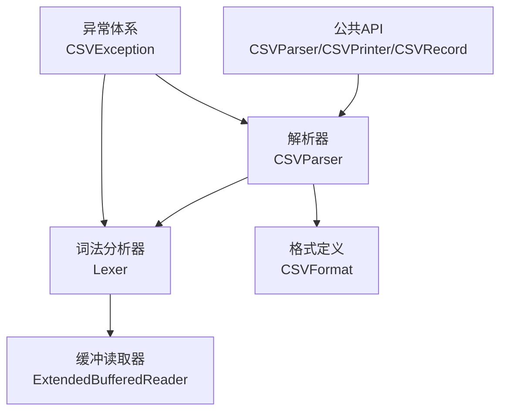
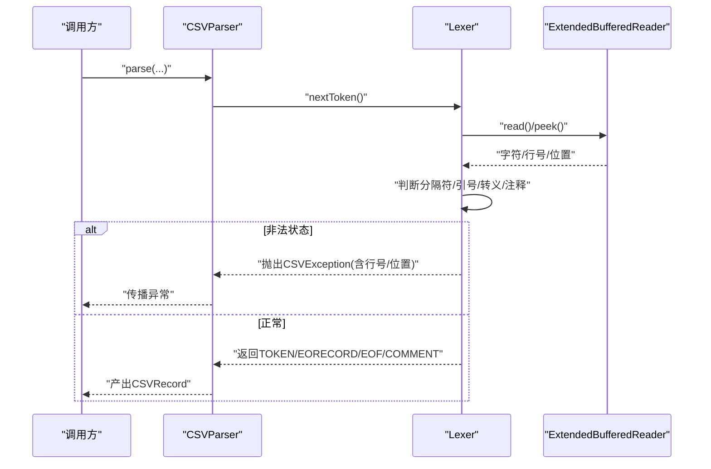
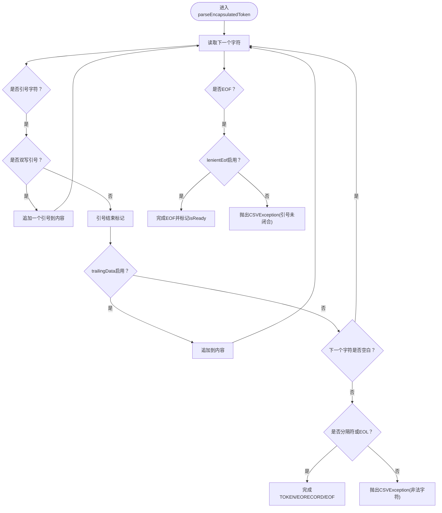
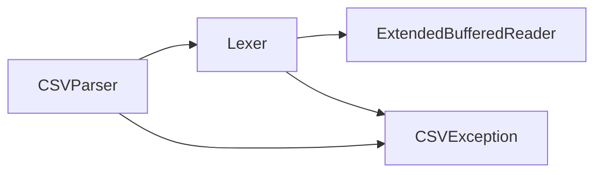
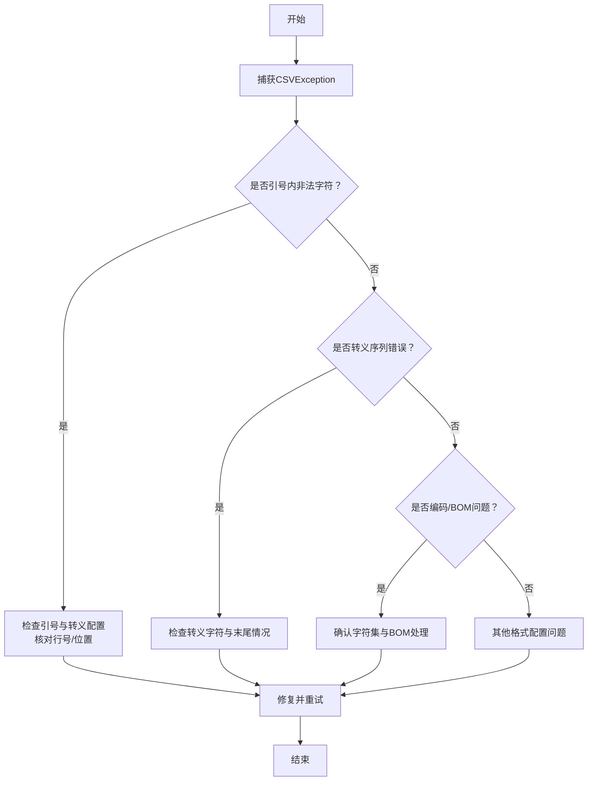

# 错误处理与调试

<cite>
**本文档引用的文件**
- [CSVException.java](file://src/main/java/org/apache/commons/csv/CSVException.java)
- [Lexer.java](file://src/main/java/org/apache/commons/csv/Lexer.java)
- [ExtendedBufferedReader.java](file://src/main/java/org/apache/commons/csv/ExtendedBufferedReader.java)
- [CSVParserTest.java](file://src/test/java/org/apache/commons/csv/CSVParserTest.java)
- [LexerTest.java](file://src/test/java/org/apache/commons/csv/LexerTest.java)
- [UserGuideTest.java](file://src/test/java/org/apache/commons/csv/UserGuideTest.java)
- [common-bugs-in-commons-csv-20260320.md](file://dialogs/common-bugs-in-commons-csv-20260320.md)
- [inject-a-bug-20260320.md](file://dialogs/inject-a-bug-20260320.md)
- [README.md](file://README.md)
</cite>

## 目录
1. [简介](#简介)
2. [项目结构](#项目结构)
3. [核心组件](#核心组件)
4. [架构总览](#架构总览)
5. [详细组件分析](#详细组件分析)
6. [依赖分析](#依赖分析)
7. [性能考虑](#性能考虑)
8. [故障排查指南](#故障排查指南)
9. [结论](#结论)
10. [附录](#附录)

## 简介
本指南聚焦于commons-csv库中的错误处理与调试实践，围绕CSVException及其在词法分析阶段的典型错误类型（格式不匹配、转义字符错误、编码问题）展开，提供错误恢复与容错策略、调试技巧（日志记录、错误追踪、问题定位）、常见问题诊断流程与修复示例，并给出生产环境健壮性建议与最佳实践模板。

## 项目结构
commons-csv采用分层设计：上层为公共API（CSVParser、CSVPrinter、CSVRecord），中层为词法分析器（Lexer）与缓冲读取器（ExtendedBufferedReader），底层为格式定义（CSVFormat）与常量（Constants）。错误主要在词法分析阶段产生，通过统一的CSVException向上抛出，便于调用方捕获与处理。

图示来源
- [Lexer.java:32-66](file://src/main/java/org/apache/commons/csv/Lexer.java#L32-L66)
- [ExtendedBufferedReader.java:44-84](file://src/main/java/org/apache/commons/csv/ExtendedBufferedReader.java#L44-L84)
- [CSVParserTest.java:1767-1779](file://src/test/java/org/apache/commons/csv/CSVParserTest.java#L1767-L1779)

章节来源
- [README.md:52-58](file://README.md#L52-L58)

## 核心组件
- CSVException：统一的IO异常基类，用于包装格式化消息，便于携带行号与位置信息。
- Lexer：词法分析器，负责逐字符扫描、识别令牌（TOKEN/EORECORD/EOF/COMMENT）、处理转义与引号、检测非法字符与EOF提前等错误。
- ExtendedBufferedReader：增强的缓冲读取器，支持前瞻读取、行号与位置跟踪、可选字节统计（按字符集编码计算）。

章节来源
- [CSVException.java:31-46](file://src/main/java/org/apache/commons/csv/CSVException.java#L31-L46)
- [Lexer.java:32-66](file://src/main/java/org/apache/commons/csv/Lexer.java#L32-L66)
- [ExtendedBufferedReader.java:44-84](file://src/main/java/org/apache/commons/csv/ExtendedBufferedReader.java#L44-L84)

## 架构总览
词法分析的关键流程：读取字符 → 判断是否为分隔符/换行/注释/引号/转义 → 按规则构建令牌 → 遇到非法状态抛出CSVException → 上层捕获并处理。

图示来源
- [Lexer.java:235-307](file://src/main/java/org/apache/commons/csv/Lexer.java#L235-L307)
- [Lexer.java:336-389](file://src/main/java/org/apache/commons/csv/Lexer.java#L336-L389)
- [Lexer.java:409-440](file://src/main/java/org/apache/commons/csv/Lexer.java#L409-L440)
- [Lexer.java:479-509](file://src/main/java/org/apache/commons/csv/Lexer.java#L479-L509)

## 详细组件分析

### CSVException：统一异常模型
- 继承自IOException，构造函数支持格式化消息，便于在词法分析器中携带行号与位置信息。
- 在多个错误分支中被抛出，确保调用方可获得明确的错误上下文。

章节来源
- [CSVException.java:31-46](file://src/main/java/org/apache/commons/csv/CSVException.java#L31-L46)
- [Lexer.java:369-371](file://src/main/java/org/apache/commons/csv/Lexer.java#L369-L371)
- [Lexer.java:383-383](file://src/main/java/org/apache/commons/csv/Lexer.java#L383-L383)
- [Lexer.java:500-500](file://src/main/java/org/apache/commons/csv/Lexer.java#L500-L500)

### 词法分析器（Lexer）：错误类型与处理
- 引号内非法字符：在解析被引令牌时，若遇到引号后非分隔符/换行/EOF且trailingData未启用，抛出CSVException并包含行号与位置。
- EOF提前：在lenientEof未启用时，读到EOF而引号未闭合，抛出CSVException并标注起始行。
- 转义序列错误：转义字符位于末尾或未知转义组合，抛出CSVException并提示“转义序列处理中遇到EOF”。
- 空白与忽略策略：当忽略周围空白时，会在简单令牌结束时修剪尾随空白；否则保留原样。

图示来源
- [Lexer.java:336-389](file://src/main/java/org/apache/commons/csv/Lexer.java#L336-L389)
- [Lexer.java:369-371](file://src/main/java/org/apache/commons/csv/Lexer.java#L369-L371)
- [Lexer.java:377-383](file://src/main/java/org/apache/commons/csv/Lexer.java#L377-L383)

章节来源
- [Lexer.java:336-389](file://src/main/java/org/apache/commons/csv/Lexer.java#L336-L389)
- [Lexer.java:409-440](file://src/main/java/org/apache/commons/csv/Lexer.java#L409-L440)
- [Lexer.java:479-509](file://src/main/java/org/apache/commons/csv/Lexer.java#L479-L509)

### 缓冲读取器（ExtendedBufferedReader）：编码与位置追踪
- 行号与位置：每次读取字符时更新行号与字符位置，支持前瞻读取（peek）与行读取（readLine）。
- 字节统计：可选开启按字符集编码计算字节数（用于UTF-8代理对与多字节字符的字节长度估算）。
- 错误定位：配合Lexer提供的行号与位置信息，快速定位问题字符。

章节来源
- [ExtendedBufferedReader.java:167-182](file://src/main/java/org/apache/commons/csv/ExtendedBufferedReader.java#L167-L182)
- [ExtendedBufferedReader.java:194-206](file://src/main/java/org/apache/commons/csv/ExtendedBufferedReader.java#L194-L206)
- [ExtendedBufferedReader.java:246-265](file://src/main/java/org/apache/commons/csv/ExtendedBufferedReader.java#L246-L265)
- [ExtendedBufferedReader.java:134-148](file://src/main/java/org/apache/commons/csv/ExtendedBufferedReader.java#L134-L148)

## 依赖分析
- Lexer依赖ExtendedBufferedReader进行字符读取与位置追踪。
- CSVParser依赖Lexer进行词法分析，再组织为CSVRecord。
- 异常CSVException贯穿词法分析与解析阶段，向上游传播。

图示来源
- [Lexer.java:32-66](file://src/main/java/org/apache/commons/csv/Lexer.java#L32-L66)
- [ExtendedBufferedReader.java:44-84](file://src/main/java/org/apache/commons/csv/ExtendedBufferedReader.java#L44-L84)
- [CSVException.java:31-46](file://src/main/java/org/apache/commons/csv/CSVException.java#L31-L46)

章节来源
- [Lexer.java:32-66](file://src/main/java/org/apache/commons/csv/Lexer.java#L32-L66)
- [ExtendedBufferedReader.java:44-84](file://src/main/java/org/apache/commons/csv/ExtendedBufferedReader.java#L44-L84)
- [CSVParserTest.java:1767-1779](file://src/test/java/org/apache/commons/csv/CSVParserTest.java#L1767-L1779)

## 性能考虑
- 词法分析避免不必要的对象创建与字符串拼接，优先使用StringBuilder与预分配缓冲。
- 合理设置CSVFormat（如忽略空白、忽略空行、宽松EOF），减少无效处理。
- 使用流式解析与限制最大行数，避免一次性加载大文件造成内存压力。

## 故障排查指南

### 常见错误类型与定位
- 格式不匹配
  - 现象：解析到引号内的非法字符或引号未闭合即报错。
  - 定位：根据异常消息中的行号与位置，结合ExtendedBufferedReader的行号/位置接口快速定位。
  - 示例参考：测试用例断言异常消息包含“引号内非法字符”与“行号/位置”。

- 转义字符错误
  - 现象：转义序列位于文件末尾或未知转义组合，抛出“转义序列处理中遇到EOF”。
  - 定位：检查转义字符配置与输入末尾是否合法。
  - 示例参考：转义处理分支抛出CSVException。

- 编码问题
  - 现象：多字节字符（如UTF-8代理对）字节统计异常或BOM处理不当。
  - 定位：确认字符集与BOM处理方式；使用带BOM处理的Reader；必要时启用字节统计。
  - 示例参考：用户指南测试展示BOM处理与UTF-8读取。

章节来源
- [CSVParserTest.java:1767-1779](file://src/test/java/org/apache/commons/csv/CSVParserTest.java#L1767-L1779)
- [Lexer.java:369-371](file://src/main/java/org/apache/commons/csv/Lexer.java#L369-L371)
- [Lexer.java:500-500](file://src/main/java/org/apache/commons/csv/Lexer.java#L500-L500)
- [UserGuideTest.java:50-92](file://src/test/java/org/apache/commons/csv/UserGuideTest.java#L50-L92)
- [ExtendedBufferedReader.java:134-148](file://src/main/java/org/apache/commons/csv/ExtendedBufferedReader.java#L134-L148)

### 调试技巧与工具
- 日志记录
  - 在调用方捕获CSVException后，记录异常消息、行号、位置与上下文（如当前记录号、字段索引）。
  - 使用ExtendedBufferedReader的行号与位置接口辅助定位。

- 错误追踪
  - 从词法分析器的nextToken开始，逐步回溯到上游调用链，确认格式配置与输入数据是否一致。
  - 结合单元测试用例（如LexerTest、CSVParserTest）对比期望行为与实际行为。

- 问题定位
  - 使用最小可复现输入（仅包含出错行与前后几行），缩小问题范围。
  - 针对BOM与编码问题，分别尝试不同字符集与BOM处理策略。

章节来源
- [LexerTest.java:72-113](file://src/test/java/org/apache/commons/csv/LexerTest.java#L72-L113)
- [UserGuideTest.java:50-92](file://src/test/java/org/apache/commons/csv/UserGuideTest.java#L50-L92)
- [ExtendedBufferedReader.java:167-182](file://src/main/java/org/apache/commons/csv/ExtendedBufferedReader.java#L167-L182)

### 常见问题诊断流程

图示来源
- [Lexer.java:336-389](file://src/main/java/org/apache/commons/csv/Lexer.java#L336-L389)
- [Lexer.java:479-509](file://src/main/java/org/apache/commons/csv/Lexer.java#L479-L509)
- [UserGuideTest.java:50-92](file://src/test/java/org/apache/commons/csv/UserGuideTest.java#L50-L92)

### 生产环境健壮性建议
- 配置与容错
  - 使用lenientEof与ignoreEmptyLines等格式选项，降低边界条件带来的解析失败。
  - 对外部输入进行预校验（如长度、字符集声明），并在解析前做基本合法性检查。

- 错误恢复
  - 对于可修复的格式问题（如多余空白），在捕获CSVException后进行数据清洗并重试。
  - 对于不可修复的输入，记录详细上下文并返回结构化的错误报告给上层系统。

- 监控与告警
  - 统计异常类型分布与频率，建立阈值告警。
  - 将异常消息、行号、位置与输入文件名关联存储，便于审计与回溯。

- 测试与回归
  - 基于现有测试用例扩展边界与异常场景，确保新版本不会引入回归。
  - 参考常见Bug清单与注入Bug示例，主动发现潜在问题。

章节来源
- [common-bugs-in-commons-csv-20260320.md:1-88](file://dialogs/common-bugs-in-commons-csv-20260320.md#L1-L88)
- [inject-a-bug-20260320.md:55-157](file://dialogs/inject-a-bug-20260320.md#L55-L157)

### 实际错误场景与修复示例
- 场景一：引号内出现非法字符
  - 现象：解析到引号后非分隔符或EOL且trailingData未启用，抛出CSVException。
  - 修复：调整格式配置（启用trailingData或修正输入），或在捕获异常后进行数据清洗。

- 场景二：转义序列位于文件末尾
  - 现象：转义字符后无字符，抛出“转义序列处理中遇到EOF”。
  - 修复：补齐转义序列或移除无效转义。

- 场景三：BOM与编码不匹配
  - 现象：读取UTF-8文件时出现乱码或解析异常。
  - 修复：使用带BOM处理的Reader并指定UTF-8字符集。

章节来源
- [Lexer.java:369-371](file://src/main/java/org/apache/commons/csv/Lexer.java#L369-L371)
- [Lexer.java:500-500](file://src/main/java/org/apache/commons/csv/Lexer.java#L500-L500)
- [UserGuideTest.java:50-92](file://src/test/java/org/apache/commons/csv/UserGuideTest.java#L50-L92)

### 异常处理最佳实践与模板
- 捕获与记录
  - 捕获CSVException，记录行号、位置与上下文，避免吞掉异常。
- 容错与重试
  - 对可修复的输入进行清洗与重试；对不可修复输入返回结构化错误。
- 配置校验
  - 在解析前校验CSVFormat配置与输入字符集，减少运行时异常。

章节来源
- [CSVParserTest.java:1767-1779](file://src/test/java/org/apache/commons/csv/CSVParserTest.java#L1767-L1779)
- [common-bugs-in-commons-csv-20260320.md:24-30](file://dialogs/common-bugs-in-commons-csv-20260320.md#L24-L30)

## 结论
通过对CSVException与词法分析器的深入剖析，结合测试用例与常见Bug清单，开发者可以更有效地识别、处理与预防CSV处理中的各类错误。在生产环境中，建议以格式配置校验、异常上下文记录、容错恢复与监控告警为核心，构建健壮的CSV处理逻辑。

## 附录
- 相关测试用例参考
  - 词法分析错误定位：[CSVParserTest.java:1767-1779](file://src/test/java/org/apache/commons/csv/CSVParserTest.java#L1767-L1779)
  - 转义与注释行为：[LexerTest.java:72-113](file://src/test/java/org/apache/commons/csv/LexerTest.java#L72-L113)
  - BOM与编码处理：[UserGuideTest.java:50-92](file://src/test/java/org/apache/commons/csv/UserGuideTest.java#L50-L92)
- 常见Bug清单与注入Bug示例
  - [common-bugs-in-commons-csv-20260320.md:1-88](file://dialogs/common-bugs-in-commons-csv-20260320.md#L1-L88)
  - [inject-a-bug-20260320.md:55-157](file://dialogs/inject-a-bug-20260320.md#L55-L157)