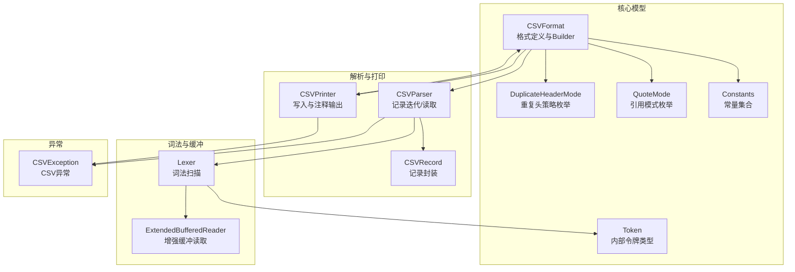
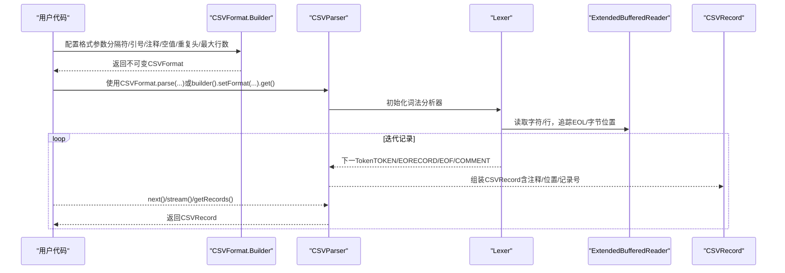
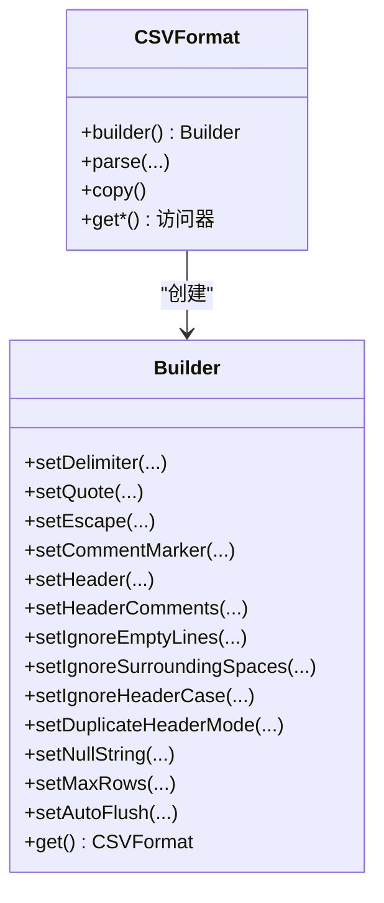
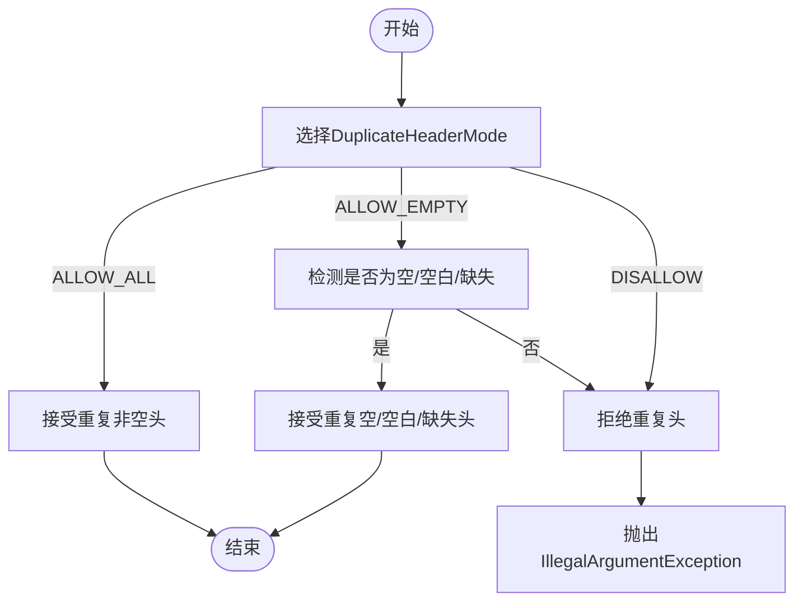
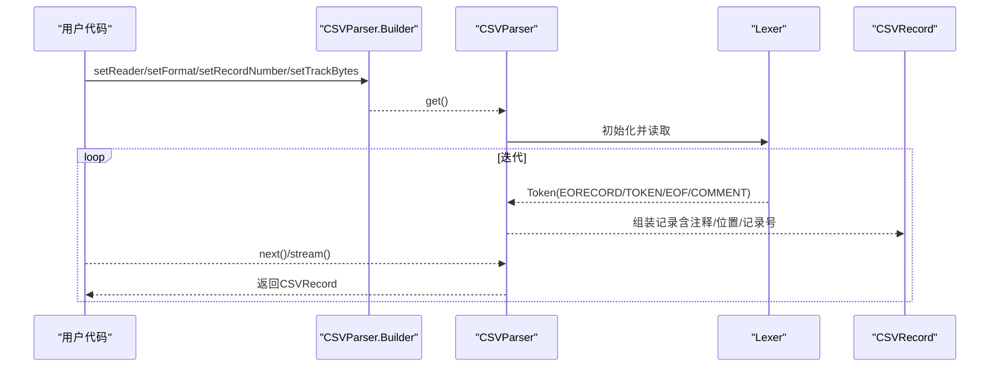
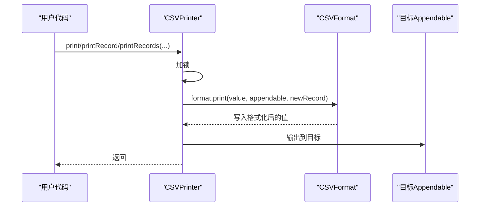
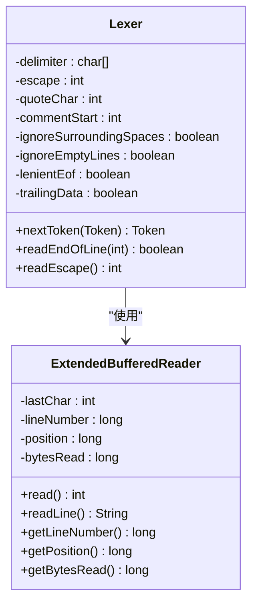
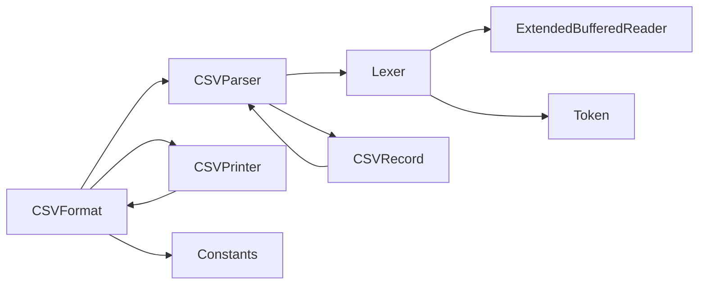

# 高级功能

<cite>
**本文引用的文件**
- [CSVFormat.java](file://src/main/java/org/apache/commons/csv/CSVFormat.java)
- [DuplicateHeaderMode.java](file://src/main/java/org/apache/commons/csv/DuplicateHeaderMode.java)
- [QuoteMode.java](file://src/main/java/org/apache/commons/csv/QuoteMode.java)
- [CSVParser.java](file://src/main/java/org/apache/commons/csv/CSVParser.java)
- [CSVPrinter.java](file://src/main/java/org/apache/commons/csv/CSVPrinter.java)
- [Lexer.java](file://src/main/java/org/apache/commons/csv/Lexer.java)
- [ExtendedBufferedReader.java](file://src/main/java/org/apache/commons/csv/ExtendedBufferedReader.java)
- [CSVRecord.java](file://src/main/java/org/apache/commons/csv/CSVRecord.java)
- [CSVException.java](file://src/main/java/org/apache/commons/csv/CSVException.java)
- [Constants.java](file://src/main/java/org/apache/commons/csv/Constants.java)
- [Token.java](file://src/main/java/org/apache/commons/csv/Token.java)
- [CSVDuplicateHeaderTest.java](file://src/test/java/org/apache/commons/csv/CSVDuplicateHeaderTest.java)
- [CSVFormatTest.java](file://src/test/java/org/apache/commons/csv/CSVFormatTest.java)
- [PerformanceTest.java](file://src/test/java/org/apache/commons/csv/PerformanceTest.java)
- [UserGuideTest.java](file://src/test/java/org/apache/commons/csv/UserGuideTest.java)
</cite>

## 目录
1. [简介](#简介)
2. [项目结构](#项目结构)
3. [核心组件](#核心组件)
4. [架构总览](#架构总览)
5. [详细组件分析](#详细组件分析)
6. [依赖关系分析](#依赖关系分析)
7. [性能考量](#性能考量)
8. [故障排查指南](#故障排查指南)
9. [结论](#结论)
10. [附录](#附录)

## 简介
本文件系统性梳理 Apache Commons CSV 的高级功能与定制化选项，围绕以下主题展开：  
- 自定义 CSV 格式配置（Builder 模式的高级用法、格式参数详解与最佳实践）  
- 高级特性（重复头处理模式、引用模式、注释支持、空值转换、行数限制等）  
- 性能优化（内存使用、大文件处理策略、I/O 与解析器优化）  
- 错误处理与调试（异常类型、错误恢复、定位与修复）  
- 复杂场景解决方案与集成模式（数据库、流式处理、BOM 支持等）

## 项目结构
该项目采用清晰的分层与职责分离设计：  
- 核心模型与格式定义：CSVFormat、DuplicateHeaderMode、QuoteMode、Constants、Token  
- 解析与打印：CSVParser、CSVPrinter  
- 词法分析与缓冲：Lexer、ExtendedBufferedReader  
- 记录封装：CSVRecord  
- 异常模型：CSVException  
- 测试覆盖：格式验证、重复头策略、性能基准、用户指南示例

图示来源
- [CSVFormat.java](file://src/main/java/org/apache/commons/csv/CSVFormat.java)
- [CSVParser.java](file://src/main/java/org/apache/commons/csv/CSVParser.java)
- [CSVPrinter.java](file://src/main/java/org/apache/commons/csv/CSVPrinter.java)
- [Lexer.java](file://src/main/java/org/apache/commons/csv/Lexer.java)
- [ExtendedBufferedReader.java](file://src/main/java/org/apache/commons/csv/ExtendedBufferedReader.java)
- [CSVRecord.java](file://src/main/java/org/apache/commons/csv/CSVRecord.java)
- [CSVException.java](file://src/main/java/org/apache/commons/csv/CSVException.java)
- [Constants.java](file://src/main/java/org/apache/commons/csv/Constants.java)
- [Token.java](file://src/main/java/org/apache/commons/csv/Token.java)

章节来源
- [CSVFormat.java](file://src/main/java/org/apache/commons/csv/CSVFormat.java)
- [CSVParser.java](file://src/main/java/org/apache/commons/csv/CSVParser.java)
- [CSVPrinter.java](file://src/main/java/org/apache/commons/csv/CSVPrinter.java)
- [Lexer.java](file://src/main/java/org/apache/commons/csv/Lexer.java)
- [ExtendedBufferedReader.java](file://src/main/java/org/apache/commons/csv/ExtendedBufferedReader.java)
- [CSVRecord.java](file://src/main/java/org/apache/commons/csv/CSVRecord.java)
- [CSVException.java](file://src/main/java/org/apache/commons/csv/CSVException.java)
- [Constants.java](file://src/main/java/org/apache/commons/csv/Constants.java)
- [Token.java](file://src/main/java/org/apache/commons/csv/Token.java)

## 核心组件
- CSVFormat：不可变格式定义，提供 Builder 模式以配置分隔符、引号、注释、空值字符串、忽略空白、换行处理、重复头策略、最大行数等。支持预定义格式（Excel、RFC4180、MySQL、PostgreSQL、MongoDB、Oracle、TDF 等）。  
- DuplicateHeaderMode：控制重复头行为（允许全部、仅允许空/空白/缺失、禁止）。  
- QuoteMode：控制字段引用策略（全部、非空、最小、非数值、不引用）。  
- CSVParser：按格式解析输入，支持逐条记录迭代、批量读取到内存、注释与尾注读取、字节/字符位置跟踪、记录号管理、最大行数限制。  
- CSVPrinter：按格式打印记录，支持注释输出、自动刷新、并发安全锁、JDBC 结果集导出。  
- Lexer/ExtendedBufferedReader：词法扫描与增强缓冲读取，支持多行值、EOL 规范、字节计数、字符编码转换长度计算。  
- CSVRecord：记录封装，提供按索引/名称访问、映射一致性检查、注释、位置信息。  
- CSVException：CSV 解析异常基类。

章节来源
- [CSVFormat.java](file://src/main/java/org/apache/commons/csv/CSVFormat.java)
- [DuplicateHeaderMode.java](file://src/main/java/org/apache/commons/csv/DuplicateHeaderMode.java)
- [QuoteMode.java](file://src/main/java/org/apache/commons/csv/QuoteMode.java)
- [CSVParser.java](file://src/main/java/org/apache/commons/csv/CSVParser.java)
- [CSVPrinter.java](file://src/main/java/org/apache/commons/csv/CSVPrinter.java)
- [Lexer.java](file://src/main/java/org/apache/commons/csv/Lexer.java)
- [ExtendedBufferedReader.java](file://src/main/java/org/apache/commons/csv/ExtendedBufferedReader.java)
- [CSVRecord.java](file://src/main/java/org/apache/commons/csv/CSVRecord.java)
- [CSVException.java](file://src/main/java/org/apache/commons/csv/CSVException.java)

## 架构总览
下图展示从输入到记录消费的端到端流程，以及 Writer 的写入路径。

图示来源
- [CSVParser.java](file://src/main/java/org/apache/commons/csv/CSVParser.java)
- [Lexer.java](file://src/main/java/org/apache/commons/csv/Lexer.java)
- [ExtendedBufferedReader.java](file://src/main/java/org/apache/commons/csv/ExtendedBufferedReader.java)
- [CSVRecord.java](file://src/main/java/org/apache/commons/csv/CSVRecord.java)
- [CSVFormat.java](file://src/main/java/org/apache/commons/csv/CSVFormat.java)

## 详细组件分析

### CSVFormat 与 Builder 模式
- Builder 提供链式配置能力，涵盖：  
  - 分隔符/记录分隔符/引号/转义/注释标记  
  - 忽略空白/忽略空行/宽松EOF/尾随数据/尾随分隔符/trim  
  - 头部注释/头部数组/自动解析首行头/跳过首行头/大小写忽略  
  - 重复头策略（DuplicateHeaderMode）  
  - 最大行数限制（setMaxRows）  
  - 空值字符串与带引号空值（nullString/quotedNullString）  
  - 自动刷新（autoFlush）  
- 预定义格式：EXCEL、RFC4180、MYSQL、POSTGRESQL_*、MONGODB_*、ORACLE、TDF、INFORMIX_* 等，便于快速适配常见系统。

图示来源
- [CSVFormat.java](file://src/main/java/org/apache/commons/csv/CSVFormat.java)

章节来源
- [CSVFormat.java](file://src/main/java/org/apache/commons/csv/CSVFormat.java)
- [CSVFormatTest.java](file://src/test/java/org/apache/commons/csv/CSVFormatTest.java)

### 重复头处理模式（DuplicateHeaderMode）
- ALLOW_ALL：允许所有重复头（包括非空）。  
- ALLOW_EMPTY：仅允许空/空白/缺失头重复。  
- DISALLOW：禁止重复头（包括非空）。  
- 与 allowMissingColumnNames、ignoreHeaderCase 协同影响解析与映射一致性。

图示来源
- [CSVDuplicateHeaderTest.java](file://src/test/java/org/apache/commons/csv/CSVDuplicateHeaderTest.java)
- [CSVParser.java](file://src/main/java/org/apache/commons/csv/CSVParser.java)

章节来源
- [DuplicateHeaderMode.java](file://src/main/java/org/apache/commons/csv/DuplicateHeaderMode.java)
- [CSVDuplicateHeaderTest.java](file://src/test/java/org/apache/commons/csv/CSVDuplicateHeaderTest.java)
- [CSVParser.java](file://src/main/java/org/apache/commons/csv/CSVParser.java)

### 引用模式（QuoteMode）与空值转换
- QuoteMode：ALL、ALL_NON_NULL、MINIMAL、NON_NUMERIC、NONE。  
- nullString：在读取时将指定字符串转为 null；在写出时将 null 写为该字符串；quotedNullString 用于带引号空值。  
- 严格引用模式（如 ALL_NON_NULL/NON_NUMERIC）下，空字符串与空值区分更明确。

章节来源
- [QuoteMode.java](file://src/main/java/org/apache/commons/csv/QuoteMode.java)
- [CSVParser.java](file://src/main/java/org/apache/commons/csv/CSVParser.java)
- [CSVFormat.java](file://src/main/java/org/apache/commons/csv/CSVFormat.java)

### 注释支持与头部注释
- 注释起始字符仅在行首识别；注释写入优先于头部输出。  
- 头部注释通过 setHeaderComments 输出，注释写入会自动添加注释前缀与空格，并按记录分隔符换行。  
- 解析时注释附着在后续记录上，EOF 前的注释会被忽略。

章节来源
- [CSVPrinter.java](file://src/main/java/org/apache/commons/csv/CSVPrinter.java)
- [CSVParser.java](file://src/main/java/org/apache/commons/csv/CSVParser.java)
- [CSVFormat.java](file://src/main/java/org/apache/commons/csv/CSVFormat.java)

### CSVParser：解析流程与高级能力
- 支持多种输入源：Reader、InputStream、Path、URL、String。  
- 逐条记录迭代（Iterator/Stream），也可一次性读取到内存（getRecords）。  
- 位置跟踪：当前行号、记录号、字符位置、字节位置（可选）。  
- 最大行数限制：setMaxRows 控制解析数量，避免无限增长。  
- 宽松EOF：lenientEof 允许不完整文件结尾兼容某些应用（如 Excel）。  
- 尾随数据/尾随分隔符：可配置是否允许分隔符后跟随数据或末尾分隔符。  

图示来源
- [CSVParser.java](file://src/main/java/org/apache/commons/csv/CSVParser.java)
- [Lexer.java](file://src/main/java/org/apache/commons/csv/Lexer.java)

章节来源
- [CSVParser.java](file://src/main/java/org/apache/commons/csv/CSVParser.java)

### CSVPrinter：打印流程与并发安全
- 并发安全：内部使用重入锁保护 print/printRecord 等写操作。  
- 注释输出：仅当格式启用注释时才写入；自动换行与前缀处理。  
- 自动刷新：autoFlush 或显式 close(flush) 控制刷新时机。  
- JDBC 导出：支持 ResultSet 直接打印，自动处理 CLOB/BLOB 字段。  
- 批量打印：支持 Iterable/Stream/Object... 等多种数据源。

图示来源
- [CSVPrinter.java](file://src/main/java/org/apache/commons/csv/CSVPrinter.java)
- [CSVFormat.java](file://src/main/java/org/apache/commons/csv/CSVFormat.java)

章节来源
- [CSVPrinter.java](file://src/main/java/org/apache/commons/csv/CSVPrinter.java)

### 词法分析与缓冲（Lexer/ExtendedBufferedReader）
- Lexer：基于状态机扫描，识别 TOKEN/EORECORD/EOF/COMMENT；支持转义序列、引号嵌套、多字符分隔符、EOL 规范（CRLF/LF/CR）。  
- ExtendedBufferedReader：提供前瞻读取、行号/位置/字节计数、字符编码长度计算、mark/reset 支持。  
- 与 CSVParser 的配合：解析器持有 Lexer，逐个产出 Token 并组装 CSVRecord。

图示来源
- [Lexer.java](file://src/main/java/org/apache/commons/csv/Lexer.java)
- [ExtendedBufferedReader.java](file://src/main/java/org/apache/commons/csv/ExtendedBufferedReader.java)

章节来源
- [Lexer.java](file://src/main/java/org/apache/commons/csv/Lexer.java)
- [ExtendedBufferedReader.java](file://src/main/java/org/apache/commons/csv/ExtendedBufferedReader.java)

### CSVRecord：记录封装与一致性
- 提供按名称/索引访问、注释获取、位置信息（字符/字节）、记录号、映射一致性检查（isConsistent）。  
- 支持转 Map/List/Stream，便于进一步处理。

章节来源
- [CSVRecord.java](file://src/main/java/org/apache/commons/csv/CSVRecord.java)

### 异常模型（CSVException）
- 统一的 CSV 解析异常类型，支持格式化消息，便于定位问题上下文。

章节来源
- [CSVException.java](file://src/main/java/org/apache/commons/csv/CSVException.java)

## 依赖关系分析
- CSVFormat 是核心契约，被 CSVParser/CSVPrinter 依赖；  
- CSVParser 依赖 Lexer 与 ExtendedBufferedReader；  
- CSVPrinter 依赖 CSVFormat；  
- CSVRecord 依赖 CSVParser（用于映射与位置信息）；  
- Constants/Token 为内部支撑类，被 Lexer/CSVParser 使用。

图示来源
- [CSVFormat.java](file://src/main/java/org/apache/commons/csv/CSVFormat.java)
- [CSVParser.java](file://src/main/java/org/apache/commons/csv/CSVParser.java)
- [CSVPrinter.java](file://src/main/java/org/apache/commons/csv/CSVPrinter.java)
- [Lexer.java](file://src/main/java/org/apache/commons/csv/Lexer.java)
- [ExtendedBufferedReader.java](file://src/main/java/org/apache/commons/csv/ExtendedBufferedReader.java)
- [CSVRecord.java](file://src/main/java/org/apache/commons/csv/CSVRecord.java)
- [Constants.java](file://src/main/java/org/apache/commons/csv/Constants.java)
- [Token.java](file://src/main/java/org/apache/commons/csv/Token.java)

章节来源
- [CSVFormat.java](file://src/main/java/org/apache/commons/csv/CSVFormat.java)
- [CSVParser.java](file://src/main/java/org/apache/commons/csv/CSVParser.java)
- [CSVPrinter.java](file://src/main/java/org/apache/commons/csv/CSVPrinter.java)
- [Lexer.java](file://src/main/java/org/apache/commons/csv/Lexer.java)
- [ExtendedBufferedReader.java](file://src/main/java/org/apache/commons/csv/ExtendedBufferedReader.java)
- [CSVRecord.java](file://src/main/java/org/apache/commons/csv/CSVRecord.java)
- [Constants.java](file://src/main/java/org/apache/commons/csv/Constants.java)
- [Token.java](file://src/main/java/org/apache/commons/csv/Token.java)

## 性能考量
- 内存使用优化  
  - 逐条记录迭代优于一次性 getRecords 到内存，避免大文件导致 OOM。  
  - 使用 Builder.setTrackBytes 可启用字节计数，但会带来编码长度计算开销。  
  - 合理设置 ignoreEmptyLines/ignoreSurroundingSpaces，减少无效处理。  
- 大文件处理策略  
  - 使用 CSVParser.Builder.setFormat(...) + setReader(...) 组合，避免中间对象复制。  
  - 对超大文件，结合 setMaxRows 限制处理数量。  
  - 使用流式打印（printRecords(Stream)）替代批量收集。  
- I/O 与解析器优化  
  - 选择合适的预定义格式（如 EXCEL/RFC4180）减少自定义配置带来的额外判断。  
  - 合理设置 quoteMode（MINIMAL/NONE）降低引号处理成本。  
  - 使用缓冲良好的 Reader（如 Files.newBufferedReader）提升读取效率。  
- 基准测试参考  
  - 性能测试工具包含多种读取与解析路径对比，可作为调优依据。

章节来源
- [PerformanceTest.java](file://src/test/java/org/apache/commons/csv/PerformanceTest.java)
- [CSVParser.java](file://src/main/java/org/apache/commons/csv/CSVParser.java)
- [CSVPrinter.java](file://src/main/java/org/apache/commons/csv/CSVPrinter.java)
- [ExtendedBufferedReader.java](file://src/main/java/org/apache/commons/csv/ExtendedBufferedReader.java)

## 故障排查指南
- 常见异常与原因  
  - CSVException：解析非法输入触发，通常由不匹配的引号、转义序列、EOL 不一致等引起。  
  - IllegalArgumentException：格式参数冲突（如分隔符/注释/转义字符与换行冲突、重复头策略不合法、缺失列名等）。  
- 定位与修复建议  
  - 启用注释与日志：利用注释输出与记录号定位问题行。  
  - 关闭宽松EOF：在严格模式下更容易发现文件尾部问题。  
  - 精确设置 quoteMode 与 nullString，避免空值与空字符串混淆。  
  - 使用 getFirstEndOfLine/getCurrentLineNumber/getRecordNumber 辅助定位。  
- 调试技巧  
  - 在测试中使用小样例复现，逐步缩小范围。  
  - 使用 UserGuideTest 中的 BOM 处理方式，确保 UTF-8 BOM 场景正确。  
  - 对比不同 QuoteMode/DuplicateHeaderMode 的行为差异。

章节来源
- [CSVException.java](file://src/main/java/org/apache/commons/csv/CSVException.java)
- [CSVParser.java](file://src/main/java/org/apache/commons/csv/CSVParser.java)
- [UserGuideTest.java](file://src/test/java/org/apache/commons/csv/UserGuideTest.java)

## 结论
Apache Commons CSV 通过不可变的 CSVFormat 与强大的 Builder 模式，提供了高度可定制的 CSV 解析与打印能力。配合重复头策略、引用模式、注释与空值转换等高级特性，能够满足复杂业务场景。在性能方面，推荐采用流式处理、合理配置格式参数与缓冲策略，并结合基准测试持续优化。遇到问题时，借助异常类型、位置信息与测试用例可快速定位与修复。

## 附录
- 集成模式与最佳实践  
  - 数据库导出：使用 CSVPrinter.printRecords(ResultSet) 并开启 printHeader 控制是否输出表头。  
  - BOM 处理：参考 UserGuideTest，使用 BOMInputStream + UTF-8 编码读取含 BOM 的 CSV 文件。  
  - 流式处理：对超大数据集使用 CSVParser.stream()/iterator，避免一次性加载内存。  
  - 多系统适配：优先选用预定义格式（EXCEL/RFC4180/MySQL/PostgreSQL），必要时通过 Builder 微调。

章节来源
- [CSVPrinter.java](file://src/main/java/org/apache/commons/csv/CSVPrinter.java)
- [UserGuideTest.java](file://src/test/java/org/apache/commons/csv/UserGuideTest.java)
- [CSVParser.java](file://src/main/java/org/apache/commons/csv/CSVParser.java)